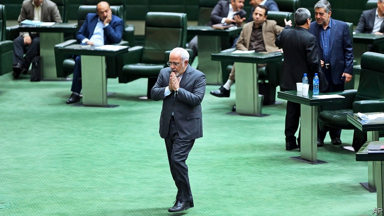

###### Hard men v pragmatists

# What to make of the attempted resignation of Iran’s foreign minister 

##### A hidden power struggle is brought into the open 

 

> Feb 28th 2019 

MUHAMMAD JAVAD ZARIF, Iran’s long-serving foreign minister and architect of its nuclear deal with America and the West, apologised for his shortcomings and resigned, by way of an Instagram post, on February 25th. Within hours, Iran’s two rival camps—one still seeking engagement with the West, the other thirsting for confrontation—were at each other’s throats. The elected government of President Hassan Rouhani pressed Mr Zarif (pictured) to stay. Unelected authorities backed by the Islamic Revolutionary Guard Corps, spearhead of the hardliners, celebrated his demise. Rarely has the power struggle inside Iran been more exposed. 

Mr Rouhani rejected the resignation as “against Iran’s national interests”. With #ZarifStay trending on Twitter, most members of parliament called on him to stick around. Several ambassadors threatened to follow Mr Zarif out. By contrast, agencies tied to the Guards rushed to confirm his departure. One of their loudest television mouthpieces, Vahid Yaminpour, hailed his “ejection from an aircraft in free fall”. Allies of the Guards also predicted that Bijan Zanganeh, the oil minister who has sought to conciliate the West, would go next. Hardliners even called for the ouster of President Rouhani himself. 

Iran’s supreme leader, Ayatollah Ali Khamenei, who has the final say, has tried to keep mum. But Mr Zarif’s public protest testifies to his frustration with the power of the hardliners. They have blocked his efforts to keep Iran off the international blacklist of countries sponsoring terrorism by ratifying the terms of the Financial Action Task Force, an outfit based in Paris that seeks to curb money-laundering and the financing of terrorism. When the president of Syria, Bashar al-Assad, made his first visit, unannounced, to Tehran since the start of Syria’s civil war in 2011, Mr Zarif was excluded from the proceedings. Qassem Suleimani, the head of the Guards’ foreign legion, managed them instead. 

Back in the Obama era, the Rouhani-Zarif team rubbed along well with the Americans. The deal to rein in Iran’s nuclear ambitions, signed in 2015, enabled most sanctions against Iran to be lifted. But the victory of President Donald Trump in 2016 and his decision to pull America out of the deal last year knocked the pragmatist tandem askew. Sanctions on banking and oil exports have been reimposed. Unemployment and inflation have soared. Iran’s currency has plummeted in value, along with Mr Rouhani’s popularity. Unrest is rising. “The Revolutionary Guards and Khamenei’s conservatives want a more radical government,” says Pejman Abdolmohammadi, an Iranian-Italian academic at the University of Trento in Italy. 

The Guards have long made life trying for Mr Rouhani. Their intelligence units have forced out some of his ministers, even accusing them of ties to Mossad, Israel’s spy service. “They are trying to block everything, control everything,” says Kaveh Madani, a senior Iranian official who fled to America last year. They have increasingly indulged their habit of arresting dual nationals on flimsy grounds. They have put one of Mr Zarif’s fellow negotiators in jail on espionage charges despite objections from Mr Rouhani’s own security men. This month a brother of Mr Rouhani was put on trial for alleged corruption. “If they could, they would mount a coup,” says a Rouhani aide. A presidential election is not due until 2021, but talk of an early poll is growing. 

Some Guards would be happy to see the nuclear deal, to which Mr Rouhani’s circle still clings, formally revoked. They do not shrink from the prospect of rising confrontation with Saudi Arabia and the United Arab Emirates over Yemen or over disputed islands in the Strait of Hormuz. Nor do they mind American economic sanctions, because these help protect their vast business interests from international competition. And they seem positively to revel in the diplomatic isolation from the West that Mr Zarif has spent the past five years trying to end. For now Mr Rouhani appears to have persuaded Mr Zarif to stay on. But the two men may have to tailor Iran’s foreign policy more to the liking of the Guards. 

-- 

 单词注释:

1.V[vi:]:[计] 溢出, 变量, 向量, 检验, 虚拟, 垂直 [医] 钒(23号元素) 

2.pragmatist['prægmәtist]:n. 实用主义者, 爱管闲事的人 

3.muhammad[]:n. 穆罕默德 

4.javad[]:[网络] 贾维德 

5.zarif[]:n. (Zarif)人名；(俄)扎里夫 

6.apologise[ә'pɔlәdʒaiz]:vi. 道歉（等于apologize） 

7.Instagram[]:一款图片分享应用 

8.engagement[in'geidʒdmәnt]:n. 诺言, 约会, 婚约, 交战 [医] 衔接 

9.Hassan[]:n. 哈山（男子名） 

10.rouhani[]:n. (Rouhani)人名；(伊朗)鲁哈尼 

11.zarif[]:n. (Zarif)人名；(俄)扎里夫 

12.unelected[ˌʌnɪˈlektɪd]:a. 未经选举的 

13.Islamic[iz'læmik]:a. 伊斯兰教的, 穆斯林的 

14.corp[]:[经] 公司 

15.spearhead['spiәhed]:n. 矛尖, 先锋队, 先头部队 vt. 做先锋, 带头 

16.hardliner[ˌhɑ:d'laɪnə(r)]:n. 强硬路线者 

17.demise[di'maiz]:n. 崩, 薨, 死亡 vt. 让渡, 遗赠, 转让 

18.Iran[i'rɑ:n]:n. 伊朗 

19.twitter['twitә]:n. 啁啾, 唧唧喳喳声 vi. 啭, 啁啾, 颤抖 vt. 嘁嘁喳喳地讲, 抖动 

20.mouthpiece['mauθpi:s]:n. 发话筒, 代言人, (电话)送话口 [机] 钳口垫片 

21.vahid[]:[网络] 瓦希德；照明灯具厂 

22.hail[heil]:n. 冰雹, 致敬, 欢呼, 招呼 vt. 向...欢呼, 致敬, 招呼, 使象下雹样落下 vi. 招呼, 下雹 interj. 万岁, 欢迎 

23.ejection[i'dʒekʃәn]:n. 驱逐, 喷出, 排出物 [化] 排出 

24.ally['ælai. ә'lai]:n. 同盟者, 同盟国, 助手 vt. 使联盟, 使联合, 使有关系 vi. 结盟 

25.bijan[]:n. 毕扬（品牌名） 

26.zanganeh[]:[网络] 赞加内 

27.conciliate[kәn'silieit]:vt. 安抚, 说服, 博得...的支持, 调和 [法] 调解, 安抚, 抚慰 

28.ouster['ajstә(r)]:n. 驱逐, 撵走, 剥夺 [法] 驱逐, 撵走, 剥夺 

29.ayatollah[,aɪə'tɒlə]:n. 阿亚图拉（对伊朗等国伊斯兰教什叶派领袖的尊称） 

30.ALI[]:[计] 异步线路接口 

31.Khamenei[]:n. (Khamenei)人名；(伊朗)哈梅内伊 

32.mum[mʌm]:n. 菊花, 沉默 a. 沉默的 vi. 演哑剧 interj. 别说话 

33.testify['testifai]:v. 证明, 作证, 声明, 表明 

34.frustration[frʌs'treiʃәn]:n. 挫折, 顿挫 [医] 挫折 

35.blacklist['blæklist]:n. 黑名单 

36.terrorism['terәrizm]:n. 恐怖主义, 恐怖统治, 恐怖状态 [法] 胁迫, 暴政, 恐怖政治 

37.ratify['rætifai]:vt. 批准, 认可 [经] 证实, 肯定, 确认 

38.outfit['autfit]:n. 用具, 配备, 机构 vt. 配备, 供应 vi. 得到装备 

39.curb[kә:b]:n. 抑制, 勒马绳, 边石 vt. 抑制, 束缚, 勒住 

40.Syria['siriә]:n. 叙利亚 [经] 叙利亚 

41.bashar[]:巴沙尔 巴沙尔 

42.unannounced[.ʌnә'naunst]:a. 未经宣布的 

43.tehran[teә'ræn,-'rɑ:n]:n. 德黑兰 

44.proceeding[prәu'si:diŋ]:n. 进行, 程序, 行动, 诉讼程序, 事项 [化] 会议论文集 

45.qassem[]:[网络] 卡西姆 

46.Suleimani[]:un. 苏利曼一世 [网络] 苏来麻尼 

47.legion['li:dʒәn]:n. 军团, 军队, 众多的人 

48.obama[]:n. 奥巴马(姓) 

49.sanction['sæŋkʃәn]:n. 核准, 制裁, 处罚, 约束力 vt. 制定制裁规则, 认可, 核准, 同意 

50.donald['dɔnәld]:n. 唐纳德（男子名） 

51.trump[trʌmp]:n. 王牌, 法宝, 喇叭 vt. 打出王牌赢, 胜过 vi. 出王牌, 吹喇叭 

52.tandem['tændәm]:adv. 一前一后地, 纵排地 a. 纵排的, 串联的 n. 纵列两匹马拉的马车, 前后纵列的两匹马, 串座双人自行车 

53.askew[ә'skju:]:a. 歪斜的 adv. 歪斜地 

54.reimpose[.ri:im'pәuz]:vt. 再强加, 重新征收 [经] 再征收, 重新征收 

55.inflation[in'fleiʃәn]:n. 胀大, 夸张, 通货膨胀 [化] 充气吹胀; 膨胀 

56.soar[sɒ:]:n. 高扬, 翱翔 vi. 往上飞舞, 高耸, 翱翔 

57.plummete[]:[网络] 直线下降 

58.popularity[.pɒpju'læriti]:n. 名声, 受大众欢迎, 流行 

59.abdolmohammadi[]:[网络] 阿卜杜勒莫哈马迪 

60.Trento['trentɔ:]:特兰托[意大利北部城市] 

61.Mossad['mɔsæd]:n. 摩萨德（以色列情报机关） 

62.kaveh[]:[网络] 卡维；扎哈克的卡维；雷雄 

63.madani[]:[网络] 尼；麦地那 

64.Iranian[i'reiniәn]:a. 伊朗的, 伊朗语系的 n. 伊朗人, 伊朗语 

65.indulge[in'dʌldʒ]:vt. 纵情于, 使高兴, 放任, 迁就 vi. 沉溺 

66.dual['dju:әl]:a. 双重的, 双的 n. 双数 

67.flimsy['flimzi]:a. 易坏的, 脆弱的, 浅薄的 n. 易损坏的东西(或材料), 薄纸, 描图用薄纸, 薄纸稿纸 

68.negotiator[ni'gәuʃieitә]:n. 磋商者, 交涉者, 议定者 [经] 谈判者, 交易者, 协商者 

69.espionage[.espiә'nɑ:ʒ]:n. 间谍活动 [法] 间谍活动, 刺探, 间谍 

70.allege[ә'ledʒ]:vt. 宣称, 主张, 提出, 断言 [法] 断言, 指称, 指证 

71.corruption[kә'rʌpʃәn]:n. 腐败, 堕落, 贪污 [计] 论误 

72.coup['ku:]:n. 砰然的一击, 妙计, 出乎意料的行动, 政变 [医] 发作, 中, 击 

73.aide[eid]:n. 助手, 副官 [计] 数据输入的可说明性 

74.presidential[.prezi'denʃәl]:a. 总统制的, 总统的, 首长的, 统辖的 [法] 总统的, 议长的, 总经理的 

75.cling[kliŋ]:vi. 粘紧, 附着, 紧贴, 坚持 

76.formally['fɒ:mәli]:adv. 正式地, 形式上 

77.revoke[ri'vәuk]:vt. 撤回, 废除 vi. 藏牌 n. 藏牌 [计] 取消权限程序 

78.confrontation[.kɔnfrʌn'teiʃәn]:n. 对抗；对质；面对 

79.saudi['sajdi]:a. 沙乌地阿拉伯（人或语）的 

80.Arabia[ә'reibiә]:n. 阿拉伯半岛 

81.emirate[e'miәrit]:n. 埃米尔的地位, 酋长国 

82.yeman[]:[网络] 也门；叶门；园艺业的普及则始于也门 

83.Hormuz['hɔ:mәz,hɔ:'mu:z]:霍尔木兹海峡(在伊朗和阿拉伯半岛之间,连接波斯湾[即阿拉伯湾]和阿曼湾) 

84.positively[]:adv. 明确地, 肯定地, 无疑地, (非正式)确实地, 真正地 

85.revel['revl]:n. 作乐, 狂欢 vi. 狂欢作乐, 陶醉, 着迷 vt. 耗费 

86.diplomatic[.diplә'mætik]:a. 外交的, 老练的 [法] 外交的, 外交上的, 文献上的 

87.isolation[.aisә'leiʃәn]:n. 隔绝, 孤立, 隔离 [化] 分离; 生物分离 

