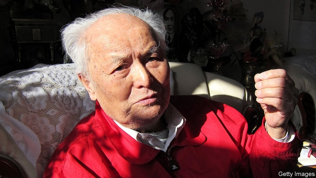

###### A thorn in their side

# Obituary: Li Rui died on February 16th 

##### The man who was secretary to Mao and an outspoken advocate of freedom in China was 101 

 

> Feb 28th 2019 

THE SUMMONS was one Li Rui could not ignore. Nor did he want to. When Mao Zedong sent a plane to fetch him to their first private meeting, in 1958, he was 41 and rising fast. His position as deputy head of the Ministry of Water Resources made him the youngest vice-minister in the still-young Chinese republic. Even better, he was the first director of Joint Factory 718, an electronics venture with East Germany that employed 10,000 workers, offered furnished living quarters, sports teams, a hospital and an orchestra, and was bound for success. 

All the same, doubts niggled. His last effort to join Mao had turned sour. After his hard, keen trek on foot at the end of the 1930s from his home province, Hunan, to Yanan, Mao’s rebel stronghold, he had started writing editorials in the revolutionary newspaper Liberation. But these were so spikily revealing about both sides (“Rui” meant “sharp”, and he lived up to that) that he was thrown in prison as a spy, needing “rectification”. His mother had told him tearfully, as he left home, “The Communists are good, but you might get killed.” Or, apparently, trashed by his own side. 

Now Mao was ruler, and he was being called to discuss the Three Gorges Dam, a giant power project proposed for the Yangzi river. He and Mao did not agree about it. As a trained engineer, he fiercely opposed it, whereas Mao in a poem had already imagined himself swimming in its shadow, admiring its “walls of stone” and “smooth lake rising”. Oddly, though, Mao liked the way he argued; seemed to like him too, despite, as a peasant, loathing intellectuals; and asked him to be his secretary for industrial affairs. 

It lasted barely a year. Mao brooked no dissent, insisting on controlling everybody’s minds; he often claimed to be a terrifying blend of Marx and the first Qin emperor, a brutal unifying warlord of ancient times. Since his new secretary was the straight-talking sort, he was soon purged for daring to criticise openly the Great Leap Forward, the economic enormity which led China into savage famine. After that, he was in jail and exile in the northern mountains for the best part of 20 years. But that brief closeness to the chain-smoking Great Helmsman gave him insights that seared him. It also gave him enough standing in the party, when times were calmer, to barrack other leaders continually to leave Maoist methods alone. For as long as the party kept flirting with autocracy, where government, leader and ideology made one unchecked force, China would never reform or truly advance. 

Eventually he wrote five books on Mao, from birth to death, turning himself into a valued historian of those years. Yet the point of history was to learn from it and face up to it, and the party would not. Each leader, from more open-minded Deng Xiaoping onwards, was battered with his opinions and demands. They were drafted in his centre of operations, a study in which it was impossible to cram any more books, and from which he angrily shooed away anyone who filmed what he was writing. Sometimes they took the form of open letters, sometimes interjections at Communist Party congresses. He spoke out even against Tiananmen, that unmentionable massacre, stating simply but emphatically that the students were right and the leadership was wrong. As “the veteran liberal member”, he was usually met with silence, sometimes humoured, and ignored. He harassed Xi Jinping over dinner when the future leader was just party secretary in Zhejiang, a poorly educated hack in his view, not a patch on his admirable father. He was horrified to see how autocratic the man became, once in power. 

His political wishlist was not long. First, free speech: the party had to listen to the people. Second, freedom to publish. He had been a proper investigative journalist, as well as a trenchant writer; but his Mao books were banned on the mainland, and the journal Yanhuang Chunqiu, which he strongly backed in its unofficial reappraisals of Chinese history, had been made anodyne and the editor sacked. Top of the list, he sought constitutional and democratic governance, with the party reframed as a socialist party in the west European style. That thought was so subversive, so unChinese, that in 2013 it was officially, though secretly, condemned. But a man who had got through nine years of solitary by running on the spot, practising qigong and writing 400 poems, in gentian violet, in the margins of Marx’s collected works would not be cowed by that. True to his name, he stayed thorn-sharp. 

All the same, what could be done with China’s Communist Party, and what would it become? The question was on his lips even in his last days, which were spent in a first-rate hospital reserved for party officials. For he had never left the party, or even toyed with that. It was his life, ever since he had joined it secretly, at 20, in 1937; ever since, as a student, he had been jailed by the Kuomintang for eagerly thrusting Marxist textbooks into people’s hands. Mao had expelled him and, in the name of the party, destroyed his first marriage and almost killed him; but that groupthink party of red books and red scarves was not the one he had raced to as a patriotic young rebel, urgent to rid China of warlords and invading Japanese. When he was readmitted under Deng in the 1980s he hoped for a party of brotherhood and social justice, but of freedom too. Instead, as he wrote in a poem, he found arrogance, ignorance, shamelessness, lawlessness. He wore red—as he wore his loyalty—but he had also grown to loathe it. Everything was red, red, red. 

Red was naturally the colour of the flag that was to drape his coffin once he was inside it. That, as well as burial at the Babaoshan Revolutionary Cemetery in Beijing, was his privilege as a senior party member. Asked whether he wanted that, he merely said he would prefer to be buried with his parents in Hunan. He felt bad that he had not cared for his mother in her old age. It made him sigh to recall those simple words of hers, “The Communists are good.” 

When his funeral took place, everything was as the party wanted. No media were allowed. Mr Xi, rid of his most vexing thorn, sent a nice wreath of flowers. 

-- 

 单词注释:

1.summon['sʌmәn]:vt. 召唤, 召集, 号召, 振奋, 唤起, 鼓起 [经] 传唤, 传讯 

2.niggle['nigl]:vi. 闲混, 为琐事费时, 吹毛求疵, 拘泥小节 vt. 玩忽, 小气地给... 

3.trek[trek]:vi. 牛拉货车, 艰苦跋涉 n. 牛车旅行, 艰苦跋涉 

4.stronghold['strɒŋhәuld]:n. 要塞, 堡垒, 大本营 

5.spikily[]:adv. spiky的变形 

6.rectification[.rektifi'keiʃәn]:n. 改正, 矫正, 整流 [化] 精馏 

7.tearfully['tɪəfəlɪ]:adv. 泪汪汪地, 流泪地 

8.apparently[ә'pærәntli]:adv. 表面上, 清楚地, 显然地 

9.trash[træʃ]:n. 垃圾, 废物 vt. 丢弃 

10.gorge[gɒ:dʒ]:n. 峡谷, 凹槽, 塞饱, 咽喉 vi. 狼吞虎咽 vt. 塞饱, 狼吞虎咽地吃 

11.fiercely['fiәsli]:adv. 猛烈地, 厉害地 

12.oddly['ɒdli]:adv. 奇怪地 

13.loathing['lәuðiŋ]:n. 非常讨厌, 嫌恶, 极不情愿 

14.dissent[di'sent]:n. 异议 vi. 持异议, 不同意 

15.marx[mɑ:ks]:n. 马克思（无产阶级的伟大领袖） 

16.brutal['bru:tәl]:a. 残忍的, 野蛮的, 不讲理的 

17.unify['ju:nifai]:v. 统一, 使成一体 

18.warlord['wɒ:lɒ:d]:n. 军阀, 军阀式领袖 

19.purge[pә:dʒ]:n. 净化, 清除, 泻药 v. (使)净化, 清除, (使)通便 [计] 服务器文件删除实用程序 

20.criticise['kritisaiz]:v. 批评, 吹毛求疵, 非难 

21.openly['әjpәnli]:adv. 公开地, 坦率地, 直率地, 公然地 

22.enormity[i'nɒ:miti]:n. 暴行, 极恶, 巨大 [法] 重罪, 大罪, 暴行 

23.exile['eksail]:n. 放逐, 流放, 被放逐者 vt. 放逐, 流放, 使背井离乡 

24.closeness['klәusnis]:[建] 密闭, 紧密 

25.helmsman['helmzmәn]:n. 舵手 

26.sear[siә]:a. 枯萎的, 凋谢的 vt. 烤焦, 使枯萎 vi. 凋谢, 干枯 

27.barrack['bærәk]:n. 兵舍, 军营 vt. 使驻兵营内 

28.continually[kәn'tinjuәli]:adv. 不断地, 频繁地 

29.Maoist['majist]:n. 毛泽东主义者  a. 毛泽东的,毛(泽东)主义的 

30.flirt[flә:t]:n. 卖弄风骚的人, 急动, 急扔 vt. 忽然弹出, 轻快摆动, 挥动 vi. 调情, 玩弄, 摆动, 轻率地对待 

31.autocracy[ɒ:'tɒkrәsi]:n. 独裁统治, 独裁统治的国家 [法] 独裁政治, 专制政治, 独裁政府 

32.ideology[.aidi'ɒlәdʒi]:n. 思想体系, 意识形态, 观念学, 空论 [医] 观念学, 观念形态 

33.unchecked[.ʌn'tʃekt]:a. 未加抑制的, 未经检查的 [计] 未选中的 

34.historian[hi'stɒ:riәn]:n. 历史学家, 记事者 

35.onward['ɒnwәd]:a. 向前的, 前进的 adv. 向前, 前进, 在先 

36.batter['bætә]:v. 连续猛打（尤其指妇女），猛击 n. 面糊（食物），击球员，打击手 

37.cram[kræm]:vt. 塞满, 填满, 猛吃 vi. 贪吃 n. 极度拥挤, 死记硬背 

38.angrily['æŋgrili]:adv. 愤怒地 

39.shooe[]:[网络] 鞋 

40.interjection[.intә'dʒekʃәn]:n. 感叹词, 插入语 

41.unmentionable[.ʌn'menʃәnәbl]:a. 不宜提及的, 说不出口的 n. 不宜说出口之事物, 内衣, 裤子 

42.massacre['mæsәkә]:n. 大屠杀 vt. 大屠杀, 残杀 

43.emphatically[im'fætikәli]:adv. 强调地, 着重地 

44.harass['hærәs]:vt. 使困扰, 使烦恼, 折磨 

45.poorly['puәli]:adv. 贫穷地, 不充分地, 贫乏地 a. 身体不舒服的 

46.hack[hæk]:n. 劈, 砍, 砍痕, 出租车, 干咳, 晒架, 鹤嘴锄 vt. 劈, 砍, 出租, 用旧 vi. 劈, 砍, 干咳, 驾驶出租车 a. 出租的 

47.horrify['hɒrifai]:vt. 使恐惧, 使震惊 

48.autocratic[.ɒ:tә'krætik]:a. 独裁的, 专制的 

49.wishlist['wiʃlist]:n. 意愿清单 

50.investigative[in'vestigeitiv]:a. 审查的, 调查的, 好研究的 [法] 调查的, 审查的, 受调查研究的 

51.trenchant['trentʃәnt]:a. 锐利的, 尖锐的, 有力的, 鲜明的, 清晰的 

52.unofficial[.ʌnә'fiʃәl]:a. 非正式的, 非官方的 [化] 非法定的; 未入药典的 

53.reappraisal[.ri:ә'preizl]:n. 重新估计, 重新评价 [经] 重新估价 

54.anodyne['ænәudain]:n. 止痛药, 镇痛剂 a. 止痛的 

55.constitutional[.kɒnsti'tju:ʃәnl]:a. 宪法的, 立宪的, 体质的 [医] 全身的; 体质的 

56.governance['gʌvәnәns]:n. 统治, 统辖, 管理 [法] 统治, 管理, 支配 

57.reframe['ri:'freim]:vt. 再构造, 重新制订, 再组织, 给...装上新框架 

58.subversive[sәb'vә:siv]:a. 从事颠覆的, 破坏性的 n. 破坏分子, 颠覆分子 

59.officially[ә'fiʃәli]:adv. 作为公务员, 职务上, 官方地 

60.secretly['si:kritli]:adv. 秘密地, 背地里 

61.solitary['sɒlitәri]:n. 独居者 a. 孤独的, 独居的 

62.gentian['dʒenʃiәn]:n. 龙胆属植物, 黄龙胆根 [化] 龙胆 

63.kuomintang['kwәumin'tæŋ]:n. (中国)国民党 

64.eagerly[]:adv. 渴望, 热衷于, 热切 

65.groupthink['^ru:pθiŋk]:n. 小集团思想 

66.patriotic[.peitri'ɒtik]:a. 爱国的, 有爱国心的 [法] 爱国的, 有爱国心的 

67.readmit[.ri:әd'mit]:vt. 重新接纳 

68.arrogance['ærәgәns]:n. 傲慢态度, 自大 

69.ignorance['ignәrәns]:n. 无知, 愚味 [法] 无知, 不知情, 愚昧 

70.shamelessness[]:无耻 

71.lawlessness['lɔ:ləsnəs]:n. 不服从法律; 不受法律制约; 未实施法律; 目无法纪 

72.loathe[lәuð]:vt. 厌恶, 憎恶 

73.drape[dreip]:n. 布帘, 褶皱 vt. 用布帘覆盖, 披上 vi. 成褶皱状 

74.coffin['kɒfin]:n. 棺材, 灵柩 vt. 把...装进棺材 

75.cemetery['semitәri]:n. 墓地, 公墓 [法] 公墓, 墓地 

