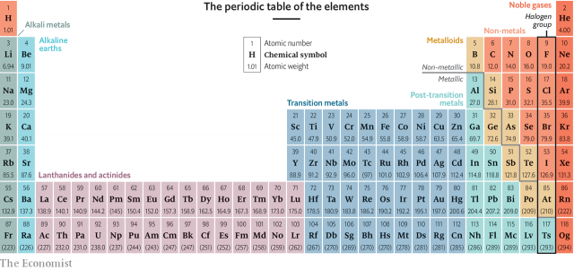
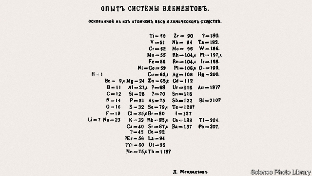
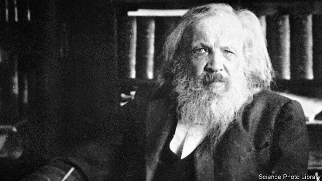
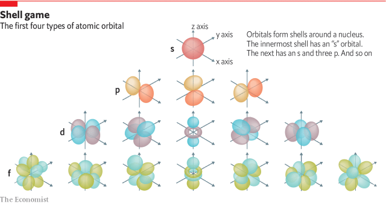

###### The history of science

# The periodic table is 150 years old this week 

##### Its creation is a perfect illustration of how science progresses 

> Mar 2nd 2019 

 

“LA république n’a pas besoin de savants ni de chimistes.” With that curt dismissal a court in revolutionary France cut short the life of Antoine-Laurent de Lavoisier, argued by some to be the greatest chemist of all. Lavoisier’s sin was tax farming. He had been a member of the firm that collected the monarchy’s various imposts and then, having taken its cut, passed what remained on to the royal treasury. That he and many of his fellow farmers met their ends beneath a guillotine’s blade is no surprise. What had distinguished Lavoisier from his fellows, though, was what he chose to spend his income on. For much of it went to create the best-equipped chemistry laboratory in Europe. 

Nothing comes of nothing. Where the story of the periodic table of the elements really starts is debatable. But Lavoisier’s laboratory is as good a place as any to begin, for it was Lavoisier who published the first putatively comprehensive list of chemical elements—substances incapable of being broken down by chemical reactions into other substances—and it was Lavoisier and his wife Marie-Anne who pioneered the technique of measuring quantitatively what went into and came out of a chemical reaction, as a way of getting to the heart of what such a reaction really is. 

Lavoisier’s list of elements, published in 1789, five years before his execution, had 33 entries. Of those, 23—a fifth of the total now recognised—have stood the test of time. Some, like gold, iron and sulphur, had been known since ancient days. Others, like manganese, molybdenum and tungsten, were recent discoveries. What the list did not have was a structure. It was, avant la lettre, a stamp collection. But the album was missing. 

Creating that album, filling it and understanding why it is the way it is took a century and a half. It is now, though, a familiar feature of every high-school science laboratory. Its rows and columns of rectangles, each containing a one- or two-letter abbreviation of the name of an element, together with its sequential atomic number, represent an order and underlying structure to the universe that would have astonished Lavoisier. It is little exaggeration to say that almost everything in modern science is connected, usually at only one or two removes, to the periodic table. 

The Lavoisiers’ careful measurements had discovered something now thought commonplace—the law of conservation of matter. Chemistry transforms the nature of substances, but not their total mass. That fact established, another Frenchman, Louis-Joseph Proust, extended the idea with the law of definite proportions. This law, published in 1794, the year of Antoine Lavoisier’s execution, states that the ratio by weight of the elements in a chemical compound is always the same. It does not depend on that compound’s method of preparation. From there, it might have been a short step for Proust to arrive at the idea of compounds being made of particles of different weights, each weight representing a specific element. But he did not take it. That insight had to wait for John Dalton, a man who was the polar opposite of the aristocratic bon vivant Lavoisier. Dalton’s parents were so poor that he had been put to work at the age of ten. The man himself was an ascetic, colour-blind Quaker. And he was English. 

Dalton lived in Manchester, at a time when it was the world’s largest industrial city. He made a modest living tutoring, but spent most of his energy on scientific research, including into colour-blindness, a condition still sometimes referred to as Daltonism. That inquiry came to nothing. But during the first decade of the 19th century he took Proust’s concept and showed not only that elements reacted in fixed proportions by weight, but also that those proportions were ratios of small whole numbers. The simplest way to explain this—and indeed the way that Dalton lit upon—was to suppose each element to be composed of tiny, indivisible particles, all of the same weight. The Greek word for indivisible is “atomos”. Thus was the atom born. 

Dalton based his system of relative atomic weights on hydrogen, the atoms of which he found to be the lightest. And it was quickly picked up by someone who, though less famous than Lavoisier, perhaps because of his grizzly end, was arguably the greater man. Jacob Berzelius, a Swede, furnished chemistry with its language. It was he who came up with the idea of the abbreviations that now occupy the periodic table’s rectangles. It was he who combined those abbreviations with numbers, indicating the proportions involved, to make formulae for chemical compounds: H2O (water), H2SO4 (sulphuric acid), NaCl (table salt). And it was he who used these formulae to describe reactions: H2SO4 + Zn→ZnSO4 + H2 (sulphuric acid plus zinc becomes zinc sulphate plus hydrogen). Though Dalton invented atomic theory, it was Berzelius who embedded it at the heart of the subject. 

And Berzelius did more. He used Alessandro Volta’s recently invented battery, which created electricity from a chemical reaction, to do the reverse. He employed electricity to drive chemical reactions in solutions (for example, releasing metallic copper from a solution of copper sulphate), a process called electrolysis. 

Back in England, Humphry Davy, inventor of the miner’s safety lamp, picked up the idea of electrolysis and supercharged it. He employed a more powerful version of Volta’s battery to decompose molten materials, rather than solutions. In this way he discovered sodium and potassium in 1807 and magnesium, calcium, strontium, barium and boron in 1808. He also showed that chlorine, previously thought to be a compound of oxygen, was actually an element. 

After Davy’s work new elements began to flow in thick and fast. Iodine (1811). Cadmium and selenium (1817). Lithium (1821). Silicon (1823). Aluminium and bromine (1825). By then there were enough of them for the next step on the journey to be taken. 

It had been apparent from the time of their discovery that sodium and potassium were similar, as were calcium, strontium and barium. Lithium, when discovered, proved similar to sodium and potassium. Likewise, bromine and iodine proved similar to chlorine. In 1829 Johann Dobereiner, a German, noticed a curiosity about these trios (members of groups now known, respectively, as alkali metals, alkaline earths and halogens), and also another triplet that shared similar properties: sulphur, selenium and tellurium. In each case, if the members were arranged in order of atomic weight, the middle element (sodium, strontium, bromine, selenium) had a weight that was the average of the lightest and the heaviest of the three. Dobereiner called this the law of triads. It was the first hint of some underlying pattern. 

 

The stamp collection continued to grow. Thorium was discovered in 1829 (by Berzelius, as it happened). Lanthanum followed in 1838, erbium in 1843 and ruthenium in 1844. Then, in 1860, Robert Bunsen, inventor of the burner that bears his name, showed how new elements could be recognised from brightly coloured lines in the spectra obtained when materials containing them were heated in a flame. This approach was an instant success. Bunsen and his colleague Gustav Kirchhoff added caesium (1860) and rubidium (1861) to the list. Others, copying them, added thallium (1861) and indium (1863). Spectroscopic analysis’s greatest triumph, though, was helium (1868). This was recognised not from a sample in the flame of a Bunsen burner but in the spectrum of the sun. 

As more and more elements turned up, so the search for order intensified. In 1864 John Newlands, a Briton, almost got it. He published what he called the law of octaves. Arranging the known elements in order of atomic weight, he believed he had discerned that, like a musical scale, every eighth element “rhymed” in the ways that sodium rhymed with potassium, and chlorine with bromine. 

The trouble with Newlands’ scheme was that an awful lot of the rhymes were forced. A glance at a modern periodic table shows why. For the tall, outer columns (and discounting hydrogen, which is a law unto itself) Newlands’ octaves work perfectly for the lightest elements then known. From the row beginning with potassium (K, from the Latin kalium, meaning potash), however, the tall outer columns are split asunder by the intrusion of ten other, shorter ones known as the transition metals. To deal with that intrusion using data then available required a mixture of luck and genius. And a few years after Newlands published, a lucky genius wrestled with the question in his study in St Petersburg. 

Albert Einstein, dapper in his youth, cultivated a waywardness of appearance in old age that has contributed to the trope of the mad professor. Dmitri Mendeleev (pictured overleaf) looked like that from the beginning—having his hair cut just once a year by a shepherd, using wool shears. He also behaved like a mad professor. He was prone to dancing rages that put one biographer in mind of the protagonist of “Rumplestiltskin”, a children’s fairy tale. Also like Rumplestiltskin he proved, metaphorically at least, able to spin straw into gold. 

For a time, Mendeleev had worked in Germany with Bunsen and Kirchhoff, but he had fallen out with them and returned home. In 1869 he was professor of general chemistry at the University of St Petersburg and was writing a Russian-language textbook on the subject. On February 14th of the Julian calendar then in use in Russia (February 26th by the Gregorian calendar employed in most of the rest of Europe), having addressed halogens and alkali metals, he was racking his brains for an organising principle to act as a template for the rest. The 14th was a Friday, and the problem obsessed him more and more over the weekend. But on Monday 17th, while waiting for a sleigh to take him to the railway station for a trip to an estate he had bought in the countryside, he had a brainwave. 

Mendeleev was an inveterate player of patience. His brainwave was to recognise that, just as games of patience require the player to organise the pack as a grid of suits in order of the value of the cards, so the elements might be arranged by their atomic weights in “suits” that shared chemical and physical properties. By making his own pack, with each card representing one of the 63 then-known elements, he was able to embark on what was arguably the most important game of patience ever played. 

He claimed subsequently that the answer had come to him in a dream. Perhaps. But after having worked for four days on the problem without much rest, the boundary between sleep and wakefulness must have been pretty blurred. Whatever the details, the result was a grid of cards that arranged the elements in a pattern (see picture). He published it two weeks later. 

 

His grid was not perfect. Indeed, it was full of holes. But those holes (some of them, anyway) turned out to be keystones. Though there was no reason, in the 1860s, to believe that all the elements had been discovered, Newlands had behaved as though they had been. Mendeleev had enough confidence to leave gaps in order to make the pattern work. At the time, some took this as a sign of weakness. In fact, it was a sign of strength—the more so because, for several of the gaps, he described in detail the properties of the elements he predicted would fill them, and these predictions were, by and large, fulfilled. 

Similarly, there are places in Mendeleev’s original table where it works only by cheating—that is, by swapping two adjacent elements between the places to which their atomic weights assign them. Here, Mendeleev argued that the accepted weights were incorrect, and needed re-measuring. Sometimes, he turned out to be correct about this, too. But not always. A few such pairs, cobalt and nickel for example (which actually share a slot in the published table), remained stubbornly out of kilter, providing evidence that atomic weight was really a proxy for some deeper structural principle 

Crucially, Mendeleev was not constrained, as Newlands had been, by preconceptions about how things ought to be. At points where the octave rule did not work, he let the grid burst out of its corset. This can be seen at both the top and the bottom of the published table. 

The upper-right-hand extension contains the transition metals. Here, subsequent discoveries have proved Mendeleev more or less correct in his insights. The lower-left-hand one is more problematic. Its contents are a grab bag, though it does contain all of the then-known members of the set of elements called lanthanides. Arguably, Mendeleev was lucky that by 1869 only three lanthanides had been discovered. In a modern table there are 15 and, together with the actinides below them, they form an awkward interpolation that is often relegated to the bottom as an asterisked footnote. Whether Mendeleev’s game of chemical patience would have been helped or hindered by having more lanthanides in the pack is an intriguing question. 

There was also an invisible gap, the filling of which was one of the table’s greatest triumphs. Helium, which Mendeleev ignored because its atomic weight could not be established, turned out to be the lightest member of a whole, new row (or column, in a modern table). These are the noble gases, undiscovered previously because they are chemically inert. The others are neon, argon, krypton, xenon and radon. 

Like Davy’s discoveries, the noble gases came all of a tumble. All but radon were the work of William Ramsay, a Briton. With various collaborators, Ramsay isolated argon in 1894, helium in 1895 and neon, krypton and xenon in 1898. Instead of chemistry, he used physical processes. All except helium were products of the newly developed technology of cryogenics, which he used to liquefy air and then separate it into its components, according to their boiling points. Helium, he found by heating a mineral called cleveite. 

The 1890s also saw the first inklings that atoms themselves might not, despite the meaning of their name, be truly indivisible. The initial evidence that atoms could spin off parts of themselves, and must therefore have smaller components, came in 1896. That was when Henri Becquerel, who was investigating the nature of phosphorescence, wrapped some uranium salts in photographic paper and found that the paper got fogged. Thus did Becquerel discover radioactivity. 

The following year, J.J. Thomson worked out that “cathode rays” emitted into a vacuum by a negative electrode were electrically charged particles that weighed far less than any atom. Then, in 1899, Ernest Rutherford, a former student of Thomson’s, showed that Becquerel’s radiation had two components, which he dubbed “alpha” (heavy, positively charged particles) and “beta” (light, negatively charged ones). 

 

Becquerel himself, in 1900, showed that beta particles were the same as Thomson’s cathode rays. Seven years later, Rutherford demonstrated that alpha particles were helium ions (thus incidentally explaining why cleveite, which is an ore of uranium, is also a source of helium). The stage was now set for some of the most important experiments in history: Rutherford’s attempts to find out what atoms looked like. 

One previous guess had been that they were vortices in the luminiferous aether through which light and radio waves were thought to propagate. That hypothesis, however, died with the aether itself, when the latter’s existence was disproved experimentally in the 1890s. Rutherford’s experiments, conducted between 1908 and 1910, probed matter by firing alpha particles at gold foil. Most sailed through, to be recorded by a scintillation screen beyond the foil. But a few were deflected from their courses, to be recorded by other screens, including one behind the source. This screen’s recording of alpha particles returning whence they had come was described by Rutherford as being “almost as incredible as if you fired a 15-inch shell at a piece of tissue paper and it came back and hit you”. His explanation, now abundantly proved true, was that the atoms in the foil had tiny, positively charged nuclei, which were reflecting the positively charged alpha particles, and that these nuclei were surrounded by electrons. 

Regardless of an atom’s exact nature, losing alpha and beta particles necessarily changes it. Such radioactive decay proved a source of yet more members of the periodic table. Polonium and radium—decay products of uranium—were found in 1898 by Pierre and Marie Curie. Actinium, the lightest actinide, followed in 1899. Radon was recognised in 1900. Protactinium in 1913. 

Models of the atom also became more sophisticated. In 1913, Rutherford and a Danish colleague, Niels Bohr, suggested electrons orbit the nucleus as planets orbit the sun, with electrical attraction playing the role of gravity. In the same year Henry Moseley, another of Rutherford’s confrères, found a mathematical relationship between an element’s X-ray spectrum when bombarded with electrons and its atomic number in the table. In pairs like cobalt and nickel, where the table had been fudged, Moseley confirmed the fudges to be correct. He tidied up the lanthanides, predicting missing elements as Mendeleev had done. He also predicted two new transition metals, with atomic numbers 72 and 75, which duly turned up in 1923 (hafnium) and 1925 (rhenium). 

Moseley’s X-ray spectra demonstrated that an element’s atomic number does not depend directly on its atomic weight. Rutherford soon showed that the atomic number is actually the number in a nucleus of a positively charged particle that came to be known as a proton. Even though protons weigh almost 2,000 times as much as electrons, the two have equal (though opposite) charges. An atom, which has equal numbers of both, is therefore electrically neutral. Protons are not, though, heavy enough to account for measured atomic weights. That requires a second, electrically neutral particle, the neutron. This was discovered in 1932. Neutrons are also the reason that an element can have atoms of different atomic weights, known as isotopes. These isotopes have different numbers of neutrons. 

The Bohr-Rutherford model of the atom had a problem, though. Electrostatic forces should pull the electrons into the nucleus rather than keeping them in orbit. Here, the new science of quantum mechanics came to the rescue. Quantum theory requires objects to be both particles and waves. The wavelike aspect of electrons means that when they circle an atomic nucleus they settle into self-reinforcing three-dimensional standing waves, called orbitals. The stability of these standing waves stops the electrons being drawn into the nucleus. And here, at last, is the explanation for why the periodic table is the way that it is. 

For reasons deep in the heart of quantum mechanics, each orbital can have either one or two electrons in it, but not more. The orbitals themselves come in different types (see diagram) and these are arranged in shells around a nucleus. The first shell has one type “s” orbital, for a maximum of two electrons. The second, a type s and three type p, for a maximum of eight. The third has one s, three p and five d, for a maximum of 18. The fourth, one s, three p, five d and seven f, for a maximum of 32. Et cetera. The names are derived from the spectral lines seen by Bunsen and his followers. The colours of these lines represent energy released as light by electrons moving between orbitals. 

 

It is the shells that define the table’s rows. In the first row, which consists of hydrogen (one electron) and helium (two), the first shell is filled up. In the second row, from lithium to neon, the second shell is filled. The third row, from sodium to argon, fills the s and p orbitals of the third shell. The fourth, from potassium to krypton, fills the s and p orbitals of the fourth shell and the d of the third shell (which has ten electrons altogether, for the ten columns of transition metals). 

Compounds are created either by unpaired electrons from different atoms forming joint orbitals called covalent bonds, or by the complete transfer of unpaired electrons between atoms, to create paired orbitals in the recipients. When this happens, the resulting positive and negative ions are held together by electrostatic forces—a process called ionic bonding. The repetitive order in which the shells are filled in each row means that elements in each column of the table have the same combination of unpaired electrons, and thus similar properties. For example, the noble gases are inert because they have no unpaired electrons. Further analysis showed, moreover, that the difference between metals and non-metals depends on how easy an atom’s outer electrons are to detach (if easily detached, they can flow as an electric current, reflect light in the way that makes metals shiny, and confer ductility on the solid form of the element). And that, essentially, is chemistry solved. 

It is not quite, however, the end of the story. In the 1930s physicists discovered that radioactivity could, in essence, be reversed by bombarding atoms with subatomic particles to increase their atomic numbers. This way, new elements can be produced. Technetium, created in 1937, was the first such. Two years later francium, the last to be discovered in nature, was isolated as a decay product of actinium. From that moment the extension of the periodic table became work for physicists, not chemists. 

Technetium is strange. Despite its low atomic number (43) it has no stable isotopes, and is thus found only transiently in nature. This is a quirk of the physics of protons and neutrons that it shares with promethium (61). But at the heavy end of the table, beyond lead (82), radioactivity is compulsory for all. And beyond uranium (92) it is so compulsory that “transuranics” were once thought not to occur in nature. 

This part of the periodic table was the playground of Glenn Seaborg, an American physicist. In 1940 Seaborg was part of a group at the University of California, Berkeley, that made neptunium (93). When the group’s head left later that year, Seaborg took over. On his watch americium (95), curium (96), berkelium (97), californium (98), einsteinium (99), fermium (100), mendelevium (101) and nobelium (102) were all created. But his first discovery, plutonium (94, in 1941), was the most important. On July 16th 1945, the first atom bomb, a plutonium-implosion device, was tested at Alamogordo, New Mexico. On August 9th of that year another of the same design destroyed Nagasaki, in Japan. 

Americium has its uses, too. Since it was a synthetic product, it was patentable, and Seaborg did, indeed, patent it. It was (and is) employed in smoke detectors, and he drew a tidy income from that fact for many years. Beyond 95, though, the practical point of extending the table became less and less obvious as elements became less and less stable. 

Efforts to make new elements slowed down after 1955, though there was a pick up again in the mid 1990s. Neither chemistry nor the wider world, however, reverberated with excitement at the creation of darmstadtium (110), roentgenium (111), copernicum (112) and nihonium (113) in the way that they had with the discovery of potassium, or helium, or radium or plutonium. What started as stamp collecting has returned to its roots—except in one regard. This is that, thanks to Mendeleev’s brilliance, element-hunters now have an album in which to stick their discoveries. 

The heaviest element of all, oganesson (118), was created in 2002, though named only in 2016. Oganesson completes the table’s seventh row. Chemically, it should be a noble gas. But, with only a few atoms of it to play with at a time, and with those atoms having lifetimes measured in milliseconds, it seems improbable anyone will ever know for sure. 

Despite physicists’ best efforts, then, the eighth row has not been reached. But as Mendeleev himself said, “To conceive, understand and grasp the whole symmetry of the scientific edifice, including its unfinished portions, is equivalent to tasting that enjoyment only conveyed by the highest forms of beauty and truth.” For those who share this view, and see in the periodic table a supreme example of nature’s poetry, the row-completing, album-filling addition of oganesson may seem as good a place as any to stop. 

-- 

 单词注释:

1.periodic[.piәri'ɒdik]:a. 周期的, 定期的, 间歇(性)的, 循环的, 用完整句的, 高碘的 [医] 周期性的 

2.creation[kri:'eiʃәn]:n. 创造, 创作物, 发明 [化] 产生 

3.La[lɔ:, lɑ:]:[医] 镧(57号元素) 

4.PA[pɑ:]:私人秘书, (露天)扩音系统 [计] 程序存取, 程序地址, 程序分析 

5.besoin[]:[医] 需要, 必需 

6.de[di:]:[化] 非对映体过量 [医] 铥(69号元素铥的别名,1916年Eder离得的假想元素) 

7.savant['sævәnt]:n. 学者, 专家 

8.Ni[]:[医] 镍(28号元素) 

9.curt[kә:t]:a. 简略的, 简短的, 生硬的 

10.dismissal[dis'misәl]:n. 免职, 解雇 [经] 解雇 

11.Lavoisier[,lɑ:vwә'zjei]:拉瓦锡(Antoine Laurent,1743-1794,法国化学家, 氧发现者) 

12.impost['impәust]:n. 税款, 关税 vt. 决定关税, 分类课税 

13.treasury['treʒәri]:n. 国库, 宝库, 财政部, 国库券 [经] 库存, 国库, 金库 

14.debatable[di'beitәbl]:a. 可争论的, 成问题的, 未决定的 

15.putatively['pju:tətɪvlɪ]:adv. 推定地 

16.incapable[in'keipәbl]:a. 无能力的, 不能的 [机] 不能行的, 耐不住的 

17.quantitatively[]:adv. 量, 数量上, 定量 

18.execution[.eksi'kju:ʃәn]:n. 实行, 完成, 执行, 死刑 [计] 执行 

19.manganese['mæŋ^әni:z]:n. 锰 [化] 锰; 锰酸盐 

20.molybdenum[mɒ'libdinәm]:n. 钼 [化] 钼 

21.tungsten['tʌŋstәn]:n. 钨 [化] 钨W 

22.avant[]:a. 激进的；先锋派的 

23.La[lɔ:, lɑ:]:[医] 镧(57号元素) 

24.lettre[]:[网络] 我写了一封信；我写了封信 

25.abbreviation[ә.bri:vi'eiʃәn]:n. 缩写词, 缩写, 缩短, 节略 

26.sequential[si'kwenʃәl]:a. 继续的, 后果的 [计] 顺序的 

27.underlie[.ʌndә'lai]:vt. 位于...之下, 成为...的基础 

28.exaggeration[ig.zædʒә'reiʃәn]:n. 夸张, 夸大的事物, 夸大之词 

29.Proust[pru:st]:普鲁斯特(姓氏) 

30.antoine[æn'twɑ:n]:n. 安托万（男子名, Anthony的异体） 

31.alway['ɔ:lwei]:adv. 永远；总是（等于always） 

32.john[dʒɔn]:n. 盥洗室, 厕所, 嫖客 

33.dalton['dɔ:ltәn]:[化] 道尔顿(质量单位,等于一氧原子的1/16) [医] 道尔顿(质量单位) 

34.polar['pәulә]:a. 两极的, 极地的, 正好相反的, 极性的 n. 极线, 极面 

35.aristocratic[æristә'krætik]:a. 贵族的, 主张贵族统绐的, 有贵族气派的 

36.bon[bɔ:n]:a. （法）好的 

37.vivant[]:[网络] 威万；拉菲尔维凡 

38.ascetic[ә'setik]:n. 苦行者, 禁欲者, 修道者 a. 苦行的, 禁欲的 

39.quaker['kweikә]:n. 贵格会教徒 

40.Manchester['mæntʃestә]:n. 曼彻斯特 

41.daltonism['dɒ:ltәnizm]:n. 先天性色盲, 红绿色盲 [医] 红绿色盲, 色盲 

42.indivisible[.indi'vizәbl]:a. 不能分割的, 除不尽的 [经] 不可分的, 除不尽的 

43.quickly['kwikli]:adv. 很快地 

44.les[lei]:abbr. 发射脱离系统（Launch Escape System） 

45.grizzly['grizli]:a. 略为灰色的, 呈灰色的 n. 灰熊 

46.arguably['ɑ:ɡjuәbli]:adv. 可论证地；可争辩地；正如可提出证据加以证明的那样地 

47.jacob['dʒeikәb]:n. [圣经]雅各（以色列人的祖先）；雅各布（男子名） 

48.Berzelius[bә'zi:liәs]:伯齐利厄斯(Baron JГns Jakob, 1779-1848, 瑞典化学家, 化学符号创制人) 

49.Swede[swi:d]:n. 瑞典人 

50.sulphuric[sʌl'fjuәrik]:a. 硫的 

51.nacl[]:abbr. sodium chloride (salt) 氯化钠（盐）（科技符号） 

52.zinc[ziŋk]:n. 锌 vt. 镀锌于 

53.sulphate['sʌlfeit]:n. 硫酸盐, 硫酸酯 vi. 硫酸盐化 

54.embed[im'bed]:vt. 使插入, 使嵌入, 使深留脑中 [计] 嵌入 

55.Alessandro[]:n. 亚历山大（男子名, 公司名）；爱丽斯（公司名, 产耳机）；阿里桑德罗（男子名） 

56.metallic[mi'tælik]:a. 金属的, 含金属的, 产生金属的 [经] 金属的 

57.electrolysis[.ilek'trɒlisis]:n. 电分解, 电解, 以电针除痣 [化] 电解 

58.Humphry[]:汉弗莱 

59.davy['deivi]:n. 宣誓书 

60.supercharge['sju:pәtʃɑ:dʒ]:vt. 对...增压, 使超负荷, 使过度, 使过分 [化] 增压器 

61.decompose[.di:kәm'pәuz]:v. 分解, (使)腐烂 

62.sodium['sәudiәm]:n. 钠 [化] 钠Na 

63.potassium[pә'tæsiәm]:n. 钾 [化] 钾K 

64.magnesium[mæg'ni:ziәm]:n. 镁 [化] 镁Mg 

65.calcium['kælsiәm]:n. 钙 [化] 钙Ca 

66.strontium['strɔnʃiәm]:[化] 锶Sr [医] 锶(38号元素) 

67.barium['bєәriәm]:n. 钡 [化] 钡Ba 

68.boron['bɒ:rɒn]:n. 硼 [化] 硼B 

69.chlorine['klɒ:ri:n]:n. 氯 [化] 氯Cl 

70.iodine['aiәdi:n]:n. 碘, 碘酒 [化] 碘I-2 

71.cadmium['kædmiәm]:n. 镉 [化] 镉Cd 

72.selenium[si'li:niәm]:n. 硒 [化] 硒Se 

73.lithium['liθiәm]:n. 锂 [化] 锂Li 

74.silicon['silikәn]:n. 硅 [化] 硅Si 

75.bromine['brәumi:n]:n. 溴 [化] 溴Br 

76.iodine['aiәdi:n]:n. 碘, 碘酒 [化] 碘I-2 

77.johann[]:n. 约翰（姓氏）；约翰（男子名） 

78.dobereiner[]:[网络] 徳贝莱纳；德贝莱纳；德国化学家德贝雷内尔 

79.trio['tri:әu]:n. 三重唱 

80.alkali['ælkәlai]:n. 碱 a. 碱性的 

81.alkaline['ælkәlain]:a. 碱的, 碱性的 [化] 碱的; 强碱的 

82.halogen['hælәdʒin]:n. 卤素 [化] 卤素 

83.triplet['triplit]:n. 三个一组, 三件一套, 三胞胎中的一个 [计] 三位字节 

84.tellurium[te'ljuәriәm]:n. 碲 [化] 碲Te 

85.triad['traiәd]:n. 三个一组, 三件一组, 三和音 [计] 三元组 

86.thorium['θәuriәm]:n. 钍 [化] 钍Th 

87.lanthanum['lænθәnәm]:n. 镧 [化] 镧La 

88.erbium['ә:biәm]:n. 铒 [化] 铒 

89.ruthenium[ru:'θi:niәm]:n. 钌 [化] 钌Ru 

90.Robert['rɔbәt]:[法] 警察 

91.bunsen['bʌnsn]:n. 本生（1811 - 1899, 德国化学家）；本生灯 

92.burner['bә:nә]:n. 火炉, 烧火的人 [化] 灯; 灯头; 烧嘴炉; 燃烧器; 燃烧炉 

93.brightly['braitli]:adv. 生辉地, 明亮地, 鲜明地 

94.spectrum['spektrәm]:n. 光谱, 范围, 系列 [化] 光谱 

95.gustav['^jstɑ:v,'^ʌs-]:n. 冠军 

96.kirchhoff[]:[计] 基尔霍夫 

97.caesium['si:ziәm]:[医] 铯(55号元素) 

98.rubidium[ru:'bidiәm]:n. 铷 [化] 铷Rb 

99.thallium['θæliәm]:n. 铊 [化] 铊Tl 

100.indium['indiәm]:n. 铟 [化] 铟In 

101.spectroscopic[.spektrә'skɒpik]:a. 分光镜的, 光谱学的 [医] 分光镜检查的; 分光镜的 

102.helium['hi:liәm]:n. 氦 [化] 氦 

103.intensify[in'tensifai]:vt. 加强 vi. 强化 

104.Newland[]:n. (Newland)人名；(英)纽兰 

105.Briton['britәn]:n. 大不列颠人, 英国人 

106.octave['ɔkteiv, -tiv]:n. 八音度, 低八度音, 高八度音 [电] 八音度 

107.discern[di'zә:n]:v. 辨别, 看清楚, 了解 

108.rhym[]:[网络] 鐗涘竞；洞庭清韵；里姆 

109.unto['ʌntu, 'ʌntә, 'ʌntu:]:prep. 到, 对, 直到 

110.K[kei]:[计] 键, 关键字, 千, 千字节 [医] 钾(19号元素) 

111.kalium['keiliәm]:n. 钾 [医] 钾(19号元素) 

112.potash['pɔtæʃ]:[化] 钾碱 [医] 钾硷, 碳酸钾, 草硷 

113.asunder[ә'sʌndә]:adv. 分开, 散, 碎 

114.intrusion[in'tru:ʒәn]:n. 闯入, 侵扰 [医] [向内]突入 

115.transition[træn'ziʃәn]:n. 转变, 转换, 变迁, 过渡时期, 临时转调 [化] 跃迁 

116.datum['deitәm]:n. 论据, 材料, 资料, 已知数 [医] 材料, 资料, 论据 

117.ST[]:[计] 段表, 状态, 系统测试, 直端连接器 [化] 磺胺噻唑 

118.petersburg['pi:tәzbә:^]:n. 彼得斯堡（美国城市）；彼得堡（苏联城市列宁格勒旧称） 

119.albert['ælbәt]:n. 艾伯特（男子名） 

120.Einstein['ainstain]:n. 爱因斯坦 [化] 爱因斯坦(能量的单位) 

121.dapper['dæpә]:a. 整洁的, 整齐的, 短小精悍的 

122.waywardness['weɪwədnəs]:n. 任性, 不稳定 

123.trope[trәup]:n. 转义, 比喻 

124.Dmitri[]:德米特里（男子名） 

125.Mendeleev[,mende'leief]:门捷列夫(Dmitri Ivanovich, 1834-1907, 俄国化学家) 

126.overleaf['әuvәli:f]:adv. 在背面, 在次页 

127.prone[prәun]:a. 俯伏的, 面向下的, 有...倾向的 [医] 旋前的, 伏的, 俯的 

128.biographer[bai'ɒgrәfә]:n. 传记作者 

129.protagonist[prәu'tægәnist]:n. 主人公, 主角, 领导者 

130.rumplestiltskin[]:[网络] 纺线姑娘；黑精灵；斯金 

131.fairy['fєәri]:n. 仙女, 精灵 a. 仙女的 

132.metaphorically[ˌmetə'fɒrɪklɪ]:adv. 比喻地, 隐喻地 

133.Julian['dʒu:ljәn]:a. 尤利乌斯恺撒的 

134.Gregorian[gre'gɒ:riәn]:a. 格列高利教皇的 

135.template['templit]:n. 样板, 模板, 垫木 [计] 模板 

136.obsess[әb'ses]:vt. 迷住, 使困扰 

137.sleigh[slei]:n. 雪撬 vt. 用雪撬搬运 vi. 乘雪撬 

138.brainwave['breinweiv]:n. 脑(电)波, 灵感 

139.inveterate[in'vetәrit]:a. 根深的, 成癖的, 积习的 [医] 慢性顽固性的, 绵延难治的 

140.grid[grid]:n. 格子, 栅格 [计] 网格 

141.embark[im'bɑ:k]:vi. 乘船, 着手, 从事, 上飞机 vt. 使上船, 使上飞机, 使从事 

142.subsequently['sʌbsikwәntli]:adv. 后来, 随后 

143.wakefulness[]:[医] 不眠症, 失眠 

144.blur[blә:]:vt. 使模糊, 弄脏 vi. 弄脏, 模糊 

145.keystone['ki:stәun]:n. 拱顶石, 楔石, 重点 

146.prediction[pri'dikʃәn]:n. 预言, 预报 [化] 预测 

147.adjacent[ә'dʒeisәnt]:a. 毗连的, 邻近的, 连接的 [机] 相邻的, 邻位的, 交界的 

148.cobalt['kәubɒ:lt]:n. 钴, 钴类颜料 [化] 钴Co 

149.nickel['nikl]:n. 镍, 镍币, 五分镍币 vt. 镀镍于 

150.slot[slɒt]:n. 水沟, 细长孔, 硬币投币口, 缝, 狭槽, 狭通道, 位置, 一档(广播节目等) vt. 开槽于, 把...纳入机构 [计] 槽; 存储槽 

151.stubbornly[]:adv. 倔强地；顽固地 

152.kilter['kiltә]:n. 良好状态, 顺利, 平衡 

153.proxy['prɒksi]:n. 代理, 代理人, 委托书 [经] 代理人, 代表权, 授权书 

154.crucially[ˈkru:ʃɪəlɪ]:adv. 至关重要地, 关键地 

155.constrain[kәn'strein]:vt. 强迫, 限制, 关押 

156.preconception[.pri:kәn'sepʃәn]:n. 事先钩成的看法, 成见 [法] 先入之见, 成见, 偏见 

157.corset['kɒ:sit]:n. 紧身褡, 妇女的胸衣 [医] 围腰, 胸衣 

158.problematic[prɔblә'mætik]:a. 成问题的, 未定的, 疑难的, 有疑问的, 盖然性的, 或然性的 

159.grab[græb]:n. 抓握, 掠夺, 强占, 东方沿岸帆船 vi. 抓取, 抢去 vt. 攫取, 捕获, 霸占 

160.lanthanide['lænθәnaid]:n. 镧系元素 [化] 镧系元素; 镧系 

161.arguably['ɑ:ɡjuәbli]:adv. 可论证地；可争辩地；正如可提出证据加以证明的那样地 

162.actinide['æktinaid]:n. [化]锕类 

163.interpolation[in.tә:pәu'leiʃәn]:n. 篡改, 添写, 插补 [计] 内推法; 内插法 

164.relegate['religeit]:vt. 驱逐, 使降低地位, 把...归类, 把...委托给 [法] 流放, 判流放刑, 驱逐 

165.asterisk['æstәrisk]:n. 星号 [计] 星号, 星号通配符 

166.footnote['futnәut]:n. 脚注 [计] 脚注 

167.hinder['hindә]:a. 后面的 v. 阻碍, 打扰 

168.intrigue[in'tri:g]:n. 阴谋, 复杂的事 vi. 密谋, 私通 vt. 激起...的兴趣, 用诡计取得 

169.helium['hi:liәm]:n. 氦 [化] 氦 

170.undiscovered[.ʌndi'skʌvәd]:a. 未发现的, 未被发觉的, 尚不为人所知的 

171.chemically['kemikli]:adv. 用化学, 以化学方法 

172.inert[i'nә:t]:a. 惰性的, 迟钝的, 无活力的, 呆滞的 [医] 惰性的, 无作用的, 无效的 

173.neon['ni:ɒn]:n. 氖 [化] 氖Ne 

174.argon['ɑ:gɒn]:n. 氩 [化] 氩Ar 

175.krypton['kriptɒn]:n. 氪 [化] 氪Kr 

176.xenon['zenɒn]:n. 氙 [化] 氙Xe 

177.radon['reidɒn]:n. 氡 [化] 氡Rn 

178.william['wiljәm]:n. 威廉（男子名）；[常作W-][美俚]钞票, 纸币 

179.Ramsay['ræmzi]:拉姆齐(①姓氏 ②Sir William, 1852-1916, 英国化学家, 氦的发现者, 曾获1904年诺贝尔化学奖) 

180.collaborator[kә'læbәreitә]:n. 合干者, 合作者, 通敌者 [法] 合作者, 协助者, 勾结者 

181.cryogenics[kraiәj'dʒeniks]:n. 低温学, 低温实验法 [计] 低温学 

182.liquefy['likwifai]:v. (使)溶解, (使)液化 

183.cleveite['kli:vait]:n. [矿]钇铀矿 

184.inkling['iŋkliŋ]:n. 暗示, 微微觉得 

185.Henri[]:n. 亨利（人名） 

186.Becquerel[,bekә'rel]:贝克勒尔(Antoine Henri, 1852-1908, 法国物理学家, 曾获1903年诺贝尔物理学奖) 

187.phosphorescence[.fɒsfә'resns]:n. 磷光, 发磷光特性 [化] 磷光; 磷光现象 

188.uranium[ju'reiniәm]:n. 铀 [化] 铀U 

189.JJ[]:n. 林俊杰；约瑟夫逊结 

190.thomson['tɔmsn]:n. 汤姆森（①姓氏 ②Sir George Paget, 1892-1975, 英国物理学家, 曾获1937年诺贝尔物理学奖 ③Sir Joseph John, 1856-1940, 英国物理学家, 曾获1906年诺贝尔物理学奖） 

191.cathode['kæθәud]:n. 阴极 [化] 阴极 

192.electrode[i'lektrәud]:n. 电极 [化] 电极; 焊条; 电焊条 

193.electrically[i'lektrikәli]:adv. 电力地；有关电地 

194.erne[ә:n]:n. 白尾海雕 

195.rutherford['rʌðәfәd]:[医] 卢[瑟福](放射物质的蜕变单位) 

196.dub[dʌb]:vt. 配音, 轻点, 授予称号, 击 n. 一下击鼓声, 笨蛋 

197.alpha['ælfә]:n. 希腊字母表的第一个字母, 最初, 开端 [医] α(希腊文的第一个字母), 甲种 

198.positively[]:adv. 明确地, 肯定地, 无疑地, (非正式)确实地, 真正地 

199.beta['beitә]:n. 希腊字母表的第二个字母 [医] β(希腊文的第二个字母), 乙种 

200.negatively['ne^әtivli]:adv. 否定地, 消极地 

201.ion['aiәn]:n. 离子 [化] 离子 

202.incidentally[.insi'dentәli]:adv. 伴随地, 偶然, 顺便 

203.vortex['vɒ:teks]:n. 旋涡, 旋风, 涡流 [化] 涡旋 

204.luminiferous[.lu:mi'nifәrәs]:a. 发光的, 发光性的, 光辉的 [医] 发光的 

205.aether['i:θә]:n. 醚, 以太, 太空 [化] 以太; 醚 

206.propagate['prɒpәgeit]:vt. 繁殖, 传播, 传送 vi. 繁殖, 蔓延 

207.hypothesis[hai'pɒθәsis]:n. 假设 [化] 假设 

208.disprove[.dis'pru:v]:vt. 证明...是不对的, 提出...的反证, 反驳 [法] 证明...不成立, 反驳, 驳斥 

209.experimentally[ik.speri'mentli]:adv. 实验式地, 在实验上 

210.probe[prәub]:n. 探索, 调查, 探针, 探测器 v. 用探针探测, 调查, 探索 

211.foil[fɒil]:n. 箔, 烘托, 衬托 vt. 贴箔于, 衬托, 阻止, 挡开, 挫败 

212.scintillation[,sinti'leiʃәn]:[医] 闪烁[现象], 光闪视 

213.deflect[di'flekt]:vt. 转移, 使偏斜 vi. 偏斜 

214.whence[(h)wens]:adv. 从何处, 出于什么原因, 从哪个 n. 来处, 根源 

215.incredible[in'kredәbl]:a. 难以置信的 

216.abundantly[ә'bʌndәntli]:adv. 大量地, 丰富地 

217.polonium[pә'lәuniәm]:n. 钋 [化] 钋Po 

218.pierre[pi(:)'eә, peә]:n. 皮埃尔（男子名） 

219.marie['mɑ:ri(:), mә'ri:]:n. 玛丽（女子名） 

220.curie['kjuәri]:n. 居里 [化] 居里(放射性强度单位) 

221.actinium[æk'tiniәm]:n. 锕 [化] 锕Ac 

222.radon['reidɒn]:n. 氡 [化] 氡Rn 

223.protactinium[.prәutæk'tiniәm]:n. 镤 [化] 镤Pa 

224.sophisticate[sә'fistikeit]:n. 久经世故的人, 精于...之道的人 vt. 篡改, 曲解, 使变得世故, 掺合, 弄复杂 vi. 诡辩 

225.Danish['deiniʃ]:n. 丹麦文 a. 丹麦的, 丹麦人的, 丹麦文的 

226.Niel[]:n. (Niel)人名；(英、荷)尼尔；(法)尼埃尔 

227.Bohr['bәuә]:n. 玻尔 

228.henry['henri]:n. 亨利 [医] 亨[利](电感应单位) 

229.Moseley[]:n. 摩斯利（人名） 

230.bombard[bɒm'bɑ:d]:vt. 炮击, 攻击, 轰击 n. 射石炮 

231.fudge[fʌdʒ]:n. 虚构的故事, 谎言, 胡说 interj. 胡说八道 vi. 蒙混, 做傻事 vt. 粗制滥造, 捏造, 逃避职责 

232.duly['dju:li]:adv. 恰当地, 充分地, 适当地, 及时地 

233.hafnium['hæfniәm]:n. 铪 [化] 铪 

234.rhenium['ri:niәm]:n. 铼 [化] 铼Re 

235.proton['prәutɒn]:n. 质子 [化] 质子 

236.neutron['nju:trɒn]:n. 中子 [化] 中子 

237.isotope['aisәutәup]:n. 同位素 [化] 同位素 

238.electrostatic[i.lektrә'stætik]:a. 静电的, 静电学的 [医] 静电的 

239.quantum['kwɒntәm]:n. 量, 量子 [计] 量子 

240.quantum['kwɒntәm]:n. 量, 量子 [计] 量子 

241.wavelike['weivlaik]:a. 波浪般的, 波状的 adv. 波浪般地, 波状地 

242.orbital['ɒ:bitәl]:a. 轨道的, 眼眶的 [化] 轨道 

243.S[es]:[计] 标量, 服务员, 符号, 堆栈, 状态, 存储器, 开关, 同步, 系统 [医] 硫[黄](16号元素); 半; 骶骨的; 标记, 用法签; 光滑; 左的; 上转 

244.p[pi:]:便士 [计] 页, 对, 并行, 奇偶性, 指示器, 多项式, 程序, 方法, 皮 

245.Et['i:ti:]:[化] 乙基 

246.cetera[]:adv. 其余, 其他 n. (Cetera)人名；(意)切泰拉 

247.spectral['spektrәl]:a. 光谱的, 鬼怪的, 幻觉的 [医] 光谱的 

248.follower['fɒlәuә]:n. 从者, 属下, 追补者 [电] 随动机 

249.lithium['liθiәm]:n. 锂 [化] 锂Li 

250.unpaired['ʌn'peәd]:a. 未配对的, 无配偶的 

251.covalent[kәu'veilәnt]:a. 共有原子价的, 共价的 

252.recipient[ri'sipiәnt]:a. 领受的, 容易接受的, 感受性强的 n. 领受者, 容纳者, 容器 

253.electrostatic[i.lektrә'stætik]:a. 静电的, 静电学的 [医] 静电的 

254.ionic[ai'ɒnik]:a. 离子的, 爱奥尼亚的, 爱奥尼亚韵律的, 爱奥尼亚式的 n. 爱奥尼亚方言 

255.repetitive[ri'petitiv]:a. 重复的, 反复性的 

256.detach[di'tætʃ]:vt. 使分离, 分遣 [机] 摘下, 分离, 卸下 

257.shiny['ʃaini]:a. 有光泽的, 发光的, 辉煌的, 磨光的, 磨损的 

258.confer[kәn'fә:]:vt. 授予, 带来 vi. 协商 

259.ductility[dʌk'tiliti]:n. 延展性, 粘性, 可塑性, 可锻性, 韧性, 柔顺, 驯良 [计] 延性, 延度 

260.essentially[i'senʃәli]:adv. 本质上, 本来 

261.essence['esns]:n. 实质, 本质, 香精 [化] 香精 

262.subatomic['sʌbә'tɔmik]:a. 逊原子的, 原子内的, 比原子更小的 [化] 亚原子的 

263.technetium[tek'ni:ʃiәm]:n. 锝 [化] 锝 

264.francium['frænsiәm]:n. 钫 [化] 钫 

265.actinium[æk'tiniәm]:n. 锕 [化] 锕Ac 

266.transiently[]: [医]adv.短暂地, 仅持续片刻地 

267.quirk[kwә:k]:n. 古怪举动, 俏皮话, 急转 

268.physic['fizik]:n. 药品, 泻药, 医学 vt. 给...服药, 治愈, 使通便 

269.Promethium[prә'mi:θiәm]:钷 

270.transuranics[]:[网络] 铀后元素 

271.glenn[^len]:n. 格伦（男子名） 

272.Seaborg['si:bɔ:^]:西博格(①姓氏 ②Glenn Theodore, 1912-, 美国化学家, 曾获1951年诺贝尔化学奖) 

273.California[.kæli'fɒ:njә]:n. 加利福尼亚 

274.berkeley['bɑ:kli, 'bә:kli]:n. 伯克利（姓氏）；贝克莱（爱尔兰主教及哲学家）；伯克利（美国港市） 

275.neptunium[nep'tju:niәm]:n. 镎 [化] 镎Np 

276.americium[.æmә'riʃiәm]:n. 镅 [化] 镅Am 

277.curium['kjuәriәm]:n. 锔 [化] 锔Cm 

278.berkelium['bә:kliәm]:n. 锫 [化] 锫Bk 

279.californium[.kæli'fɒ:niәm]:n. 锎 [化] 锎Cf 

280.einsteinium[ain'stainiәm]:n. 锿 [化] 锿Es 

281.fermium['fєәmiәm]:n. 镄 [化] 镄 

282.mendelevium[.mendә'li:viәm]:n. 钔 [化] 钔Md 

283.nobelium[nәu'bi:liәm]:n. 锘 [化] 锘 

284.plutonium[plu:'tәuniәm]:n. 钚 [化] 钚Pu 

285.Alamogordo[]:阿拉莫戈多 

286.nagasaki[,næ^ә'sɑ:ki]:n. 长崎（日本港口城市） 

287.americium[.æmә'riʃiәm]:n. 镅 [化] 镅Am 

288.patentable[]:a. 可给予专利权的, 可取得专利证的, 可给予专利证的, 可取得专利权的 [法] 可给予专利权的, 可以取得专利的 

289.detector[di'tektә]:n. 发现者, 检验器, 检波器 [计] 检波器; 检测器 

290.mid[mid]:a. 中间的, 中央的, 中部的 prep. 在...之中 

291.reverberate[ri'vә:bәreit]:vi. 回响, 反响, 被反射 vt. 使反响, 使回响, 反射 a. 回响的, 反射的 

292.darmstadtium['dɑ:mʃtætɪəm]: 钅达（第110号元素）▽ 

293.roentgenium[ˌrɒnt'gi:niəm]:n. 錀（一种人工合成的放射性化学元素） [网络] 钅仑；化学符号 

294.nihonium[]:[网络] 无 

295.brilliance['briljәns]:n. 卓越, 光辉 [电] 辉度 

296.oganesson[]: 

297.oganesson[]: 

298.chemically['kemikli]:adv. 用化学, 以化学方法 

299.millisecond['mili,sekәnd]:n. 毫秒 [计] 毫秒 

300.improbable[im'prɒbәbl]:a. 不大可能的, 不象发生的, 荒谬可笑的 [法] 未必会的, 不大可能发生的, 未必确实的 

301.conceive[kәn'si:v]:vt. 构思, 认为 vi. 怀孕 

302.symmetry['simitri]:n. 对称, 匀称 [化] 对称; 对称性; 对称现象 

303.edifice['edifis]:n. 大厦, 大建筑物 

304.unfinished[.ʌn'finiʃt]:a. 未完成的 

305.enjoyment[in'dʒɒimәnt]:n. 享乐, 快乐, 享受 [经] 使用权 

