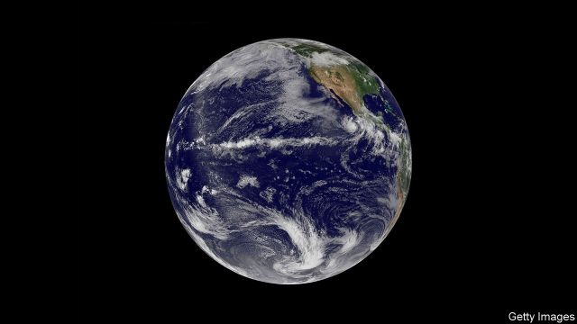
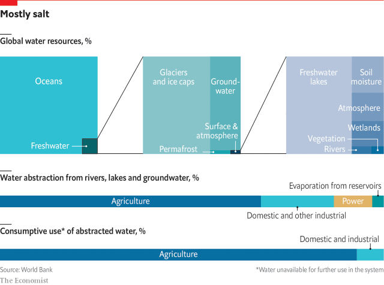
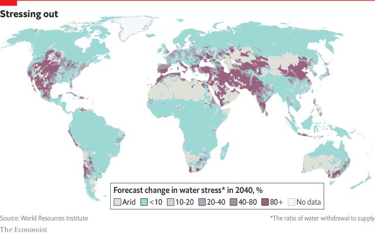

###### Water

# Climate change and population growth are making the world’s water woes more urgent 

##### And they are exacerbated by bad management, says Simon Long 

 

> Feb 28th 2019 

AS IT SCOURS the universe for signs of extraterrestrial life, NASA has a motto-cum-mission-statement: “Follow the water”. About 70% of the human body is made up of water, it says, and 70% of Earth’s surface is covered in the stuff. “Water creates an environment that sustains and nurtures plants, animals and humans, making Earth a perfect match for life in general.” 

If water is a proxy for life itself, it is perhaps not surprising that worries about the health and availability of supplies here on Earth can take on apocalyptic overtones. A scorching, arid future marked by a fierce, bloody struggle for a few drops of water is a standard theme of dystopian fiction and film-making. This report will examine how close such nightmares are to reality. It will look at the state of the world’s freshwater and at the increasing demands on it, and consider the ways they can be met. 

The first thing to recognise is that the 70% figure is largely irrelevant to the debate. The sea it represents is salty, accounting for 97.5% of all the water on Earth. A further 1.75% is frozen, at the poles, in glaciers or in permafrost. So the world has to rely on just 0.75% of the planet’s available water, almost all of which is subterranean groundwater, though it is from the 0.3% on the surface that it draws 59% of its needs (see chart). This report will argue that misuse of water may indeed lead to a series of catastrophes. But the means to dodge them are already known, and new technologies are constantly evolving to help. 

 

The fundamental problems, however, are neither the resource itself, since water is likely to remain abundant enough even for a more populous Earth, nor technical. They are managerial, or, more precisely, how to withstand economic, cultural and political pressures to mismanage water. In the harsh words of Asit Biswas, a water expert at the Lee Kuan Yew School of Public Policy in Singapore: “Lack of money, scarcity, and so on—they’re all excuses. The problem everywhere is bad management.” Or, as Jean-Claude Juncker, president of the European Commission, put it in an entirely different context: “We all know what to do, we just don’t know how to get re-elected after we’ve done it.” 

Even governments not facing the vexatious business of winning over voters struggle to institute sensible water policies. People regard access to water as a fundamental human right and hence as something that should be available on the basis of need, rather than the ability or willingness to pay. That makes it hard to charge a proper price for it, which in turn encourages profligate use. Even those who would be willing to curb their consumption for the benefit of generations to come may not be aware how much they are using. They consume it mostly not through drinking or washing, but through the water that has gone into the food they eat and the clothes they wear. 

In any event, water seems an infinitely renewable resource. Used in a bath, it can be reused—to water plants, for example. Rainwater can be “harvested” or may seep into the ground to replenish an aquifer. Water that evaporates from lakes, swimming pools and reservoirs, or “transpires” in the photosynthetic process whereby water passes into the leaves of plants, joins the atmosphere and will eventually be recycled. Over 60% of the rain and snow that falls is returned in this way through “evapotranspiration”. But, like water that has run into the sea, it cannot be used again until nature has recycled it. 

The present-day world provides ample examples of environmental devastation that serve as a warning that water usage has its natural limits. Boats are stranded aground in the middle of nowhere, amid the vanished waters of what was once the world’s fourth-largest saline lake, the Aral Sea, between Uzbekistan and Kazakhstan. Last year Cape Town in South Africa averted only narrowly the unwanted prize for being the first of the world’s big cities to run out of water. By the time rain finally broke a three-year drought, water levels in the reservoirs supplying the city had fallen to below 20%, and officials were discussing the feasibility of towing an iceberg from Antarctica to provide meltwater to drink. Four years earlier, it had been São Paulo in Brazil that had teetered on the brink, with reservoirs reduced to 5% of capacity. 

Even the sober assessment of the UN’s latest annual world “water development report” smacks of a kind of desperation. Already, it notes, more than a quarter of humanity—1.9bn people, with 73% of them in Asia—live in areas where water is potentially severely scarce (up, other studies suggest, from 240m, or 14% of the world’s population, a century ago). The number facing shortages almost doubles if you count those at risk at least one month a year. Meanwhile, global water use is six times greater than it was a century ago—and is expected to increase by another 20-50% by 2050. The volume of water used—about 4,600 cubic kilometres a year—is already near the maximum that can be sustained without supplies shrinking dangerously. A third of the world’s biggest groundwater systems are in danger of drying out. So the numbers living under severe water stress are expected to climb to as many as 3.2bn by 2050, or 5.7bn taking seasonal variation into account. And they will not just be in poor countries (see map). Australia, Italy, Spain and even America will endure severe water shortage. 

 

Three main factors will drive the continued growth in demand: population, prosperity and climate change. In 2050 the number of people in the world is expected to increase to between 9.4bn and 10.2bn, from just under 8bn now. Most of the increase will come in parts of the world, in Africa and Asia, that are already short of water. People will be leading more water-intensive lifestyles and move into cities, many of them in places at great risk of water shortage. 

The biggest uncertainty in projecting future demand lies in estimating how much will be needed for agriculture, which currently accounts for about 70% of water withdrawals, mostly for irrigation. Some forecast a big increase in demand, as food production has to rise to feed a growing population. Others, such as the OECD, have predicted a small decline in water use in irrigation thanks to a reduction in wastage and a rise in productivity. 

Still less predictable is the impact of climate change. The scientific consensus is that, in the words of Henk Ovink, the Dutch government’s special envoy on water matters, the process will be “like a giant magnifying glass, making all our challenges more extreme”. Wet places will become wetter and dry places drier. The world’s water endowment is already highly unequal—just nine countries account for 60% of all available fresh supplies. China and India have about 36% of the world’s people, but only about 11% of its freshwater. Climate change will exacerbate this inequity. And rainfall, such as the South Asian monsoons, on which much of subcontinental economic life hinges, will become more erratic. 

The most dramatic short-term effects have been the increasing number of extreme weather events. Over the past two decades these have affected on average about 300m people every year. Last September’s almost simultaneous storms—Hurricane Florence in the east of America, and super-Typhoon Mangkhut in East Asia—were linked by scientists to rising levels of greenhouse gases, warming oceans and changing climate. Measurements of sea temperatures down to 2,000 metres show a steady rise since the 1950s, to new records. Climate models have long forecast that warmer oceans will lead to more intense, longer-lasting storms. The rising temperatures are accompanied by rising sea levels—at a rate of about 3mm a year—as the warmer water expands, and as ice at both poles melts. Higher seas bring storm surges that can reach farther inland. And warmer air temperatures mean the atmosphere can hold more moisture that eventually falls as precipitation. 

In the long run, however, the bigger problem from climate change will not be too much water but too little. As a report by the World Bank puts it: “The impacts of water scarcity and drought may be even greater, causing long-term harm in ways that are poorly understood and inadequately documented.” Of course, a lot depends on how much the climate changes and how fast. 

Last October the Intergovernmental Panel on Climate Change published a report comparing the consequences of restraining global temperature rises to 1.5°C above pre-industrial levels as opposed to 2°C. It concluded “with medium confidence” that, with a 2°C rise, an additional 8% of the world’s population in 2000 will be exposed to new or aggravated water scarcity by 2050. With a 1.5°C rise, that falls to 4%. There would be considerable regional variation. For example, it cited research showing that, in the Mediterranean region, a 1.5°C rise in temperatures would lead to statistically insignificant changes in the mean annual flow in its rivers and streams. A 2°C rise, however, would bring decreases of 10-30%. 

Decreasing streamflow is a worldwide phenomenon. Some of it results from declining rainfall. But much is the direct result of human intervention—the damming and diversion of rivers for flood control, water-storage and irrigation. And, where rivers still flow, the water in them is often unsafe to drink or even bathe in. In surveying the Earth, surface water is an obvious place to start. As throughout this report, examples will be drawn worldwide, but especially from two countries with very contrasting experiences: Israel, which is sometimes held up as a model of sensible water management; and India, which almost never is. 

-- 

 单词注释:

1.woe[wәu]:n. 悲哀, 悲痛, 苦痛 

2.exacerbate[ek'sæsәbeit]:vt. 使恶化, 使增剧, 激怒, 使加剧 

3.simon['saimәn]:n. 西蒙（男子名） 

4.scour['skauә]:vt. 擦亮, 洗涤, 清洗, 冲刷成, 急速穿过 vi. 擦, 洗, 冲刷, 腹泻, 急速穿行 n. 擦, 洗, 腹泻, 洗涤剂 

5.extraterrestrial[,ekstrәtә'restriәl]:a. 地球外的, 地球大气圈外的 

6.NASA['næsә]:国家航空和宇宙航行局(美国) [电] 国际航空和太空总署的同义字 

7.nurture['nә:tʃә]:n. 养育, 营养物, 培育 vt. 养育, 供给营养物, 教养 

8.proxy['prɒksi]:n. 代理, 代理人, 委托书 [经] 代理人, 代表权, 授权书 

9.availability[ә.veilә'biliti]:n. 有效性, 可利用性, 可利用的人 [计] 有效性; 可用性 

10.apocalyptic[ә.pɒkә'liptik]:a. 天启的, <<启示录>>的 

11.overtone['әuvәtәun]:n. 泛音, 暗示, 弦外之音, 折光的色彩 [医] 陪音, 泛音 

12.scorch[skɒ:tʃ]:n. 烧焦, 枯萎 v. 烧焦, 拷焦, (使)枯萎, 讽刺 

13.arid['ærid]:a. 干燥的, 不毛的 

14.bloody['blʌdi]:a. 血腥的, 嗜杀的, 有血的 

15.dystopian[dis'tәjpiәn]:a. 反面乌托邦的,反面假想国的  n. 反面乌托邦的鼓吹者(或描写者) 

16.nightmare['naitmєә]:n. 梦魇, 恶梦, 可怕的事物(或情景、人物) [医] 梦魇, 恶梦 

17.freshwater['freʃwɔ:tә(r)]:a. 江河湖泊的, 淡水的 

18.irrelevant[i'relәvәnt]:a. 不恰当的, 无关系的, 不相干的 [法] 无关的, 不相干的, 离题的 

19.glacier['gleiʃә]:n. 冰川 

20.permafrost['pә:mәfrɔ(:)st]:n. [地]永久冻结带 

21.subterranean[.sʌbtә'reinjәn]:a. 地下的, 秘密的 n. 地下室, 地下工作者 

22.groundwater['graundwɒ:tә]:n. 地下水 

23.misuse[.mis'ju:z]:n. 误用, 滥用 vt. 误用, 滥用, 虐待 

24.sery[]:n. (Sery)人名；(俄)谢雷；(科特)塞里 

25.dodge[dɒdʒ]:v. 避开, 躲避 n. 诡计, 躲藏 

26.constantly['kɒnstәntli]:adv. 不变地, 不断地, 时常地 

27.populous['pɒpjulәs]:a. 人口多的, 人口稠密的 

28.managerial[.mænә'dʒiәriәl]:a. 管理的 [经] 管理上的, 经营上的 

29.precisely[pri'saisli]:adv. 精确地, 明确地, 刻板地, 拘泥地, 正好, 恰恰, 对, 正是如此, 确实如此, 不错 

30.cultural['kʌltʃәrәl]:a. 文化的, 教养的, 修养的 [医] 培养的 

31.mismanage[mis'mænidʒ]:vt. 处置失当, 对...管理不善 

32.asit[]:[网络] 创造性思维的先进系统(Advanced Systematic Inventive Thinking)；宏硕；变应原特异性免疫治疗 

33.biswas[]:n. (Biswas)人名；(英、德、印、孟、巴基)比斯瓦斯 

34.lee[li:]:n. 背风处, 避风处, 下风处, 保护, 庇护 a. 避风的, 背风的, 下风的, 保护的 

35.kuan[^wɑ:n]:n. 官窑瓷器 

36.yew[ju:]:n. 紫杉 

37.scarcity['skɑ:siti]:n. 缺乏, 不足, 缺少 [经] 缺乏, 不足 

38.juncker[]:[网络] 容克；欧元集团现任主席容克；欧元区主席容克 

39.entirely[in'taiәli]:adv. 完全, 全然, 一概 

40.vexatious[vek'seiʃәs]:a. 叫人发急的, 使人为难的, 无理缠讼的 [经] 苛捐杂税 

41.voter['vәutә]:n. 选民, 投票人 [法] 选民, 选举人, 投票人 

42.profligate['prɒfligit]:a. 放荡的, 不检点的, 浪费的 n. 放荡者, 享乐者 

43.curb[kә:b]:n. 抑制, 勒马绳, 边石 vt. 抑制, 束缚, 勒住 

44.infinitely['infinitli]:adv. 无限地, 无数地, 庞大地 

45.renewable[ri'nju(:)әbl]:a. 可更新的, 可恢复的, 可继续的, 可换新的, 可重复的, 可重说的 [计] 可更新, 可再生的 

46.rainwater['reinwɒ:tә]:n. 雨水 

47.seep[si:p]:vi. 渗出, 渗流, 漏 n. 小泉, 水陆两用吉普车 

48.replenish[ri'pleniʃ]:vt. 把...重新补足, 把...再装满 vi. 被再装满, 充满 

49.aquifer['ækwifә]:[化] 含水层 

50.reservoir['rezәvwɑ:]:n. 贮水池, 贮藏处, 贮备, 水库 vt. 储藏 

51.transpire[træn'spaiә]:vt. 使蒸发, 使排出 vi. 蒸发, 散发, 泄露 

52.photosynthetic[,fәutәusin'θetik]:a. 光合的 [医] 光合的 

53.whereby[(h)weә'bai]:adv. 靠什么, 如何, 为何, 靠那个, 因此, 由此 [法] 因此, 由是 

54.evapotranspiration[i,væpәu,trænspi'reiʃәn]:n. 土壤水分蒸发蒸腾损失总量 

55.cannot['kænɒt]:aux. 无法, 不能 

56.environmental[in.vaiәrәn'mentәl]:a. 周围的, 环境的 [经] 环境的, 环保的 

57.devastation[.devә'steiʃәn]:n. 毁坏 

58.strand[strænd]:n. (绳索的)股, 绳, 串, 海滨, 河岸 vi. 搁浅 vt. 使搁浅, 使落后, 使陷于困境, 弄断, 搓 

59.aground[ә'graund]:adv. 搁浅地, 地面上 

60.amid[ә'mid]:prep. 在其间, 在其中 [经] 在...中 

61.saline['seilain]:a. 盐的, 苦涩的, 由碱金属(或含镁之盐类)组成的 n. 盐湖, 盐田, 碱盐泻药, 生理盐水 

62.Aral['ærәl]:Sea 咸海[苏联中亚细亚地区](旧译阿拉海, 是一个大咸水湖) 

63.Uzbekistan[,uzbeki'stɑ:n]:n. 乌兹别克斯坦 

64.Kazakhstan[ˌkæzək'stæn]:n. 哈萨克斯坦（原苏联加盟共和国之一, 已于1991年宣布独立） 

65.cape[keip]:n. 岬, 海角, 披肩, 斗蓬 

66.avert[ә'vә:t]:vt. 转开, 避免, 防止 

67.narrowly['nærәuli]:adv. 狭窄地, 严密地, 仔细地, 几乎不, 勉强地, 仅仅 

68.unwanted[.ʌn'wɒntid]:a. 没人要的, 不需要的, 多余的 

69.feasibility[.fi:zә'biliti]:n. 可行性, 可能性 [化] 可行性 

70.tow[tәu]:n. 拖, 拖绳, 拖轮 vt. 拖, 拉, 牵引 

71.iceberg['aisbә:g]:n. 冰山, 冷冰冰的人 

72.meltwater['melt,wɔ:tә]:n. 冰雪融化成的水,冰河融化后的水 

73.paulo[]:n. 保罗（男子名） 

74.Brazil[brә'zil]:n. 巴西 

75.teeter['ti:tә]:vi. 步履不稳地走动, 踉跄, 摇晃, 摇摆不定, 摇摇欲坠, 玩跷跷板 n. 踉跄, 摇摆, 跷跷板 

76.brink[briŋk]:n. 边缘, 陡岸 

77.smack[smæk]:n. 风味, 滋味, 少量, 拍击声, 咂嘴声, 小渔船, 海洛因 vi. 有味道, 咂嘴, 发出拍击声 vt. 拍, 打, 掴, 咂, 出声地吻 adv. 啪地一声, 猛然 

78.desperation[.despә'reiʃәn]:n. 绝望 

79.potentially[pә'tenʃәli]:adv. 可能地, 潜在地 

80.dangerously[]:adv. 危险, 不安全 

81.seasonal['si:znәl]:a. 季节的, 依照季节的, 周期性的 [经] 季节性的, 季节的 

82.Spain[spein]:n. 西班牙 

83.lifestyle['laifstail]:n. 生活方式 

84.uncertainty[.ʌn'sә:tnti]:n. 不确定, 不可靠, 不确定的事物 [化] 不确定度 

85.currently['kʌrәntli]:adv. 现在, 当前, 一般, 普通 [计] 当前 

86.withdrawal[wið'drɒ:l]:n. 提款, 撤退, 退回, 撤消, 退隐, 戒毒过程 [医] 戒除, 脱瘾 

87.Oecd[]:[经] 已开发国家组织 

88.wastage['weistidʒ]:n. 浪费, 浪费量, 废物 [化] 废物 

89.productivity[.prәudʌk'tiviti]:n. 生产力 [经] 生产率, 生产能力 

90.les[lei]:abbr. 发射脱离系统（Launch Escape System） 

91.predictable[pri'diktәbl]:a. 可预言的 

92.henk[]:n. (Henk)人名；(德、匈、荷、印尼)亨克 

93.Dutch[dʌtʃ]:n. 荷兰人, 荷兰语 a. 荷兰的 

94.envoy['envɒi]:n. 外交使节, 特使 [法] 使者, 代表, 使节 

95.magnify['mægnifai]:vt. 放大, 扩大, 赞美, 夸大 vi. 有放大能力 

96.endowment[in'daumәnt]:n. 捐助, 天赋, 才能 [经] 捐赠, 捐款, 养老金 

97.inequity[in'ekwiti]:n. 不公平, 不公正 

98.monsoon[mɒn'su:n]:n. 季风, 吹季风的季节, 雨季 

99.subcontinental[sʌbkɒntɪ'nentl]:a. 次大陆的 

100.hinge[hindʒ]:n. 铰链, 关键, 枢纽 vt. 装铰链 vi. 靠铰链移动, 依...而转移 

101.erratic[i'rætik]:n. 古怪的人, 漂泊无定的人 a. 不稳定的, 奇怪的 

102.simultaneous[.simәl'teinjәs]:a. 同时的, 同时发生的 [计] 同时的 

103.Florence['flɒ:rәns]:n. 佛罗伦萨(意大利城市) 

104.surge[sә:dʒ]:n. 巨涌, 汹涌, 澎湃 vi. 汹涌, 澎湃, 颠簸, 猛冲, 突然放松 vt. 使汹涌奔腾, 急放 [计] 电压尖峰 

105.precipitation[pri.sipi'teiʃәn]:n. 坠落, 沉淀, 降水, 轻率, 急速, 猛冲, 突如其来 [化] 析出 

106.poorly['puәli]:adv. 贫穷地, 不充分地, 贫乏地 a. 身体不舒服的 

107.inadequately[]:adv. 不适当地；不够好地 

108.intergovernmental[,intә^ʌvәn'mentәl]:a. 政府间的 

109.aggravate['ægrәveit]:vt. 使恶化, 使更严重, 加重 

110.regional['ri:dʒәnәl]:a. 地方的, 地域性的 [医] 区的, 部位的 

111.cite[sait]:vt. 引用, 引证, 表彰 [建] 引证, 指引 

112.statistically[]:adv. 用统计的方法, 统计学上 

113.streamflow['stri:mflәu]:n. 河流流量 

114.diversion[dai'vә:ʒәn]:n. 转移 [医] 转向 

115.Israel['izreil]:n. 以色列, 以色列后裔, 犹太人 

