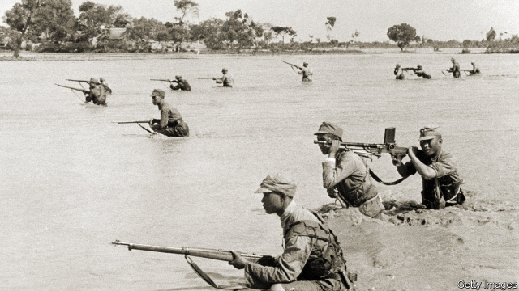
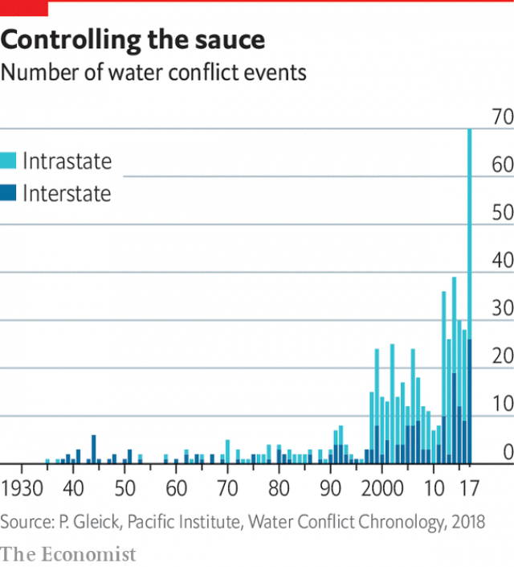

###### Water conflicts

# Disputes over water will be an increasing source of international tension 

##### Violence over water access is on the rise 

 

> Feb 28th 2019 

IT HAS BECOME a cliché of doom-mongering: future wars will be over water. The forecast is old enough to face a sceptical backlash. Whatever happened, people ask, to the water wars? One answer emphasises the role water has played in past conflicts. In his autobiography, Ariel Sharon, who before becoming Israel’s prime minister had been a commander in the six-day war of 1967, wrote that it “really started on the day Israel decided to act against the diversion of the Jordan…The matter of water diversion was a stark issue of life and death.” 

Another answer is that, though many conflicts involve water, it is rarely their sole motivation. That will remain true. But it also seems likely that water will be an aspect of ever more conflicts. A chronology maintained by the Pacific Institute, a think-tank in Oakland, California, of water-linked conflicts, shows a startling increase in their number in just the past few years (see chart). 

The institute distinguishes between three types of violence. Sometimes water itself can be used as a weapon, as when China in 1938 breached dykes along the Yellow River to repel the Japanese army, or, just last year al-Shabaab, a terrorist group, diverted water from the Jubba river in Somalia, causing a flood that forced opposing forces to move to higher ground where they were ambushed. 

 

Sometimes water is the trigger, as last year when conflicts over pasture land and water led to violence in both northern Kenya, and central Nigeria, where 11 people were killed in an attack by Fulani herdsmen on a farming community. Finally, water installations can also be the target of military action, as in 2006 when Hezbollah rockets damaged a wastewater plant in Israel, which mounted retaliatory attacks on water facilities in Lebanon. Last year, during ethnic strife in the populous Oromia region of Ethiopia, dozens of water systems were attacked. 

Most water conflicts will be subnational disputes. But transboundary tensions are also likely to intensify. A study last year by the Joint Research Centre, a think-tank under the European Commission, used computer modelling to rank the rivers where these are most likely to flare up. Its scientists listed five: the Nile, Ganges-Brahmaputra, Indus, Tigris-Euphrates and Colorado. 

In all these instances, downstream nations fear or resent the effect on their waters of the actions of upstream countries. Egypt worries about the Grand Renaissance Dam that Ethiopia is building on the Blue Nile, about 40km from the Sudanese border. India and Bangladesh fear that China’s water-diversion ambitions might one day turn towards the Brahmaputra as a source for China’s thirsty north. South-East Asian nations are concerned, too. Pakistan and India, in turn, squabble over the treaty they concluded in 1960 (to which the World Bank was also a signatory) on sharing the waters of the Indus. 

In contrast, no treaty regulates the Tigris and Euphrates rivers where dam construction in Turkey has reduced flow in Iraq and Syria. The Colorado river is shared by seven US states and two in Mexico. After a 19-year drought, water flow has dropped by nearly 20%. In Mexico, the river that created the Grand Canyon and fed a vast marshy delta has, for two decades, been almost completely dry. 

-- 

 单词注释:

1.backlash['bæklæʃ]:n. 后冲, 强烈反对 [电] 反撞, 逆栅流 

2.emphasise[]:vt. 强调, 重读, 加强...的语气, 着重 

3.ariel['єәriәl]:n. 瞪羚 

4.sharon[]:n. 莎伦（女子名） 

5.Israel['izreil]:n. 以色列, 以色列后裔, 犹太人 

6.diversion[dai'vә:ʒәn]:n. 转移 [医] 转向 

7.stark[stɑ:k]:a. 僵硬的, 完全的, 刻板的, 明显的, 荒凉的, 结实的 adv. 突出地, 简直, 全然 

8.chronology[krә'nɔlәdʒi]:n. 年代学, 资料按年月次序的排列, 按时间顺序编制的表格, 年表 

9.oakland['әuklәnd]:n. 奥克兰（美国加州西部城市） 

10.California[.kæli'fɒ:njә]:n. 加利福尼亚 

11.breach[bri:tʃ]:n. 裂口, 违背, 破坏, 违反, 突破, 破裂 vt. 攻破, 突破 vi. 跳出水面 

12.dyke[daik]:n. 堤 

13.repel[ri'pel]:vt. 逐退, 抵制, 使厌恶, 抗御 vi. 使厌恶, 相互排斥 

14.terrorist['terәrist]:n. 恐怖分子 [法] 恐怖份子, 恐怖主义 

15.divert[dai'vә:t]:vt. 转移, 使欢娱 vi. 转移 

16.jubba[]:[网络] 朱巴；朱罢 

17.Somalia[sәu'mɑ:liә]:n. 索马里 

18.ambush['æmbuʃ]:n. 埋伏, 伏兵, 伏击 vt. 埋伏, 伏击 vi. 埋伏 

19.trigger['trigә]:n. 触发器, 扳机 vt. 触发, 发射, 引起 vi. 松开扳柄 [计] 切换开关 

20.pasture['pæstʃә]:n. 牧场, 草地, 牧草 vt. 放牧 vi. 吃草 

21.Kenya['kenjә]:n. 肯尼亚 

22.Nigeria[nai'dʒiriә]:n. 尼日利亚 

23.Fulani['fu:lɑ:ni]:富拉尼人(即富尔贝人) 

24.herdsman['hә:dzmәn]:n. 牧人, 牧主 

25.Hezbollah[,hezbə'lɑ:]:n. （黎巴嫩）真主党（等于Hizbollah） 

26.wastewater['weistwɔ:tә]:n. 废水 

27.retaliatory[ri'tæliәtәri]:a. 报复的 [经] 报复性的 

28.Lebanon['lebәnәn]:n. 黎巴嫩 

29.ethnic['eθnik]:a. 人种的, 种族的 [医] 人种的 

30.strife[straif]:n. 争吵, 竞争, 冲突 

31.populous['pɒpjulәs]:a. 人口多的, 人口稠密的 

32.oromia[]:[网络] 奥罗莫；奥罗莫族州；奥罗莫洲 

33.Ethiopia[.i:θi'әupiә]:n. 埃塞俄比亚 

34.subnational[]:a. 低于国家的/地方的 

35.transboundary[ træns'baʊndərɪ]: 跨界 

36.intensify[in'tensifai]:vt. 加强 vi. 强化 

37.Nile[nail]:n. 尼罗河 

38.Indus['indәs]:n. 印度河, 印第安(星)座 

39.Colorado[,kɔlә'rɑ:dәu]:n. 科罗拉多, 科罗拉多河 

40.downstream['daun'stri:m]:adv. 下游地 a. 下游的 

41.resent[ri'zent]:vt. 愤恨, 憎恶, 怨恨 

42.upstream['ʌp'stri:m]:adv. 向上游, 逆流地 a. 向上游的, 逆流而上的 

43.Egypt['i:dʒipt]:n. 埃及 

44.renaissance[ri'neisәns]:n. 复活, 复兴, 文艺复兴 a. 文艺复兴的 

45.Sudanese[su:dә'ni:z]:a. 苏丹的, 苏丹人的 n. 苏丹人 

46.Bangladesh[,bɑ:ŋ^lә'deʃ]:n. 孟加拉国 [经] 孟加拉共和国 

47.Brahmaputra[,brɑ:mә'pu:trә]:n. 雅鲁藏布江(发源于西藏) 

48.Pakistan[.pɑ:ki'stɑ:n]:n. 巴基斯坦 

49.squabble['skwɒbl]:vi. 争吵, 口角 n. 争吵, 口角 

50.signatory['si^nәtәri]:n. 协议的签署者, 签约国 a. 签署的, 签约的 

51.tigris['tai^ris]:n. 底格里斯河（西南亚, 流经土尔其和伊拉克） 

52.Euphrates[ju:'freiti:z]:n. 幼发拉底河 

53.Iraq[i'rɑ:k]:n. 伊拉克 

54.Syria['siriә]:n. 叙利亚 [经] 叙利亚 

55.canyon['kænjәn]:n. 峡谷, 海底悬崖 

56.marshy['mɑ:ʃi]:a. 多沼地的, 湿地的, 沼地的 

57.delta['deltә]:n. 三角洲, 希腊字母的第四个字 [医] δ(希腊文的第四个字母), 丁种, 三角, 三角形区 

