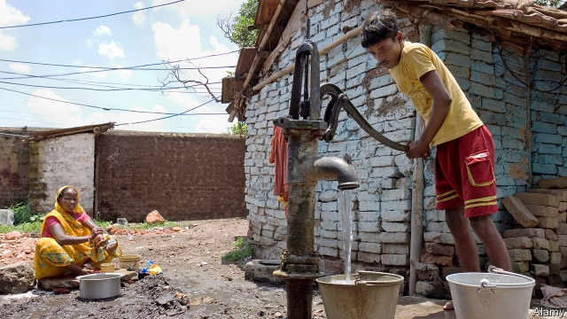

###### Groundwater

# Groundwater is helping to feed the world, but it is dangerously depleted 

##### Much underground water is poisoned, too 

 

> Mar 2nd 2019 

IN 2004, WHEN Danmanti Devi was four years old, her mother took her to see a doctor because of pains in her legs. The doctor wrongly diagnosed polio. He could do no more than prescribe painkillers. Danmanti’s legs are now deformed. Many others in Churaman Nagar, her 140-household hamlet of mud huts and a few “pukka” brick houses in rural Bihar, one of India’s poorest states, also hobble on the knock knees or bow legs characteristic of a condition known as skeletal fluorosis. She is one of millions of Indians to suffer this, and to have contracted it merely from drinking water containing dangerous levels of fluoride. She is a victim of the over-exploitation of India’s groundwater. 

Fluoride, like arsenic, is present naturally in groundwater. It is harmless (or even beneficial) in small concentrations. The World Health Organisation (WHO) suggests a limit of 1.5 milligrams per litre. In Churaman Nagar, the water that comes from standpipes overseen by the local panchayat (village council) has 16mg. 

The hamlet’s inhabitants are among India’s most downtrodden. They are dalits, once called “untouchables”, at the bottom of the Hindu caste system. They eke a living as wage labourers in nearby brick kilns or by distilling moonshine. 

In being poisoned by their drinking water, however, they are sadly typical. The most obvious danger—bacterial pollution—is a “second-order problem”, says V.K. Madhavan, chief executive in India for WaterAid, a British charity. More fundamental is contamination by arsenic, nitrates, salinity and fluoride. Some of this is natural, some a consequence of industrial effluent, and of seepage from landfills, septic tanks, leaky underground gas tanks and the overuse of fertilisers and pesticides. But the most intractable difficulty is the pumping of groundwater from ever deeper below the surface. The deeper the water, the more likely it is to be contaminated by chemicals such as arsenic seeping downwards. 

As long ago as 2002, the WHO called the effects of arsenic contamination of groundwater in Bangladesh “the largest mass poisoning of a population in history”. Tens of millions are at risk in neighbouring India, too. Efforts to save people from the bacterial diseases carried by surface water leave them condemned to longer-term dangers hidden in the groundwater. Arsenic has been linked to cancers of the skin, gallbladder and lungs. 

In the scheme of things, the extraction of groundwater for drinking and bathing by India’s poor, like those in Churaman Nagar, is a minor cause of its over-exploitation. Far more important is irrigation. Almost 60% of India’s irrigation needs are now met from groundwater. The Green Revolution which, in the 1970s, transformed India’s ability to feed itself and turned it into a big food exporter, relied on tube wells, powered by electric pumps. 

It also turned India into the world’s biggest extractor of groundwater. The five largest such users, which include America, China, Iran and Pakistan, account for 67% of total extractions worldwide. In India, the water is free. A law from 1882 gives every landowner the right to collect and dispose of all water on and under his land. The cost of the electricity needed to pump it ever farther to the surface is one constraint. But Indian politicians love to lavish cheap or free electricity on rural voters when elections loom (as, in India, they often do). The Green Revolution saw agriculture’s share of total energy use climb from 10% in 1970 to 30% by 1995. 

This freed many farmers from the fickle monsoon—India usually receives more than 70% of its annual rainfall in the annual downpours from June to September. In Churaman Nagar, and elsewhere in Bihar, residents believe the rains are weaker than they were, though scientists have so far measured only a tiny decline in the rains in recent years. 

In India and elsewhere the easy availability of groundwater has encouraged the cultivation of thirsty crops in water-stressed areas. Starting under British rule, irrigation canals and groundwater-extraction turned the arid lands of Punjab into India’s agricultural powerhouse. Similarly, in China, the dry plains of the north-east now produce 60% of the country’s wheat and 40% of its maize on an area with 4% of its water resources. 

As Sunil Amrith, a historian at Harvard University, notes in his new book, “Unruly Waters”, the half-century since the 1960s has reversed a centuries-old pattern in which agrarian wealth lay where rains were most abundant. Instead, Israel, Punjab and Manchuria have actually become net exporters of water, if you include what hydrologists call “virtual” water used in the production of a crop or good. In other words, they sell more water in the form of crops and products than they import in that form or extract from their own sources of water. Mr Amrith notes the “most bitter of ironies” in this agricultural miracle: intensified production means that more land is planted with crops, which reflect more solar radiation than forests. The land becomes cooler, weakening the temperature differences with the sea that drive the circulation of the monsoon. So measures taken to protect farmers from the vagaries of the monsoon have in fact themselves helped make the rains more fickle. 

This phenomenon is not confined to India. Across the world, the need for more food production encourages deforestation and the use of more land for agriculture. That in turn will increase demand for irrigation which, as precipitation becomes more erratic and surface water is over-used, will probably rely ever more on groundwater. The long-term impact of this is uncertain. Research led by Mark Cuthbert, of the School of Earth and Ocean Sciences at Cardiff University, found that groundwater systems are likely to take far longer fully to respond to differences induced by climate change than does surface water. Only half the world’s groundwater flows are likely to find a new equilibrium within 100 years. The arid regions where water is scarce are often where response times are longest. So the full impact of withdrawals now may not be felt for decades, or much longer in some cases. 

-- 

 单词注释:

1.groundwater['graundwɒ:tә]:n. 地下水 

2.dangerously[]:adv. 危险, 不安全 

3.deplete[di'pli:t]:vt. 耗尽, 使衰竭 [医] 排除, 减少 

4.devi[]:n. 提毗（梵语中“女神”的意思）；井斜（测井曲线代号） 

5.wrongly[]:adv. 错误地, 不恰当地, 不正确地, 不正直地, 不公正地 

6.diagnose['daiәgnәuz]:v. 诊断 

7.polio[]:n. 脊髓灰质炎, 小儿麻痹症 [医] 脊髓灰质炎 

8.painkiller['pein,kilә(r)]:n. 解痛药, 止痛片, 止痛药 

9.deform[di'fɒ:m]:vt. 使残缺, 使变形 vi. 变形 

10.nagar[]:n. 纳加尔（巴基斯坦地名） 

11.hamlet['hæmlit]:n. 小村, 部落 

12.pukka['pʌkә]:a. 份量充足的, 纯良的 

13.Bihar[bi'hɑ:]:n. 比哈尔邦(印度地名) 

14.hobble['hɒbl]:vi. 蹒跚 vt. 使跛行, 阻碍 n. 跛行 

15.skeletal['skelәtәl]:a. 骨骼的, 框架的 [医] 骨胳的 

16.fluorosis[flu(:)ә'rәusis]:[化] 氟中毒 [医] 氟中毒, 斑釉 

17.fluoride['flu(:)әraid]:n. 氟化物 [化] 氟化物 

18.groundwater['graundwɒ:tә]:n. 地下水 

19.fluoride['flu(:)әraid]:n. 氟化物 [化] 氟化物 

20.arsenic['ɑ:sәnik]:n. 砷, 砒霜 [化] 砷As 

21.organisation[,ɔ: ^әnaizeiʃən; - ni'z-]:n. 组织, 团体, 体制, 编制 

22.milligram['miligræm]:n. 毫克 [电] 毫克 

23.standpipe['stændpaip]:n. 竖管 [化] 立管; 竖管 

24.oversee[.әuvә'si:]:vt. 向下看, 了望, 监督, 偷看到 [法] 监察, 监督, 俯瞰 

25.panchayat[pʌn'tʃaiәt]:n. ( 印度的) 村务委员会, 五人长老会 

26.downtrodden['dajntrɔd(ә)n]:a. 被蹂躏的, 受压制的 

27.dalits['dælɪt]:[网络] 贱民；达利人；是达利人 

28.untouchable[ʌn'tʌtʃәbl]:a. 达不到的, 碰不着的, 管不到的, 不可批评的, 碰不得的, 不可捉摸的, 无形的 

29.Hindu['hindu:]:a. 印度教教徒的 n. 印度教教徒 

30.caste[kæst. kɑ:st]:n. 印度的种姓制度, (排他的)社会团体 

31.eke[i:k]:vt. 补充, 增加 

32.kiln[kiln]:n. 窑, 炉, 干燥炉 vt. 烧窑, (在干燥炉)烘干 

33.distil[]:vt.vi. 蒸馏, 提取...的精华, 用蒸馏法提取 vi. 滴下, 渗出 

34.moonshine['mu:nʃain]:n. 月光, 大话, 非法酿制的酒 

35.vk[]:abbr. 维生素k（vitamin k） 

36.madhavan[]: [人名]马德哈万 

37.wateraid[]:[网络] 水支援协会；组织；水帮助协会 

38.contamination[kәn.tæmi'neiʃәn]:n. 污染, 污物 [化] 污染; 沾污 

39.nitrate['naitreit]:n. 硝酸盐 [化] 硝酸盐(或酯) 

40.salinity[sә'liniti]:n. 盐性, 盐度 [化] 盐度 

41.effluent['efluәnt]:a. 流出的, 射出的 n. 流出物, 由河湖等流出之水流 

42.seepage['si:pidʒ]:n. 渗漏, 渗出物 [化] 渗流 

43.landfill['lændfil]:n. 垃圾堆；垃圾填埋地 

44.septic['septik]:a. 腐败的, 脓毒性的 n. 引起腐败的物质 

45.leaky['li:ki]:a. 有漏洞的, 易泄漏秘密的, 爱哭的 [电] 漏的 

46.overuse[.әuvәr'ju:z]:vt. 使用过度 n. 过度使用, 任意驱使 

47.fertiliser['fә:tilaizә]:[化] 肥料 

48.pesticide['pestisaid]:n. 杀虫剂 [化] 农药 

49.intractable[in'træktәbl]:a. 不听话的, 倔强的, 棘手的 [医] 顽固的, 难治的 

50.contaminate[kәn'tæmineit]:vt. 弄污, 弄脏, 污染, 毒害 [化] 污染 

51.seep[si:p]:vi. 渗出, 渗流, 漏 n. 小泉, 水陆两用吉普车 

52.downwards['daunwәdz]:adv. 向下 

53.Bangladesh[,bɑ:ŋ^lә'deʃ]:n. 孟加拉国 [经] 孟加拉共和国 

54.tens[]:十位 

55.bacterial[bæk'tiәriәl]:a. 细菌的 [医] 细菌的, [无芽胞]杆菌的 

56.arsenic['ɑ:sәnik]:n. 砷, 砒霜 [化] 砷As 

57.gallbladder['gɒ:lblædә]:n. 胆囊 [医] 胆囊 

58.extraction[ik'strækʃәn]:n. 抽出, 取出, 拔出术, 抽出物 [化] 萃取; 提取 

59.BThE[]:[网络] 实际热效率 

60.exporter[ik'spɒ:tә]:n. 出口商, 输出者, 出口公司 [经] 出口商, 输出者 

61.extractor[ik'stræktә]:n. 抽出器, 拔取的人, 抽出者 [计] 抽取字; 析取字 

62.Iran[i'rɑ:n]:n. 伊朗 

63.Pakistan[.pɑ:ki'stɑ:n]:n. 巴基斯坦 

64.landowner['lændәunә]:n. 地主 [法] 土地所有人, 地主 

65.constraint[kәn'streint]:n. 强制, 约束 [计] 约束 

66.lavish['læviʃ]:a. 大方的, 丰富的, 浪费的 vt. 浪费, 滥用, 慷慨给予 

67.voter['vәutә]:n. 选民, 投票人 [法] 选民, 选举人, 投票人 

68.loom[lu:m]:n. 织布机, 若隐若现的景象 vi. 朦胧地出现, 隐约可见, 可怕地出现 

69.fickle['fikl]:a. 变幻无常的, 浮燥的, 薄情的 

70.downpour['daunpɔ:]:n. 倾盆大雨；注下 

71.availability[ә.veilә'biliti]:n. 有效性, 可利用性, 可利用的人 [计] 有效性; 可用性 

72.cultivation[.kʌlti'veiʃәn]:n. 教化, 培养, 耕作 [医] 培养[法] 

73.arid['ærid]:a. 干燥的, 不毛的 

74.Punjab[pʌn'dʒɑ:b]:n. 旁遮普(南亚一地区) 

75.powerhouse['pauәhaus]:n. 发电所, 动力室, 精力旺盛的人, 办事效率高的机构 

76.maize[meiz]:n. 玉蜀黍, 黄色 a. 玉蜀黍色的, 黄色的 

77.Sunil[]:n. 苏尼尔（男子名） 

78.historian[hi'stɒ:riәn]:n. 历史学家, 记事者 

79.Harvard['hɑ:vәd]:n. 哈佛大学 

80.unruly[.ʌn'ru:li]:a. 难控制的, 无法无天的, 任性的 

81.agrarian[ә'grєәriәn]:a. 土地的, 耕地的 [法] 土地的, 土地所有制的 

82.Israel['izreil]:n. 以色列, 以色列后裔, 犹太人 

83.Manchuria[mæn'tʃuriә]:n. 满洲(东北的旧称) 

84.hydrologist[hai'drɒlәdʒist]:n. 水文学者 

85.extract[ik'strækt]:n. 榨出物, 精汁, 摘录, 选段 vt. (费力地)取出, 采掘, 榨取, 摘录, 吸取 [计] 提取 

86.irony['aiәrәni]:n. 反语, 讽刺, 具有讽刺意味的事 

87.intensify[in'tensifai]:vt. 加强 vi. 强化 

88.circulation[.sә:kju'leiʃәn]:n. 流通, 循环, 发行量 [化] 环流 

89.monsoon[mɒn'su:n]:n. 季风, 吹季风的季节, 雨季 

90.vagary['veigәri]:n. 狂想, 奇特行为, 奇想 

91.deforestation[di:.fɒ:ri'steiʃәn]:n. 采伐森林, 森林开伐 [法] 砍伐森森 

92.precipitation[pri.sipi'teiʃәn]:n. 坠落, 沉淀, 降水, 轻率, 急速, 猛冲, 突如其来 [化] 析出 

93.erratic[i'rætik]:n. 古怪的人, 漂泊无定的人 a. 不稳定的, 奇怪的 

94.Cuthbert['kʌθbәt]:卡斯伯特(姓氏, 男子名) 

95.cardiff['kɑ:dif]:n. 加的夫（英国港市） 

96.fully['fuli]:adv. 十分地, 完全地, 充分地 

97.induce[in'dju:s]:vt. 引诱, 招致, 归纳出, 感应 [医] 诱导, 感应 

98.equilibrium[.i:kwi'libriәm]:n. 平衡, 平静, 均衡 [化] 平衡 

99.withdrawal[wið'drɒ:l]:n. 提款, 撤退, 退回, 撤消, 退隐, 戒毒过程 [医] 戒除, 脱瘾 

