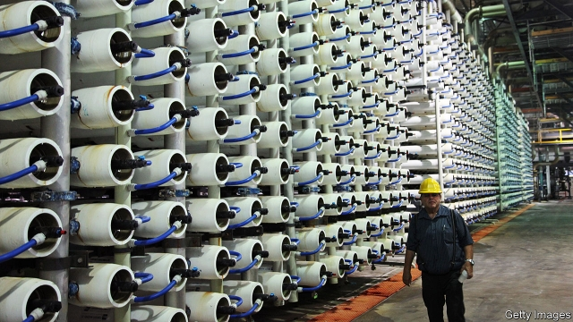
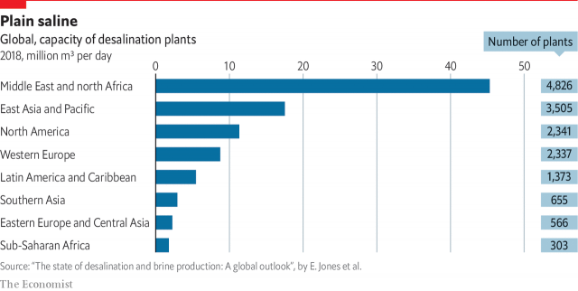

###### Desalination

# Manufactured water can supplement the natural stuff, but never replace it 

##### And the cost of desalination can be prohibitive 

 

> Feb 28th 2019 

THE SOREK desalination plant, about 15km south of Tel Aviv, is eerily unpopulated. This is the largest such plant in the world, producing as much as 230m cubic metres of desalinated water a year—about one-fifth of Israel’s domestic water supply. Yet only 20 staff are needed at any time to operate it. Seawater is piped in from over a kilometre out at sea. It is given a preliminary clean in a series of large tanks where it is filtered slowly through sandbeds before being pumped through “reverse osmosis” membranes (pictured). 

These are based on a design first patented in the early 1960s by Sidney Loeb, an American scientist who moved to Israel and saw his invention eventually oust competing methods and become the dominant desalination technology not just in his new homeland, but around the world, accounting for 69% of the output of desalinated water. They certainly seem effective. The water is absolutely tasteless. Indeed, what it lacks—calcium and magnesium, for example—causes more worries than pollutants. 

But these are minor quibbles, easily fixed: at first sight, desalination seems the answer to the world’s water needs. Seawater is not going to run out. Indeed, sea levels are already rising because of climate change. To be sure, desalination is catching on. A recent synthesis of available data by Manzoor Qadir, of the Institute for Water, Environment and Health at the UN University (UNU), and other scholars, found that 15,906 plants are in operation worldwide, producing 95m cubic metres a day of desalinated water. Israel already has five plants and is planning another two. The country has a target of increasing annual production from 600m cubic metres a year now to 1.1bn in 2030. In global league tables, however, Israel remains a relatively small producer, with a 2% global share, compared with Saudi Arabia (15.5%), the United Arab Emirates (10.1%) and Kuwait (3.7%). Nearly half (48%) of global production is, not surprisingly, in the Middle East and north Africa. China and America also have large capacities (see chart). Eight countries (the Maldives, Singapore, Qatar, Malta, Antigua, Kuwait, the Bahamas and Bahrain) produce more desalinated water than they withdraw from natural sources. 

 

That breakdown of where desalination is used hints at two reasons it is not a panacea. One is geography. If the sea is the feedstock it will be too costly to transport desalinated water long distances inland—to western China, for example. Secondly, even for coastal regions, desalination is very expensive, which explains why two-thirds of existing facilities are located in high-income countries. The expense comes partly in the capital cost of the plants. Sorek required a total investment of about $400m. In Israel the desalination industry marks a departure from one of the cardinal principles of its water-management policies—that all water is a public good. From the moment a raindrop leaves a cloud it is the state’s property. However, four out of the five desalination plants are privately owned. 

The second big reason for the expense is the energy they use—typically between one-half and two-thirds of the cost of desalinated water. Israel has managed to achieve relatively good energy efficiency, partly through the use of innovative membranes. The price of Sorek’s water is $0.50-0.55 a cubic metre, down from $0.78 for water from the first Israeli plant built on the public-private model at Ashkelon, which opened in 2005. 

The UNU paper concentrated on a third drawback to desalination: what happens to the salty sludge (known as brine) left behind by the pristine, desalinated water. At Sorek, as is typical, it is taken out by a pipe and discharged nearly 2km out at sea. Around the world, desalination plants produce nearly 50% more brine (141.5m cubic metres a day) than freshwater. 

The researchers worry about the threat that uncontrolled discharge of brine could cause to marine life. At the very least it raises the salinity of the surrounding seawater, depleting the dissolved oxygen. But in some places it may be accompanied by toxic chemicals used in the treatment process. More optimistically, they also point to opportunities to use reject brine, for example, in aquaculture, where it has achieved increases in fish biomass of 300%. 

The sea is not the only source of manmade water in Israel. It also treats and reuses 86% of its waste water. In this it claims to be far ahead of the rest of the world—with the next-highest recycler being Spain, with just 20%. This is cheaper than desalinated water and is primarily used for agriculture (which accounts for 52% of Israel’s water usage), with about 10% returned to “nature” (eg, to increase river flow), or used for putting out fires. That leaves the expensive stuff to flow out from the taps in people’s houses. In this area Singapore even goes one better: it drinks its treated sewage. “NEWater” is reclaimed wastewater treated with advanced membrane technologies and ultra-violet disinfection. Its four plants can meet up to 30% of Singapore’s needs—three times as much as its local catchment. 

All of this costs money. Both Israel and Singapore are unusual in trying to recoup the full cost from the consumer, though Singapore subsidises lower-income users. Pricing is a reminder to consumers in both places of water’s importance to national security, and of the truth of an observation made by Mr Schor of the Israeli water authority: “Desalination is the most expensive way to produce a cubic metre of water. The cheapest way is to save it.” 

-- 

 单词注释:

1.desalination[di:,sæli'neiʃәn]:[化] 脱盐 [医] 脱盐[作用], 去盐[作用] 

2.desalination[di:,sæli'neiʃәn]:[化] 脱盐 [医] 脱盐[作用], 去盐[作用] 

3.prohibitive[prә'hibitiv]:a. 禁止的, 禁止性的 [经] 禁止性的, 抑制的 

4.sorek[]:[网络] 梭烈谷；孙在梭烈谷；索里克 

5.tel[tel]:abbr. 试验仪器清单（Test Equipment List） 

6.Aviv[ɑ:'viv]:n. 大自然的重生 n. (Aviv)人名；(俄)阿维夫 

7.eerily[]:a. 怪诞的；奇异的；可怕的 

8.unpopulated[ʌn'pɔpjuleitid]:a. 无人居住的 

9.desalinated[di:'sælineit]:vt. 除去……中的盐分；使……脱盐 

10.seawater['si:.wɒtә]:n. 海水 [化] 海水 

11.sery[]:n. (Sery)人名；(俄)谢雷；(科特)塞里 

12.sandbeds[]:[网络] 砂组 

13.osmosis[ɒz'mәusis]:n. 渗透作用, 渗透性, 潜移默化, 耳濡目染 [化] 渗透; 渗透作用 

14.membrane['membrein]:n. 薄膜, 膜, 羊皮纸 [化] 膜; 隔膜 

15.sidney[]:n. 西德尼（男子名）；茜德尼（女子名） 

16.loeb[lә:b]:罗卜（Jacques；1859-1924生于德国的美国生理学家及生物学家） 

17.Israel['izreil]:n. 以色列, 以色列后裔, 犹太人 

18.oust[aust]:vt. 逐出, 罢黜, 剥夺, 驱逐 [法] 驱逐, 剥夺, 免职 

19.dominant['dɒminәnt]:a. 占优势的, 支配的 [医] 优性的, 显性的 

20.magnesium[mæg'ni:ziәm]:n. 镁 [化] 镁Mg 

21.pollutant[pә'lu:tәnt]:n. 污染物质 [法] 污染物 

22.quibble['kwibl]:n. 遁词, 双关语 vi. 吹毛求疵, 争吵, 说模棱两可的话 vt. 对...诡辩 

23.synthesis['sinθisis]:n. 综合, 组织, 综合体 [化] 合成 

24.datum['deitәm]:n. 论据, 材料, 资料, 已知数 [医] 材料, 资料, 论据 

25.manzoor[]:[网络] 曼佐尔 

26.qadir[]:[网络] 卡迪尔；强大的；男性 

27.UN[ʌn]:pron. 家伙, 东西 [经] 联合国 

28.unu[]:abbr. United Nations University 联合国大学（在日本东京） 

29.producer[prә'dju:sә]:n. 生产者, 制作者, 制作人 [化] 发生器; (炉煤气)发生炉; 制气炉; 生产者 

30.saudi['sajdi]:a. 沙乌地阿拉伯（人或语）的 

31.Arabia[ә'reibiә]:n. 阿拉伯半岛 

32.emirate[e'miәrit]:n. 埃米尔的地位, 酋长国 

33.Kuwait[kә'wait]:n. 科威特 

34.Maldives['mɔ:ldaivz, 'mæl-]:马尔代夫(群岛)[亚洲岛国] 

35.Singapore[.siŋgә'pɒ:]:n. 新加坡 

36.Qatar['kɑ:tәr]:n. 卡塔尔 

37.Malta['mɒ:ltә]:n. 马尔他 

38.Antigua[æn'ti:^ә]:安提瓜岛 

39.Bahamas[bә'hɑ:mәz]:n. 巴哈马群岛 

40.Bahrain[]:n. 巴林岛 

41.breakdown['breikdaun]:n. 崩溃, 故障 [化] 事故; 击穿 

42.panacea[.pænә'siә]:n. 万能药, 灵丹妙药 [医] 万应药 

43.feedstock['fi:dstɔk]:n. 原料 

44.coastal['kәustәl]:a. 海岸的, 沿海的, 沿岸的 [法] 海岸的, 沿海的 

45.sorek[]:[网络] 梭烈谷；孙在梭烈谷；索里克 

46.cardinal['kɑ:dinәl]:n. 红衣主教, 鲜红色 a. 主要的, 深红色的 

47.raindrop['reindrɒp]:n. 雨滴, 雨点 

48.privately[]:adv. 秘密地；私下地 

49.innovative['inәjveitiv]:a. 革新的, 创新的, 富有革新精神的 

50.Israeli[iz'reili]:a. 以色列的, 以色列人(语)的 n. 以色列人 

51.ashkelon['æʃkilən]:n. 阿什克伦（古城市名） 

52.sludge[slʌdʒ]:n. 软泥, 泥泞 [化] 沉淀物; 泥状沉淀 

53.brine[brain]:n. 盐水, 海水, 海 vt. 用浓盐水处理 

54.pristine['pristi:n]:a. 太古的, 原来的, 古时的, 原始的 

55.freshwater['freʃwɔ:tә(r)]:a. 江河湖泊的, 淡水的 

56.uncontrolled[.ʌnkәn'trәuld]:a. 不受抑制的, 不受控制的, 自由的 

57.salinity[sә'liniti]:n. 盐性, 盐度 [化] 盐度 

58.seawater['si:.wɒtә]:n. 海水 [化] 海水 

59.deplete[di'pli:t]:vt. 耗尽, 使衰竭 [医] 排除, 减少 

60.toxic['tɒksik]:a. 有毒的, 中毒的 [医] 中毒的, 毒物的 

61.optimistically[]:adv. 乐观地；乐天地 

62.aquaculture['ækwә.kʌltʃә]:n. 水产养殖 

63.biomass['baiәumæs]:n. 生物量 [化] 生物质; 生物量 

64.manmade[]:[经] 人造的 

65.recycler[]:[计] 再循环器, 反复循环器 

66.Spain[spein]:n. 西班牙 

67.eg[]:abbr. [拉]例如（exempli gratia）；[网络用语]邪恶的笑（Evil Grin） 

68.sewage['sju:idʒ]:n. 脏水, 污水 [医] 污水, 污物 

69.newater[]:[网络] 新生水；新生水厂；新加坡新生水 

70.reclaim[ri'kleim]:vt. 开垦, 改造, 感化, 纠正, 回收 vi. 喊叫, 抗议 

71.wastewater['weistwɔ:tә]:n. 废水 

72.disinfection[.disin'fekʃәn]:n. 消毒 [医] 消毒 

73.catchment['kætʃmәnt]:n. 排水区, 集水, 流域 

74.recoup[ri'ku:p]:vt. 偿还, 赔偿, 补偿, 扣除 vi. 补偿损失 

75.subsidise[]:vt. 给...补助金, 津贴, 资助 

76.reminder[ri'maindә]:n. 提醒的人, 暗示 [经] 催单 

77.schor[]:[网络] 肖尔；黑碧玺 

