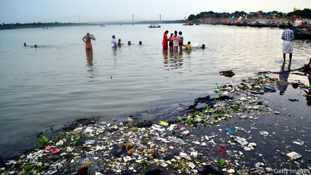

###### Rivers and lakes

# Poisoned and over-exploited, many rivers are in a parlous state 

##### Three different approaches are trying to improve that 

 

> Mar 2nd 2019 

THE RIVER VIEW HOTEL on the banks of the Yamuna river at Okhla, on the outskirts of Delhi, lives up to its name. But the view is not uplifting. Rubbish is strewn along the water’s edge. As elsewhere in India, industrial pollution, untreated sewage and the still widespread practice of open defecation make this stretch of the Yamuna a toxic soup teeming with bacterial infection. According to India’s Central Pollution Control Board (CPCB), in 2016 the water contained at times 1.6bn faecal coliform bacteria per 100ml—more than 3m times the CPCB’S “desirable” bathing limit of 500 per 100ml. 

About 600km (373 miles) downstream from Okhla the sacred Yamuna joins an even holier river, the Ganges, or Ganga, at Prayagraj (formerly Allahabad), site from January to March this year of the six-yearly kumbh, a Hindu festival that is expecting 150m devotees—perhaps the largest human gathering ever held anywhere. They have waited for days for the chance to cleanse their souls, if not their bodies, by taking a short dip (limited to 41 seconds, in an effort to avert stampedes) in the blessed waters. The river there is considerably less toxic. In December the CPCB ordered state governments to stop “grossly polluting units”—distilleries, paper mills and textile factories—discharging effluent into the river. The Tehri dam upstream released more water to ensure it flowed just fast enough to wash away sins but not sinners. 

Even farther downstream, the Ganges reaches Varanasi, Hinduism’s holiest city and the parliamentary constituency of India’s Hindu-nationalist prime minister, Narendra Modi. Year-round, devotees visit to bathe or drink the waters, or to cremate their dead on the ghats, the series of broad stone staircases that line the southern bank. One of Mr Modi’s first and most fervent pledges in office was to clean up the Ganges, to ensure its “purity and uninterrupted flow”. He renamed the Ministry of Water Resources by adding to its title “River Development and Ganga Rejuvenation”. 

But the water remains polluted and dangerous to health, and the Ganges’ flow is weakening, in part because of the hydroelectric dams on its upper reaches. A study in 2018 found its flow in some stretches may have fallen by 50% since the 1970s. Climate change has actually encouraged the damming of the river. By one reckoning about 70% of the Ganges’ flow is contributed by meltwater from the Himalayan glaciers from where it springs. Engineers had assumed that, as temperatures rise, more ice would melt, increasing the river’s flow and hence its hydroelectric potential. In fact, it has declined in the past few years, because the aquifers supplying Himalayan rivers have been shrinking as winter precipitation drops. In the long run, however, the fate of the glaciers might doom the great rivers. A study published in February by the International Centre for Integrated Mountain Development, a think-tank in Nepal, warned that even on relatively benign forecasts of global warming, more than a third of Himalayan glaciers will have melted by 2100, with river flows declining from the 2060s. 

The state of the holy river is worth dwelling on. Some 400m people—5% of humanity—live on its plains. But it may also be the most powerful symbol anywhere of the sheer difficulty of managing freshwater supplies. As Victor Mallet, a British journalist, asks in his book on the Ganges, “River of Life, River of Death”, “Why do Indians and their governments tolerate for even a week the over-exploitation of their holy river—sometimes to the point of total dehydration—by irrigation dams and its poisoning by human waste and industrial toxins?” After five years of government under Mr Modi, that question remains unanswered. 

The clean-up effort has two main elements. The first involves a nationwide campaign, known as swachh bharat (clean India) to end open defecation, in which India in 2014 led the world, with 600m open defecators out of a global total of 1bn. Thanks to subsidies for the construction of 92m toilets (mostly simple twin-pit arrangements that turn faecal sludge into harmless compost), the government says the “ODF” (open-defecation free) rate has risen from 39% in 2014 to 99% now. Many scoff at such hyperbole, but, at the very least, in many places to venture at dawn through the Indian countryside is no longer to intrude on a mass latrine. 

The second aim, building treatment plants, has been beset by disagreements over the design of the scheme. Private companies are to bid for treatment contracts, with payment partly based on sensors tracking the water they produce. They are handicapped by the lack of sewers in much of India, so in many cases they will have to block discharges with weirs to divert them for treatment. 

If such a sacred source is so hard to rescue, what hope for other ravaged rivers and lakes, in India and elsewhere? For his book “When the Rivers Run Dry”, published in 2006 and recently updated, Fred Pearce, a British writer, visited dozens of countries around the world and writes of river after river under seemingly life-threatening stress. Three of the rivers have, since Mr Pearce’s first visit, become test-cases for different approaches to solving surface-water problems: large-scale infrastructure to bring water from elsewhere; flow-management through digital monitoring; and the use of economic levers. 

In Israel, the state of its famous sources of surface water—the River Jordan and the Sea of Galilee (in fact, a freshwater lake)—is also a national preoccupation. After five years of its worst drought in nearly a century, the level of the Sea had sunk late last year to alarming levels. Heavy rains in December and January ended the crisis, but Israel’s supply of natural freshwater remains precarious, according to Uri Schor of Israel’s water authority. 

For much of Israel’s history, Galilee supplied most of its drinking water. Under the British mandate over Palestine, economists used to worry that immigration into the territory would overwhelm its available water resources. In 1939, 834,000 people lived there. The upper limit was seen as 2m. Israel now has 8.7m inhabitants, with another 5m people living in the occupied territories. They no longer rely on the Sea of Galilee for water. More than half the water Israel uses is man-made, from desalinated seawater (see article) and treated effluent. So during the drought the 400m cubic metres that used to be pumped annually from the Sea was cut, to less than 70m in 2018. Now Israel plans to replenish it with desalinated water so it will form a strategic water reserve. 

For now, though, the Sea of Galilee is probably more important to tourists and pilgrims. They can also survey the River Jordan, which runs south into the Dead Sea, the fast-evaporating saltwater lake at Earth’s lowest point on dry land (430 metres below sea-level). The Jordan has long disappointed visitors expecting to see the “deep and wide” waterway from which Michael rowed his boat ashore. In places it can be crossed with a standing jump. 

The Yellow River in China, the world’s seventh-longest at 5,500km, now counts as a success story. It gets its colour, and name, from the loess-soil sediment it carries downstream. Its fertile basin was the cradle of Chinese civilisation and, in an epithet often given the river, its “sorrow”. A build-up of sediment changed the river’s course 26 times before 1949. But the sediment also raises the river above the surrounding plains, so that it has to be contained by dykes. Often it has flooded, catastrophically. The risk of floods remains, but a massive dam at Xiaolangdi in Henan province enables engineers to release water to flush the sediment downstream, reducing the danger. 

By 2015 this system had also more than doubled the channel’s capacity. But it was still only two-thirds what it had been 50 years before. Indeed, in recent years the river’s drying out has been as big a concern as its flooding. By 1997 it was so overused that it only reached the sea 139 days in the year. At that stage 40% of its waters were too polluted even for irrigation. The quality has much improved but by 2017 water in one-tenth of samples taken from the Yellow River was still deemed unfit for farming. Since then digital centralised controls over the release of water from dams have been introduced. Billed as the world’s most advanced water-rationing system, this has kept the flow to the sea uninterrupted. Environmentalists, however, complain that the dams have harmed the river’s ecosystem, and that pressure has shifted from the river itself to its increasingly polluted tributaries and underground aquifers, which are shrinking alarmingly. 

In Australia, the Murray river, with its main tributary, the Darling (known as the Murray-Darling basin), drains one-seventh of the country, a region the size of France and Spain combined. It irrigates farms, and supplies cities in the east. When Mr Pearce visited the region in 2006 drought had already lasted more than a decade, yet he was shocked to find local farmers insouciant about squandering water, using wasteful flood irrigation, for example, when the water was available. Since the 1970s enormous farms growing thirsty crops such as cotton and nuts had spread across the basin. 

That disastrous drought prompted government action to restore the river—if not to its heyday, when paddle-steamers plied it, then at least to levels where it could sustain the farms and people that rely on it. Australia already had an elaborate system for trading water rights, allowing farmers to buy or sell entitlements according to their need in any given season. An index compiled by Aither, a consultancy, tracks a weighted price for these entitlements in the Murray-Darling basin, and showed a 96.1% rise in the ten years from July 2008. The government’s plan aimed to reduce water consumption by at least 2.75 cubic km a year, or about a fifth, either by purchasing water licences from farmers who were willing to offload them, or by financing projects that would save water (eg, through more efficient irrigation). 

Water usage was cut by two-thirds of this target, recovering 2.1 cubic km of the surface water. In 2016 the state of South Australia saw its highest flows since 1993. Yet by last year the river was again low, with hundreds of kilometres running dry, entitlement prices rising fast and fish dying in huge numbers. Scientists concluded the basin as a whole was yet to show real improvement. 

-- 

 单词注释:

1.parlous['pɑ:lәs]:a. 危险的, 不易对付的, 精明的, 麻烦的 adv. 非常地, 极度地 

2.yamuna[]:[网络] 亚穆纳河；那河；阎牟那河 

3.Okhla[]:[网络] 克拉；欧克拉；区南部欧克拉 

4.delhi['deli]:n. 德里（印度城市名） 

5.uplift[ʌp'lift]:n. 抬起, 道德的向上, 精神的高涨 vt. 提高, 抬起 vi. 上升 

6.strew[stru:]:vt. 散播, 撒满 

7.untreated['ʌn'tri:tid]:[化] 未经处理的 

8.sewage['sju:idʒ]:n. 脏水, 污水 [医] 污水, 污物 

9.defecation[.defi'keiʃәn]:n. 澄清, 净化, 排便 [化] 澄清; 澄清作用 

10.toxic['tɒksik]:a. 有毒的, 中毒的 [医] 中毒的, 毒物的 

11.teem[ti:m]:vi. 充满, 充足, 倾注 vt. 倒出 

12.bacterial[bæk'tiәriәl]:a. 细菌的 [医] 细菌的, [无芽胞]杆菌的 

13.infection[in'fekʃәn]:n. 传染, 影响, 传染病 [医] 传染, 感染 

14.faecal['fi:kәl]:a. 排泄物的, 渣滓的 

15.coliform['kɒlifɒ:m]:n. 大肠菌 a. 大肠菌状的 

16.BThE[]:[网络] 实际热效率 

17.downstream['daun'stri:m]:adv. 下游地 a. 下游的 

18.ganges['^ændʒi:z]:n. 恒河（位于亚洲, 发源于喜马拉雅山, 流经印度和孟加拉） 

19.ganga['^æŋ^ә]:[医] 大麻花膏 

20.formerly['fɒ:mәli]:adv. 从前, 以前 

21.Allahabad['ælәhә,bæd]:阿拉哈巴德[印度北部城市](印度教圣地) 

22.kumbh[]: [地名] 泉（布拉灰语） 

23.Hindu['hindu:]:a. 印度教教徒的 n. 印度教教徒 

24.cleanse[klenz]:vt. 使清洁, 净化, 使纯净 [建] 纯化, 净化, 精炼 

25.avert[ә'vә:t]:vt. 转开, 避免, 防止 

26.stampede[stæm'pi:d]:v. (使)惊跑, (使)蜂拥 n. 惊跑, 蜂拥 

27.considerably[kәn'sidәrәbli]:adv. 非常地, 很, 颇 

28.les[lei]:abbr. 发射脱离系统（Launch Escape System） 

29.grossly['grәusli]:adv. 非常, 很, 粗 

30.effluent['efluәnt]:a. 流出的, 射出的 n. 流出物, 由河湖等流出之水流 

31.Tehri[]:[网络] 特赫里；特里 

32.upstream['ʌp'stri:m]:adv. 向上游, 逆流地 a. 向上游的, 逆流而上的 

33.sinner['sinә]:n. 罪人, 不知礼仪的人, 无赖 [法] 罪人, 无赖 

34.Varanasi[vә'rɑ:nәsi:]:瓦腊纳西[印度东北部城市](旧称贝拿勒斯) 

35.parliamentary[.pɑ:lә'mentәri]:a. 国会的, 议会的, 议会制度的 

36.constituency[kәn'stitjuәnsi]:n. 选民, 顾客, 读者 [法] 选区, 全体选民, 选区内的选民 

37.narendra[]:[网络] 纳伦德拉；纳兰德；纳然陀 

38.MODI['mәudai]:[计] 模块化光学数字接口 

39.devotee[.devә'ti:]:n. 爱好者, 献身者, 虔诚的宗教信徒 

40.cremate['kri:meit]:vt. 烧成灰, 火葬 

41.ghat[^ɔ:t]:n. <印>河边的石梯, 山路 

42.sery[]:n. (Sery)人名；(俄)谢雷；(科特)塞里 

43.fervent['fә:vәnt]:a. 热的, 炎热的, 热心的 

44.pledge[pledʒ]:n. 诺言, 保证, 誓言, 抵押, 信物, 保人, 祝愿 vt. 许诺, 保证, 使发誓, 抵押, 典当, 举杯祝...健康 

45.uninterrupted['ʌn.intә'rʌptid]:a. 不间断的, 连续的, 不断的 

46.rename[.ri:'neim]:vt. 重新命名, 再命名, 给...改名 [计] 重命名; DOS内部命令:更改文件名 

47.rejuvenation[]:[医] 回春, 返老还童 

48.hydroelectric[.haidrәui'lektrik]:a. 水力电气的 [医] 水电的, 水电治疗的 

49.reckon['rekәn]:vt. 计算, 总计, 估计, 认为, 猜想 vi. 数, 计算, 估计, 依赖, 料想 

50.meltwater['melt,wɔ:tә]:n. 冰雪融化成的水,冰河融化后的水 

51.Himalayan[hi'mɒlәjәn]:a. 喜玛拉雅山的 

52.glacier['gleiʃә]:n. 冰川 

53.aquifer['ækwifә]:[化] 含水层 

54.precipitation[pri.sipi'teiʃәn]:n. 坠落, 沉淀, 降水, 轻率, 急速, 猛冲, 突如其来 [化] 析出 

55.doom[du:m]:n. 厄运, 不幸, 法律, 宣告, 判决, 死亡 vt. 命中注定, 判决 

56.Nepal[ni'pɒ:l]:n. 尼泊尔 

57.benign[bi'nain]:a. 善良的, 良性的 [医] 良性的 

58.sheer[ʃiә]:a. 绝对的, 全然的, 纯粹的, 透明的, 峻峭的 vi. 偏转, 偏航 vt. 使急转向, 使偏航 adv. 完全, 全然, 峻峭 n. 偏航 

59.freshwater['freʃwɔ:tә(r)]:a. 江河湖泊的, 淡水的 

60.victor['viktә]:n. 胜利者 a. 胜利的 

61.mallet['mælit]:n. 木槌, 球棍, 棒 [化] 大锤; 手锤 

62.unanswered[.ʌn'ɑ:nsәd]:a. 未答复的, 无反应的 

63.bharat['bʌrʌt]:n. （梵文）巴拉特（或婆罗多, 即印度）；印度巴拉特石油公司 

64.defecator['defikeitә]:n. 澄清者, 清净器 

65.sludge[slʌdʒ]:n. 软泥, 泥泞 [化] 沉淀物; 泥状沉淀 

66.compost['kɒmpәust]:n. 混合物, 堆肥 vt. 施堆肥于 

67.ODF[]:[网络] 光纤配线架(Optical Distribution Frame)；开放文档格式(Open Document Format)；取向分布函数(Orientation Distribution Function) 

68.scoff[skɒf]:n. 嘲笑, 愚弄, 笑柄, 食品 v. 嘲笑, 嘲弄, 贪吃, 狼吞虎咽地吃 

69.hyperbole[hai'pә:bәli]:n. 夸张法 

70.intrude[in'tru:d]:vi. 闯入, 侵入 vt. 强加于 

71.latrine[lә'tri:n]:n. 厕所 [医] 坑厕, 沟厕 

72.beset[bi'set]:vt. 围绕, 使苦恼, 镶嵌 

73.sensor['sensә]:n. 传感器 [计] 检测器 

74.handicap['hændikæp]:n. 障碍, 困难, 不利条件 vt. 加障碍于, 妨碍 

75.sewer['su:ә]:n. 下水道, 阴沟, 裁缝师 vt. 用下水道排, 铺设下水道于 

76.weir[wiә]:n. 堰, 鱼梁 [化] 堰 

77.divert[dai'vә:t]:vt. 转移, 使欢娱 vi. 转移 

78.ravage['rævidʒ]:n. 破坏, 蹂躏 v. 毁坏, 破坏, 掠夺 

79.update[ʌp'deit]:vt. 更新, 使现代化 n. 更新 [计] 更新 

80.fred[fred]:n. 佛瑞德（男子名） 

81.Pearce[]:皮尔斯（人名） 

82.seemingly['si:miŋli]:adv. 看来似乎, 表面上看来 

83.infrastructure['infrәstrʌktʃә]:n. 基础结构, 基础设施 [经] 基础设施 

84.Israel['izreil]:n. 以色列, 以色列后裔, 犹太人 

85.jordan['dʒɒ:dәn]:n. 约旦, 约旦河, 尿壶 

86.galilee['^ælә,li]:n. 加利利（巴勒斯坦北部一多山地区）；西端入口处的门廊（中古英国教堂） 

87.preoccupation[pri:.ɒkju'peiʃәn]:n. 抢先占据, 先人之见, 入神 [医] 成见, 注意散漫, 心不在焉 

88.precarious[pri'kєәriәs]:a. 不稳定的, 不安的, 危险的 

89.uri[]:abbr. 上呼吸道感染（Upper Respiratory Infection）；统一资源标识符（Uniform Resource Identifier） 

90.schor[]:[网络] 肖尔；黑碧玺 

91.mandate['mændeit]:n. 命令, 指令, 要求 vt. 委任统治 

92.Palestine['pælәstain]:n. 巴勒斯坦 

93.economist[i:'kɒnәmist]:n. 经济学者, 经济家 [经] 经济学家 

94.overwhelm[.әuvә'hwelm]:vt. 淹没, 受打击, 制服, 压倒, 使不知所措 [法] 打翻, 倾覆, 覆盖 

95.desalinated[di:'sælineit]:vt. 除去……中的盐分；使……脱盐 

96.seawater['si:.wɒtә]:n. 海水 [化] 海水 

97.annually['ænjuәli]:adv. 一年一次, 每年 [经] 年度的, 每年的 

98.replenish[ri'pleniʃ]:vt. 把...重新补足, 把...再装满 vi. 被再装满, 充满 

99.pilgrim['pilgrim]:n. 旅行者, 朝圣者, 香客 vi. 朝圣 

100.saltwater['sɒ:ltwɒ:tә]:a. 盐水的, 海产的, 海上的 

101.waterway['wɒtәwei]:n. 航道, 水路 [法] 水道, 水路航道 

102.michael['maikl]:n. 迈克尔（男子名） 

103.ashore[ә'ʃɒ:]:adv. 向岸, 在岸上 

104.sediment['sedimәnt]:n. 沉淀物, 沉积 [化] 沉降物; 沉积物 

105.cradle['kreidl]:n. 摇篮, 发祥地, 孩提时代 vt. 放在摇篮内, 抚育 vi. 刈割 

106.civilisation[,sivilai'zeiʃən;-li'z-]:n. 文明, 文明世界, 文化, 开化, 教化 

107.epithet['epiθet]:n. 浑名, 绰号, 称号 

108.dyke[daik]:n. 堤 

109.catastrophically[]:灾难性地 

110.henan[]:n. 河南, 河南省 

111.overuse[.әuvәr'ju:z]:vt. 使用过度 n. 过度使用, 任意驱使 

112.deem[di:m]:v. 认为, 相信 

113.centralise['sentrәlɑiz]:vt. 形成中心, 把统治权集中于中央, 把...集中起来, 成为...的中心, 集中 

114.environmentalist[in,vaiәrәn'mentlist]:n. 环保人士 

115.ecosystem['i:kәu.sistәm]:n. 生态系统 [医] 生态系 

116.tributary['tribjutәri]:a. 支流的, 纳贡的, 从属的, 辅助的 n. 支流, 纳贡者, 属国 

117.alarmingly[ ə'lɑːmɪŋli]:adv. 让人担忧地 

118.murray['mʌri, 'm\\:-]:n. 默里（男子名）；墨累河（澳大利亚东南部一条河流） 

119.Spain[spein]:n. 西班牙 

120.insouciant[in'su:siәnt]:a. 漫不经心的, 无忧虑的, 不在意的, 满不在乎的 

121.squander['skwɒndә]:vt. 浪费, 使分散 vi. 浪费, 漂泊, 四散 

122.wasteful['weistful]:a. 浪费的, 不经济的 

123.disastrous[di'zɑ:strәs]:a. 损失惨重的, 悲伤的 

124.heyday['heidei]:n. 全盛期 interj. 嘿 

125.ply[plai]:n. 厚度, 板层 vt. 使用, 使劲挥舞, 从事, 折, 弯 vi. 辛勤工作, 定期航行 

126.entitlement[]:n. 权利 [法] 权利 

127.aither[]:[网络] 埃忒耳；埃忒尔；太空之神 

128.consultancy[]:n. 商量, 协商, 磋商, 会诊, 与...商量, 咨询, 请教, 找(医生)看病, 查阅, 考虑 [经] 咨询业务, 咨询服务 

129.km[]:[医] 千米, 公里 

130.offload['ɔflәjd, ɔf'lәjd; (?@) 'ɔ:flәjd]:v. 卸下, 卸货 

131.eg[]:abbr. [拉]例如（exempli gratia）；[网络用语]邪恶的笑（Evil Grin） 

