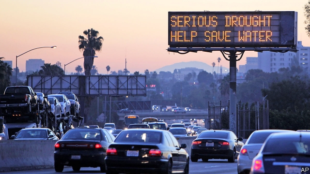
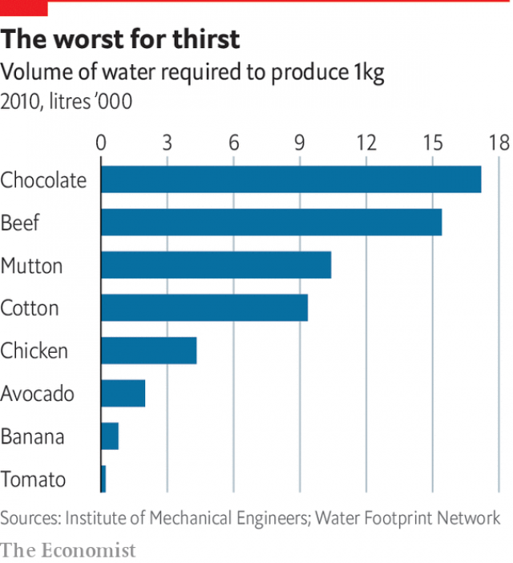

###### Saving water

# The best way to solve the world’s water woes is to use less of it 

##### And much of that has to do with agriculture 

 

> Mar 2nd 2019 

IF THE WORLD is to reduce its use of water, the most obvious area in which to look for savings is where most water goes: agriculture. How much water this accounts for varies enormously from country to country. In Britain, which is a huge importer of embedded or “virtual” water (that consumed in producing any crop or product) accounting for as much as two-thirds of its water needs, it is relatively little. In Egypt it is about 84%, and in India as much as 90%. Viewed more broadly, as a global water “footprint”—a concept developed by Arjen Hoekstra, a Dutch scientist—including not just the direct uses of water in agriculture, but the indirect ones all the way along the chain from field to fork, agriculture accounts for 92%. 

Much of this is wasted. “Flood” irrigation systems, where water is released to inundate fields or furrows, lose water to evaporation, or to percolation (ie, to the soil itself before it can be absorbed by the crop’s roots). A common estimate is that flood-irrigation squanders 50% of the water it releases. Sprinkler systems can help with efficiency. But these, too, are imprecise, vulnerable to the wind and to loss of water through evaporation. 

Far more effective are “drip” irrigation systems introduced in Israel in the 1960s and since spread around the world. As the name suggests, these direct limited amounts of water to the plants themselves, so that they get enough but not too much. Avi Schweitzer, chief technology officer of Netafim, an Israeli company that sells drip-irrigation equipment and technology in 110 countries, says that, by minimising both evaporation and percolation, it manages to achieve 95-97% efficiency in delivering the water to the photosynthetic process. 

This saves large amounts of water and increases yields. Precise amounts of nutrient and crop-protection chemicals can be added to the irrigation water. And the new generation of systems employ remote sensors that can monitor weather, soil and plant conditions and calibrate how much water is delivered. Mr Schweitzer, however, concedes that, for now, the high capital cost precludes the use of drip irrigation in much of the world, and limits its use to cash crops. The goals for the future are to reduce costs for commodity crops such as grains, and to improve precision even more. The market will expand. Climate change is likely to mean that more rain-fed farmland—at present estimated to make up about 80% of the world’s total—will be irrigated. 

Greater efficiency, however, comes with risks of its own: that farmers persist in planting thirstier crops than is rational in an arid climate, or switch to more water-intensive ones. Even in Israel, just south of the shrinking Sea of Galilee, swathes of irrigated land are covered in plastic-draped banana plantations. 

So reducing the water consumed by agriculture will depend not just on improving efficiency, but on rationalising crop-planting. And that in turn will depend on demand and hence on changes in diet and even fashion. A foretaste of controversies to come was a furore that arose last year over avocado-eating—criticised by many as an emblem of selfish millennial hipsterdom. Avocado consumption in America increased by 300% (to about 4.25bn avocados a year) from 2010 to 2015. Farmers scrambled to meet demand, including in very dry places, such as some parts of Chile and in Mexico, where the craze was blamed for a surge in deforestation. A kilo of avocados can need up to 2,000 litres of water, so local sources were strained, and activists mobilised to campaign against the culinary fashion. 

In future, people around the rich world at least are likely to be made more aware of the water footprint of what they eat (and wear: the global average water requirement for producing a kilo of cotton is 9,359 litres). Avocados may need more water than tomatoes (214 litres) but they are far more frugal in their water needs than meat—chicken takes 4,325 litres per kg, mutton 10,412 and beef 15,415 (see chart). Globally, however, the trend is not towards a low-water diet. On the contrary, as countries such as China grow richer, meat-eating is on the increase. Over the past 50 years, global meat production has quadrupled. 

 

Another way in which water is used inefficiently in agriculture is in waste or loss of food, which adds up to as much as a third of global production. In countries such as India, the inadequacies of the cold chain and logistical hurdles mean that much never reaches the shops. Even in rich countries, food shops and consumers end up discarding vast amounts of uneaten food. 

A new report by the World Economic Forum, a think-tank, emphasises technological fixes to this problem. Sell-by and use-by dates could be replaced, it argues, by remote sensor technologies, such as near-infrared spectrometers and hyperspectral imaging, capable of evaluating the perishability of individual items. It looks forward to the day when the imaging technology is available on shoppers’ smartphones. 

A less visible but perhaps more shocking waste is in the form of “non-revenue water”—that is, water supplied by utilities but never paid for. Some is diverted and stolen; much is simply lost through leakage. The lost revenue often leads to a vicious circle. Money is too short to maintain and repair the system, leaks increase, prices rise and theft becomes more widespread. The problem is most obvious in poor countries. Delhi’s water board, for example, reported in 2011 that 53% of the water it distributed was non-revenue. In Hanoi that figure was 44%. But even in the rich world, where pipes and other infrastructure may be old, rates can also be staggering. London, for example, reported 28% and Montreal 40%. Again, technology is helping. Sensors and smart valves that use the water itself to send a pulse, which alters when there is a leak, can make it easier to pinpoint trouble-spots. 

In almost every aspect of water usage the scope for using less is enormous. It is a question of incentives. Optimists point to signs that this is changing. Some governments still use the availability of cheap and plentiful water as a lure to foreign investors. But some businesses are seeing water-efficiency as both an economic goal in itself and as an important part of their image-building. In the Canadian province of Ontario, for example, the local arm of Nestlé, a Swiss food-and-drinks giant that is one of the world’s biggest sellers of bottled water, has found itself embroiled in a lawsuit between First Nations representatives and the provincial government, which has led to a moratorium on issuing new bottling permits. 

Elsewhere, Nestlé is making much of its efforts to save water, aiming to reduce usage in every product category between 2010 and 2020 (a target it says is already within touching distance). In some countries, for example, such as America, Brazil and South Africa it makes baby milk in “zero-water” factories, reclaiming water evaporated from cow’s milk used in the manufacturing. 

Unilever, another multinational, also has set “sustainability goals”. One is to keep the water used in its manufacturing processes to 2008 levels, despite greatly increased production. Already, it says, it has cut water use per tonne of production by 39% since 2008 in seven water-scarce countries representing half the world’s population. Less successful has been its drive to reduce the amount of water its customers use—by making products, such as detergents, for example, that need less water. Since 2010, per-consumer use has fallen only by 2%. 

-- 

 单词注释:

1.woe[wәu]:n. 悲哀, 悲痛, 苦痛 

2.les[lei]:abbr. 发射脱离系统（Launch Escape System） 

3.enormously[i'nɒ:mәsli]:adv. 非常地, 巨大地 

4.importer[im'pɒ:tә]:n. 输入者, 进口商 [法] 进口商, 输入者 

5.embed[im'bed]:vt. 使插入, 使嵌入, 使深留脑中 [计] 嵌入 

6.Egypt['i:dʒipt]:n. 埃及 

7.broadly['brɒ:dli]:adv. 宽广地, 明白地, 无礼貌地 

8.hoekstra[]:[网络] 胡克斯特拉 

9.Dutch[dʌtʃ]:n. 荷兰人, 荷兰语 a. 荷兰的 

10.inundate['inʌndeit]:vt. 浸水, 泛滥, 淹没, 使充满 

11.furrow['fʌrәu]:n. 犁沟, 车辙, 皱纹 vt. 犁, 耕, 弄绉 vi. 起波纹 

12.evaporation[i.væpә'reiʃәn]:n. 蒸发, 脱水, 消失 [化] 蒸发 

13.percolation[.pә:kә'leiʃәn]:n. 过滤, 浸透 [计] 渗透 

14.IE['i:ei]:[计] 中断启动 

15.squander['skwɒndә]:vt. 浪费, 使分散 vi. 浪费, 漂泊, 四散 

16.sprinkler['spriŋklә]:n. 洒水车, 洒水器 

17.imprecise[.impri'saiz]:a. 不严密的, 不精确的, 不明确的 

18.vulnerable['vʌlnәrәbl]:a. 易受伤害的, 有弱点的, 易受影响的, 脆弱的, 成局的 [医] 易损的 

19.Israel['izreil]:n. 以色列, 以色列后裔, 犹太人 

20.avi[]:abbr. 多媒体文件格式（Audio Video Interactive） 

21.schweitzer['ʃvaitsә]:n. 史怀哲（德国医学家和神学家以及哲学家）；施韦策（姓氏, 特指法国基督教牧师和哲学家, 曾经获得诺贝尔和平奖） 

22.Israeli[iz'reili]:a. 以色列的, 以色列人(语)的 n. 以色列人 

23.minimise[]:vt. 使减到最少/最小, 使降到最低限度, 使缩到最小, 极度轻视 

24.photosynthetic[,fәutәusin'θetik]:a. 光合的 [医] 光合的 

25.nutrient['nju:triәnt]:a. 营养的, 滋养的 n. 营养物, 滋养物 

26.sensor['sensә]:n. 传感器 [计] 检测器 

27.calibrate['kælibreit]:vt. 测定口径, 校准, 使标准化, 调整 [化] 校准 

28.concede[kәn'si:d]:vt. 承认, 退让 vi. 让步 

29.preclude[pri'klu:d]:vt. 预先排除, 预防, 阻止, 妨碍 [法] 预防, 排除, 消除 

30.commodity[kә'mɒditi]:n. 农产品, 商品, 有用的物品 [经] 商品, 货物, 日用品 

31.arid['ærid]:a. 干燥的, 不毛的 

32.galilee['^ælә,li]:n. 加利利（巴勒斯坦北部一多山地区）；西端入口处的门廊（中古英国教堂） 

33.swathe[sweiθ]:vt. 绑, 裹, 包围 n. 带子, 绷带 

34.rationalise['ræʃәnәlaiz]:v. <主英>=rationalize 

35.foretaste[fɒ:'teist]:vt. 预尝, 先试 n. 先尝, 预示 

36.controversy['kɒntrәvә:si]:n. 论争, 辩论, 论战, 争论 [法] 论战, 争论, 争吵 

37.furore[fju:'rɔ:ri]:n. 轰动, 勃然大怒, 公众的骚动, 狂热 

38.emblem['emblәm]:n. 象征, 徽章, 符号 vt. 用象征表示 

39.millennial[mi'leniәl]:a. 一千年的, 千福年的 

40.hipsterdom[]:[网络] 时髦 

41.avocado[.ævәu'kɑ:dou]:n. 鳄梨, 鳄梨树 

42.avocado[.ævәu'kɑ:dou]:n. 鳄梨, 鳄梨树 

43.scramble['skræmbl]:n. 攀缘, 爬行, 抢夺, 混乱, 紧急起飞 vi. 攀缘, 杂乱蔓延, 争夺, 拼凑, 匆忙 vt. 攀登, 扰乱, 使混杂 

44.Chile['tʃili]:n. 智利 [化] 番椒; 辣椒 

45.craze[kreiz]:n. 狂热, 大流行 v. (使)发狂, (使)开裂 

46.surge[sә:dʒ]:n. 巨涌, 汹涌, 澎湃 vi. 汹涌, 澎湃, 颠簸, 猛冲, 突然放松 vt. 使汹涌奔腾, 急放 [计] 电压尖峰 

47.deforestation[di:.fɒ:ri'steiʃәn]:n. 采伐森林, 森林开伐 [法] 砍伐森森 

48.activist['æktivist]:n. 激进主义分子 

49.mobilise['mәjbilɑiz]:vi.vt. 动员, 松动, 使活动, 调动, 发动 

50.culinary['kʌlinәri]:a. 厨房的, 烹调用的 

51.footprint['futprint]:n. 足迹 [计] 印迹 

52.frugal['fru:gәl]:a. 节俭的, 朴素的 

53.kg[]:n. 千克, 公斤 [医] 千克, 公斤 

54.globally[]:[计] 全局地 

55.quadruple['kwɒdrupl]:a. 四倍的, 四重的, 四部分组成的 n. 四倍 vt. 使成四倍 vi. 成为四倍 

56.inefficiently[ˌɪnɪ'fɪʃntlɪ]:adv. 无效率地 

57.inadequacy[in'ædikwәsi]:n. 不适当, 不足之处, 不充分 [医] 机能不全, 闭锁不全, 关闭不全 

58.logistical[ lə'dʒɪstɪkl]:a. 逻辑的; 后勤方面的 

59.hurdle['hә:dl]:n. 障碍, 跳栏, 临时活动篱笆 vt. 用篱笆围, 越过, 克服 

60.uneaten[ʌnˈi:tn]:a. 没吃的, 剩下的 

61.forum['fɒ:rәm]:n. 论坛, 公开讨论的广场, 法庭, 讨论会 [法] 讨论会, 专题讨论, 公共论坛 

62.emphasise[]:vt. 强调, 重读, 加强...的语气, 着重 

63.technological[.teknә'lɒdʒikl]:a. 技术的 [经] 工艺的, 技术的 

64.spectrometer[spek'trɒmitә]:n. 分光计, 谱仪 [化] 分光计; 分光仪 

65.hyperspectral[haɪpəs'pektrəl]: 高光谱的；超光谱的 

66.perishability[perɪʃə'bɪlɪtɪ]: 易腐烂性, 易朽性 

67.smartphones[]: 智能手机（smartphone的复数） 

68.divert[dai'vә:t]:vt. 转移, 使欢娱 vi. 转移 

69.leakage['li:kidʒ]:n. 漏, 漏出物, 泄漏 [化] 漏电; 漏水; 漏气; 渗漏; 漏失量; 漏出量 

70.vicious['viʃәs]:a. 邪恶的, 堕落的, 品性不端的, 恶毒的, 恶性的, 有错误的 [医] 缺点的, 恶的 

71.hanoi[hæ'nɔi]:n. 河内（越南首都） 

72.infrastructure['infrәstrʌktʃә]:n. 基础结构, 基础设施 [经] 基础设施 

73.stagger['stægә]:n. 蹒跚, 踌躇 vi. 蹒跚, 犹豫 vt. 使摇摆, 使踌躇, 交错, 错开 a. 交错的, 错开的 

74.montreal[,mɔntri'ɔ:l]:n. 蒙特利尔（加拿大东南部港市） 

75.valve[vælv]:n. 活瓣, 阀, 活门 v. 装阀, 用阀调节 

76.pinpoint['pinpɒint]:n. 极小之物, 针尖, 立锥之地, 精确位置 vt. 精确地找到, 准确地轰炸, 刺穿, 准确描述, 使突出, 强调 a. 针尖的, 极微的, 精确的, 详尽的, 精确定位的 

77.incentive[in'sentiv]:n. 动机 a. 激励的 

78.optimist['ɔptimist]:n. 乐观者, 乐观主义者 

79.availability[ә.veilә'biliti]:n. 有效性, 可利用性, 可利用的人 [计] 有效性; 可用性 

80.lure[luә]:n. 饵, 诱惑 vt. 引诱, 诱惑 

81.investor[in'vestә]:n. 投资者 [经] 投资者 

82.ontario[ɔn'teәriәu]:n. 安大略湖（北美五大湖之一） 

83.embroil[im'brɒil]:vt. 使卷入, 牵连 

84.lawsuit['lɒ:sju:t]:n. 诉讼 [法] 诉讼, 诉讼案件 

85.provincial[prә'vinʃәl]:n. 外地人, 粗野的人 a. 省的, 外地的, 偏狭的 

86.moratorium[.mɒrә'tɒ:riәm]:n. 延期偿付, 暂停 [法] 延期偿付, 延缓履行, 延期偿还期 

87.Brazil[brә'zil]:n. 巴西 

88.reclaim[ri'kleim]:vt. 开垦, 改造, 感化, 纠正, 回收 vi. 喊叫, 抗议 

89.manufacturing[.mænju'fæktʃәriŋ]:n. 制造业 a. 制造业的 

90.Unilever[]:n. 联合利华（财富500强公司之一, 总部位于荷兰和英国, 主要经营食品和洗涤用品） 

91.multinational[.mʌlti'næʃәnl]:a. 多国的, 跨国公司的 n. 跨国公司 

92.sustainability[sə,stenə'bɪlɪti]:n. 持续性, 能维持性, 永续性 

93.tonne[tʌn]:n. 吨, 公吨 [经] 吨 

94.detergent[di'tә:dʒәnt]:n. 清洁剂 [化] 洗涤剂 

