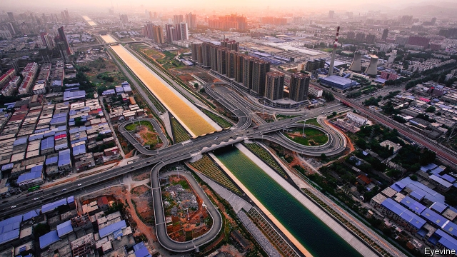

###### Conclusion

# Water, the original solvent, can provide its own solutions 

##### In the end, they come down to a political choice 

 

> Mar 2nd 2019 

AFTER RATTLING into the hillside outside Jerusalem for 7km, the little three-carriage railway reaches the end of the line, some 300 metres underground. The diminishing speck of light at the tunnel’s opening has long vanished altogether. This, for now, is as far as it goes. The German-Austrian contractor will eventually bore about 13.5km. But progress is fitful, depending on the rock being drilled through and whether it will need some artificial strengthening. The drill has already negotiated one large cave, complete with stalactites, which had to be reinforced with concrete. More such obstacles are expected. The contractor works non-stop, but the average progress made by Isabel, as their “double gripper” boring machine has been named, is just 22 metres a day. As its jaws grind into the wall of rock ahead, conveyor belts carry the rubble out to the tunnel’s opening. 

The tunnel will accommodate a tube 2.6 metres wide, the deepest potable-water pipe in the world, that will pump (mostly desalinated) water through 30km of tunnel from sea-level to an elevation of 860 metres to supply much of Jerusalem’s drinking-water needs. In a country famous for its ambitious water-supply schemes, this is the biggest since the 1960s. It was in 1964 that Israel inaugurated its National Water Carrier, a public-works project to bring water from the north of the country down to the Negev desert in the south. It was an emblem of the young country’s determination to survive. And it is a dominant theme in water policy to this day. In a dramatic symbol of a determination to shape the natural order to human needs, the direction of water-flow in the national carrier is to be reversed, to give clean, desalinated water back to “nature” in the north of the country. 

Water “megaprojects” are not unique to Israel. Humanity has long embraced what Peter Gleick, a scientist who co-founded the Pacific Institute, a think-tank in California, calls “the hard path” to solving its water problems: one that relies “almost exclusively on centralised infrastructure to capture, treat and deliver water supplies”. When water has been short, the solution has been to find a new source, or to bring it from somewhere else, in ancient times using large amounts of human labour. 

Ancient Sumerians in southern Mesopotamia dug canals. More than 4,000 years ago Egyptian farmers relied on the Nile—traces of their irrigation systems survive today. Throughout the Roman Empire cities were supplied by manmade aqueducts. High in the Andes in present-day Peru the Incas and their predecessors built cisterns and irrigation canals, and carved terraces into the hillsides. 

Modern technology means that megaprojects now are on a scale the ancients could only dream of. China’s are the grandest. The Three Gorges Dam on the Yangzi river, which went into full operation in 2012, involved the flooding of hundreds of villages and the displacement of 1.2m people. The reservoir it created is 600km long. Besides providing energy for one of the world’s biggest power stations, the project was touted for improving navigation and preventing floods. Ever since it was first mooted as an idea a century ago, however, the dam has been controversial, with worries about its impact on biodiversity, cultural heritage and even seismology. 

Environmentalists are also leery of another proud boast of modern Chinese hydraulic engineering: its south-to-north water- diversion project (pictured overleaf), by some measures the most expensive infrastructure project in the world. It counts as the largest transfer of water between river basins in history. It recognises that, for all China’s well-publicised struggles with air pollution, a shortage of water is its biggest environmental problem. That shortage is acute in the north, where 11 provinces have less than 1,000 cubic metres of water per person per year, the usual international measure of water stress. Those provinces include four of China’s five biggest agricultural producers. 

So, since 2014, two-thirds of the tap water and one-third of the total water supply in Beijing, in the arid north, has come by canal and pipeline from a reservoir 1,400km to the south, fed by a tributary of the Yangzi. China hails the project as an unqualified success, supplying more than 50m people in its early years of operation. And it is part of an even bigger project that will see up to 45bn cubic metres of water a year transferred—7% of Chinese consumption. Environmentalists and water experts at home and abroad are more sceptical, however. Mr Biswas at the Lee Kuan Yew School in Singapore says the project gives China at best “a few years’ grace”. The worry is that it is a distraction from more pressing and important policy changes—cutting demand for water—and may actually encourage wasteful use. As elsewhere, the authorities fear that charging users for the true cost of their water might provoke protests and threaten social stability. 

Similar doubts surround India’s scheme to “interlink” 37 rivers through a network of 15,000km of canals, the ultimate aim being, as in China, to move water from well-endowed regions—such as some of the Himalayan foothills in the north—to areas of scarcity. The plan has been discussed for decades. The current government has tried to give it fresh impetus. But even if it forges a political consensus in Delhi behind the plan, it would be hard to realise because of tensions between different states over water. 

With so many cities around the world facing an acute need for water, “the hard path” will not be abandoned. It will always seem easier to bring water in, or to exploit a new source, than to move tens of millions of people, or completely redraw the map of agricultural production. The scale of the problem was suggested by research published in 2014 by The Nature Conservancy, an American charity. Its list of water-stressed cities was dominated by places in India and China—with Delhi second, Shanghai fourth and Beijing fifth. Mexico City came third. But top of the list was Tokyo. Other rich-world cities were also high up, including Los Angeles (eighth) and even London (15th). 

Few, however, would disagree with Mr Gleick that the hard path alone is no longer enough and that it needs to be complemented with a “soft” one that seeks to improve the way water is used, rather than to find new sources of supply. That means spending on local facilities, efficient technologies and education and training. 

How to do this is already known. In water-scarce regions where people—usually women—have to spend hours each day fetching water from a distant source, it may mean building pipes or bore-wells and training people to maintain them. In places with heavy seasonal rain followed by long dry seasons it means building (or in many cases restoring) storage systems, ideally in places where evaporation will be low. (In Bermuda, with abundant year-round rain, domestic water needs are met by harvesting rainwater from the islands’ roofs, which building regulations stipulate must make room for storage tanks.) And to ensure that the water people drink does not kill them, the discharge of untreated effluent has to be stopped, and people have to use toilets. 

Waste water, as Israel and Singapore have shown, can be treated as a resource to exploit rather than a problem to dispose of. As the UN’s Sustainable Development Goals (SDGs), the targets for 2030 adopted in 2015, acknowledge, water-management has to be “integrated”, that is co-ordinated both between the various bodies responsible for different bits of the water cycle and other policies that have an impact on water. At times this will entail cross-border co-operation. It will always require community involvement. 

None of this is rocket science, which helps explain a paradox of most conversations with scientists, ecologists and charity-workers who have devoted their lives to solving the world’s water problems. Most are full of horror stories about how woefully the world is misusing and wasting its water. Yet most will profess cautious optimism about the long-term future. 

The World Bank has even sought to cost the water-related SDGs. It estimated that, to “achieve universal and equitable access to safe and affordable drinking water for all” and “achieve access to adequate and equitable sanitation for all and end open defecation” would need $114bn a year, 69% of it spent on sanitation. So to provide access to drinking water for the whole world would cost not much more than $30bn a year, or roughly the size of the defence budget in, say, Italy or Brazil. 

The total of $114bn would amount to just 0.39% of the GDPs of the 140 countries the World Bank studied. That would, however, be 0.27 percentage points more than is currently spent globally. It would require a massive reallocation of resources. For that to be realised, three issues need to be tackled: ownership; price; and political priorities. On ownership, India and Israel represent two extremes. In India it may be hard to repeal the British-era law giving landowners the right to all the water on and under their property. But it should be possible to mitigate some of its effects by, for example, penalising the over-extraction of groundwater. Israel’s nationalisation of all water supplies has helped “integrate” policy, but may not be replicable elsewhere. In many countries water rights are less clear and subject to litigation. America, for example, still suffers from tension between two different doctrines adopted in the early days of the modern nation: a “riparian” one in the east, giving rights to those near to a body of water, and the “prior-appropriation” one in the west, giving rights to the earliest users. 

Pricing will be even harder. Few utilities in the world charge consumers the full cost of the water they use. And even in countries where they do, a water subsidy may be included in the cost of the goods people buy in shops. To persuade people to recognise and pay for the water-intensity of their lifestyles may require concerted campaigns of the type that have helped cut smoking rates in many places. But because they will affect the entire population, it will be even harder. On the other hand, as experience in some unlikely places has shown—Phnom Penh, the capital of Cambodia, for example—poor people will pay for a clean, reliable source of water. After all, in much of the world, they already pay over the odds for dirty, dangerous and erratic supplies. 

Finally, even if the world is cajoled into using water more sustainably, that will still leave questions of allocation. On the global level, it is easy to see where the priorities should lie: in the hundreds of millions who do not yet have access to safe and adequate drinking water and sanitation. At the national and subnational level, there will always be powerful interests lobbying for their own needs, whereas those without access to clean water are, almost by definition, the powerless. So, as Jonathan Farr, senior policy analyst at WaterAid, puts it, water management—however sustainable, progressive and integrated—has first to concentrate on access. Money is not the binding constraint. Nor is technology. It is a political choice. 

-- 

 单词注释:

1.solvent['sɒlvәnt]:n. 溶剂 a. 有偿付能力的, 有溶解力的 

2.rattle['rætl]:vt. 使嘎嘎响, 喋喋不休地说 vi. 格格响, 喋喋不休 n. 格格声, 拨浪鼓, 喋喋不休的话 

3.Jerusalem[dʒә'ru:sәlәm]:n. 耶路撒冷 

4.diminish[di'miniʃ]:v. (使)减少, (使)变小 

5.speck[spek]:n. 斑点, 有斑点的东西, 污点, 缺点, 微粒, 肥肉 vt. 使有斑点 

6.contractor['kɒntræktә]:n. 立契约的人, 承包商 [化] 承包者; 承包工厂 

7.fitful['fitful]:a. 断断续续的, 一阵阵的, 间歇的 

8.stalactite['stælәktait]:n. 钟乳石 [医] 钟乳石 

9.isabel['izәbel]:n. 伊莎贝尔（人名） 

10.gripper['^ripә]:n. 握者, 抓爪, 抓器, 夹子 [计] 机械爪, 夹子 

11.conveyor[]:n. 搬运者, 传达者, 转让财产者, 输送机, 输送设备 [计] 传送机, 传送带 

12.rubble['rʌbl]:n. 粗石, 碎砖, 粗石堆 

13.desalinated[di:'sælineit]:vt. 除去……中的盐分；使……脱盐 

14.elevation[.eli'veiʃәn]:n. 海拔, 提高, 仰角 [计] 仰角 

15.ambitious[æm'biʃәs]:a. 有野心的, 抱负不凡的, 雄心勃勃的 

16.Israel['izreil]:n. 以色列, 以色列后裔, 犹太人 

17.inaugurate[i'nɒ:gjureit]:vt. 开始, 举行...就职典礼 

18.Negev['ne^ev]:内盖夫(西南亚巴勒斯坦南部一地区) 

19.emblem['emblәm]:n. 象征, 徽章, 符号 vt. 用象征表示 

20.dominant['dɒminәnt]:a. 占优势的, 支配的 [医] 优性的, 显性的 

21.megaproject[me'ɡæprədʒekt]:n. 特大工程, 特大项目 

22.humanity[hju:'mæniti]:n. 人性, 人类, 博爱 

23.peter['pi:tә]:vi. 逐渐消失, 逐渐减少 

24.gleick[]:[网络] 格莱克；格雷克；葛雷易克 

25.California[.kæli'fɒ:njә]:n. 加利福尼亚 

26.centralise['sentrәlɑiz]:vt. 形成中心, 把统治权集中于中央, 把...集中起来, 成为...的中心, 集中 

27.infrastructure['infrәstrʌktʃә]:n. 基础结构, 基础设施 [经] 基础设施 

28.Sumerian[su:'miәriәn, -'mer-]:n. 闪族人[语] a. 闪族人[语]的 

29.Mesopotamia[.mesәpә'teimiә]:n. 美索不达米亚 

30.manmade[]:[经] 人造的 

31.aqueduct['ækwidʌkt]:n. 水管, 沟渠, 导管 [医] 水管 

32.Andes['ændi:z]:n. 安第斯山脉 

33.Peru[pә'ru:]:n. 秘鲁 

34.inca['iŋkә]:n. 印加；印加人 

35.predecessor[.predi'sesә]:n. 前任, 先辈, 前身 [医] 初牙, 前辈, 祖先 

36.cistern['sistәn]:n. 贮水器, 水塘, 水箱 [化] 槽车 

37.terrace['terәs]:n. 阶地, 梯田, 房屋之平顶, 阳台, 沿岸防地, 露台 a. 叠层式的 vt. 使成梯田, 使成有平台屋顶 

38.gorge[gɒ:dʒ]:n. 峡谷, 凹槽, 塞饱, 咽喉 vi. 狼吞虎咽 vt. 塞饱, 狼吞虎咽地吃 

39.displacement[dis'pleismәnt]:n. 换置, 移位, 移动, 取代 [化] 顶替展开法 

40.reservoir['rezәvwɑ:]:n. 贮水池, 贮藏处, 贮备, 水库 vt. 储藏 

41.tout[taut]:vi. 招徕顾客, 兜售物品 vt. 招徕, 刺探...情报 n. 兜售者, 侦查者 

42.moot[mu:t]:n. 大会, 模拟案件, 辩论会 a. 未决议的, 无实际意义的 vt. 讨论, 争论 

43.biodiversity[]:n. 生物多样性 

44.cultural['kʌltʃәrәl]:a. 文化的, 教养的, 修养的 [医] 培养的 

45.heritage['heritidʒ]:n. 遗产, 祖先遗留物, 继承物 [医] 遗传性 

46.seismology[saiz'mɒlәdʒi]:n. 地震学 

47.environmentalist[in,vaiәrәn'mentlist]:n. 环保人士 

48.leery['liәri]:a. 机敏的, 猜疑的, 狡猾的 

49.hydraulic[hai'drɒ:lik]:a. 与水有关的, 水力的, 水压的 [电] 水力的 

50.diversion[dai'vә:ʒәn]:n. 转移 [医] 转向 

51.overleaf['әuvәli:f]:adv. 在背面, 在次页 

52.environmental[in.vaiәrәn'mentәl]:a. 周围的, 环境的 [经] 环境的, 环保的 

53.les[lei]:abbr. 发射脱离系统（Launch Escape System） 

54.producer[prә'dju:sә]:n. 生产者, 制作者, 制作人 [化] 发生器; (炉煤气)发生炉; 制气炉; 生产者 

55.arid['ærid]:a. 干燥的, 不毛的 

56.tributary['tribjutәri]:a. 支流的, 纳贡的, 从属的, 辅助的 n. 支流, 纳贡者, 属国 

57.hail[heil]:n. 冰雹, 致敬, 欢呼, 招呼 vt. 向...欢呼, 致敬, 招呼, 使象下雹样落下 vi. 招呼, 下雹 interj. 万岁, 欢迎 

58.unqualified[.ʌn'kwɒlifaid]:a. 不合格的, 无资格的, 不胜任的 [经] 无条件的, 不合格的, 无资格的 

59.biswas[]:n. (Biswas)人名；(英、德、印、孟、巴基)比斯瓦斯 

60.lee[li:]:n. 背风处, 避风处, 下风处, 保护, 庇护 a. 避风的, 背风的, 下风的, 保护的 

61.kuan[^wɑ:n]:n. 官窑瓷器 

62.yew[ju:]:n. 紫杉 

63.Singapore[.siŋgә'pɒ:]:n. 新加坡 

64.distraction[dis'trækʃәn]:n. 娱乐, 分心的事物, 分心 [医] 注意力分散, 内脱位, 牙弓过宽 

65.wasteful['weistful]:a. 浪费的, 不经济的 

66.provoke[prә'vәuk]:vt. 激怒, 惹起, 诱导 [法] 刺激, 煽动, 激怒 

67.interlink[.intә'liŋk]:vt. 把...互相连结 n. 连环 

68.Himalayan[hi'mɒlәjәn]:a. 喜玛拉雅山的 

69.foothill['futhil]:n. 山麓小丘 

70.scarcity['skɑ:siti]:n. 缺乏, 不足, 缺少 [经] 缺乏, 不足 

71.impetus['impitәs]:n. 动力, 推动力, 动量 [医] 冲动, 动能, 起始(病) 

72.forge[fɒ:dʒ]:n. 熔炉, 铁工厂 vt. 打制, 锻造, 伪造 vi. 锻造, 伪造 

73.delhi['deli]:n. 德里（印度城市名） 

74.alway['ɔ:lwei]:adv. 永远；总是（等于always） 

75.tens[]:十位 

76.redraw[.ri:'drɒ:]:vt. 重画 vi. 刷新屏幕 [计] 刷新屏幕 

77.conservancy[kәn'sә:vәnsi]:n. 保存, 保护, 管理 [医] 保存; 保护, 管理 

78.los[lɔ:s]:abbr. 月球轨道航天器（Lunar Orbiter Spacecraft）；视线（Line of Sight） 

79.angeles[]:n. 安杰利斯（姓氏）；天使城（菲律宾地名） 

80.complement['kɒmplimәnt]:n. 补足物, 补语, 补数 vt. 补充, 补足 [计] 补码; 反相器; 补数 

81.seasonal['si:znәl]:a. 季节的, 依照季节的, 周期性的 [经] 季节性的, 季节的 

82.ideally[ai'diәli]:adv. 完美地, 理想地 

83.evaporation[i.væpә'reiʃәn]:n. 蒸发, 脱水, 消失 [化] 蒸发 

84.Bermuda[bә'mju:dә]:n. 百慕大岛 

85.rainwater['reinwɒ:tә]:n. 雨水 

86.stipulate['stipjuleit]:v. 规定, 保证 

87.untreated['ʌn'tri:tid]:[化] 未经处理的 

88.effluent['efluәnt]:a. 流出的, 射出的 n. 流出物, 由河湖等流出之水流 

89.sustainable[sә'steinәbl]:a. 足可支撑的, 养得起的, 可以忍受的 

90.SDGs[]:[网络] 可持续发展目标；永续发展目标；山东高速 

91.entail[in'teil]:vt. 使成为必需, 需要, 使承担, 遗传给 n. 限定继承 

92.involvement[in'vɔlvmәnt]:n. 卷入, 牵连, 包含, 困窘 [经] 财政困难, 经济上的困窘 

93.paradox['pærәdɒks]:n. 似非而是的论点, 自相矛盾的话, 悖论, 怪人怪事 [化] 佯谬 

94.ecologist[i:'kɒlәdʒist]:n. 生态学者 

95.woefully[]:adv. 悲伤地；不幸地；使人痛苦地 

96.misuse[.mis'ju:z]:n. 误用, 滥用 vt. 误用, 滥用, 虐待 

97.profess[prә'fes]:vt. 声称, 以...为业, 伪称, 讲授 vi. 表白, 承认, 当教授 

98.optimism['ɒptimizm]:n. 乐观主义, 乐观, 乐天 [医] 乐观主义, 乐观 

99.equitable['ekwitәbl]:a. 公平的, 公正的 [法] 公平的, 公正的, 平衡法的 

100.affordable[]:[计] 普及型 

101.sanitation[sæni'teiʃәn]:n. (环境)卫生, 环境卫生的提倡/维持, 卫生设备, 下水道设施, 卫生设施 [医] 环境卫生 

102.defecation[.defi'keiʃәn]:n. 澄清, 净化, 排便 [化] 澄清; 澄清作用 

103.Brazil[brә'zil]:n. 巴西 

104.GDP[]:[化] 鸟苷二磷酸 

105.currently['kʌrәntli]:adv. 现在, 当前, 一般, 普通 [计] 当前 

106.globally[]:[计] 全局地 

107.reallocation[]:[计] 再分配 

108.repeal[ri'pi:l]:n. 废止, 撤消 vt. 废止, 撤消, 放弃 

109.landowner['lændәunә]:n. 地主 [法] 土地所有人, 地主 

110.mitigate['mitigeit]:vt. 温和, 缓和, 减轻 [医] 缓和, 减轻 

111.penalise[]:vt. 对...处以刑罚/刑事惩罚, 惩罚, 处罚, 使处于严重不利地位 

112.groundwater['graundwɒ:tә]:n. 地下水 

113.nationalisation[,næʃәnәlai'zeiʃәn; -li'z-]:n. 国有化, 国营 

114.replicable['replikәbl]:[化] 能重现的 

115.litigation[.liti'geiʃәn]:n. 诉讼, 起诉 [经] 诉讼, 纠葛 

116.doctrine['dɒktrin]:n. 教条, 学说 [医] 学说 

117.riparian[ri'pєәriәn]:a. 河岸的, 生于河岸的 n. 河岸土地所有人 

118.lifestyle['laifstail]:n. 生活方式 

119.concerted[kәn'sә:tid]:a. 商定的, 协定的, 一致的 [法] 一致的, 协力的, 共同的 

120.Penh[]:n. (Penh)人名；(柬)边 

121.Cambodia[kæm'bәudiә]:n. 柬埔寨 

122.odds[ɒdz]:n. 可能性, 几率, 机会, 胜算, 不平等 

123.erratic[i'rætik]:n. 古怪的人, 漂泊无定的人 a. 不稳定的, 奇怪的 

124.cajole[kә'dʒәul]:vt. 以甜言蜜语哄骗, 勾引 

125.sustainably[]:adv. 支撑得住；能保持住地 

126.allocation[.ælәu'keiʃәn]:n. 配置, 分配, 拨给 [经] 分配, 拨款, 分摊 

127.subnational[]:a. 低于国家的/地方的 

128.lobby['lɒbi]:n. 大厅, 休息室, 游说议员者 vi. 游说议员, 游说 vt. 游说 

129.powerless['pauәlis]:a. 无力的, 无权的, 无效能的 

130.jonathan['dʒɔnәθәn]:n. 乔纳森（男子名） 

131.Farr[]:n. (Farr)人名；(英、芬、德、西、阿拉伯)法尔 

132.analyst['ænәlist]:n. 分析者, 精神分析学家 [化] 分析员; 化验员 

133.wateraid[]:[网络] 水支援协会；组织；水帮助协会 

134.sustainable[sә'steinәbl]:a. 足可支撑的, 养得起的, 可以忍受的 

135.constraint[kәn'streint]:n. 强制, 约束 [计] 约束 

