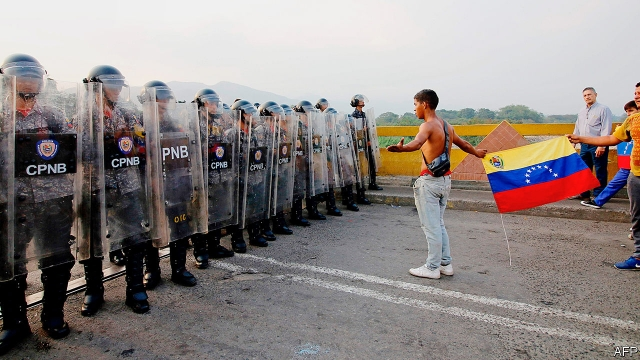

###### Fighting off the food trucks

# After repelling aid deliveries, Venezuela’s despot declares “victory” 

##### The rightful president, who has no guns, ponders his next step 

 

> Feb 28th 2019 

BY ABOUT 11AM on February 23rd, four lorries, each loaded with 20 tonnes of food, medical supplies and toiletries, had arrived at the Simón Bolívar and Francisco de Paula Santander bridges, which link the Colombian border town of Cúcuta with Venezuela. At the Simón Bolívar crossing, used by thousands of people on a normal day, Colombian police opened a metal barricade they had erected. Venezuelans gathered on the Colombian side poured through, hoping to clear a passage for the vital supplies to enter Venezuela. Chanting “liberty”, they headed towards Venezuelan riot police, who had arrayed themselves behind clear plastic shields. Minutes later, the first tear-gas grenade fell. The crowds fled. Many were hurt in the stampede. 

This was the first skirmish in a day of pain and frustration for Venezuelans who are trying to relieve their country’s humanitarian crisis and topple the dictatorship that caused it. By the end of it nearly 300 people had been injured on the Colombian border by tear gas and rubber bullets fired by Venezuelan security forces and by live ammunition from paramilitary colectivos. On the border with Brazil, where more aid awaits entry into Venezuela, four people were killed over two days. Almost no supplies got through. 

Nicolás Maduro, Venezuela’s president, hailed this success in repelling an incursion of powdered milk, surgical gloves and other necessities as a “victory”. He celebrated by dancing salsa with his wife at a rally in Caracas. For Juan Guaidó, whose claim to be the real (interim) president of Venezuela is recognised by the opposition-controlled legislature and by 52 democracies, it was a setback. February 23rd, he had promised, would be a day of deliverance “by air, sea and land”. 

Watched by the world’s media, Mr Guaidó’s operation should have shamed Mr Maduro’s regime. But the despot and his massively corrupt cronies blame everyone but themselves for Venezuela’s plight. And although footage of food and medical supplies turned away cannot have improved Mr Maduro’s dismal reputation at home, there is not yet much sign that the armed forces or paramilitaries are abandoning him. Venezuelans yearning for an end to his rule are gloomy. “Maybe I am impatient,” mused Alexandra Flores, a lawyer in Caracas, “but I fear this [attempt to overthrow the regime] could fizzle out.” 

Mr Guaidó and his international backers are striving to ensure that does not happen. Their first response to the setback was a startling one. On the evening of February 23rd Mr Guaidó tweeted that he would “formally propose to the international community that we must keep all options open to liberate the homeland”. This echoes President Donald Trump’s warnings that the United States could use armed force against Mr Maduro’s regime. Marco Rubio, an American senator, tweeted that the Venezuelan regime’s brutality towards the aid carriers “opened the door to various potential multilateral actions not on the table just 24 hours ago”. He accompanied this with images of 20th- and 21st-century dictators who thought they were invulnerable but were toppled and killed or jailed. 

An American military intervention is highly unlikely, unless the Maduro regime does something insane like attacking the US embassy (see article). The Trump administration is not seriously preparing for one. On February 25th Mr Guaidó joined a meeting in Bogotá, Colombia’s capital, of the 14-member Lima group, countries that are seeking a solution to Venezuela’s crisis. All except a few (including Mexico, which did not attend) recognise him as Venezuela’s interim president. They condemned the regime’s thuggery and asked the International Criminal Court to investigate whether it constitutes a breach of human rights. But they ruled out military action.  

That leaves open the question of just what Mr Guaidó’s backers are prepared to do to end Venezuela’s suffering. The plan, said Mike Pence, Mr Trump’s vice-president, who was at the meeting in Bogotá, is “to continue to isolate Maduro economically and diplomatically until democracy is restored”. The United States Treasury widened sanctions on members of the regime to four more people, all state governors. They include Rafael Lacava, governor of Carabobo. He speaks fluent English and played a role in the release of Joshua Holt, an American, from a Venezuelan prison last year. During that negotiation he spoke to Mr Trump by telephone. The sanctions against Mr Lacava suggest that the United States has no further interest in talking to the regime. 

 On the sidelines of a UN Security Council meeting to discuss the crisis, Elliott Abrams, the Trump administration’s point man for Venezuela, promised more sanctions. These could bar non-American companies from trading with Venezuela. But Mr Trump has already imposed the toughest sanction at his disposal, denying the Maduro regime and PDVSA, the state oil company, access to revenue from sales to the United States of hydrocarbons, Venezuela’s most important export by far. Venezuela is trying to sell its oil to other countries, such as India. Tankers holding 10m barrels of it, worth about $500m, are waiting for customers off Venezuela’s coast, according to Kpler, an energy-research firm. 

Mr Guaidó and his allies hope such pressure will cause enough defections from the armed forces to topple the regime, or to force some of its leaders to break with Mr Maduro and negotiate with the opposition a transition back to democracy. 

More than 400 members of the Venezuelan armed forces and police have deserted in recent days and crossed into Colombia, according to Colombia’s immigration agency. Many crossed the bridges they had been patrolling and pledged their loyalty to Mr Guaidó’s government. One brought his baby daughter, another his drug-sniffer dog. “It’s repress, repress, repress, I can’t do it anymore,” said one exhausted national-guard sergeant who had just sprinted across the dried-up Táchira river. 

But most of the men in uniform remain at their posts. The families of deserters have reportedly been tortured or raped—a powerful deterrent. The sergeant said that members of the paramilitary colectivos were issuing the orders in towns along the border. They stopped a protest by inhabitants of San Antonio de Táchira by forcing them to stay in their homes. “You have just seen a little taste of what we are ready to do,” crowed Venezuela’s vice-president, Delcy Rodríguez. 

Mr Guaidó’s immediate challenge is to return to Venezuela, after leaving the country in defiance of a travel ban. (He sneaked out via back roads, with help from sympathisers in the army, he says.) Presidents in exile “achieve little”, Mr Guaidó notes. Mr Maduro has threatened to jail him. If any harm comes to him, “it would be the last decision Mr Maduro would make”, a senior American official told journalists. 

-- 

 单词注释:

1.repel[ri'pel]:vt. 逐退, 抵制, 使厌恶, 抗御 vi. 使厌恶, 相互排斥 

2.despot['despɒt]:n. 专制君主, 暴君 [法] 暴君, 专制君主 

3.rightful['raitful]:a. 合法的, 正直的, 恰当的 [法] 正当的, 合法的, 依法有求权的 

4.ponder['pɒndә]:v. 沉思, 考虑 

5.tonne[tʌn]:n. 吨, 公吨 [经] 吨 

6.toiletry['tɔilitri]:n. 化妆用品, 梳妆用具, 化妆用具 [化] 化妆用品 

7.Simón[]:[地名] 西蒙 ( 玻 ) 

8.francisco[fræn'siskәu]:n. 弗朗西斯科（男子名, 等于Francis） 

9.de[di:]:[化] 非对映体过量 [医] 铥(69号元素铥的别名,1916年Eder离得的假想元素) 

10.paula['pɔ:lә]:n. 保拉（女子名） 

11.Santander[,sæntən'dεə]:n. 桑坦德（西班牙北部港市, 桑坦德省的省会） 

12.Colombian[kә'læmbiәn]:n. 哥伦比亚人 a. 哥伦比亚的 

13.Venezuela[,vene'zweilә]:n. 委内瑞拉 

14.barricade[.bæri'keid]:n. 路障, 障碍 vt. 设路障于, 阻碍 

15.venezuelan[,venә'zweilәŋ]:a. 委内瑞拉的；委内瑞拉人的 

16.venezuelan[,venә'zweilәŋ]:a. 委内瑞拉的；委内瑞拉人的 

17.riot['raiәt]:n. 暴动, 喧闹, 放纵 vi. 发动, 暴动, 纵情, 放荡 vt. 浪费, 挥霍 

18.array[ә'rei]:n. 排列, 衣服, 大批, 军队 vt. 布署, 打扮, 排列 [计] 数组; 阵列 

19.grenade[gri'neid]:n. 手榴弹 

20.stampede[stæm'pi:d]:v. (使)惊跑, (使)蜂拥 n. 惊跑, 蜂拥 

21.skirmish['skә:miʃ]:n. 前哨战, 小争论, 小冲突 vi. 发生小争论, 侦察 

22.frustration[frʌs'treiʃәn]:n. 挫折, 顿挫 [医] 挫折 

23.humanitarian[hju:.mæni'tєәriәn]:n. 人道主义者, 博爱者, 基督凡人论者 a. 人道主义的, 博爱的, 凡人论的 

24.topple['tɒpl]:vt. 推翻, 颠覆 vi. 倒塌, 摇摇欲坠 

25.dictatorship[dik'teitәʃip]:n. 独裁者之职位, 独裁, 独裁政权 [法] 专攻, 独裁权 

26.ammunition[.æmju'niʃәn]:n. 军火, 弹药 [机] 弹药 

27.paramilitary[.pærә'militәri]:a. 辅助军事的 

28.colectivos[]:[网络] 公共汽车；集合名词 

29.Brazil[brә'zil]:n. 巴西 

30.maduro[mә'duәrәu]:a. 色深味浓的烟草做的, (雪茄)色深味浓的 

31.hail[heil]:n. 冰雹, 致敬, 欢呼, 招呼 vt. 向...欢呼, 致敬, 招呼, 使象下雹样落下 vi. 招呼, 下雹 interj. 万岁, 欢迎 

32.incursion[in'kә:ʃәn]:n. 侵入, 侵略, 奇袭 

33.surgical['sә:dʒikl]:a. 外科的, 外科医生的, 手术上的 n. 外科病例, 外科病房, 外科手术 

34.salsa['sɑ:lsә]:n. 洋葱做的辣调味汁；萨尔萨舞曲 

35.rally['ræli]:n. 重振旗鼓, 集合, 群众集会, 跌停回升 v. 重整旗鼓, 集合, 恢复精神, 团结, 挖苦, 嘲笑 

36.caracas[kә'rækәs]:n. 加拉加斯（委内瑞拉首都） 

37.juan[hwɑ:n]:n. 胡安（男子名） 

38.interim['intәrim]:a. 暂时的, 临时的, 间歇的 n. 过渡时期 

39.legislature['ledʒisleitʃә]:n. 立法机关, 议会, 立法院 [法] 立法机构, 立法机关 

40.setback['setbæk]:n. 挫折, 退步, 逆流 

41.deliverance[di'livәrәns]:n. 解脱, 解救, 释放, 判决 [法] 交保, 判决, 正式意见 

42.regime[rei'ʒi:m]:n. 政权, 当权期间, 政体, 社会制度, 体制, 情态 [医] 制度, 生活制度 

43.massively[]:adv. 大而重, 厚实, 粗大, 强有力, 结实, 魁伟, 大块, 大量, 大规模, 实心, 块状 [计] 大规模地 

44.crony['krәuni]:n. 密友, 亲密伙伴, 好朋友 

45.plight[plait]:n. 困境, 窘境 vt. 宣誓, 保证 

46.footage['futidʒ]:n. 英尺长度, 英板尺, (影片的)连续镜头 

47.cannot['kænɒt]:aux. 无法, 不能 

48.dismal['dizmәl]:a. 阴沉的, 凄凉的, 令人忧郁的 n. 低落的情绪, 沼泽 

49.yearn[jә:n]:vi. 渴望, 想念, 怀念, 同情 

50.muse[mju:z]:n. 沉思, 冥想 v. 沉思, 冥想, 若有所思地凝望或说 

51.alexandra[,æli^'zɑ:ndrә]:n. 亚历山德拉（女子名, 义为男人的保护者） 

52.flore['flәuә]:[机] 凝花 

53.overthrow[.әuvә'θrәu]:n. 推翻, 瓦解, 倾覆 vt. 打倒, 推翻, 倾覆 

54.fizzle['fizl]:n. 嘶嘶声, 失败 vi. 发嘶嘶声, 失败 

55.backer['bækә]:n. 援助者, 支持者 [经] 背书人, 支持人 

56.strive[straiv]:vi. 努力, 奋斗, 斗争 

57.tweet[twi:t]:vi. 啁啾 n. 小鸟叫声 

58.formally['fɒ:mәli]:adv. 正式地, 形式上 

59.donald['dɔnәld]:n. 唐纳德（男子名） 

60.marco[]:n. 马尔科（人名）；显示地图；展现地图 

61.rubio[]: [地名] [玻利维亚、古巴、美国、墨西哥、委内瑞拉、西班牙] 鲁维奥 

62.senator['senәtә]:n. 参议员, (某些大学的)理事 [法] 参议员, 上议员 

63.brutality[bru:'tæliti]:n. 残忍, 无慈悲, 野蛮的行为 

64.multilateral[.mʌlti'lætәrәl]:a. 多边的, 多国的 [经] 多边的, 涉及多方的 

65.dictator['dikteitә]:n. 命令者, 独裁者 

66.invulnerable[in'vʌlnәrәbl]:a. 不会受伤害的, 刀枪不入的, 无懈可击的, 无可反驳的 

67.intervention[.intә'venʃәn]:n. 插入, 介入, 调停 [经] 干预 

68.insane[in'sein]:a. 患精神病的, 极愚蠢的 [医] 神经错乱的 

69.trump[trʌmp]:n. 王牌, 法宝, 喇叭 vt. 打出王牌赢, 胜过 vi. 出王牌, 吹喇叭 

70.lima['li:mә]:n. 利马（秘鲁首都） 

71.thuggery['θʌ^әri]:n. 谋财害命 

72.constitute[kәn'stitjut]:vt. 构成, 组成, 任命 [建] 构造, 组成 

73.breach[bri:tʃ]:n. 裂口, 违背, 破坏, 违反, 突破, 破裂 vt. 攻破, 突破 vi. 跳出水面 

74.mike[maik]:vi. 偷懒, 游手好闲 n. 休息, 游手好闲, 扩音器, 话筒 

75.economically[i:kә'nɔmikәli]:adv. 节约地, 不浪费地, 节省地, 节俭地, 在经济上, 在经济学上 

76.diplomatically[,diplә'mætikәli]:adv. 在外交上, 靠外交途径, 凭外交手腕 

77.treasury['treʒәri]:n. 国库, 宝库, 财政部, 国库券 [经] 库存, 国库, 金库 

78.sanction['sæŋkʃәn]:n. 核准, 制裁, 处罚, 约束力 vt. 制定制裁规则, 认可, 核准, 同意 

79.rafael[]:n. 拉斐尔（男子名, 来源于圣经故事） 

80.lacava[]:[网络] 拉卡瓦；意大利医生拉卡维；拉卡维 

81.carabobo[]: [地名] [委内瑞拉] 卡拉沃沃 

82.Joshua['dʒɒʃuә]:n. 约书亚(<<圣经>>人物), <<约书亚记>> 

83.holt[hәult]:n. 小林, 林丘 

84.negotiation[ni.gәuʃi'eiʃәn]:n. 谈判, 磋商, 交涉 [经] 谈判, 协商 

85.sideline['saidlain]:n. 副业, 旁线, 界线, 兼职, 旁观者看法 vt. 使退出比赛场地 

86.UN[ʌn]:pron. 家伙, 东西 [经] 联合国 

87.Elliott[]:n. 艾略特（姓氏） 

88.abram['eibrәm]:n. 艾布拉姆（男子名, 等于Abraham） 

89.pdvsa[]: 委内瑞拉石油公司总部所在地：委内瑞拉主要业务：炼油 

90.hydrocarbon[.haidrәu'kɑ:bәn]:n. 碳氢化合物 [化] 烃; 碳氢化合物 

91.ally['ælai. ә'lai]:n. 同盟者, 同盟国, 助手 vt. 使联盟, 使联合, 使有关系 vi. 结盟 

92.defection[di'fekʃәn]:n. 背叛, 缺乏, 毛病 [法] 缺点, 过失, 背叛 

93.opposition[.ɒpә'ziʃәn]:n. 反对, 敌对, 相反, 在野党 [医] 对生, 对向, 反抗, 反对症 

94.transition[træn'ziʃәn]:n. 转变, 转换, 变迁, 过渡时期, 临时转调 [化] 跃迁 

95.Colombia[kә'læmbiә]:n. 哥伦比亚 

96.patrol[pә'trәul]:n. 巡逻, 巡逻员, 侦察队 v. 巡逻, 巡视 

97.pledge[pledʒ]:n. 诺言, 保证, 誓言, 抵押, 信物, 保人, 祝愿 vt. 许诺, 保证, 使发誓, 抵押, 典当, 举杯祝...健康 

98.repress[ri'pres]:vt. 镇压, 抑制, 压制 vi. 压制 

99.anymore['eni'mɔ:]:adv. 再也不, 不再 

100.sergeant['sɑ:dʒәnt]:n. 警察小队长, 军士 

101.sprint[sprint]:n. 短距离赛跑 vi. 全速跑, 冲刺 vt. 全速跑过 

102.deserter['dezәtә]:n. 背弃者, 脱党者, 逃亡者 [法] 逃犯, 逃亡者, 逃兵 

103.reportedly[ri'pɒ:tidli]:adv. 根据传说, 根据传闻, 据报道 

104.deterrent[di'tә:rәnt]:a. 制止的, 威慑的, 遏制的 n. 威慑力量(或因素), 制止物 

105.san[sɑ:n]:abbr. 存储区域网（Storage Area Networking） 

106.antonio[æn'tәuniәu]:n. 安东尼奥（男名） 

107.defiance[di'faiәns]:n. 蔑视, 挑战 [法] 挑战, 藐视, 违抗 

108.sneak[sni:k]:vi. 鬼鬼祟祟做事 vt. 偷偷地做 n. 鬼鬼祟祟的人, 偷偷摸摸的行为, 帆布胶底运动鞋 a. 暗中进行的 

109.sympathiser['sɪmpəθaɪzə]:n. 同情者; 同意者; 支持者 

110.exile['eksail]:n. 放逐, 流放, 被放逐者 vt. 放逐, 流放, 使背井离乡 

