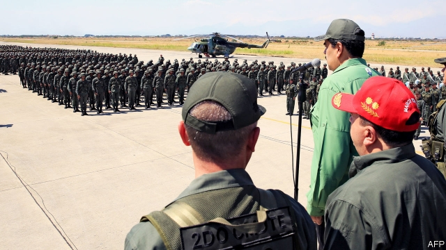

###### A Caracas idea

# The risks of military intervention in Venezuela 

##### Using force to oust Nicolás Maduro would be horribly risky 

 

> Feb 28th 2019 

IN PAST DECADES the United States has used force to change governments in the Caribbean basin. Nowadays the country is trying to extricate itself from wars, not get into a new one. Yet President Donald Trump has repeatedly insisted that “all options are on the table” to remove Venezuela’s dictator, Nicolás Maduro, from power. What if he means it? Experts think a military intervention would be unwise, for many reasons. Some spoke on condition of anonymity. 

A full-scale shock-and-awe invasion would require a formidable logistical and operational effort. The intervention in Panama in 1989, which removed from power Manuel Noriega, a drug-running dictator, involved nearly 26,000 troops, many of whom were already in the country. It was quickly over. 

But Panama is a minnow. Venezuela is a mountainous country twice the size of Iraq. It has large cities. In such conditions, the United States’ high-tech weaponry confers less of an advantage. Each of the presumed objectives—detaining Mr Maduro, installing a new government, organising elections and allowing in aid—would be a big task, involving large numbers of boots on the ground. 

No doubt the superpower would defeat Venezuela’s 130,000-strong armed forces. “The Venezuelan military would disintegrate very quickly,” says Evan Ellis of the US Army War College. Yet that would merely bring on a second problem. A new government would need that same army to maintain order. Although many ordinary Venezuelans would welcome an invasion, others would resist. Thousands of gangs and militias could create chaos. “Some of them would fight for Maduro, some would fight for Venezuela, but many more would take up arms to repel a Yankee invasion,” notes an analyst at a think-tank that is connected to the Pentagon. Francisco Toro, founding editor of Caracas Chronicles, an independent news site, warns of the danger of creating “Libya in the Caribbean”. 

Trouble could spill over into Colombia, especially if that country participated in a military operation. Even after making peace with the FARC guerrilla group in 2016 Colombia is fighting small insurgencies. Outlaw groups include the ELN, which shelters in Venezuela. Hence a third risk: starting a regional conflict. “I don’t think there’s a military solution to this that doesn’t create the likely situation of a protracted regional war,” says Cynthia Arnson of the Wilson Centre in Washington. 

A fourth complication is that any intervention has to reckon with the role of countries that back Mr Maduro’s regime, both on the ground and at the United Nations. Thousands of Cubans, including military advisers and intelligence officers but also doctors, are in the country. Luis Almagro, the secretary-general of the Organisation of American States, likens them to an “occupation army”. Russia and, more cautiously, China support Mr Maduro; both are able to veto UN backing for a military intervention, which would anyway be hugely controversial. 

If a major American intervention is so problematic, what about a minor one? Perhaps willing partners could put the boots on the ground, limiting the United States’ role to providing logistical and other support. That, however, would not mean a smaller operation or an easier one. A less direct approach would be to arm anti-Maduro groups. But memories of the Contras in Nicaragua should quickly squash that temptation. More plausibly, intervention could be confined to securing delivery of humanitarian aid, through air drops and safe zones along the border. “That would be the only sort of military intervention that would be remotely feasible given history and current circumstances,” says Craig Deare, who briefly co-ordinated Venezuela policy at the National Security Council in 2017. Yet even that might require significant muscle, including the destruction of Venezuela’s air defences and aircraft. 

All this explains why, for all the talk about what may be on the table, it does not yet appear to be an imminent plan. “I can dispel the theory that there is a military option for Venezuela,” says a defence official in Washington. She denies that staff are being asked to draw up plans. 

That could change if Mr Maduro hangs on for months despite a deepening humanitarian disaster and a mass exodus of refugees. American officials warn that violence against Americans (which was what triggered the intervention in Panama) would change the situation. So might any attempt to harm Mr Guaidó or his family. A military option, for all its difficulties, cannot quite be ruled out. 

-- 

 单词注释:

1.caracas[kә'rækәs]:n. 加拉加斯（委内瑞拉首都） 

2.intervention[.intә'venʃәn]:n. 插入, 介入, 调停 [经] 干预 

3.Venezuela[,vene'zweilә]:n. 委内瑞拉 

4.oust[aust]:vt. 逐出, 罢黜, 剥夺, 驱逐 [法] 驱逐, 剥夺, 免职 

5.maduro[mә'duәrәu]:a. 色深味浓的烟草做的, (雪茄)色深味浓的 

6.horribly['hɒrәbli]:adv. 可怕地, 非常地 

7.risky['riski]:a. 危险的 

8.Caribbean[.kæri'bi:әn]:n. 加勒比海 a. 加勒比海的, 加勒比人的 

9.extricate['ekstrikeit]:vt. 使解脱, 救出 

10.donald['dɔnәld]:n. 唐纳德（男子名） 

11.trump[trʌmp]:n. 王牌, 法宝, 喇叭 vt. 打出王牌赢, 胜过 vi. 出王牌, 吹喇叭 

12.dictator['dikteitә]:n. 命令者, 独裁者 

13.unwise['ʌn'waiz]:a. 愚蠢的, 欠考虑的, 不明智的, 轻率的 

14.anonymity[.ænә'nimiti]:n. 匿名, 姓氏不明 [计] 匿名信件 

15.formidable['fɒ:midәbl]:a. 巨大的, 优秀的, 可怕的, 艰难的 

16.logistical[ lə'dʒɪstɪkl]:a. 逻辑的; 后勤方面的 

17.Panama[.pænә'mɑ:]:n. 巴拿马, 巴拿马城 

18.manuel['mænjuel]:n. 曼纽尔（男子名）；曼努埃尔二世（拜占庭皇帝约翰五世的次子） 

19.Noriega[]:n. (Noriega)人名；(西、葡)诺列加 

20.quickly['kwikli]:adv. 很快地 

21.minnow['minәu]:n. 鲤科淡水小鱼 

22.Iraq[i'rɑ:k]:n. 伊拉克 

23.weaponry['wepәnri]:n. 武器, 军备, 武器设计研制学 

24.confer[kәn'fә:]:vt. 授予, 带来 vi. 协商 

25.les[lei]:abbr. 发射脱离系统（Launch Escape System） 

26.presume[pri'zu:m]:vt. 假定, 推测, 擅自, 意味着 vi. 擅自行动, 相信 

27.superpower[.sju:pә'pauә]:n. 超级强权, 超级大国 [经] 超级大国 

28.venezuelan[,venә'zweilәŋ]:a. 委内瑞拉的；委内瑞拉人的 

29.disintegrate[dis'intigreit]:vt. (使)分解, (使)碎裂 [医] 分解, 分裂, 蜕变 

30.evan['evən]:n. 埃文（男子名） 

31.elli[]:n. (Elli)人名；(荷、意、芬、罗、土)埃莉(女名), 埃利；(俄)叶利 

32.venezuelan[,venә'zweilәŋ]:a. 委内瑞拉的；委内瑞拉人的 

33.militia[mi'liʃә]:n. 义勇军, 民兵组织, 国民军 

34.chao[]:n. 钞（货币） 

35.repel[ri'pel]:vt. 逐退, 抵制, 使厌恶, 抗御 vi. 使厌恶, 相互排斥 

36.Yankee['jæŋki]:n. (美国的)新英格兰人, (美国)北方诸州的人, 美国佬 

37.analyst['ænәlist]:n. 分析者, 精神分析学家 [化] 分析员; 化验员 

38.pentagon['pentәgәn]:n. 五角形, 五边形 [经] 五角平台 

39.francisco[fræn'siskәu]:n. 弗朗西斯科（男子名, 等于Francis） 

40.toro['tәurәu]:n. （斗牛用的）公牛 

41.chronicle['krɒnikl]:n. 年代记, 记录, 编年史 vt. 把...载入编年史 

42.Libya['libiә]:n. 利比亚 

43.Colombia[kә'læmbiә]:n. 哥伦比亚 

44.farc[]:abbr. Federal Addiction Research Center 联邦上瘾研究中心; Fuerzas Armadas Revolucionarias de Colombia (Spanish=Armed Revolutionary Forces of Colombia) （西班牙语）哥伦比亚武装革命力量; Federal Archives and Records Center 联邦档案履历中心; Field Artillery Replacement Center 野战炮兵补充训练中心（美军） 

45.guerrilla[gә'rilә]:n. 游击队 

46.insurgency[in'sә:dʒәnsi]:n. 叛乱状态, 发生暴动 [法] 暴动, 起义, 叛乱 

47.outlaw['autlɒ:]:n. 被剥夺法律保护的人, 罪犯 vt. 使...失去法律保护, 将...逐出社会, 宣告非法, 取缔 

48.eln[]: [医][=electronic noise]电子鼻 

49.regional['ri:dʒәnәl]:a. 地方的, 地域性的 [医] 区的, 部位的 

50.protract[prәu'trækt]:vt. 延长, 拖延, 伸出, 绘制 [法] 延迟, 拖延, 延长 

51.Cynthia['sinθjә]:n. 月亮女神, 月亮 

52.arnson[]:[网络] 阿森 

53.wilson['wilsn]:n. 威尔逊（姓氏） 

54.Washington['wɒʃiŋtn]:n. 华盛顿 

55.complication[.kɒmpli'keiʃәn]:n. 复杂化, 复杂情况 [医] 并发症, 并发病 

56.reckon['rekәn]:vt. 计算, 总计, 估计, 认为, 猜想 vi. 数, 计算, 估计, 依赖, 料想 

57.regime[rei'ʒi:m]:n. 政权, 当权期间, 政体, 社会制度, 体制, 情态 [医] 制度, 生活制度 

58.Cuban['kju:bәn]:a. 古巴的, 古巴人的 n. 古巴人 

59.adviser[әd'vaizә]:n. 顾问, 劝告者, 指导教师 [法] 顾问, 劝告者 

60.luis[]:n. 路易斯（人名） 

61.almagro[]:阿尔马格罗 

62.organisation[,ɔ: ^әnaizeiʃən; - ni'z-]:n. 组织, 团体, 体制, 编制 

63.liken['laikәn]:vt. 比喻, 比拟 

64.cautiously['kɒ:ʃәsli]:adv. 慎重地 

65.veto['vi:tәu]:n. 否决权 vt. 否决, 禁止 

66.UN[ʌn]:pron. 家伙, 东西 [经] 联合国 

67.hugely['hju:dʒli]:adv. 巨大地, 非常地 

68.problematic[prɔblә'mætik]:a. 成问题的, 未定的, 疑难的, 有疑问的, 盖然性的, 或然性的 

69.contra['kɒntrә]:n. 反对, 相反 adv. 反对地, 相反地 

70.Nicaragua[,nikә'rɑ:^wә, ,nikә'ræ^juә]:[经] 尼加拉瓜 

71.squash[skwɒʃ]:n. 挤压, 压碎的东西, 南瓜属植物, 拥挤的人群 vt. 压扁, 镇压, 压制 vi. 被压扁, 发溅泼声, 挤入 

72.plausibly[ˌplɔ:zəblɪ]:adv. 似真地 

73.humanitarian[hju:.mæni'tєәriәn]:n. 人道主义者, 博爱者, 基督凡人论者 a. 人道主义的, 博爱的, 凡人论的 

74.remotely[]:adv. 极小地, 极细微地 

75.craig[krei^]:n. 克雷格（男子名） 

76.deare[]: [人名] 迪尔 

77.briefly['brifli]:adv. 简短地, 扼要地, 简明地, 简单地 

78.imminent['iminәnt]:a. 即将来临的, 逼近的 

79.dispel[dis'pel]:vt. 驱散, 驱逐 

80.exodus['eksәdәs]:n. 大批的离去 [法] 退出, 大批离去, 成一外出 

81.refugee[.refju'dʒi:]:n. 难民, 流亡者 [法] 避难者, 流亡者, 难民 

82.trigger['trigә]:n. 触发器, 扳机 vt. 触发, 发射, 引起 vi. 松开扳柄 [计] 切换开关 

83.cannot['kænɒt]:aux. 无法, 不能 

