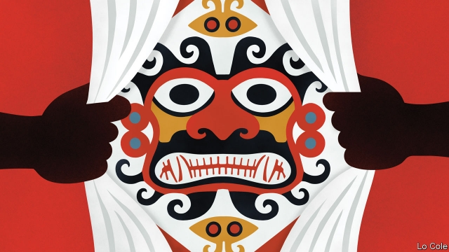

###### Bello

# Uncovering Peru’s neglected splendours 

##### The country fails to make the most of its recent archaeological finds 

 

> Feb 28th 2019 

ONE NIGHT in 1987 the police woke Walter Alva, a Peruvian archaeologist, and invited him to come to inspect some stolen gold objects. The tip would lead Mr Alva to discover the intact tomb of a ruler of the Mochica (or Moche) civilisation, whom he dubbed the Lord of Sipán. It held the lord’s full regalia of gold breastplates and crowns, exquisite nose- and ear-pieces and a unique necklace of giant gold and silver peanuts. 

It was the start of an archaeological revolution in northern Peru. Since then Mochica temples, built from mud reinforced with gravel and shells, have been unearthed at Huaca de la Luna, near the colonial city of Trujillo. They are decorated with embossed and colourfully painted friezes of fanged warlord deities and bound prisoners. In 2005 at a site called El Brujo, Régulo Franco, another archaeologist, found a tomb almost as rich as that of Sipán, but of a woman, now known as the Lady of Cao. 

These discoveries underline that ancient Peru was one of the half-dozen cradles of civilisation. It remains a creative place, as its gastronomic boom attests. But modern Peru’s dysfunctions are preventing it from reaping the full benefit of the new finds. 

The Mochicas thrived from around 100 to 600AD by irrigating the valleys of the coastal desert. Theirs was perhaps the most artistic of Peru’s ancient cultures, far more so than the much later Inca empire. Apart from their metallurgical prowess, they were skilled potters, producing sculpted vessels and stirrup-spouted jars on which they recorded their likenesses, lives, animal deities and religious ceremonies. Thanks to the recent tomb discoveries, it is now clear that some of these representations accurately portrayed priests and rulers. 

Although the pots and friezes describe warfare and human sacrifice, archaeologists now believe these were rituals to placate the deities of a people acutely vulnerable to drought and flood. “There are no Mochica fortresses, there are temples,” says Ricardo Morales of the University of Trujillo, who directs the Huaca de la Luna site. Recent scholarship also suggests that there was no Mochica super-state, but rather a collection of local lordships in each valley, linked by a common religious ideology and iconography. Finding the Lady of Cao “changed our conception of power in ancient Peru”, and the role of women within it, notes Mr Franco. 

The Sipán treasures are displayed at a superb museum, directed by Mr Alva, in a nearby town. There are museums on site at Huaca de la Luna and El Brujo, both run by non-profit foundations. They represent a kind of miracle. For decades locals lived from tomb-robbing, and Peru’s treasures were melted down or sold on an international black market. The country has around 100,000 archaeological sites. It is impossible to police them all. 

Although funds are always tight, the archaeologists are trying to win over the locals. Mr Morales says he sees Huaca de la Luna as a “development pole”. His project employs 38 staff, while another 98 sell handicrafts to visitors. Peru is developing archaeological skills. Whereas many of the Sipán artefacts were sent to Germany for conservation, this was done on site for the Lady of Cao. The archaeologists say that the biggest impact of their discoveries is on Peruvians’ self-esteem. “There wasn’t a native hero,” says Mr Alva. Now there are several. At the village next to El Brujo, DNA testing is under way to see whether the residents are descended from the Lady of Cao. 

Visitor numbers are rising, but remain low. The Sipán museum received 198,000 last year, mostly Peruvians. Despite recent decentralisation, Peru revolves around Lima. The government promotes the Inca sites of Cusco and Machu Picchu, although they are saturated with tourists (1.4m went to Machu Picchu in 2017). Roads in the north are vulnerable to the El Niño flooding that helped to end the Mochica civilisation. Because of a damaged bridge, the fastest bus between Trujillo and Chiclayo, the two main cities, takes almost five hours to cover 200km (125 miles). There are few good hotels. Official incompetence leaves roadsides strewn with rubbish. 

Yet from the top of the temple mount at El Brujo the view is breathtaking: the Pacific breakers, the desert and the sugar-cane fields that stretch to the Andean foothills. Turkey vultures glide overhead. The archaeologists have revealed that what once seemed to be desert hillocks were the ramped, decorated and tomb-filled temples of one of the world’s most sophisticated early civilisations. They deserve to be far better known. 

-- 

 单词注释:

1.bello[]:n. 贝罗（姓氏） 

2.splendour['splendә]:n. 光辉, 壮丽, 显赫 

3.archaeological[.ɑ:kiә'lɒdʒikl]:a. 考古学的, 考古学上的 

4.Walter['wɔ:ltә(r)]:n. 沃尔特（男子名） 

5.alva['ælvә]:n. 阿尔瓦（人名） 

6.Peruvian[pә'ru:viәn]:a. 秘鲁的, 秘鲁人的, 秘鲁文化的 n. 秘鲁人 

7.archaeologist[.ɑ:ki'ɒlәdʒist]:n. 考古学家 

8.intact[in'tækt]:a. 尚未被人碰过的, 原封不动的, 完整的 [医] 完整的, 无伤的 

9.Mochica[]:[网络] 莫奇卡；莫奇卡文明；莫契卡 

10.moche[]:n. (Moche)人名；(法)莫什；(以)摩西 

11.civilisation[,sivilai'zeiʃən;-li'z-]:n. 文明, 文明世界, 文化, 开化, 教化 

12.dub[dʌb]:vt. 配音, 轻点, 授予称号, 击 n. 一下击鼓声, 笨蛋 

13.regalia[ri'geiljә]:n. 王权, 王位标识, 标记, 徽章 [法] 王权, 王室的特权, 王权的标记 

14.breastplate['brestpleit]:n. 护胸甲, 腹甲, 胸革带 

15.exquisite['ekskwizit]:a. 精致的, 细腻的, 敏锐的 

16.peanut['pi:nʌt]:n. 花生, 小人物, 极小的数额 a. 渺小的, 微不足道的 

17.Peru[pә'ru:]:n. 秘鲁 

18.gravel['grævәl]:n. 砂砾, 碎石 [医] 沙砾, 尿沙 

19.unearth[.ʌn'ә:θ]:vt. 发掘, 掘出, 从洞中赶出, 揭露, 发现 

20.huaca['wɑ:kә]:古秘鲁的一种神物 

21.de[di:]:[化] 非对映体过量 [医] 铥(69号元素铥的别名,1916年Eder离得的假想元素) 

22.La[lɔ:, lɑ:]:[医] 镧(57号元素) 

23.luna['lu:nә]:n. 卢娜(月神), 月 

24.colonial[kә'lәunjәl]:a. 殖民的, 殖民地的 [法] 殖民地居民 

25.TRUJILLO[tru:'hi:əu; -'hi:jɔ:]:n. 特鲁希略（秘鲁港市） 

26.emboss[im'bɒs]:vt. 浮雕, 加以浮饰, 装饰 [化] 压印 

27.colourfully[]:色彩斑斓地 丰富多彩地 

28.frieze[fri:z]:n. 饰带, 带状物, 起绒粗呢 vt. 使起绒毛 

29.fange[]:烂泥浆；肮脏, 卑鄙, 腐化 

30.warlord['wɒ:lɒ:d]:n. 军阀, 军阀式领袖 

31.deity['di:iti]:n. 神, 神性 

32.el[el]:abbr. 预期损失（Expected Loss） 

33.brujo[]: 

34.franco['fræŋkәu]:a. 免费的 [经] 全部费用在内价, 运费准免的 

35.cao[]:abbr. 首席行政官（Chief Administrative Officer）；仅限货机 （Cargo Aircraft Only）；计算机辅助订货（Computer-Assisted Ordering） 

36.cradle['kreidl]:n. 摇篮, 发祥地, 孩提时代 vt. 放在摇篮内, 抚育 vi. 刈割 

37.gastronomic[,^æstrәu'nɔmik]:a. 美食(烹饪)法的, 烹任学的 

38.attest[ә'test]:vi. 证明, 表明, 作证 vt. 为...作证 

39.dysfunction[dis'fʌŋkʃәn]:n. 机能不良, 机能障碍 [医] 机能障碍, 机能不良 

40.coastal['kәustәl]:a. 海岸的, 沿海的, 沿岸的 [法] 海岸的, 沿海的 

41.inca['iŋkә]:n. 印加；印加人 

42.metallurgical[,metә'lә:dʒikәl]:a. 冶金的, 冶金学的 [机] 治金的, 治金术的 

43.prowess['prauis]:n. 英勇, 勇敢, 超凡技术 

44.potter['pɒtә]:n. 陶工, 制陶工人 

45.sculpt[skʌlpt]:v. 雕刻, 造型 

46.likeness['laiknis]:n. 相象, 相似物, 样子 

47.representation[.reprizen'teiʃәn]:n. 表示法, 表现, 陈述, 代表 [计] 表示法指定 

48.accurately['ækjurәtli]:adv. 正确地, 精确地 

49.portray[pɒ:'trei]:vt. 描绘, 描写, 描绘...的肖像 

50.warfare['wɒ:fєә]:n. 战争, 战斗, 交战, 斗争, 竞争 [法] 战事, 作战, 交战 

51.ritual['ritʃuәl]:n. 仪式, 典礼, 宗教仪式 a. 仪式的, 依仪式进行的 

52.placate[plә'keit]:vt. 抚慰, 平息, 使和解, 怀柔 

53.acutely[ә'kju:tli]:adv. 尖锐地, 剧烈地 

54.vulnerable['vʌlnәrәbl]:a. 易受伤害的, 有弱点的, 易受影响的, 脆弱的, 成局的 [医] 易损的 

55.fortress['fɒ:tris]:n. 城堡, 要塞 vt. 筑要塞, 以要塞防守 

56.Ricardo[ri'kɑ:dәu]:里卡多(姓氏) 

57.morale[mɒ'rɑ:l]:n. 士气, 道德 

58.lordship['lɒ:dʃip]:n. 贵族身分, 主权, 支配 

59.ideology[.aidi'ɒlәdʒi]:n. 思想体系, 意识形态, 观念学, 空论 [医] 观念学, 观念形态 

60.iconography[.aikә'nɒgrәfi]:n. 图像材料, 图示法, 肖像研究 [医] 影像学, 影像塑造术 

61.conception[kɒn'sepʃәn]:n. 观念, 概念 [医] 妊娠, 受孕; 概念 

62.alway['ɔ:lwei]:adv. 永远；总是（等于always） 

63.handicraft['hændikræft]:n. 手工艺, 手艺 [经] 手工业, 手工 

64.artefact['ɑ:tifækt]:n. 人工制品, 制造物, 人为现象, 膺象, 矫作物, 古代文物 [医] 人为现象, 人工产物 

65.DNA[]:脱氧核糖核酸 [计] 无效数据, 数字网络体系结构, 分布式网络体系结构 

66.Peruvian[pә'ru:viәn]:a. 秘鲁的, 秘鲁人的, 秘鲁文化的 n. 秘鲁人 

67.decentralisation[di:,sentrәlai'zeiʃən]:n. <主英>=decentralization 

68.revolve[ri'vɒlv]:v. (使)旋转, 反复考虑, 循环出现 

69.lima['li:mә]:n. 利马（秘鲁首都） 

70.Cusco['ku:skәu]:库斯科[秘鲁南部城市](11世纪初起至16世纪为印加帝国首都) 

71.machu[]:[网络] 马丘；马丘测试；老峰 

72.picchu[]: 比丘 

73.saturate['sætʃәreit]:vt. 使渗透, 浸透, 使充满, 使饱和 a. 浸透的, 饱和度高的, 深颜色的 n. 饱和化合物, 饱和脂肪酸 

74.Chiclayo[tʃi'klɑ:jɔ:]:n. 齐克拉约（秘鲁城区） 

75.incompetence[in'kɔmpitәns]:n. 不胜任, 不够格, 不合格, 不适合, 无能力, 不熟练, 无资格 [医] 机能不全, 闭锁不全, 关闭不全 

76.roadside['rәudsaid]:n. 路旁, 路边 a. 路边的 

77.strew[stru:]:vt. 散播, 撒满 

78.breaker['breikә]:n. 断路器 [化] 破碎机 

79.andean['ændiәn, æn'di:әn]:a. 安第斯山脉的 

80.foothill['futhil]:n. 山麓小丘 

81.vulture['vʌltʃә]:n. 秃鹫, 贪婪的人 [法] 贪婪而残酷者, 劫掠成性者 

82.hillock['hilәk]:n. 小丘, 小高处, 土堆 [医] 丘, 阜 

83.ramp[ræmp]:n. 斜坡, 坡道, 敲诈 vi. 狂跳乱撞, 乱冲, 敲诈, 蔓延 vt. 使有斜面, 敲诈 

84.sophisticate[sә'fistikeit]:n. 久经世故的人, 精于...之道的人 vt. 篡改, 曲解, 使变得世故, 掺合, 弄复杂 vi. 诡辩 

