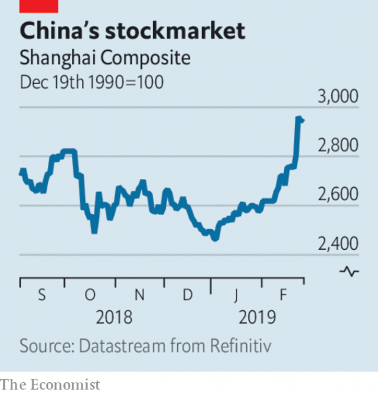

###### Bromance on hold

# Business this week 

> Feb 28th 2019 

Donald Trump lifted a deadline of March 1st for China to agree to concessions on trade, after which he had threatened to increase tariffs on $200bn-worth of Chinese exports from 10% to 25%. The president tweeted that “substantial progress” was being made in negotiations with the Chinese and that he expected to meet his counterpart, Xi Jinping, to sign a deal in the coming weeks. No details were provided, but one of the promises China has reportedly made is not to depreciate its currency. A weak yuan makes Chinese exports cheaper. 

 

The Shanghai stockmarket rose by 5.6% in response to the suspension of tariffs, its best day in three years. Investor sentiment was also lifted by comments from Mr Xi about quickening the pace of development in China’s financial- services industry. 

General Electric agreed to sell its biotechnology business to Danaher, a health-services group, for $21bn. It is the biggest step taken to streamline GE under Larry Culp, who became chief executive last October and was Danaher’s boss until 2014. The deal was welcomed by the conglomerate’s weary investors; the proceeds of the sale will go towards reducing GE’s debt. 

The share price of Kraft Heinz plunged by 27% after the food company booked a $15.4bn write-down, in part because its key Kraft and Oscar Mayer divisions were overvalued. It also revealed that the Securities and Exchange Commission had opened an investigation into its accounting practices. Warren Buffett, who helped engineer the merger of Heinz with Kraft Foods in 2015, admitted that he had overpaid for his investment company’s stake in the business. See article. 

Regulators in America and Britain announced a long-term agreement to ensure that the transatlantic derivatives market, which accounts for the vast majority of global derivatives contracts, is not disrupted by Brexit, whatever form it takes. The pact covers both the trading and clearing of derivatives between the two countries. European regulators have taken steps to allow EU derivative contracts to be cleared in London in the event of a no-deal Brexit, but the arrangement is temporary. 

America’s Justice Department conceded defeat after a federal appeals-court dismissed its attempt to overturn  at&t’s merger with Time Warner, describing the government’s arguments as “unpersuasive”. The merger was approved by a lower court last year. 

In a surprise development, the Dutch government revealed that it had built a stake of 12.7% in Air France- KLM’s holding company, and would increase it to a size similar to that of the French government’s stake in the business, which is 14.3%. Disagreements between the two governments over the future of Air France-KLM have escalated, with the Dutch keen to protect jobs at Amsterdam’s Schiphol airport. The French complained that the Dutch had not informed them about the investment. 

Barrick Gold launched an $18bn hostile bid for Newmont Mining, a smaller rival in the gold industry. Newmont retorted that its pending acquisition of Goldcorp, another mining firm, offered “superior benefits” to shareholders. 

In a challenge to Amazon’s ambitions in the online-grocery market in Britain, Ocado, a leader in online-supermarket technology, struck a deal to deliver Marks & Spencer’s food products from 2020. Ocado will then cease selling goods from Waitrose, another upmarket food retailer, which has supplied Ocado with posh nosh since it started home deliveries in 2002. Last year Ocado signed an agreement with Kroger, America’s biggest supermarket chain, to develop its online-grocery business. 

The name Merrill Lynch is to disappear. Bank of America bought the investment bank, which started out in 1915 and became one of the biggest firms on Wall Street, during the financial crisis. It had rebranded the business as Bank of America Merrill Lynch, though many investors clung to the old namesake. The wealth-management side will now be known simply as Merrill, and investment banking will fall under the BofA brand. 

Exxon Mobil reportedly asked the Securities and Exchange Commission (SEC) to block a shareholder vote at its annual meeting on a measure that would oblige it to set targets for reducing greenhouse-gas emissions in line with the Paris accord on climate change. The oil giant argues that the measure is an attempt to “micro-manage” its operations, and “reflects a misunderstanding” of energy markets. 

Elon Musk got into more hot water with the SEC when he tweeted inaccurate production forecasts for Tesla’s cars, violating part of last year’s settlement with the regulator about not disseminating misleading information about the company. The SEC asked a court to hold Mr Musk in contempt. 

-- 

 单词注释:

1.bromance[]:n. 兄弟罗曼史； 也可以理解为“兄弟情”； 指两个男人关系很好； 但不涉及“性”的同性关系 

2.donald['dɔnәld]:n. 唐纳德（男子名） 

3.trump[trʌmp]:n. 王牌, 法宝, 喇叭 vt. 打出王牌赢, 胜过 vi. 出王牌, 吹喇叭 

4.concession[kәn'seʃәn]:n. 特许, 让步, 认可 [经] 核准, 许可, 特殊(权) 

5.tariff['tærif]:n. 关税, 关税表, 价格表, 收费表 vt. 课以关税 [计] 价目表 

6.tweet[twi:t]:vi. 啁啾 n. 小鸟叫声 

7.negotiation[ni.gәuʃi'eiʃәn]:n. 谈判, 磋商, 交涉 [经] 谈判, 协商 

8.counterpart['kauntәpɑ:t]:n. 副本, 复本, 配对物, 相应物 [经] 副本, 正副二份中之一 

9.reportedly[ri'pɒ:tidli]:adv. 根据传说, 根据传闻, 据报道 

10.depreciate[di'pri:ʃieit]:vi. 贬值 vt. 降价, 贬低 

11.stockmarket[s'tɒkmɑ:kɪt]: 证券市场; 证券交易所; 证券行情 

12.investor[in'vestә]:n. 投资者 [经] 投资者 

13.sentiment['sentimәnt]:n. 感情, 感伤, 情操, 情绪, 感想, 意见 [医] 情感, 情操 

14.biotechnology[.baiәutek'nɔlәdʒi]:n. 生物工艺学；生物技术 

15.danaher[]:达纳赫（人名） 

16.streamline['stri:mlain]:n. 流线, 流线型 vt. 使成流线型, 使合理化 

17.Larry['læri]:n. 拉里（男子名） 

18.culp[]:abbr. California Union List of Periodicals 加利福尼亚期刊联盟; computer usage list processor 计算机应用表处理机 

19.investor[in'vestә]:n. 投资者 [经] 投资者 

20.kraft[krɑ:ft]:n. 牛皮纸 

21.heinz[]:n. 海因茨（姓氏）；亨氏食品公司（世界著名的食品供应商, 主要产品包括调味品和餐食两大类） 

22.Oscar['ɔskә]:n. 奥斯卡金像奖, 钱, 现金 

23.mayer['meiә]:[医] 迈尔(热容单位) 

24.overvalue[.әuvә'vælju:]:vt. 估价过高, 过分尊重, 估计过高 

25.warren['wɒrәn]:n. 养兔场, 拥挤的地区 

26.buffett['bʌfit]: [人名] 巴菲特 

27.merger['mә:dʒә]:n. 合并, 归并 [经] 购并 

28.overpay[.әuvә'pei]:vt. 多付, 多给报酬 vi. 付得过多 

29.regulator['regjuleitә]:n. 调整者, 校准者, 校准器, 调整器, 标准钟 [化] 调节剂; 调节器 

30.transatlantic[.trænsәt'læntik]:a. 横渡大西洋的, 大西洋彼岸的, 美国的 

31.derivative[di'rivәtiv]:a. 引出的, 派生的 n. 引出之物, 派生物, 衍生字 

32.disrupt[dis'rʌpt]:a. 分裂的, 中断的 vt. 使分裂, 使瓦解 

33.Brexit[]:[网络] 英国退出欧盟 

34.pact[pækt]:n. 契约, 协定, 条约 [化] 合同 

35.EU[]:[化] 富集铀; 浓缩铀 [医] 铕(63号元素) 

36.concede[kәn'si:d]:vt. 承认, 退让 vi. 让步 

37.overturn[.әuvә'tә:n]:n. 倾覆, 破灭, 革命 vt. 推翻, 颠倒 vi. 翻倒 

38.warner['wɔ:nә]:n. 警告者, 告诫者, 预告者 [化] 报警器 

39.unpersuasive[ʌnpә'sweisiv]:a. 无说服力的 

40.Dutch[dʌtʃ]:n. 荷兰人, 荷兰语 a. 荷兰的 

41.escalate['eskәleit]:vi. 逐步扩大, 逐步升高, 逐步增强 vt. 使逐步上升 

42.schiphol[]:n. 斯希波尔 （机场）; 或译：史基浦 （机场） 

43.barrick[]:n. (Barrick)人名；(英)巴里克 

44.newmont[]:[网络] 纽蒙特；纽蒙特矿业公司；纽蒙特公司 

45.retort[ri'tɒ:t]:n. 反驳, 顶嘴, 蒸馏器, 曲颈甑 vi. 反驳, 回嘴, 反击 vt. 反击, 反驳, 蒸馏 

46.pending['pendiŋ]:a. 未决定的, 待决的, 行将发生的, 向外伸出的 prep. 在等待...之际, 直到...时为止, 在...期间, 在...过程中 

47.Goldcorp[]:[网络] 加拿大黄金公司；加拿大金矿公司；黄金企业公司 

48.shareholder['ʃєә.hәuldә]:n. 股东 [法] 股东, 股票持有人 

49.Ocado[]:[网络] 奥卡多；奥克杜；油梨 

50.Waitrose[]:维特罗斯（英国) 

51.upmarket[ˌʌpˈmɑ:kɪt]:a. 高级的, 高档的, 高端的 

52.retailer['ri:teilә]:n. 零售商人, 传播的人 [经] 零售商 

53.posh[pɒʃ]:a. 豪华的, 漂亮的, 优雅的, 极好的 interj. 呸 

54.nosh[nɒʃ]:n. 小吃, 点心 v. 吃点心 

55.kroger[]:n. 克罗格（美国跨国公司名） 

56.Merrill[]:n. 美林（美国证券公司）；美林（美国城市） 

57.lynch[lintʃ]:n. 私刑, 私罚 vt. 处以私刑处死, 加私刑 

58.rebrand[ˌri:ˈbrænd]:v. 给（产品或组织）重新命名（或包装）, 重塑…的形象 

59.cling[kliŋ]:vi. 粘紧, 附着, 紧贴, 坚持 

60.namesake['neimseik]:n. 同名人, 同名物 

61.bofa[]:n. (Bofa)人名；(法)博法 β-癌胚抗原（beta-oncofetal antigen） 

62.Exxon['ɛksan]:n. 艾克森石油公司 

63.mobil[]:n. 美孚石油公司（世界上最著名的石油公司之一） 

64.SEC[sek]:[计] 秒, 辅助 [化] 尺寸排阻色谱法 

65.emission[i'miʃәn]:n. 发射, 射出, 发行 [医] 发射, 遗精 

66.misunderstanding[.misʌndә'stændiŋ]:n. 误会, 误解 [法] 误解, 误会, 不和 

67.elon[i'lɔn]:n. 埃伦（可溶性显影剂粉末） 

68.musk[mʌsk]:n. 麝香, 麝香的气味 [化] 麝香 

69.inaccurate[in'ækjurit]:a. 错误的, 不准确的 [化] 不精确 

70.disseminate[di'semineit]:vt. 散播, 传播, 宣传 vi. 广为传播 

71.misleading[mis'li:diŋ]:a. 引入歧途的, 使人误解的, 骗人的 [法] 误写姓名的, 误称的, 令人误解的 

