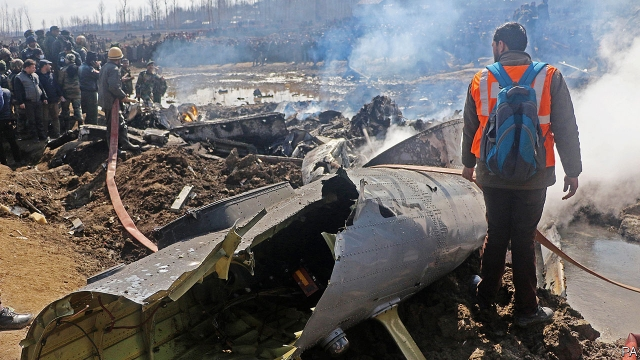
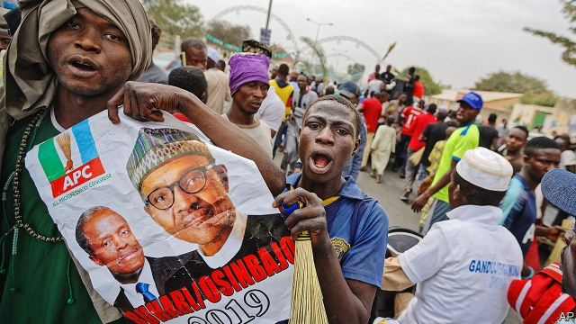

###### Bromance on hold

# Politics this week 

 

> Mar 2nd 2019 

Indian fighter jets bombed what they said was a terrorist training camp in Pakistan, in retaliation for a suicide-bombing in India which killed 40 paramilitary police. Pakistan responded by sending warplanes to strike at targets in India. In the aerial battle that followed, both countries claimed to have shot down some of the other’s fighters. Pakistan captured an Indian pilot. The fighting is the worst since 1999, and marks the first time since the two countries acquired nuclear weapons that they have conducted bombing raids against one another. See article. 

Donald Trump walked away from his summit with Kim Jong Un, North Korea’s dictator, in Vietnam. The talks broke down when the North Koreans pushed for all sanctions to be lifted in exchange for dismantling Yongbyon, an old nuclear facility. America wants the North to reveal where all its nuclear weapons are stored, as a prelude to dismantling them. See article. 

Michael Cohen, Mr Trump’s former lawyer and fixer, testified against his former boss before Congress. He accused the president of being a “racist”, and a “cheat”, as well as a “con man” for suppressing the publication of his high-school and college grades. Mr Cohen has already pleaded guilty to several charges, some of which are related to his work for Mr Trump. The White House said no one should trust the testimony of a “disgraced felon”. See article. 

Lori Lightfoot and Toni Preckwinkle came out on top in Chicago’s mayoral election and will advance to the run-off on April 2nd. The city will now get its first black female mayor, and if Ms Lightfoot wins, also the first gay person to hold the office. William Daley, a scion of Chicago’s most famous political dynasty, came third. See article. 

Venezuela’s dictatorship blocked deliveries of aid, which it sees as a foreign attempt to undermine it. Police, national guardsmen and paramilitary groups drove back lorries carrying food and medical supplies, and used tear gas and rubber bullets to disperse people who were trying to escort the aid. Some live bullets were fired, too. Around 300 people were injured and four were killed. Hundreds of Venezuelan soldiers and police deserted. Some of their families were reportedly tortured or raped to discourage further defections. At a meeting attended by Mike Pence, the American vice-president, ten members of the Lima Group of mostly Latin American countries repeated their support for Juan Guaidó, who is recognised as Venezuela’s interim president by Venezuela’s legislature and by most western democracies. But they ruled out military intervention to topple the regime led by Nicolás Maduro. See article. 

In a referendum 87% of participants approved a new constitution for Cuba, which will legalise private property, subject to restrictions by the state, and limit the president to two five-year terms. 

Brazil’s education minister asked all schools to film their pupils singing the national anthem and to send the films to the government. He also asked schools to read out a message that ends “Brazil above all. God above everyone”. That was the campaign slogan of the country’s new president, Jair Bolsonaro. The minister later admitted that asking schools to read the slogan was a mistake. 

Theresa May, Britain’s prime minister, conceded some ground to Parliament over Brexit. As well as voting on her revised withdrawal agreement with the European Union, MPs will also have an option to take “no deal” off the table if her plan is rejected. If MPs reject no-deal, they will then vote on whether to ask for an extension past March 29th, which is when Britain is due to leave the EU. Labour also made a significant shift when its leader, Jeremy Corbyn, said it would back a second referendum. See article. 

Poland’s government announced a package of tax cuts and spending, including a bonus for pensioners and hefty handouts to parents. The package could cost as much as 2% of GDP. The ruling party faces a tough election this year. See article. 

 EU leaders visited Sharm el-Sheikh in Egypt to meet leaders of Arab League countries and ask for help in keeping refugees out of Europe. The atrocious human-rights records of some participants were barely mentioned. 

In the face of huge protests against his dictatorship, President Omar al-Bashir declared a state of emergency in Sudan, dissolving the federal government and replacing all state governors with military and security men. He is still far from secure. Despite a ban on unauthorised gatherings, the protests continued. See article. 

In a surprise move Muhammad Javad Zarif, Iran’s foreign minister, publicly offered to resign. The move laid bare the struggle for control of Iran’s foreign policy between pragmatists, such as Mr Zarif and President Hassan Rouhani, and hardliners. Mr Rouhani rejected the resignation. See article. 

King Salman of Saudi Arabia named Princess Reema bint Bandar bin Sultan ambassador to America, the first time a woman has been named to such a post. 

 

Muhammadu Buhari was re-elected president of Nigeria. At least 39 people were killed in election-related attacks—fewer than during previous ballots. The opposition claims that the vote was rigged, but observers seem to think it was clean enough. See article. 

Tens of thousands of Algerians protested against President Abdelaziz Bouteflika’s decision to run for a fifth term. The octogenarian leader has made few public appearances since 2013. Most Algerians expect the vote on April 18th to be fixed by the cabal of power brokers who run the country. 

Three funeral providers in South Africa said they would sue a pastor after they were “tricked” into taking part in a service in which a man was supposedly raised from the dead. A video that went viral shows the man sitting up in his coffin with a startled look on his face. Social-media users were not convinced. Many posted images implying how easy it is to pretend to be dead, and then wake up. 

-- 

 单词注释:

1.bromance[]:n. 兄弟罗曼史； 也可以理解为“兄弟情”； 指两个男人关系很好； 但不涉及“性”的同性关系 

2.politic['pɒlitik]:a. 精明的, 明智的, 策略的 

3.terrorist['terәrist]:n. 恐怖分子 [法] 恐怖份子, 恐怖主义 

4.Pakistan[.pɑ:ki'stɑ:n]:n. 巴基斯坦 

5.retaliation[ri.tæli'eiʃәn]:n. 报复 [法] 报仇, 报复, 回敬 

6.paramilitary[.pærә'militәri]:a. 辅助军事的 

7.warplane['wɒ:plein]:n. 军用飞机 

8.aerial['єәriәl]:a. 空中的, 航空的, 空气的, 空想的 n. 天线 

9.donald['dɔnәld]:n. 唐纳德（男子名） 

10.trump[trʌmp]:n. 王牌, 法宝, 喇叭 vt. 打出王牌赢, 胜过 vi. 出王牌, 吹喇叭 

11.kim[]:n. 金姆（人名） 

12.jong[jɔŋ]:n. 小伙子；（旧时的）青年男奴 

13.UN[ʌn]:pron. 家伙, 东西 [经] 联合国 

14.dictator['dikteitә]:n. 命令者, 独裁者 

15.Vietnam[.vjet'næm]:n. 越南 

16.Korean[kә'riәn]:n. 朝鲜人, 朝鲜语 a. 朝鲜人的, 朝鲜语的 

17.sanction['sæŋkʃәn]:n. 核准, 制裁, 处罚, 约束力 vt. 制定制裁规则, 认可, 核准, 同意 

18.dismantle[dis'mæntl]:vt. 拆除...的设备, 分解, 去除覆盖物 

19.yongbyon[]:[网络] 宁边；宁边核设施 

20.prelude['prelju:d]:n. 前奏, 序幕, 序诗, 前奏曲 vi. 作为前奏 vt. 作为...的开头 

21.michael['maikl]:n. 迈克尔（男子名） 

22.cohen['kәuin]:科恩（姓氏） 

23.fixer['fiksә]:n. 定色剂, 定影剂, 毒贩子 [化] 定影剂; 定香剂; 固色剂; 固着剂; 固定剂 

24.testify['testifai]:v. 证明, 作证, 声明, 表明 

25.racist['reisist]:n. 种族主义者 [法] 种族主义的, 种族歧视 

26.con[kɒn]:vt. 精读, 仔细研究, 默记 adv. 反面地, 从反面 a. 欺诈的 n. 反对者, 反对票, 肺结核 [计] 控制台 

27.suppress[sә'pres]:vt. 镇压, 使止住, 禁止, 抑制, 查禁 [法] 镇压, 平定, 禁止出版 

28.plead[pli:d]:vi. 辩护, 恳求 vt. 为...辩护, 提出...借口, 托称, 恳求 

29.testimony['testimәni]:n. 证言, 证据, 声明 [医] 证据 

30.disgrace[dis'greis]:n. 耻辱, 不名誉 vt. 使受耻辱, 使失体面 

31.lori[]:n. 洛里, 罗莉（人名） 

32.Lightfoot[]:莱特福特（人名） 

33.toni['tәuni]:n. 托妮（女子名） 

34.mayoral['mєәrәl]:a. 市长的 

35.william['wiljәm]:n. 威廉（男子名）；[常作W-][美俚]钞票, 纸币 

36.DALEY[]:n. 戴利（男子名） 

37.scion['saiәn]:n. 接穗, 子孙 [医] 嫩枝, 接穗 

38.dictatorship[dik'teitәʃip]:n. 独裁者之职位, 独裁, 独裁政权 [法] 专攻, 独裁权 

39.undermine[.ʌndә'main]:vt. 在...下面挖, 渐渐破坏, 暗地里破坏 [法] 暗中破坏, 以阴谋中伤伤害 

40.guardsman['gɑ:dzmәn]:n. 卫兵, (英)近卫兵, (美)国民警卫队士兵 

41.disperse[dis'pә:s]:vt. 分散, 传播, 散开 vi. 分散 a. 分散的 [计] 分散 

42.escort['eskɒ:t]:n. 护送者, 护卫者, 护航舰 vt. 护卫, 护送 

43.venezuelan[,venә'zweilәŋ]:a. 委内瑞拉的；委内瑞拉人的 

44.reportedly[ri'pɒ:tidli]:adv. 根据传说, 根据传闻, 据报道 

45.rape[reip]:n. 抢夺, 掠夺, 强奸, 葡萄渣, 芸苔 vt. 掠夺, 抢夺, 强奸 

46.defection[di'fekʃәn]:n. 背叛, 缺乏, 毛病 [法] 缺点, 过失, 背叛 

47.mike[maik]:vi. 偷懒, 游手好闲 n. 休息, 游手好闲, 扩音器, 话筒 

48.lima['li:mә]:n. 利马（秘鲁首都） 

49.juan[hwɑ:n]:n. 胡安（男子名） 

50.interim['intәrim]:a. 暂时的, 临时的, 间歇的 n. 过渡时期 

51.legislature['ledʒisleitʃә]:n. 立法机关, 议会, 立法院 [法] 立法机构, 立法机关 

52.intervention[.intә'venʃәn]:n. 插入, 介入, 调停 [经] 干预 

53.topple['tɒpl]:vt. 推翻, 颠覆 vi. 倒塌, 摇摇欲坠 

54.regime[rei'ʒi:m]:n. 政权, 当权期间, 政体, 社会制度, 体制, 情态 [医] 制度, 生活制度 

55.referendum[.refә'rendәm]:n. （就重大政治或社会问题进行的）全民公决，全民投票 

56.participant[pɑ:'tisipәnt]:n. 参加者, 参与者 a. 有份的, 参加的, 参与的 

57.Cuba['kju:bә]:n. 古巴 

58.legalise['li:^әlaiz]:vt. 使合法化, 使成为法定, 法律上认可 

59.anthem['ænθәm]:n. 圣歌, 赞美诗 

60.Brazil[brә'zil]:n. 巴西 

61.jair[]:[网络] 睚珥；贾伊尔；睢珥 

62.theresa[ti'ri:zә]:n. 特丽萨（女子名） 

63.concede[kәn'si:d]:vt. 承认, 退让 vi. 让步 

64.Brexit[]:[网络] 英国退出欧盟 

65.withdrawal[wið'drɒ:l]:n. 提款, 撤退, 退回, 撤消, 退隐, 戒毒过程 [医] 戒除, 脱瘾 

66.MP[]:国会议员, 下院议员 [计] 宏处理程序, 维护程序, 线性规划, 微程序, 多处理器 

67.EU[]:[化] 富集铀; 浓缩铀 [医] 铕(63号元素) 

68.jeremy['dʒerimi]:n. 杰里米（男子名） 

69.Corbyn[]:科尔宾（人名） 

70.pensioner['penʃәnә(r)]:n. 领取抚恤金者, (英国剑桥大学的)自费生, 为金钱所收买的人, 帮佣 [法] 领取退休金者, 领取抚恤金者 

71.hefty['hefti]:a. 重的, 肌肉发达的 

72.handout['hændaut]:n. 施舍物, 救济品, 分发的印刷品资料, 广告物品 

73.sharm[]: [地名] 港口（阿拉伯语） 

74.Egypt['i:dʒipt]:n. 埃及 

75.refugee[.refju'dʒi:]:n. 难民, 流亡者 [法] 避难者, 流亡者, 难民 

76.atrocious[ә'trәuʃәs]:a. 残暴的, 凶恶的 

77.omar['әjmɑ:(r)]:n. 奥马尔（男子名） 

78.Sudan[su:'dæn]:n. 苏丹 [化] 苯偶氮间苯二酚; 苏丹 

79.unauthorised[ʌn'ɔ:θəraizd]:a. 无权的（等于unauthorized） 

80.gathering['gæðәriŋ]:n. 聚集, 集中, 采集 [化] 富集 

81.muhammad[]:n. 穆罕默德 

82.javad[]:[网络] 贾维德 

83.zarif[]:n. (Zarif)人名；(俄)扎里夫 

84.pragmatist['prægmәtist]:n. 实用主义者, 爱管闲事的人 

85.Hassan[]:n. 哈山（男子名） 

86.rouhani[]:n. (Rouhani)人名；(伊朗)鲁哈尼 

87.hardliner[ˌhɑ:d'laɪnə(r)]:n. 强硬路线者 

88.Salman[]:n. 萨尔曼（男子名） 

89.saudi['sajdi]:a. 沙乌地阿拉伯（人或语）的 

90.Arabia[ә'reibiә]:n. 阿拉伯半岛 

91.reema[]:瑞玛体系建筑方法 

92.bint[bɪnt]:n. <英><俚><贬>女孩, 女人 

93.Bandar['bʌndɑ:]:[动]印度狭鼻猴 

94.bin[bin]:n. (贮存谷物等的)容器, 箱子 [计] 二进制, 商业信息网 

95.sultan['sʌltn]:n. 苏丹(某些伊斯兰国家统治者的称号) 

96.buhari[]:[网络] 布哈里 

97.Nigeria[nai'dʒiriә]:n. 尼日利亚 

98.ballot['bælәt]:n. 投票, 投票用纸, 抽签 vi. 投票, 抽签 vt. 投票选出, 拉选票 

99.opposition[.ɒpә'ziʃәn]:n. 反对, 敌对, 相反, 在野党 [医] 对生, 对向, 反抗, 反对症 

100.rig[rig]:n. 装备, 帆装 vt. 装配, 装扮, 给船装帆, 垄断, 操纵 

101.tens[]:十位 

102.Algerian[æl'dʒiәriәn]:a. 阿尔及利亚的 n. 阿尔及利亚人 

103.abdelaziz[]:n. (Abdelaziz)人名；(阿拉伯)阿卜杜勒-阿齐兹 

104.octogenarian[.ɒktәudʒә'nєәriәn]:a. 80岁到90岁(的人)的 n. 80岁到90岁的人 

105.cabal[kә'bæl]:n. 秘密结社, (尤指政治上的)阴谋 vi. 策划阴谋 

106.broker['brәukә]:n. 掮客, 经纪人 [经] 经纪人, 掮客 

107.provider[prә'vaidә]:n. 供应者, 供养人, 伙食承办人 [计] 提供器 

108.sue[su:]:vt. 控告, 起诉, 请求 vi. 提出诉讼, 提出请求 

109.pastor['pæstә]:n. 牧师 

110.supposedly[sә'pәuzidli]:adv. 想象上, 看上去像, 被认为是, 恐怕, 按照推测 

111.viral['vairәl]:a. 病毒的, 病毒引起的 [医] 病毒的 

112.coffin['kɒfin]:n. 棺材, 灵柩 vt. 把...装进棺材 

