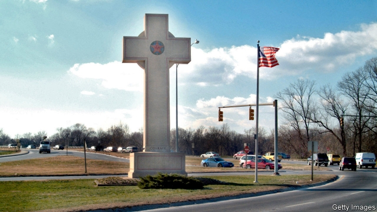

###### Squeezing Lemon

# America’s porous wall between church and state 

##### A Supreme Court case could make the holes bigger 

 

> Feb 28th 2019 

IN 1947, when the Supreme Court first interpreted the constitution’s bar on laws “respecting an establishment of religion”, the justices consulted Thomas Jefferson. The First Amendment erects “a wall of separation between church and state,” the third president had written in 1802. This means, the court said a century and a half later, that the government may neither “prefer one religion over another”, take part in the “affairs of any religious organisations” nor impose taxes to support “religious activities or institutions.” Justice Hugo Black explained in a 5-4 decision why this wall did not stand in the way of a New Jersey law covering the bus fares of Catholic-school students. In dissent, Justice Robert Jackson called the majority opinion “utterly discordant”. The ruling, for him, brought to mind “Julia who, according to Byron’s reports, ‘whispering I will ne’er consent,’—consented.’” 

The battle over the church-state line is no less divisive—and even more muddled—70 years on. Prayer in school was tossed out in the 1960s. Stand-alone nativity scenes inside government buildings were struck down in the 1980s. But other Biblical verses, crosses and menorahs in the public square have won the court’s blessing. On one day in 2005, the Supreme Court upheld a Ten Commandments monument near a capitol building while rejecting another outside a courthouse. When the justices last ruled on the matter in 2014, they found no trouble with a town board launching its meetings with Christian prayers. As long as the government does not relentlessly “denigrate” or “proselytise” dissenters, Justice Anthony Kennedy wrote—again, for a 5-4 majority—it respects America’s church-state balance. 

On February 27th a new flashpoint came before the court in the guise of an old memorial to first-world-war soldiers. Since 1925 Bladensburg in Maryland has been home to a 40-foot Latin cross honouring 49 men from Prince George’s County who died in the fighting. Upon its rededication in 1985, the Peace Cross’s reach was extended to veterans of all wars. For Rachel Laser, president of Americans United for Separation of Church and State, it is “remarkable” that the cross, which stands at the intersection of two big motorways on public ground, “is thought to be anything but a clear violation of the establishment clause.” The memorial is a sectarian symbol, she says, and denies “equal dignity” to non-Christian soldiers who died. 

When the Fourth Circuit Court of Appeals ruled against the cross in 2017 it invoked a precedent set in Lemon v Kurtzman, a 1971 ruling that states could not pay the salaries of teachers at private Catholic schools in Pennsylvania. Justice Antonin Scalia once likened Lemon to a “ghoul in a late night horror movie” that just won’t die. At the Sumpreme Court hearing Justices Neil Gorsuch and Brett Kavanaugh both professed a desire to drive a stake through its heart. Whether or not Lemon gets the squeeze, the oral arguments added credence to the widespread hunch that the Supreme Court will save the Peace Cross. The question is how bold the justices will be. 

Late in the hearing, inklings of possible compromise came from Justices Elena Kagan and Stephen Breyer. In 2005, Justice Breyer had found it “determinative” that 40 years passed before anyone raised an objection to a Ten Commandments display in Texas. His vote saved that monument. Likewise, the historical context of the Peace Cross counts, he said. What message would it send, he asked, if people “see crosses all over the country being knocked down?” Justice Kagan said she, too, finds “something quite different” about the “historic moment in time” when the cross was built. Perhaps the justices could let the Maryland memorial stand while saying “no more” to future crosses on public land? 

A third way could avoid bulldozed crosses while respecting America’s religious diversity—as Justice Ginsburg pointed out, 30% of the country now identifies as something other than Christian. Gregory Lipper, author of a brief criticising the cross, thinks Justice Breyer’s proposal could form the basis of a deal between the liberal justices and Chief Justice Roberts; it may, he says, ward off “more grievous harm.” But with the court’s new conservative majority, the chief may be tempted to make a more dramatic statement when the decision comes this spring. Thomas Jefferson’s wall could be up for a redo. 

-- 

 单词注释:

1.porous['pɒ:rәs]:a. 多孔的, 有气孔的, 多孔性的, 能渗透的 [医] 多孔的 

2.thoma[]:n. (Thoma)人名；(阿尔巴、阿拉伯)索玛；(英、德、罗、匈、捷、塞、瑞典)托马 

3.jefferson['dʒefәsn]:n. 杰弗逊（姓氏） 

4.amendment[ә'mendmәnt]:n. 修订, 改善, 改良, 改正 [化] 调理剂; 修正 

5.organisation[,ɔ: ^әnaizeiʃən; - ni'z-]:n. 组织, 团体, 体制, 编制 

6.hugo['hju:^әu]:n. 雨果（男子名, 等于Hugh） 

7.jersey['dʒә:zi]:n. 运动衫 

8.dissent[di'sent]:n. 异议 vi. 持异议, 不同意 

9.Robert['rɔbәt]:[法] 警察 

10.jackson['dʒæksn]:n. 杰克逊（男子名）；杰克逊（美国密西西比州的城市） 

11.utterly['ʌtәli]:adv. 完全地, 全然, 绝对 

12.discordant[dis'kɒ:dәnt]:a. 不调和的, 不和的 

13.julia['dʒu:ljә]:n. 朱莉娅（女子名） 

14.les[lei]:abbr. 发射脱离系统（Launch Escape System） 

15.nativity[nә'tiviti]:n. 出生, 出生的情况, 诞生, 出生地, 耶酥诞生 

16.biblical['biblikәl]:a. 圣经的 

17.verse[vә:s]:n. 诗, 韵文, 诗句 vt. 用诗表达 vi. 作诗 

18.menorah[mә'nɒ:rә]:n. 九扦枝大烛台(犹太教仪式用) 

19.uphold[ʌp'hәuld]:vt. 支撑, 赞成, 鼓励, 举起, 坚持 [法] 确认, 赞成, 支持 

20.commandment[kә'mɑ:ndmәnt]:n. 戒律 

21.Capitol['kæpitl]:n. 国会大厦, 州议会大厦, 朱比特神庙 

22.courthouse['kɒ:thaus]:n. 法院, 郡政府所在地 

23.relentlessly[]:adv. 不仁慈, 严酷, 无情, 坚韧, 不懈, 不屈不挠 

24.denigrate['denigreit]:vt. 使变黑, 玷污, 诋毁 

25.proselytise['prɔsilitaiz]:v. <主英>=proselytize 

26.dissenter[di'sentә]:n. 持异议者, 不同意者, 不顺从国教者 

27.anthony['æntәni]:n. 安东尼（人名） 

28.kennedy['kenidi]:n. 肯尼迪（姓氏, 美国第35任总统） 

29.flashpoint[ˈflæʃpɔɪnt]:n. （尤指政治动乱的）爆发点; 政治动乱地区；危险地区 

30.guise[gaiz]:n. 相似, 外观, 伪装 v. 穿戴, 伪装 

31.bladensburg[]: [地名] [美国] 布莱登斯堡 

32.Maryland['merilәnd]:n. 马里兰州 

33.rededication[]:[网络] 献身；献一生 

34.rachel['reitʃәl]:n. 雷切尔（女子名） 

35.lase[leiz]:vi. 发出激光, 以激光照射 

36.intersection[.intә'sekʃәn]:n. 交集, 十字路口, 交叉点 [计] 逻辑乘; 与 

37.motorway['mәutәwei]:n. 高速公路 

38.violation[.vaiә'leiʃәn]:n. 违反, 违背, 妨碍 [法] 违犯, 违背, 违反 

39.clause[klɒ:z]:n. 子句, 条款 [计] 子句 

40.sectarian[sek'tєәriәn]:a. 宗派的, 党派的, 偏狭的 n. 宗派成员, 闹宗派的人 

41.invoke[in'vәuk]:vt. 祈求, 恳求, 实行, 援引, 引起 [计] 调用; 请求 

42.precedent['presidәnt]:n. 先例, 前例 a. 在先的, 在前的 

43.V[vi:]:[计] 溢出, 变量, 向量, 检验, 虚拟, 垂直 [医] 钒(23号元素) 

44.kurtzman[]:[网络] 库斯特曼 

45.Pennsylvania[.pensil'veinjә]:n. 宾夕法尼亚 

46.Antonin[]:n. 安东尼（人名） n. (Antonin)人名；(塞、西、俄)安东宁；(法)安托南 

47.scalia[]:斯卡利亚（人名） 

48.liken['laikәn]:vt. 比喻, 比拟 

49.ghoul[gu:l]:n. 食尸鬼, 饿鬼, 盗墓者 

50.neil[]:n. 尼尔（男子名） 

51.gorsuch[]: [人名] [英格兰人姓氏] 戈萨奇 Gossage的变体 

52.brett[bret]:n. 布雷特（男子名） 

53.kavanaugh[]: [人名] 卡瓦诺 

54.profess[prә'fes]:vt. 声称, 以...为业, 伪称, 讲授 vi. 表白, 承认, 当教授 

55.credence['kri:dәns]:n. 信任, 祭器台, 供桌, 凭证 [法] 设计人, 创立人, 创设人 

56.hunch[hʌntʃ]:n. 肉峰, 预感, 大块 vt. 弯腰驼背, 预感到, 耸肩 vi. 向前移动, 隆起 

57.inkling['iŋkliŋ]:n. 暗示, 微微觉得 

58.elena[ә'leinә,'elәnә]:n. 埃琳娜（女子名, 等于Helen） 

59.kagan[]:n. (Kagan)人名；(英)卡根；(俄、芬、瑞典、法)卡甘 

60.stephen['sti:vn]:n. 斯蒂芬（男子名） 

61.Breyer[]:布雷耶（人名） 

62.determinative[di'tә:minәtiv]:a. 决定的, 限定的 n. 决定物, 限定词 

63.Texas['teksәs]:n. 德克萨斯 

64.context['kɒntekst]:n. 上下文, 背景, 来龙去脉 n. 上下文 [计] 上下文 

65.historic[hi'stɒrik]:a. 历史上著名的, 有历史性的 

66.bulldoze['buldәuz]:vt. 强迫, 用推土机推平/削平, 用推土机清除, 压倒, 威胁 

67.Ginsburg[]:金斯伯格（人名） 

68.gregory['^re^әri]:n. 格雷戈里（男子名, 古代罗马教皇之名） 

69.lipper['lipә]:n. 涟漪, 浪花 

70.criticise['kritisaiz]:v. 批评, 吹毛求疵, 非难 

71.Robert['rɔbәt]:[法] 警察 

72.grievous['gri:vәs]:a. 痛苦的, 严重的, 充满悲伤的 [法] 极大的, 严重的, 惨无人道的 

73.redo[.ri:'du:]:vt. 再做, 重做, 改装 [计] 重做 

