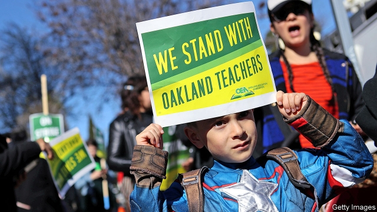

###### Civics 101

# California’s teachers’ strikes conceal a conflict of generations 

##### Teachers are striking over pay as pensions and health-care costs are eating up budgets 

 

> Feb 28th 2019 

“I LIKE CATS, unicorns and peace, but I love my teacher!” declares one sign, with two rainbows, held by a young pupil at Crocker Highlands Elementary School in Oakland on a weekday morning. She should have been at school, but instead she joined her mother and thousands of Oakland’s teachers outside City Hall. Oakland’s teachers are asking for higher salaries, support staff and more. Teachers in nearby Sacramento may be next to put down chalk and pick up placards. 

Such strikes have become a national phenomenon. Teachers in Los Angeles, Denver and West Virginia have gone on strike this year, after action in Arizona, Colorado, Kentucky, North Carolina and Oklahoma in 2018. Last year around 375,000 teachers and staff went on strike. They accounted for about three-quarters of the total number of American workers who downed tools. As a result, 2018 saw the highest number of workers involved in strikes since 1986. 

The complaints differ by school district, but one common refrain on picket lines is that teachers are not paid enough for their hard work. The wage gap between teachers and similarly educated workers has certainly widened since the mid-1990s. In many states teachers are paid less than other public-sector employees, such as prison guards and police officers. 

The financial crisis a decade ago caused some states to gut spending on education, suppressing teachers’ wages. Teachers in West Virginia and Oklahoma, where strikes have occurred, are among the worst-paid in the nation. In parts of California, where the average public-school teacher earns what might appear to be a plum salary of $79,000, around a third higher than the national average, the cost of living is an animating issue. Many teachers struggle to live without room-shares and within an hour’s commute of their schools. 

A Supreme Court decision has also played a part. Unions are particularly intent on proving their value to members after Janus v American Federation of State, County and Municipal Employees deemed it illegal to compel union dues from public employees. The strikes have helped unions “re-establish their relevance for younger members” after the Janus case, says Andy Rotherham of Bellwether Education Partners, a non-profit. 

Finally, the continued rise of charter schools is also fuelling protests. In 2016 around 6% of all American pupils attended a charter school, more than double the share in 2009. Along with private schools, charters are seen as responsible for declining enrolments, which deprive public-school districts of funds because they are paid per student. But the villainisation of charter schools is not the whole story. Behind the teachers’ strikes is a broader angst and frustration with the status quo, according to one superintendent of a large school district that has weathered a strike. 

The idea that school districts should quickly meet the demands of teachers may sound as uncontroversial as the rainbows and unicorns on the pupil’s sign in Oakland. But in many instances settling with teachers will not address the long-term problems facing public schools. 

Some school districts have been badly mismanaged. Oakland’s has been somewhere between $20m and $30m in debt for the past 15 years and has not taken the necessary steps to bring its costs into line with declining enrolment. Three-quarters of pupils qualify for free or cheaper lunches, which they get when schools are open, and rely on free tutoring to prepare them for the upcoming SAT exams, making the strikes there particularly painful. The district operates nearly twice as many schools as pupil numbers justify, but teachers who are striking oppose efforts to close any and reduce costs. A report from a civil grand jury last year chastised the district for a “laundry list of errors and poor decisions contributing to the fiscal crisis.” Settling the current strike by agreeing to salary increases and backing away from school closures would exacerbate the district’s various problems. 

Another issue that gets too little attention is the cost of retired teachers’ pensions and health-care costs, which are rising in many states, including California. In 2012 the state approved a 30% increase in income-tax rates, in part to fund schools more efficiently, but all the extra revenue went on pensions and health care for pensioners rather than on pupils or teachers’ salaries, according to David Crane of Govern for California, a non-partisan political outfit. The state could enact some reforms. For example, California, which educates 12% of America’s public-school pupils, chooses to subsidise health care for retired teachers and their families who could otherwise qualify for the Affordable Care Act (ACA) and Medicare. Eliminating that subsidy could save the state $2.6bn, allowing it to pay teachers more. In the Los Angeles Unified School District alone, this change would translate into around $10,000 more pay for every teacher, says Mr Crane. 

Young teachers are probably unaware that they are forgoing higher salaries to support pensions and benefits for their older peers, and it is not a topic that teachers tend to talk about. “The last thing unions want to introduce into the conversation is something their younger members would be pissed off about,” explains Mr Rotherham of Bellwether. 

Frustration with an underperforming system is not confined to schools. Unrest and dissatisfaction can be found in many corners of American life. But they risk eroding what could be a constructive conversation about how to reinvigorate public schools and do better by pupils. “My concern is that it’s become a political war of us versus them, versus doing right by our kids,” says Ted Lempert of Children Now, a non-profit. “We are breaking apart consensus and reframing the debate about education in a way that makes reforms harder.” 

-- 

 单词注释:

1.civic['sivik]:a. 市的, 市民的, 公民的 [法] 公民的, 市民的, 公民资格的 

2.unicorn['ju:nikɔ:n]:n. 似马的独角兽 [医] 单角的 

3.Crocker[]:n. (Crocker)人名；(英、葡)克罗克 

4.highland['hailәnd]:n. 高地, 苏格兰高地 

5.oakland['әuklәnd]:n. 奥克兰（美国加州西部城市） 

6.sacramento[,sækrә'mentәu]:n. 萨克拉门托（美国加州首府） 

7.placard['plækɑ:d]:n. 公告, 布告, 小牌, 海报 vt. 公布, 布告, 张帖, 贴海报于 

8.los[lɔ:s]:abbr. 月球轨道航天器（Lunar Orbiter Spacecraft）；视线（Line of Sight） 

9.angeles[]:n. 安杰利斯（姓氏）；天使城（菲律宾地名） 

10.Denver['denvә]:n. 丹佛(美国城市) 

11.Virginia[vә'dʒinjә]:n. 弗吉尼亚 

12.Arizona[æri'zәunә]:n. 亚利桑那州 

13.Colorado[,kɔlә'rɑ:dәu]:n. 科罗拉多, 科罗拉多河 

14.Kentucky[kәn'tʌki]:n. 肯塔基州 

15.Carolina[.kærә'lainә]:n. 北(或南)卡罗来纳州 

16.Oklahoma[.әuklә'hәumә]:n. 俄克拉何马 

17.refrain[ri'frein]:n. 重复的话, 叠句, 副歌 vi. 节制, 避免, 克制 

18.picket['pikit]:n. 桩, 尖桩, 警戒哨, 巡逻艇, 纠察队 vt. 围住, 警戒, 派...担任纠察 vi. 担任纠察 

19.les[lei]:abbr. 发射脱离系统（Launch Escape System） 

20.gut[gʌt]:n. 剧情, 内容, 内脏, 肚子, 海峡, 勇气 vt. 取出内脏, 毁坏...的内部 

21.suppress[sә'pres]:vt. 镇压, 使止住, 禁止, 抑制, 查禁 [法] 镇压, 平定, 禁止出版 

22.California[.kæli'fɒ:njә]:n. 加利福尼亚 

23.plum[plʌm]:n. 李子 

24.animate['ænimeit]:vt. 使有生气, 赋予生命 a. 有生命的, 有生气的 

25.commute[kә'mju:t]:vt. 交换, 折偿, 减轻 vi. 代偿, 经常乘车来往 

26.intent[in'tent]:n. 意图, 含义, 故意 a. 专心的, 决心的, 热心的 

27.Janus['dʒeinәs]:n. 杰纳斯两面神 [医] 双面联胎 

28.V[vi:]:[计] 溢出, 变量, 向量, 检验, 虚拟, 垂直 [医] 钒(23号元素) 

29.federation[fedә'reiʃәn]:n. 联邦, 联合, 联盟 [法] 联邦, 联盟, 联邦政府 

30.municipal[mju:'nisipl]:a. 市政的, 自治区的, 内政的 [经] 市政的, 市的 

31.deem[di:m]:v. 认为, 相信 

32.relevance['relivәns]:n. 中肯；关联；相关性 

33.andy['ændi]:n. 安迪（男子名, 等于Andrew） 

34.Rotherham['rɔðərəm]:n. 罗瑟勒姆（地名） 

35.bellwether['bel.weðә]:n. 系铃带头羊, 前导, 领导者 

36.charter['tʃɑ:tә]:n. 特许状, 执照, 宪章 vt. 特许, 发给特许执照 

37.enrolment[in'rәulmәnt]:n. 登记, 注册, 入伍, 入学, 入会, 注册人数, 入学人数 

38.deprive[di'praiv]:vt. 剥夺, 使丧失 [法] 剥夺, 剥夺, 夺去 

39.villainisation[]:[网络] 恶名 

40.angst[æŋst]:n. 焦虑, 疑惧 [医] 恐怖 

41.frustration[frʌs'treiʃәn]:n. 挫折, 顿挫 [医] 挫折 

42.statu[]:[网络] 状态查看；雕像；特级雪花白 

43.quo[]:vt. [古]说 

44.superintendent[,sju:pәrin'tendәnt]:n. 监督人, 主管人, 主日学校校长 [经] 监督人, 主管人(部门) 

45.quickly['kwikli]:adv. 很快地 

46.uncontroversial[]:a. 非争论性的；不会引起争论的 

47.mismanage[mis'mænidʒ]:vt. 处置失当, 对...管理不善 

48.upcoming['ʌp.kʌmiŋ]:a. 即将来临的, 即将出现的 

49.chastise[tʃæ'staiz]:vt. 责骂, 惩罚 [法] 责罚, 惩戒, 严惩 

50.fiscal['fiskәl]:a. 财政的, 国库的 [经] 财政上的, 会计的, 国库的 

51.closure['klәuʒә]:n. 关闭 vt. 使终止 

52.exacerbate[ek'sæsәbeit]:vt. 使恶化, 使增剧, 激怒, 使加剧 

53.efficiently[i'fiʃәntli]:adv. 生效, 能胜任, 有能力, 效率高, 有效 

54.pensioner['penʃәnә(r)]:n. 领取抚恤金者, (英国剑桥大学的)自费生, 为金钱所收买的人, 帮佣 [法] 领取退休金者, 领取抚恤金者 

55.david['deivid]:n. 大卫；戴维（男子名） 

56.outfit['autfit]:n. 用具, 配备, 机构 vt. 配备, 供应 vi. 得到装备 

57.enact[i'nækt]:vt. 制定法律, 扮演, 颁布 [法] 法令, 法规, 条例 

58.subsidise[]:vt. 给...补助金, 津贴, 资助 

59.affordable[]:[计] 普及型 

60.ACA[]:[计] 美国通信协会, 美国密码通信协会, 异步通信适配器 

61.medicare['medi,keә]:n. 医疗照顾方案, 医疗照顾项目 [法] 公办的医疗保险制 

62.unify['ju:nifai]:v. 统一, 使成一体 

63.unaware[.ʌnә'wєә]:a. 未认识到的, 不知道的 [法] 不知道的, 不察觉的, 无意的 

64.forgo[fɒ:'gәu]:vt. 摒绝, 放弃 

65.peer[piә]:n. 同等的人, 匹敌, 贵族 vi. 凝视, 窥视, 费力地看, 隐现 vt. 与...同等, 封为贵族 

66.piss[pis]:vi. 小便, 下大雨, 抱怨 vt. 撒尿弄脏, 尿在...上 n. 小便 

67.frustration[frʌs'treiʃәn]:n. 挫折, 顿挫 [医] 挫折 

68.underperform[,ʌndәpә'fɔ:m]:vi.表现不佳,工作不如预期(或同行) vt.(股票等)运作差于(一般市场价格) 

69.dissatisfaction['dis.sætis'fækʃәn]:n. 不满, 不平 

70.erode[i'rәud]:vt. 腐蚀, 侵蚀 vi. 受腐蚀 

71.constructive[kәn'strʌktiv]:a. 建设性的, 构造上的 [医] 构成的 

72.reinvigorate[.ri:in'vigәreit]:vt. 使再振作, 使复兴 

73.versus['vә:sәs]:prep. 对... [法] 诉, 对, 相形 

74.ted[ted]:vt. 翻晒 

75.Lempert['lemp\\:t]:operation [医](耳科手术中的) 开窗术 ( 亦作 Lempert'soperation) 

76.reframe['ri:'freim]:vt. 再构造, 重新制订, 再组织, 给...装上新框架 

