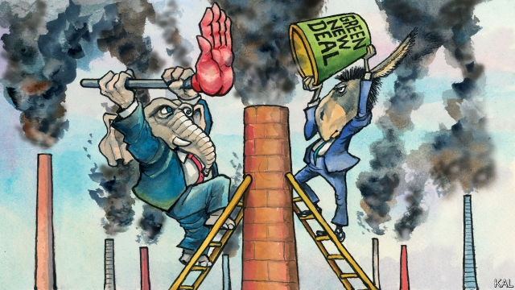

###### Lexington

# Imagine there’s no politics 

##### It’s easy if you try. But it’s not a good way for Democrats to devise badly needed climate policy 

 

> Feb 28th 2019 

NOW INTO its 26th season, the self-parody act that is the Republican Party on global warming is still playing to a loyal audience. With the nomination of Kelly Knight Craft to be ambassador to the UN, Americans can expect to be represented in the world’s premier climate-policy forum by the wife of a billionaire coal magnate and Trump donor who claims to admire “both sides of the science” on global warming. Reports meanwhile emerged of a White House scheme to commission a panel of sceptics to attack the government’s own National Climate Assessment. The latest iteration of this quadrennial review of America’s changing climate, launched in 1990 by George H.W. Bush—the last Republican leader to play it straight on global warming—irked Donald Trump. Released in November, while California was battling its worst wildfire of modern times, it did not support the president’s claim that insufficient “raking” of the forest floor was to blame. 

No wonder many Democrats want to cut the Republicans out of climate policymaking altogether. Their two past attempts to curb greenhouse-gas emissions—a legislative effort in 2009 and the regulatory steps taken by Barack Obama—both foundered on Republican resistance. The first, the Waxman-Markey cap-and-trade bill, passed the House but was not taken up in the Senate after the Democrats lost their 60-vote majority there. The second is being dismantled by the fossil-fuel lobbyists Mr Trump hired to run the Environmental Protection Agency. The Democrats’ nascent third effort, the Green New Deal (GND) championed by Representative Alexandria Ocasio-Cortez and endorsed by Kamala Harris and other presidential hopefuls, is therefore designed differently. It is intended to have the durability of legislation, but to be so broadly appealing to Democrats it can be passed without Republican support. 

Thus its main innovation: targeting climate change and social inequities together. A blueprint released by Ms Ocasio-Cortez and Senator Ed Markey, one of the architects of the 2009 bill, promises universal health care and affordable housing, as well as extremely steep emissions cuts. This has been viewed as a naive effort to cure all the ills of modern capitalism at a stroke. Yet it is also intended, in theory more pragmatically, to expand Democratic support for emissions cuts by harnessing the two main parts of the party’s coalition: college graduates who want climate-change policy and blue-collar workers whose jobs are threatened by it. Resistance from those workers’ representatives—for example Joe Manchin of West Virginia, the ranking Democrat on the Senate energy committee—was another reason why Waxman-Markey failed. The social policy in the GND blueprint is designed to win them over. 

The enthusiasm the green deal has generated, from the climate activists who invaded Mitch McConnell’s Senate office this week as well as the 2020 contenders, is testament to more than Ms Ocasio-Cortez’s salesmanship. Its emissions targets, which would include decarbonising electricity generation within a decade, are at once vastly ambitious and merely commensurate with what scientists recommend. That makes it hard for anyone concerned about global warming to gainsay the proposal. It has a powerful moral allure. Yet the gravity of climate change also means the world cannot afford another failed effort by America to curb its tide of carbon pollution. And the green deal appears to have no chance of success. 

Only a unified Democratic government—with a filibuster-proof majority or no filibuster to worry about—could entertain passing it. This is not simply because the climate-related proposals in Ms Ocasio-Cortez’s draft are left-wing. In fact, by allowing a possible role for carbon pricing, nuclear power and carbon capture-and-storage, they are more moderate than many activists would like. A bigger problem is that by lumping together climate and social policy the proposal appears to confirm one of the main Republican arguments for inaction on global warming: a contention that Democrats are using the issue as a smokescreen for a left-wing economic agenda. This has hitherto been an exaggeration; Democrats have been pushing carbon pricing, a market-based solution, for a decade. Yet the green deal provides compelling evidence for it, which makes the prospects of Republicans returning to sanity on global warming even more remote. 

It might therefore seem sensible that the deal’s architects are only counting on Democratic votes. Yet moderates such as Mr Manchin—who says the GND is “not a deal, it’s a dream”—seem unlikely to support it. The proposal is already being used to attack such Democrats in rural states with lots of extractive industries. Opposing it would offer them a relatively low-cost opportunity to define themselves against their party. It is therefore hard to imagine anything resembling Ms Ocasio-Cortez’s blueprint passing into law. And if it did, Republicans would unite to overturn it, just as they did in response to Mr Obama’s much less provocative health-care reform. The inconvenient truth for Democrats is that they cannot impose their policies by legislative fiat any more than Mr Obama could do so by executive order. 

It is a tough conclusion, because the prospects for bipartisan climate action are modest at best. And it would be hard to maintain enthusiasm on the left for the incremental steps, such as limited carbon pricing, such action might entail. While privately conceding the unreality of the green deal, some Democratic lawmakers therefore view it as a powerful slogan, to be replaced by more achievable policy in due course. That could make tactical sense, if it helps ensure the next Democratic president prioritises the issue. But it risks underestimating how hard it will be to pass any serious climate policy. Opposition politicians who duck the painstaking work of developing credible policy are liable to come to power with no serious plan—as the Republicans demonstrated in their opposition to Obamacare. It is an example Ms Ocasio-Cortez and her supporters are closer to emulating than they think. 

-- 

 单词注释:

1.lexington['leksiŋtәn]:n. 列克星敦市（位于美国肯塔基州） 

2.politic['pɒlitik]:a. 精明的, 明智的, 策略的 

3.democrat['demәkræt]:n. 民主人士, 民主主义者, 民主党党员 [经] 民主党 

4.nomination[.nɒmi'neiʃәn]:n. 提名, 任命, 提名权 

5.Kelly['keli]:n. 凯利（男子名）；[古]战士 

6.knight[nait]:n. 骑士, 爵士 vt. 授以爵位 

7.UN[ʌn]:pron. 家伙, 东西 [经] 联合国 

8.forum['fɒ:rәm]:n. 论坛, 公开讨论的广场, 法庭, 讨论会 [法] 讨论会, 专题讨论, 公共论坛 

9.billionaire[.biljә'nєә]:n. 亿万富翁 

10.magnate['mægneit]:n. 大官, 巨头 [法] 大官, 权贵, 大资本家 

11.trump[trʌmp]:n. 王牌, 法宝, 喇叭 vt. 打出王牌赢, 胜过 vi. 出王牌, 吹喇叭 

12.donor['dәunә]:n. 捐赠人 [化] 给体; 供体 

13.sceptic['skeptik]:n. 怀疑论者 

14.iteration[.itә'reiʃәn]:n. 重复, 反复说的话 [计] 迭代 

15.quadrennial[kwɔ'drenjәl]:a. 连续四年的, 每四年一次的 n. 第四周年 

16.george[dʒɔ:dʒ]:n. 乔治（男子名）；自动操纵装置；英国最高勋爵勋章上的圣乔治诛龙图 

17.hw[]:abbr. 半波（Half Wave）；热水（hot water）；硬件（Hardware） 

18.donald['dɔnәld]:n. 唐纳德（男子名） 

19.California[.kæli'fɒ:njә]:n. 加利福尼亚 

20.wildfire['waildfaiә]:n. (古时战争时所用的)燃料剂, 磷火, 鬼火, 野火 

21.policymaking['pɔlәsi,meikiŋ]:[法] 政策制定者, 决策人 

22.curb[kә:b]:n. 抑制, 勒马绳, 边石 vt. 抑制, 束缚, 勒住 

23.legislative['ledʒislәtiv]:n. 立法机构 a. 立法的, 有立法权的 

24.regulatory['regjulәtәri]:a. 受控制的, 统制的, 调整的 [经] 规则的 

25.barack[bɑ:'ræk]:n. 巴拉克（男子名） 

26.founder['faundә]:n. 创立者, 建立者 vt. 使沉没, 使摔倒, 弄跛, 浸水, 破坏 vi. 沉没, 摔到, 变跛, 倒塌, 失败 

27.dismantle[dis'mæntl]:vt. 拆除...的设备, 分解, 去除覆盖物 

28.lobbyist['lɔbiist]:n. 说客 [法] 院外活动集团成员 

29.environmental[in.vaiәrәn'mentәl]:a. 周围的, 环境的 [经] 环境的, 环保的 

30.nascent['næsnt]:a. 发生中的, 开始存在的, 初期的 [医] 初发的, 初生的 

31.GND[]:[计] 地, 接地 

32.alexandria[,æli^'zɑ:ndriә]:n. 亚历山大港（位于埃及）；亚历山大市（美国弗吉尼亚一城市）；亚历山大大帝 

33.endorse[in'dɒ:s]:vt. 支持, 赞同, 背书于, 签署 [经] 赞成, 背书 

34.kamala[kә'meilә]:n. [植] 粗糠柴 

35.harris['hæris]:n. 哈里斯（英国苏格兰一地区）；哈里斯（姓氏） 

36.presidential[.prezi'denʃәl]:a. 总统制的, 总统的, 首长的, 统辖的 [法] 总统的, 议长的, 总经理的 

37.differently['difrentli]:adv. 差异, 不同, 各别, 各种 

38.durability[,djuәrә'biliti]:[计] 耐久性, 耐用性, 持久性 

39.broadly['brɒ:dli]:adv. 宽广地, 明白地, 无礼貌地 

40.inequity[in'ekwiti]:n. 不公平, 不公正 

41.blueprint['blu:'print]:n. 蓝图, 设计图, (周详的)计划 vt. 制成蓝图, 计划 

42.senator['senәtә]:n. 参议员, (某些大学的)理事 [法] 参议员, 上议员 

43.ED[]:[计] 电子设备, 密码设备, 数据结束, 工程设计, 错误检测, 外部设备 

44.markey[]: [人名] [爱尔兰姓氏] 马基盖尔语姓氏的英语形式，来源于别名，含义是“骑士”(knight,horseman) 

45.affordable[]:[计] 普及型 

46.emission[i'miʃәn]:n. 发射, 射出, 发行 [医] 发射, 遗精 

47.naive[nɑ:'i:v]:a. 天真的, 纯真的, 幼稚的 

48.capitalism['kæpitәlizәm]:n. 资本主义 [经] 资本主义 

49.pragmatically[præg'mætikəli]:adv. 讲究实效地；实用主义地 

50.joe[dʒәu]:n. 乔（男子名） 

51.manchin[]:[网络] 西弗吉尼亚州州长曼基 

52.Virginia[vә'dʒinjә]:n. 弗吉尼亚 

53.democrat['demәkræt]:n. 民主人士, 民主主义者, 民主党党员 [经] 民主党 

54.activist['æktivist]:n. 激进主义分子 

55.mitch[mitʃ]:vi. [方言]逃学 

56.contender[kәn'tendә(r)]:n. 参赛者, 争论者, 斗争者, 竞争者 

57.testament['testәmәnt]:n. 遗嘱, <<圣约书>> [法] 遗言, 遗嘱, 确实的证明 

58.salesmanship['seilzmәnʃip]:n. 售货, 售货术, 推销, 推销术, 游说, 游说术, 善于推销 [经] 推销术, 售货术 

59.decarbonise[,di:'kɑ:bənaiz]:vt. [主英国英语] =decarbonize[亦作decarburise] 

60.vastly['vɑ:stli]:adv. 广大地, 许多, 巨大 

61.ambitious[æm'biʃәs]:a. 有野心的, 抱负不凡的, 雄心勃勃的 

62.commensurate[kә'menʃәrit]:a. 同量的, 同等的, 相称的 

63.gainsay[gein'sei]:vt. 否定, 反驳 n. 否认, 反驳, 反对 

64.allure[ә'luә]:vt. 引诱, 吸引 n. 魅力, 诱惑力 

65.cannot['kænɒt]:aux. 无法, 不能 

66.unify['ju:nifai]:v. 统一, 使成一体 

67.filibuster['filibʌstә]:n. 阻挠议事的活动, 掠夺兵, 暴兵, 海盗 vi. 掠夺 vt. (以冗长的演说)阻碍议案通过 

68.inaction[in'ækʃәn]:n. 不活动, 无为, 怠惰, 迟钝 [医] 无作用 

69.contention[kәn'teinʃәn]:n. 争论, 争辩, 所持的论点 [计] 争用 

70.smokescreen[]:n. 烟幕, 掩盖某人真实意图的东西 

71.hitherto[.hiðә'tu:]:adv. 迄今, 至今 

72.exaggeration[ig.zædʒә'reiʃәn]:n. 夸张, 夸大的事物, 夸大之词 

73.sanity['sæniti]:n. 神智健全, 头脑清楚, 通情达理 [医] 精神健全 

74.extractive[ik'stræktiv]:a. 引得出的, 萃取的, 抽取的 n. 抽出物, 精, 熬汁 

75.overturn[.әuvә'tә:n]:n. 倾覆, 破灭, 革命 vt. 推翻, 颠倒 vi. 翻倒 

76.les[lei]:abbr. 发射脱离系统（Launch Escape System） 

77.provocative[prә'vɒkәtiv]:a. 激发感情的, 挑拨的, 刺激的 n. 刺激物, 挑拨物, 兴奋剂 

78.inconvenient[.nkәn'vi:njәnt]:a. 不便的, 有困难的 

79.fiat['faiæt]:n. 命令, 严命, 许可 [医] 制成, 作成 

80.obama[]:n. 奥巴马(姓) 

81.bipartisan[bai,pɑ:ti'zæn]:a. 两党连立的 

82.incremental[.inkri'mentl]:a. 增加的, 增值的 [经] 增长的, 增量的 

83.entail[in'teil]:vt. 使成为必需, 需要, 使承担, 遗传给 n. 限定继承 

84.privately[]:adv. 秘密地；私下地 

85.concede[kәn'si:d]:vt. 承认, 退让 vi. 让步 

86.unreality[.ʌnri'æliti]:n. 不真实, 非现实, 不存在之物 

87.lawmaker[lɒ:'meikә]:n. 立法者 

88.achievable[ә'tʃi:vәbl]:a. 做得成的, 可完成的, 可有成就的 

89.tactical['tæktikl]:a. 战术的, 用兵上的, 策略的 

90.prioritise[praɪ'ɒrəˌtaɪz]:vt. 给予…优先权; 按优先顺序处理; 出轻重缓急 vi. 把事情按优先顺序排好（等于prioritize） 

91.underestimate[.ʌndәr'estimeit]:n. 低估 vt. 低估, 看轻 

92.opposition[.ɒpә'ziʃәn]:n. 反对, 敌对, 相反, 在野党 [医] 对生, 对向, 反抗, 反对症 

93.painstaking['peinzteikiŋ]:n. 辛苦, 苦心, 工夫 a. 辛苦的, 勤勉的, 小心的 

94.credible['kredәbl]:a. 可信的, 可靠的 [法] 可信的, 可靠的 

95.opposition[.ɒpә'ziʃәn]:n. 反对, 敌对, 相反, 在野党 [医] 对生, 对向, 反抗, 反对症 

96.obamacare[]: 奥巴马医改计划 

97.supporter[sә'pɒ:tә]:n. 支持者, 后盾, 迫随者, 护身织物 [法] 支持者, 赡养者, 抚养者 

98.emulate['emjuleit]:vt. 效法, 尽力赶上, 同...竞争 [计] 仿真 

