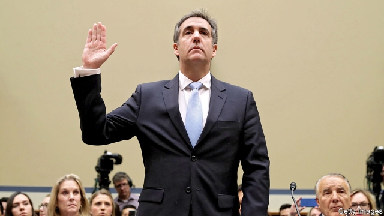

###### Nothing but the truth

# Michael Cohen’s turn in the barrel 

##### The testimony from the president’s former fixer was at once familiar and shocking 

 

> Feb 28th 2019 

FOR TEN years, Michael Cohen was Donald Trump’s attack dog. By his own estimate, the president’s former fixer threatened more than 500 people or entities at Mr Trump’s request. But in sworn testimony before the House Oversight Committee on February 27th, and armed with documents to bolster several striking accusations, Mr Cohen called his former boss “a racist…a con man [and] a cheat” who is “fundamentally disloyal” and a threat to American democracy. The parties’ responses to his testimony hinted at how they will respond to Robert Mueller’s imminently expected report, providing a preview of the political battles likely to rage for the rest of Mr Trump’s term. 

None of Mr Cohen’s accusations were entirely new. But hearing them made openly before Congress, under penalty of perjury, crystallised how extraordinary they are. Mr Cohen said that Mr Trump knew in advance—courtesy of Roger Stone, a political consultant who had been urging Mr Trump to seek the presidency for decades—that WikiLeaks would release stolen emails damaging to Hillary Clinton’s campaign. That may have violated federal campaign-finance law, which bars Americans from accepting any “thing of value” from foreign nationals. More importantly, it would make the campaign complicit in an attack by a foreign intelligence service. 

Mr Cohen also entered into evidence a pair of cheques—one signed by Mr Trump from his personal account and the other from his trust account, each for $35,000, both from 2017, after he took office—which he said were reimbursements for hush money paid to a pornographic-film actress. Mr Cohen says that as late as February 2018, Mr Trump told Mr Cohen to say that he did not know about these payments. 

He also brought three financial-disclosure statements to illustrate his claim that Mr Trump inflated his net worth when he wanted people to think he was rich, and deflated it to minimise his taxes. In 2012-13, according to the statements, his net worth rose from $4.6bn to $8.7bn—due largely to his “brand value”, which Mr Trump did not mention in 2012 but by 2013 was somehow worth $4bn. Questioned by Alexandria Ocasio-Cortez, who showed that she was almost as effective an interrogator as she is a tweeter, Mr Cohen said that Mr Trump also inflated the value of his assets to an insurance firm, which would count as fraud. 

Mr Cohen said Mr Trump, “knew of and directed the Trump Moscow negotiations throughout the campaign and lied about it.” He said he briefed Mr Trump, as well as Donald junior and Ivanka, about the project around ten times in 2016. Mr Cohen said he knew of no “direct evidence that Mr Trump or his campaign colluded with Russia.” But, he said, “I have my suspicions,” noting that Mr Trump’s desire to win at all costs made it conceivable that he would collude with a foreign power. 

Republicans on the committee did not really defend the president from these accusations. Instead, they implied that Mr Cohen’s testimony was some sort of plot to land a lucrative book or film contract. And they impugned his character, noting that he was convicted of lying to Congress, among other things, and will soon begin a three-year prison sentence. But literary glory aside, it is unclear what Mr Cohen’s motivation to lie to Congress again would be—particularly as Mr Mueller’s office was certainly watching, and would doubtless have charged him again had he done so. 

Mr Trump can take comfort in the Justice Department policy, which warns against indicting a sitting president. And campaign-finance convictions are hard to win. In 2012 federal prosecutors failed to convict John Edwards, a Democratic politician, for spending donor funds on hush-money payments to a mistress. 

Still, Mr Cohen accused the president of conduct more serious than that which led to impeachment for Bill Clinton (lying about an extramarital affair), and which is comparable to Richard Nixon’s (covering-up a break-in at Democratic headquarters). For Mr Trump, that ending remains a long way off. While he has solid Republican support, Democrats will shy away from impeachment. But the prospect is closer now than it was before Mr Cohen testified. 

-- 

 单词注释:

1.michael['maikl]:n. 迈克尔（男子名） 

2.testimony['testimәni]:n. 证言, 证据, 声明 [医] 证据 

3.fixer['fiksә]:n. 定色剂, 定影剂, 毒贩子 [化] 定影剂; 定香剂; 固色剂; 固着剂; 固定剂 

4.cohen['kәuin]:科恩（姓氏） 

5.donald['dɔnәld]:n. 唐纳德（男子名） 

6.entity['entiti]:n. 实体, 实存物, 存在 [计] 实体 

7.oversight['әuvәsait]:n. 勘漏, 失察, 失败, 照料 [经] 监督权 

8.bolster['bәulstә]:n. 支持, 长枕 vt. 支持, 支撑 

9.accusation[ækju:'zeiʃәn]:n. 控告, 指控, 指责 [法] 控告, 起诉, 告发 

10.con[kɒn]:vt. 精读, 仔细研究, 默记 adv. 反面地, 从反面 a. 欺诈的 n. 反对者, 反对票, 肺结核 [计] 控制台 

11.fundamentally[fʌndә'mentәli]:adv. 基础, 首要, 主要, 十分重要, 基本, 根本, 原始, 基频, 基音, 基谐波 

12.disloyal[dis'lɒiәl]:a. 不实的, 不义的, 不忠的 

13.Robert['rɔbәt]:[法] 警察 

14.imminently['ɪmɪnəntlɪ]:adv. 迫切地, 紧急地 

15.entirely[in'taiәli]:adv. 完全, 全然, 一概 

16.openly['әjpәnli]:adv. 公开地, 坦率地, 直率地, 公然地 

17.penalty['penәlti]:n. 处罚, 刑罚, 罚款, 罚球, 报应, 不利结果, 妨碍 [经] 罚金(款), 违约金 

18.perjury['pә:dʒәri]:n. 伪誓, 伪证, 背信弃义 [经] 伪证, 假的证据 

19.crystallise['kristәlaiz]:vi.vt. (使)结晶, (使)定形, 明朗化, (使)具体化 vt. 给裹上糖屑 

20.trump[trʌmp]:n. 王牌, 法宝, 喇叭 vt. 打出王牌赢, 胜过 vi. 出王牌, 吹喇叭 

21.roger['rɔdʒә]:interj. 对!, 行!, 好! 

22.presidency['prezidәnsi]:n. 总统职权, 总裁职位 

23.wikileaks[]: 维基解密 

24.Hillary['hiləri:]:n. 希拉里（美国现任国务卿） 

25.importantly[]:adv. 重要地；大量地；有名望地；自命不凡地 

26.complicit[kәm'plisit]:a. 有同谋关系的,串通一气的[由 complicity 逆构] 

27.reimbursement[.ri:im'bә:smәnt]:n. 付还, 退还 [经] 偿付, 赔还 

28.hush[hʌʃ]:n. 肃静, 安静, 沉默 vt. (使)肃静, (使)安静, (使)缄默 interj. 嘘, 别作声 

29.inflate[in'fleit]:vt. 使膨胀, 使得意, 使通货膨胀, 使充气 vi. 充气, 膨胀 

30.deflate[di'fleit]:vt. 放气, 抽出空气, 使缩小 vi. 缩小 

31.minimise[]:vt. 使减到最少/最小, 使降到最低限度, 使缩到最小, 极度轻视 

32.alexandria[,æli^'zɑ:ndriә]:n. 亚历山大港（位于埃及）；亚历山大市（美国弗吉尼亚一城市）；亚历山大大帝 

33.interrogator[in'terәugeitә]:n. 讯问者, 质问者 [电] 询问机 

34.tweeter['twi:tә]:n. 高频扬声器 [电] 高频扬声器 

35.asset['æset]:n. 资产, 有益的东西 

36.fraud[frɒ:d]:n. 欺骗, 欺诈, 诡计, 骗子 [经] 欺诈, 舞弊, 骗子 

37.negotiation[ni.gәuʃi'eiʃәn]:n. 谈判, 磋商, 交涉 [经] 谈判, 协商 

38.ivanka[]:[网络] 伊凡卡；伊万卡；伊凡佳 

39.collude[kә'lu:d]:vi. 共谋, 串通, 勾结 

40.conceivable[kәn'si:vәbl]:a. 想得到的, 可想象的, 可理解的 

41.lucrative['lu:krәtiv]:a. 有利益的, 获利的, 合算的 

42.impugn[im'pju:n]:vt. 责难, 抨击, 攻击 [法] 驳斥, 指责, 非难 

43.convict[kәn'vikt]:n. 囚犯, 罪犯 vt. 宣告有罪, 使知罪 

44.unclear[.ʌn'kliә]:a. 不易了解的, 不清楚的, 含混的 

45.indict[in'dait]:vt. 起诉, 控告, 指控 [法] 控告, 揭发, 对...起诉 

46.conviction[kәn'vikʃәn]:n. 定罪, 信服, 坚信 [法] 定罪, 证明有罪, 判罪 

47.prosecutor['prɒsikju:tә]:n. 实行者, 告发者, 公诉人 [法] 原告, 起诉人, 检举人 

48.john[dʒɔn]:n. 盥洗室, 厕所, 嫖客 

49.edward['edwәd]:n. 爱德华（男子名） 

50.donor['dәunә]:n. 捐赠人 [化] 给体; 供体 

51.impeachment[im'pi:tʃmәnt]:[法] 控告, 检举, 弹劾 

52.clinton['klintәn]:n. 克林顿（男子名） 

53.extramarital[.ekstrә'mæritl]:a. 婚外的 [法] 私通的, 通奸的 

54.richard['ritʃәd]:n. 理查德（男子名） 

55.headquarter[,hed'kwɔ:tә]:vt. 将...的总部设在 

56.democrat['demәkræt]:n. 民主人士, 民主主义者, 民主党党员 [经] 民主党 

57.testify['testifai]:v. 证明, 作证, 声明, 表明 

