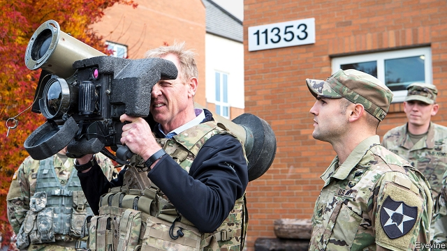

###### Bringing out the big guns

# The Pentagon changes its focus to Russia and China 

##### After 18 years of IEDs in the Middle East, America’s armed forces are planning for high-tech warfare 

 

> Feb 28th 2019 

PATRICK SHANAHAN draws his finger down a list of his priorities for the Pentagon: hypersonics, directed energy, space, cyber, quantum science and autonomy. It could not be further from the dusty battlegrounds of the past 18 years. “When we talk about space, this is not designed for counter-terrorism,” he says. Mr Shanahan, a former Boeing executive, was propelled into the job of secretary of defence in January, having served as understudy to James Mattis for less than 18 months. He has taken the helm of an organisation that is in the throes of change, as it prepares for life after the wars in Iraq and Afghanistan. 

In January 2018 the Trump administration published its National Defence Strategy (NDS). Officials lamented that nearly two decades of whack-a-mole against insurgents and jihadists had eroded the country’s military edge, resulting in exhausted and under-trained units armed for the wrong enemy. So the NDS decreed that America would henceforth focus on “long-term, strategic competition between nations”—namely, China and Russia. Mr Shanahan was charged with implementing the vision while Mr Mattis travelled around the world calming ruffled allies. 

“This is the first time since the Reagan era where the United States has been motivated to modernise its war-fighting architecture, its technologies,” says Michael Griffin, the Pentagon’s technology chief. “The first time we’ve been forced to think about how we fight war.” 

One priority is to re-tool the armed forces with the weapons they need. Mr Griffin paints a picture of each service wielding its own ultra-fast and long-range hypersonic missiles, fed information from a vast satellite network girdling the skies, all of it supported by a procurement process that can spit out high-tech weapons in years rather than decades. 

David Norquist, Mr Shanahan’s acting deputy and the Pentagon’s finance chief, points to rising investments in firepower-heavy platforms, like the Virginia-class submarine and new B21 bomber. But he also acknowledges that big planes and ships may not survive for long under a hailstorm of Chinese or Russian missiles. So money is also going to larger numbers of smaller, cheaper and dispersible platforms—like an unmanned boat. 

The second priority is ensuring that the armed forces not only have the arms they need, but also the training and readiness to use them in the sort of fighting they would face in eastern Europe and the western Pacific. Disaster relief is nice, says one general, but “this is a warfighting operation.” Ryan McCarthy, undersecretary of the army, says that half his brigade combat teams—freed from what was an intense pace of deployments—are now at the highest level of readiness, up from a small fraction of that two years ago. Basic training is being increased from 14 to 22 weeks. 

Training and exercise scenarios are adapting, too. They increasingly reflect “large force-on-force conflict against very high-end adversaries,” says John Rood, the Pentagon’s policy chief. Soldiers who once practised dealing with terrorists’ roadside bombs now drill in dodging enemy air strikes or chemical weapons. The army is raising new battalion-sized forces, one apiece for Russia and China, which integrate cyber, electronic warfare and space capabilities—skills that were lost or neglected in the counter-insurgency years. 

A third focus is changing what the Pentagon actually does with its troops, planes and ships. “The basic concept”, says Mr Rood, “is that we’re going to give priority to the Indo-Pacific.” He points out that 2018 saw the longest absence of an aircraft carrier from the Persian Gulf since 2001; two carriers were instead sent to the Pacific. 

A working group at the joint staff has been poring through 150-odd “global execution orders” (directives to commanders around the world) that have accumulated over the years, weeding out those which do not fit with the NDS’s focus on great power competition. Seven out of eight advise-and-assist missions in Africa Command have already been cut. Central Command, which covers everything from Egypt to Pakistan, will have more fat shaved off. 

But rebalancing is only part of the story. The most significant element of the NDS, says Mr Shanahan, is “dynamic force employment” (DFE in mil-speak). That refers to moving forces around the world quickly and unpredictably to bamboozle adversaries. Last year, for instance, the USS Harry S. Truman, an aircraft-carrier that usually hangs around the Middle East, was abruptly called home midway through her deployment cycle and then suddenly sailed into the Arctic Circle—the first carrier to do so in 27 years—to join massive NATO exercises. For a carrier, whose movements are planned years ahead, that is warp-speed. Similar surprise deployments of bombers, fighter aircraft and surface-to-air missiles are being planned under DFE. 

Despite all this, insiders grumble that civilians have not forced services to change spending patterns drastically enough. Rear-Admiral Mark Montgomery, former policy director for the Senate Armed Services Committee, is concerned that the army is still buying too many vehicles initially designed for low-end war, such as light tanks. Chris Brose, the committee’s former staff director, says the Pentagon is not doing anywhere near enough to develop, build and test the huge numbers of autonomous, unmanned systems it needs. 

Mr Shanahan urges sceptics to wait for the 2020 budget, which he has called “a masterpiece”. “What you’ll see in these budgets is a sizeable investment in these critical technologies and programmes, whether it’s autonomy, artificial intelligence, hypersonics, cyber. The critics haven’t had exposure to those plans yet.” He adds, coyly, that “there’s a good portion of the budget you won’t ever see”, implying that more radical efforts may be buried in classified spending. And he is confident that he can remould a 700,000-strong bureaucracy. “People like myself, we spend our whole life implementing. We know how to move large organisations. We know where to place our bets.” 

-- 

 单词注释:

1.pentagon['pentәgәn]:n. 五角形, 五边形 [经] 五角平台 

2.IED[]:abbr. 瞬间弹性变形（Instantaneous Elastic Deformation）；工程设计师学会（Institution of Engineering Designers） 

3.warfare['wɒ:fєә]:n. 战争, 战斗, 交战, 斗争, 竞争 [法] 战事, 作战, 交战 

4.patrick['pætrik]:n. 帕特里克（男子名） 

5.Shanahan[]:n. (Shanahan)人名；(英)沙纳汉 

6.hypersonics[,haipә'sɔniks]:特超声(速空气动力)学 

7.cyber['saibә]:a. 网络的, 计算机的 

8.quantum['kwɒntәm]:n. 量, 量子 [计] 量子 

9.autonomy[ɒ:'tɒnәmi]:n. 自治, 自治权 [医] 自主性 

10.Shanahan[]:n. (Shanahan)人名；(英)沙纳汉 

11.boe[bəu]:abbr. back outlet eccentric 后偏心（轮）出口 

12.propel[prәu'pel]:vt. 推进, 驱使 [机] 推进 

13.understudy['ʌndәstʌdi]:n. 预备演员, 替角 vt. 通过观察掌握某工作, 通过实习掌握某工作 vt.vi. 练习当替角 

14.jame[]: 灰岩井 

15.matti[]:n. (Matti)人名；(法、意、芬、以、瑞典)马蒂 

16.les[lei]:abbr. 发射脱离系统（Launch Escape System） 

17.helm[helm]:n. 舵, 驾驶盘, 枢机, 头盔 vt. 给...掌舵, 指挥, 给...戴头盔 

18.organisation[,ɔ: ^әnaizeiʃən; - ni'z-]:n. 组织, 团体, 体制, 编制 

19.throe[θrәu]:n. 剧痛, 阵痛 [医] 剧痛 

20.Iraq[i'rɑ:k]:n. 伊拉克 

21.Afghanistan[æf'gænistæn]:n. 阿富汗 

22.trump[trʌmp]:n. 王牌, 法宝, 喇叭 vt. 打出王牌赢, 胜过 vi. 出王牌, 吹喇叭 

23.ND[]:北达科地 [医] 钕(60号元素) 

24.lament[lә'ment]:n. 悲叹, 悔恨, 恸哭, 挽歌, 悼词 vt. 哀悼 vi. 悔恨, 悲叹 

25.insurgent[in'sә:dʒәnt]:a. 谋叛的, 起义的, 澎湃的 n. 起义者, 叛乱者 

26.jihadist[]:n. 伊斯兰圣战士 

27.erode[i'rәud]:vt. 腐蚀, 侵蚀 vi. 受腐蚀 

28.decree[di'kri:]:n. 法令, 判决, 天意 vt. 颁布, 判决 vi. 发布命令 

29.henceforth[hens'fɒ:θ]:adv. 自此以后, 今后 

30.ruffle['rʌfl]:n. 皱褶, 波纹, 生气, 混乱 vt. 弄皱, 触怒, 洗(牌), 连续轻擂(鼓) vi. 起皱, 发脾气, 连续轻擂 

31.ally['ælai. ә'lai]:n. 同盟者, 同盟国, 助手 vt. 使联盟, 使联合, 使有关系 vi. 结盟 

32.reagan[]:n. 里根（姓氏） 

33.modernise['mɔdәnaiz]:vt.vi. (使)现代化, (使)适应现代需要 vi. 用现代方法 

34.michael['maikl]:n. 迈克尔（男子名） 

35.griffin['^rifin]:n. 新手, 未经世故的人 

36.wield[wi:ld]:vt. 挥舞, 运用 

37.hypersonic[.haipә'sɒnik]:a. 极超音速的, 以高超声速行进的 [化] 特超声速的; 高超声速的 

38.girdle['gә:dl]:n. 腰带, 围绕物 vt. 用腰带束缚, 围绕 

39.procurement[prә'kjuәmәnt]:n. 获得 [经] 采购 

40.david['deivid]:n. 大卫；戴维（男子名） 

41.norquist[]:[网络] 诺奎斯特 

42.bomber['bɒmә]:n. 轰炸机, 投弹手 

43.hailstorm['heilstɒ:m]:n. 雹暴 

44.dispersible[]:[医] 可分散的 

45.unman[.ʌn'mæn]:vt. 使失去男子气概, 使怯懦, 使气馁 

46.readiness['redinis]:n. 预备, 准备, 敏捷 

47.warfighting['wɔː(r).faɪtɪŋ]:n. 作战；(导弹)弹头战 [网络] 战斗 

48.ryan['raiәn]:n. 赖安（男子名） 

49.mccarthy[mә'kɑ:θi]:n. 麦卡锡（姓氏） 

50.undersecretary['ʌndә'sekritәri]:n. 次长, 副部长 

51.brigade[bri'geid]:n. 旅, 队 [法] 团体, 队, 组 

52.combat['kɒmbæt]:n. 争斗, 战斗 vi. 战斗, 争斗 vt. 与...战斗, 与...斗争 

53.scenario[si'nɑ:riәu]:n. 剧本提纲, 情节, 剧本, 方案, 事态 [计] 方案 

54.adversary['ædvәsәri]:n. 敌手, 对手 a. 敌手的, 敌对的 

55.john[dʒɔn]:n. 盥洗室, 厕所, 嫖客 

56.rood[ru:d]:n. 十字架, 十字架上的基督像 

57.roadside['rәudsaid]:n. 路旁, 路边 a. 路边的 

58.dodge[dɒdʒ]:v. 避开, 躲避 n. 诡计, 躲藏 

59.apiece[ә'pi:s]:adv. 就每个而论, 各 

60.Persian['pә:ʃәn]:n. 波斯人, 波斯语 

61.pore[pɒ:]:n. 毛孔, 小孔, 气孔 vi. 专心阅读, 细想, 钻研, 沉思, 注视 vt. 使注视得 

62.execution[.eksi'kju:ʃәn]:n. 实行, 完成, 执行, 死刑 [计] 执行 

63.directive[di'rektiv]:a. 指导的, 指挥的, 方向的 n. 指令 [计] 指令; 命令 

64.Egypt['i:dʒipt]:n. 埃及 

65.Pakistan[.pɑ:ki'stɑ:n]:n. 巴基斯坦 

66.rebalance[re'bæləns]: 再平衡 

67.dfe[]:abbr. derivative fighter engine 派生型战斗机发动机; derrick floor elevation 起重机基底海拔; double fish eye (buttons) 双鱼眼（照相机功能按钮） 

68.quickly['kwikli]:adv. 很快地 

69.unpredictably[ˌʌnprɪˈdɪktəblɪ]:adv. 无法预言地）；不可预见地（不能预料地 

70.bamboozle[bæm'bu:zl]:vt. 欺骗, 迷惑 

71.USS[]:美国(工业)规格, 美国(工业)标准, 美国参议院 

72.harry['hæri]:vt. 掠夺, 使苦恼, 强使前行, 折磨, 骚扰 

73.S[es]:[计] 标量, 服务员, 符号, 堆栈, 状态, 存储器, 开关, 同步, 系统 [医] 硫[黄](16号元素); 半; 骶骨的; 标记, 用法签; 光滑; 左的; 上转 

74.truman['tru:mәn]:n. 杜鲁门（男子名） 

75.abruptly[ә'brʌptli]:adv. 突然地, 唐突地 

76.midway['mid'wei]:n. 中途, 中间, 娱乐场 a. 中途的, 中间的 adv. 中途 

77.deployment[]:[计] 展开 

78.NATO['neitәj]:北大西洋公约组织, 北约组织 [经] 北大西洋公约组织 

79.insider['in'saidә]:n. 内部的人, 权威人士, 知道内情的人 [经] 熟悉内情者 

80.grumble['grʌmbl]:n. 怨言, 满腹牢骚 vi. 抱怨, 发牢骚, 发隆隆声 vt. 抱怨 

81.drastically['dræstikәli]:adv. 激烈地, 彻底地 

82.montgomery[mәnt'^ʌmәri]:n. 蒙哥马利（姓氏）；蒙哥马利（英国郡名） 

83.initially[i'niʃәli]:adv. 最初, 开头 

84.chris[kris]:n. 克里斯（男子名）；克莉丝（女子名） 

85.brose[brәuz]:n. 麦片汤 

86.sceptic['skeptik]:n. 怀疑论者 

87.sizeable['saizәbl]:a. 相当大的, 可观的 

88.coyly[kɔɪlɪ]:adv. 害羞地, 羞怯地 

89.remould['ri:'mәuld]:vt. 重新塑造, 改造, 改铸 [经] 改造, 重新塑造 

90.bureaucracy[bjuә'rɒkrәsi]:n. 官僚, 官吏 [法] 官僚主义, 官僚政治, 官僚机构 

