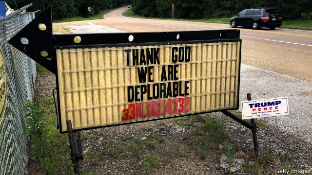
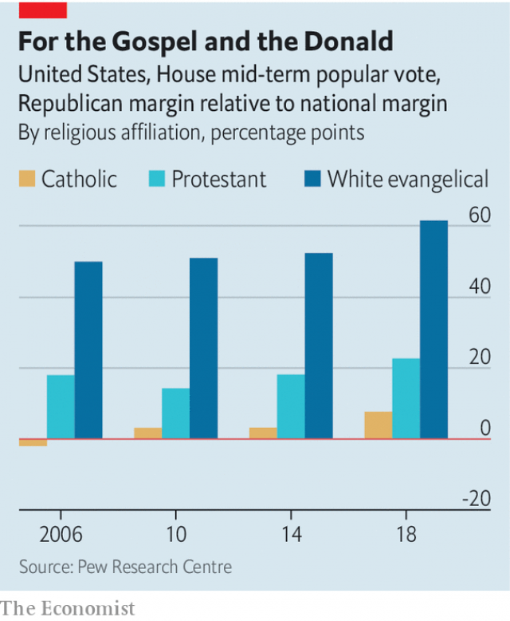

###### Flocks away

# The politicisation of white evangelical Christianity is hurting it 

##### A group of disenchanted evangelicals, the “exvies”, is among the denomination’s biggest threats 

 

> Feb 28th 2019 

ARMS OUTSTRETCHED, the congregation at Hyde Park Baptist Church welcomed the Holy Spirit into their two-storey, stained-glass sanctuary. Along with the spirit came their pastor, Kie Bowman, accompanied by a full jazz orchestra. He summed up his sermon as: “to impact culture, love the Bible”. But interspersed with this joyful invitation to share the Gospel were some spiky remarks, such his assertion that “you have to be convinced by the media that God does not exist.” Such has been the transformation of white evangelical Christianity over the past half-century. But conservative politics in church have also caused a backlash. 

Mr Bowman’s statements reflect the battle that evangelical denominations have been fighting since the 1980s, when evangelical leaders began to move past discussions about morality and embraced conservative rhetoric about individual rights. Andrew Lewis, author of a book about this phenomenon called “The Rights Turn”, says that Republicans and conservative Christians now have a shared approach to the law. As examples, he points to the use of free-speech rights to defend anti-abortion legislation and to argue against regulating campaign finance. That fusion seemed complete in 2016, when 81% of white born-again Christians voted for Donald Trump, according to data from the Democracy Fund Voter Study Group. 

Yet this coupling seems to be hurting membership of evangelical churches. Several polling firms have detected a decline in the share of Americans who describe themselves as white evangelicals over the past decade. The Pew Research Centre found a two-percentage-point drop from 2007 to 2012. PRRI found a six-percentage-point drop in the share of the population that identify as white evangelicals, from 23% in 2006 to 17% in 2016. ABC and the Washington Post found a still larger decline of eight percentage points, larger than the drop among mainline white Protestants. The problem is partly generational: in the PRRI data just 8% of young Americans aged 18-29 say they are white evangelicals, while 26% of those aged 65 or older are white evangelical Protestants. Together with the decline in the share of whites who identify as Catholics, this has caused anxiety among some of the faithful that white Christian America is under threat. 

 

The argument about how to restore lost greatness has been running for 40 years. In the late 1970s the Southern Baptist Convention (SBC), an umbrella organisation for evangelical churches, was roiled by a confrontation between modernisers, who were in charge of the organisation, and traditionalists, who blamed them for presiding over a levelling-off in church attendance. The traditionalists won, but on their watch the malaise has worsened. Nor are falling numbers the only problem: an exhaustive investigation by the Houston Chronicle and the San Antonio Express-News identified more than 250 church leaders who have been accused of sexually abusing people who worshipped at SBC churches. 

Many churches remain committed to preaching conservative politics from the pulpit on Sundays. The SBC’s leadership, however, has been critical of Mr Trump. Russell Moore, a theologian who heads its work on public policy, is among the president’s most eloquent critics. 

This may be too little, too late for a group of former evangelicals who are trying to organise “ex-vangelicals”—or “exvies”—into a nascent political movement. Christopher Stroop, a journalist, has emerged as a leader among the exvies. Mr Stroop was raised in a fundamentalist evangelical household, where he went to non-denominational Christian schools and was surrounded mostly by friends who shared his beliefs. In high-school, biology lessons about DNA would be interspersed with preaching from the teacher, and sometimes with documentaries on “flood geology” and the search for Noah’s ark. “There was strong pressure to be a young-Earth creationist,” Mr Stroop says. He also recalls a class field-trip during school hours to a prototype Tea Party convention. Mr Stroop says his education was “all about isolating children in the subculture so they’ll grow up to be the culture warriors the church wants them to be.” 

He typifies a larger pattern. In a paper published in 2017 Paul Djupe, Jacob Neiheisel and Anand Sokhey, all political scientists, found that people stop attending church when they have intellectual disagreements with their religion and when they lose social attachments to their congregations. Since Americans have become yoked to their political tribe with an intensity that often rivals religious fervour, those with moderate political disagreements frequently find their faith hard to reconcile with their politics and end up leaving their churches. 

-- 

 单词注释:

1.politicisation[]:[网络] 科学政治化 

2.evangelical[,i:væn'dʒelikәl]:a. 福音派教会的 n. 福音派信徒 

3.Christianity[.kristʃi'æniti]:n. 基督教, 基督教精神 

4.disenchant[.disin'tʃɑ:nt]:vt. 使清醒 

5.outstretched[.aut'stretʃt]:a. 伸开的, 扩张的, 延伸的 

6.congregation[.kɒŋgri'geiʃәn]:n. 集合, 聚集 [法] 集会, 人一, 红衣主教会议 

7.hyde[haid]:n. 海德 

8.Baptist['bæptist]:n. 施洗礼者, 浸礼会教友 

9.sanctuary['sæŋktʃuәri]:n. 圣所(指教堂、寺院等), 耶路撒冷的神殿, 避难所 [法] 庇护所, 避难所, 教堂 

10.pastor['pæstә]:n. 牧师 

11.kie[]:n. (Kie)人名；(朝)桂；(英)凯 

12.bowman['bәumәn]:n. 弓射手, 持弓的兵, 船首的划手 

13.sermon['sә:mәn]:n. 说教, 启示, 布道 

14.intersperse[.intә'spә:s]:vt. 散布, 点缀 

15.gospel['gɒspәl]:n. 福音, 信仰, 真理 

16.spiky['spaiki]:a. 大钉一般的, 长而尖的, 钉满钉子的, 有穗的 

17.assertion[ә'sә:ʃәn]:n. 断言, 主张 [法] 宣称, 断言, 维护 

18.politic['pɒlitik]:a. 精明的, 明智的, 策略的 

19.backlash['bæklæʃ]:n. 后冲, 强烈反对 [电] 反撞, 逆栅流 

20.denomination[di.nɒmi'neiʃәn]:n. 名称, 教派, 面额 [经] 票面金额, 名称, (度量衡) 

21.morality[mә'ræliti]:n. 道德, 教训, 品行 [法] 道德, 道义 

22.rhetoric['retәrik]:n. 修辞, 修辞学, 雄辩(术) 

23.andrew['ændru:]:n. 安德鲁（男子名） 

24.lewis['lu:is]:n. 吊楔 

25.fusion['fju:ʒәn]:n. 熔合物, 结合, 熔合 [化] 熔融; 熔化; 聚变 

26.donald['dɔnәld]:n. 唐纳德（男子名） 

27.trump[trʌmp]:n. 王牌, 法宝, 喇叭 vt. 打出王牌赢, 胜过 vi. 出王牌, 吹喇叭 

28.datum['deitәm]:n. 论据, 材料, 资料, 已知数 [医] 材料, 资料, 论据 

29.voter['vәutә]:n. 选民, 投票人 [法] 选民, 选举人, 投票人 

30.coupling['kʌpliŋ]:n. 联结, 结合, 耦合 [计] 耦合 

31.membership['membәʃip]:n. 会员的资格, 全体会员, 会员数目 [法] 会员资格, 成员资格, 会籍 

32.pew[pju:]:n. 教堂长椅, 会众, 座位 vt. 为(教堂)安装座位, 把...围在一起 

33.ABC['eibi:'si:]:预定章程, 美国广播公司, 澳大利亚广播公司, 字母表, 基础知识 [计] 记帐预算计价系统, 通用插件板计算机, 美国广播公司, 自动编码系统 

34.Washington['wɒʃiŋtn]:n. 华盛顿 

35.mainline[]:n. 主线, 干线 vt.vi. (美)(非正式)把(毒品)直接注射入静脉 

36.Protestant['prɒtistәnt]:n. 新教徒 a. 新教的, 新教徒的 

37.greatness['greitnis]:n. 大, 巨大, 广大 

38.sbc[]:abbr. 小企业委员会（Small Business Council）；单板计算机（single board computer）；瑞士银行公司（Swiss Bank Corp.） 

39.organisation[,ɔ: ^әnaizeiʃən; - ni'z-]:n. 组织, 团体, 体制, 编制 

40.roil[rɒil]:vt. 搅浑, 使焦急 

41.confrontation[.kɔnfrʌn'teiʃәn]:n. 对抗；对质；面对 

42.moderniser[]:n. 现代主义者, 现代化者 

43.traditionalist[]:n. 传统主义者, 因循守旧者 

44.preside[pri'zaid]:vi. 统辖, 当主人, 主持 [法] 主持, 负责, 指挥 

45.attendance[ә'tendәns]:n. 出席, 出席的人数, 照料 [法] 管理, 照料, 资助 

46.malaise[mæ'leiz]:n. 不舒服 [医] 不适, 欠爽 

47.worsen['wә:sn]:vt. 使更坏, 使恶化 vi. 变得更坏, 恶化 

48.exhaustive[ig'zɒ:stiv]:a. 消耗的, 枯竭的, 彻底的, 详尽的 

49.Houston['hju:stәn]:n. 休斯敦 

50.chronicle['krɒnikl]:n. 年代记, 记录, 编年史 vt. 把...载入编年史 

51.san[sɑ:n]:abbr. 存储区域网（Storage Area Networking） 

52.antonio[æn'tәuniәu]:n. 安东尼奥（男名） 

53.sexually[]:adv. 性别地；两性之间地 

54.preach[pri:tʃ]:v. 传道, 讲道, 说教, 宣讲, 鼓吹 n. 说教, 布道 

55.pulpit['pulpit]:n. 讲道坛 

56.russell['rʌsәl]:n. 拉塞尔（英国工程师, 整流器发明人） 

57.moore['muә]:n. 摩尔（男子名） 

58.theologian[.θi:ә'lәudʒәn]:n. 神学者 

59.eloquent['elәkwәnt]:a. 雄辩的, 有口才的, 有说服力的 

60.nascent['næsnt]:a. 发生中的, 开始存在的, 初期的 [医] 初发的, 初生的 

61.christopher['kristәfә]:n. 克里斯多夫（男子名） 

62.stroop[]: [人名] 斯特鲁普 

63.fundamentalist[.fʌndә'mentәlist]:n. 基要主义者 

64.DNA[]:脱氧核糖核酸 [计] 无效数据, 数字网络体系结构, 分布式网络体系结构 

65.documentary[.dɒkju'mentәri]:n. 记录片 a. 文件的 

66.ark[ɑ:k]:n. 方舟, 柜 

67.creationist[krɪ'eɪʃnɪst]:n. 神灵论者, 上帝论者; 特创论者（即相信万物皆由上帝一次造成者） 

68.prototype['prәutәtaip]:n. 原型 [计] 样机; 原型 

69.subculture['sʌb,kʌltʃә]:n. 再次培养, 亚文化群 [医] 次代培养物, 次培养物 

70.warrior['wɒ:riә]:n. 战士, 勇士, 武士, 鼓吹战争的人, 战斗, 尚武 

71.typify['tipifai]:vt. 代表, 象征, 为...之典型 

72.paul[pɔ:l]:n. 保罗（男子名） 

73.jacob['dʒeikәb]:n. [圣经]雅各（以色列人的祖先）；雅各布（男子名） 

74.Anand[]:n. 安纳德（印度古吉拉特邦的一个小镇, 印度代孕行为的发源地）；阿南德（男子名, 著名作家） 

75.attachment[ә'tʃætʃmәnt]:n. 连接, 附属物, 连接物, 爱慕 [计] 附加, 附件 

76.yoke[jәuk]:n. 轭, 牛轭, 束缚 vt. 给...上轭, 连接, 结合, 使匹配 vi. 结合, 匹配 [计] 磁轭; 磁头组; 偏转线圈 

77.fervour['fә:vә]:n. 炽热, 热诚, 热情, 热烈 

78.reconcile['rekәnsail]:vt. 使和解, 调停, 使和谐, 使一致, 使听从 [经] 对帐, 使一致 

