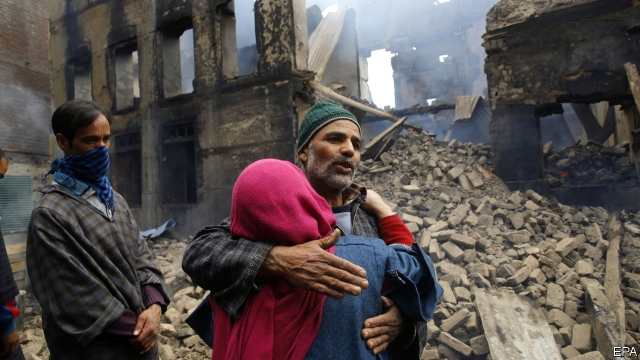
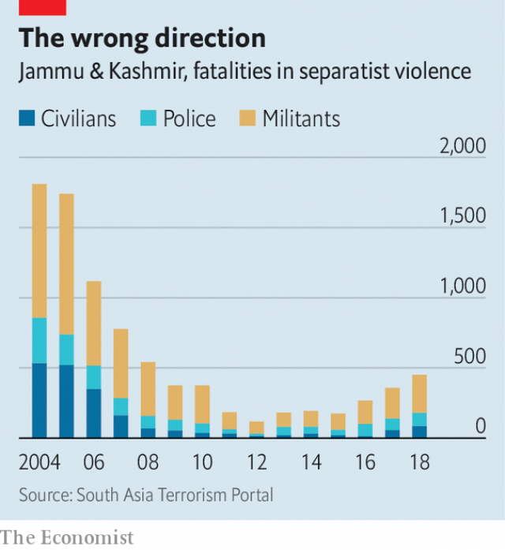

###### Nadir in the valley

# India’s government is intensifying a failed strategy in Kashmir 

##### Resentment is growing ever stronger 

 

> Mar 7th 2019 

GUNS HAVE slipped back into holsters and diplomats behind their desks; the Samjhauta or “Concord” Express has resumed its reassuring bi-weekly chug connecting Lahore Junction and Old Delhi Station. Relations between India and Pakistan are returning to the normal huffy disdain after a week of military brinkmanship. For the divided and disputed border region of Kashmir, there is relief. Yet in the Kashmir Valley, a fertile and densely populated part of the Indian state of Jammu & Kashmir, this comes tempered with weariness. For its 7m inhabitants, most of them Muslim, a return to normal means a large and growing pile of frustrations. Some, such as bad government services and a deepening shortage of jobs, are familiar to all Indians. Others are unique to the valley. 

Pakistan views the valley’s Muslims as sundered citizens; its constitution prescribes what should happen not if, but “when”, Kashmiris vote to join Pakistan. And since independence in 1947, Pakistan has never ceased trying to hasten this moment by sending guerrillas over the border to stir up jihad—although this week it claimed to rounding up such militants. India, for its part, says that Kashmir was lucky to fall to a secular, democratic country at partition and not to its violent, narrow-minded neighbour. But Indian governments turn deaf the moment people in the valley speak of greater autonomy, let alone azadi (independence). Their efforts at counter-insurgency have been disturbingly bloody. The conflict has claimed 50,000 lives since the 1980s. 

The deafness has been especially pronounced of late. When Narendra Modi came to power in India in 2014, violence in the valley was near its lowest level in a quarter century. Perhaps jihadist action would have risen again anyway, but government policies plainly have not helped. Senior officials have called for the scrapping of constitutional clauses that grant the government of Jammu & Kashmir a few more powers than those of other states. Security forces have become even more heavy-handed. They use shotguns to suppress angry crowds, thereby blinding many protesters with metal pellets. An army officer who kidnapped a civilian and strapped him to a jeep as a human shield was not punished, but lauded and promoted. 

Many Kashmiris were further alienated when Mr Modi’s Bharatiya Janata Party (BJP), which had swept polls in Jammu, the largely Hindu part of the state, first joined in an opportunistic coalition government with a pro-independence party and then abruptly quit. This allowed Mr Modi to impose direct rule from Delhi. Those who had derided Indian democracy as a sham seemed vindicated. 

 

Infiltration from Pakistan has been rife. In the words of Shivshankar Menon, a former Indian national security adviser, “When they think you are in trouble in Jammu & Kashmir, their temptation is to stir up that trouble.” Violence began to mount, and with it the intensity of the government’s response. When guerrillas hole up in villages, the security services tend to blitz their hideouts. Bystanders are often injured in the crossfire and their property destroyed. A growing proportion of the insurgents are local, even college-educated Kashmiris, not from across the border. Huge crowds gather at their funerals. 

It was a local recruit of a group based in Pakistan who drove a bomb-packed minivan into a convoy of Indian police in the valley in mid-February, killing 40 and initiating the face-off with Pakistan. In response, online agitators and even BJP officials goaded mobs around India to attack Kashmiris. Omair Ahmad, an Indian writer, despairingly remarks, “The Indian right has always seen Kashmir as our Kosovo: a land to be loved, a people to be hated.” 

In recent weeks Mr Modi’s government has escalated the repression in the valley, bringing in extra troops, rounding up non-violent activists and banning a moderate Islamic group that runs scores of schools, employing some 10,000 teachers. It has cut government advertising in local newspapers, their main source of revenue. Curfews and internet shutdowns have intensified. Senior officials speak, alarmingly, of the need to “instil India” in locals. 

-- 

 单词注释:

1.nadir['nei.diә]:n. 天底, 最低点 

2.intensify[in'tensifai]:vt. 加强 vi. 强化 

3.Kashmir['kæʃmiә]:n. 克什米尔 

4.resentment[ri'zentmәnt]:n. 怨恨, 愤恨 

5.holster['hәulstә]:n. 手枪皮套 

6.diplomat['diplәmæt]:n. 外交官, 有外交手腕的人 [法] 外交家, 外交官, 有权谋的人 

7.concord['kɒŋkɒ:d]:n. 一致, 和睦, 协定 

8.reassure[.ri:ә'ʃuә]:vt. 使...安心, 向...再保证 [法] 重新保证, 再保险, 使清除疑虑 

9.chug[tʃʌg]:n. 嘎嚓声 vi. 发出嘎嚓声, 嘎嚓响着前进 

10.lahore[lә'hɔ:]:n. 拉合尔（巴基斯坦城市） 

11.junction['dʒʌŋkʃәn]:n. 连接, 会合处, 交叉点 [医] 接[合]处, 接点.[接]界 

12.delhi['deli]:n. 德里（印度城市名） 

13.Pakistan[.pɑ:ki'stɑ:n]:n. 巴基斯坦 

14.huffy['hʌfi]:a. 怒冲冲的 

15.disdain[dis'dein]:n. 蔑视 vt. 蔑视, 鄙弃 

16.brinkmanship['briŋkmәnʃip]:n. 边缘政策 [法] 外交冒险政策, 紧急政策 

17.densely['densli]:adv. 浓密地, 浓厚地 

18.populate['pɔpjuleit]:vt. 使人口聚居在...中, 殖民于, 移民于, 居住于, 定居于 

19.Jammu['dʒʌmu:]:查谟(城市, 位于亚洲查谟和克什米尔的西南) 

20.weariness['wiәrinis]:n. 疲倦, 厌倦, 疲劳 

21.Muslim['mjzlim; (?@) 'mʌzlem]:n. 伊斯兰教, 伊斯兰教教徒 

22.frustration[frʌs'treiʃәn]:n. 挫折, 顿挫 [医] 挫折 

23.Muslim['mjzlim; (?@) 'mʌzlem]:n. 伊斯兰教, 伊斯兰教教徒 

24.sunder['sʌndә]:v. 切开, 分离 

25.Kashmiri[kæʃ'miәri]:n. 克什米尔语, 克什米尔人 

26.guerrilla[gә'rilә]:n. 游击队 

27.militant['militәnt]:a. 好战的 

28.secular['sekjulә]:n. 修道院外的教士 a. 世俗的, 现世的, 长期的 

29.partition[pɑ:'tiʃәn]:n. 分割, 隔离物, 隔墙, 财产分割 vt. 区分, 瓜分, 隔开, 分割 [计] 分区; 划分 

30.autonomy[ɒ:'tɒnәmi]:n. 自治, 自治权 [医] 自主性 

31.azadi[]:[网络] 自由；自由广场；自由广播电台 

32.disturbingly[dis'tә:biŋli]:adv. 动摇地；令人不安地 

33.bloody['blʌdi]:a. 血腥的, 嗜杀的, 有血的 

34.deafness['defnis]:n. 聋, 不听 [医] 聋[症] 

35.narendra[]:[网络] 纳伦德拉；纳兰德；纳然陀 

36.MODI['mәudai]:[计] 模块化光学数字接口 

37.jihadist[]:n. 伊斯兰圣战士 

38.plainly['pleinli]:adv. 清楚地, 明白地, 简单地, 朴素地, 直率地, 坦白地 

39.scrap[skræp]:n. 碎片, 残余物, 些微, 片断, 铁屑, 吵架 vt. 扔弃, 敲碎, 拆毁 vi. 互相殴打 a. 零碎拼凑成的, 废弃的 

40.constitutional[.kɒnsti'tju:ʃәnl]:a. 宪法的, 立宪的, 体质的 [医] 全身的; 体质的 

41.clause[klɒ:z]:n. 子句, 条款 [计] 子句 

42.shotgun['ʃɒtgʌn]:n. 散弹猎枪, 媒人 v. 用猎枪射击 

43.suppress[sә'pres]:vt. 镇压, 使止住, 禁止, 抑制, 查禁 [法] 镇压, 平定, 禁止出版 

44.protester[]:n. 抗议者, 持异议者, 拒付者 [经] 反对者 

45.pellet['pelit]:n. 颗粒状物, 小子弹, 小药丸 vt. 使成颗粒, 使成团, 用子弹打 

46.kidnap['kidnæp]:vt. 绑架, 诱拐, 拐骗 [法] 拐带, 诱拐, 绑架 

47.laud[lɒ:d]:n. 赞美, 称赞 vt. 赞美, 称赞 

48.alienate['eiljәneit]:vt. 使疏远, 离间, 转让 [法] 转让, 让与, 疏远 

49.Bharatiya[]:[网络] 巴拉蒂亚 

50.Janata['dʒʌnətɑ:]:n. （印度）人民团体；人民党（印度联合政党） 

51.bjp[]: [医][=Bence Jones protein]本周（氏）蛋白，凝溶蛋白 

52.Hindu['hindu:]:a. 印度教教徒的 n. 印度教教徒 

53.opportunistic[.ɒpәtju:'nistik]:a. 机会主义的, 投机取巧的 

54.coalition[.kәuә'liʃәn]:n. 结合体, 结合, 联合 [经] 联合, 联盟 

55.abruptly[ә'brʌptli]:adv. 突然地, 唐突地 

56.deride[di'raid]:vt. 嘲弄, 嘲笑 

57.sham[ʃæm]:n. 假, 赝品, 骗子, 哄骗 a. 假的, 伪造的 vt. 假装, 冒充 vi. 装假 

58.vindicate['vindikeit]:vt. 辩护, 证明...无辜, 维护 [法] 辩护, 辩解, 辩明 

59.infiltration[.infil'treiʃәn]:n. 渗入, 渗透, 渗透物 [化] 渗滤; 渗入过滤; 渗透; 渗入 

60.rife[raif]:a. 流行的, 盛传的, 充满的 

61.menon[]: [人名] 梅农 

62.adviser[әd'vaizә]:n. 顾问, 劝告者, 指导教师 [法] 顾问, 劝告者 

63.blitz[blits]:n. 闪电战 vt. 以闪电战攻击 

64.hideout['haidaut]:n. 隐匿处 

65.bystander['baistændә(r)]:n. 旁观者, 目击者 [法] 候补陪审员, 旁观者 

66.crossfire['krɔsfaiә]:n. 交叉火力, 串报, 串扰电流 [电] 交火 

67.insurgent[in'sә:dʒәnt]:a. 谋叛的, 起义的, 澎湃的 n. 起义者, 叛乱者 

68.minivan['minivæn]:n. 小型货车 

69.convoy['kɒnvɒi. kәn'vɒi]:n. 护送, 护卫 vt. 护航, 护送 

70.initiate[i'niʃieit]:n. 入会, 开始 a. 新加入的 vt. 开始, 传授基本知识给 

71.online[]:[计] 联机 

72.agitator['ædʒiteitә]:n. 煽动者 [化] 搅拌器; 搅拌机; 搅抖装置 

73.goad[gәud]:n. 赶牛棒, 激励, 刺激 vt. 用刺棒驱赶, 激励, 刺激, 唆使, 煽动 

74.mob[mɒb]:n. 暴民, 民众, 暴徒 vt. 大举包围, 蜂拥进入, 围攻 vi. 聚众生事 

75.ahmad[]:n. 阿哈默德（穆罕默德在《古兰经》中的名称） 

76.despairingly[dɪ'speərɪŋlɪ]:adv. 绝望地, 自暴自弃地 

77.alway['ɔ:lwei]:adv. 永远；总是（等于always） 

78.escalate['eskәleit]:vi. 逐步扩大, 逐步升高, 逐步增强 vt. 使逐步上升 

79.repression[ri'preʃәn]:n. 抑制, 压抑, 制止 [医] 压抑, 抑制 

80.activist['æktivist]:n. 激进主义分子 

81.Islamic[iz'læmik]:a. 伊斯兰教的, 穆斯林的 

82.advertising['ædvәtaiziŋ]:n. 广告业, 广告 a. 广告的 [计] 发广告 

83.curfew['kә:fju:]:n. 晚钟, 打晚钟时刻, 宵禁 [法] 宵禁, 宵禁令 

84.shutdown['ʃʌtdaun]:n. 关门, 停工, 停机 [经] 停工 

85.alarmingly[ ə'lɑːmɪŋli]:adv. 让人担忧地 

86.instil[in'stil]:vt. 滴注, 逐渐灌输, 不断灌输 [医] 滴注 

