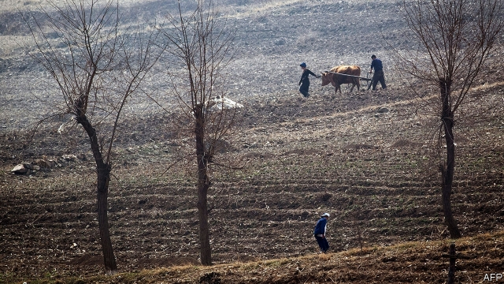

###### The other security issue

# Kim Jong Un keeps his nukes. His people keep starving 

##### Sanctions make it hard for the outside world to help 

 

> Mar 7th 2019 

AFTER HE LEFT Hanoi last week without a deal, Donald Trump, America’s president, was quick to claim that his meeting with Kim Jong Un, North Korea’s dictator, had not been entirely in vain. Mr Kim, he reassured the world, had promised to stick to the moratorium on tests of missiles and nuclear bombs that has held since November 2017. And North Korea’s economic potential, Mr Trump noted, was still “tremendous”. 

Reports this week bolster doubts about both claims. According to South Korea’s spy agency, Mr Kim may well be changing his mind on testing. Satellite images of Dongchang-ri, a site which has been used both to launch satellites and test engines for long-range missiles, but which Mr Kim had begun to dismantle last year, suggest the North is restoring the facility. The refurbishment is likely to have begun before the summit in Hanoi. Analysts are taking the move as a signal that North Korea’s “patience” with America is beginning to run out, just as Mr Kim had threatened it might in a speech to mark the new year. 

Mr Kim has promised his people economic development as well as nuclear glory. But the economy seems as backward as ever. Around 11m North Koreans, more than two-fifths of the population, are malnourished. Roughly as many have no access to clean drinking water. (In rural areas the percentage is much higher.) On March 6th the UN reported that total crop production fell to less than 5m tonnes last year, a 9% drop from 2017 and the lowest level in a decade. The situation is likely to worsen this year, as a summer of extreme heat and an autumn of floods and typhoons was followed by a lack of rain during the winter planting season. Even now, reckons the UN, nearly 4m people are in need of emergency aid. 

Technically, delivery of humanitarian assistance should not be affected by the lack of progress in nuclear talks, as it is exempt from the sanctions intended to curtail Mr Kim’s nuclear ambitions. The two leaders are unlikely to have discussed malnutrition over their steak dinner in Hanoi. But aid workers inside and outside the country say that Mr Kim’s recalcitrance, and the tightening of sanctions it has prompted, have affected the flow of humanitarian goods. Applications to the UN to bring food or medicine into the country take months to process and aid is often held up at the border. American aid workers have been unable to travel to North Korea owing to the travel ban imposed by their government. Many agencies have been forced to curtail their activities or have given up altogether. While Mr Kim flirts and bargains with Mr Trump, ordinary North Koreans continue to suffer. 

-- 

 单词注释:

1.kim[]:n. 金姆（人名） 

2.jong[jɔŋ]:n. 小伙子；（旧时的）青年男奴 

3.UN[ʌn]:pron. 家伙, 东西 [经] 联合国 

4.nuke[nju:k]:n. 核武器, 核电厂, 原子核 vt. 以核武器攻击, 把...打垮 a. 核武器的 

5.sanction['sæŋkʃәn]:n. 核准, 制裁, 处罚, 约束力 vt. 制定制裁规则, 认可, 核准, 同意 

6.hanoi[hæ'nɔi]:n. 河内（越南首都） 

7.donald['dɔnәld]:n. 唐纳德（男子名） 

8.trump[trʌmp]:n. 王牌, 法宝, 喇叭 vt. 打出王牌赢, 胜过 vi. 出王牌, 吹喇叭 

9.dictator['dikteitә]:n. 命令者, 独裁者 

10.entirely[in'taiәli]:adv. 完全, 全然, 一概 

11.reassure[.ri:ә'ʃuә]:vt. 使...安心, 向...再保证 [法] 重新保证, 再保险, 使清除疑虑 

12.moratorium[.mɒrә'tɒ:riәm]:n. 延期偿付, 暂停 [法] 延期偿付, 延缓履行, 延期偿还期 

13.bolster['bәulstә]:n. 支持, 长枕 vt. 支持, 支撑 

14.dismantle[dis'mæntl]:vt. 拆除...的设备, 分解, 去除覆盖物 

15.refurbishment[]:n. 整修; 翻新; 重新磨亮 

16.analyst['ænәlist]:n. 分析者, 精神分析学家 [化] 分析员; 化验员 

17.Korean[kә'riәn]:n. 朝鲜人, 朝鲜语 a. 朝鲜人的, 朝鲜语的 

18.malnourished[mæl'næriʃt]:a. 营养失调的, 营养不良的 

19.UN[ʌn]:pron. 家伙, 东西 [经] 联合国 

20.les[lei]:abbr. 发射脱离系统（Launch Escape System） 

21.tonne[tʌn]:n. 吨, 公吨 [经] 吨 

22.worsen['wә:sn]:vt. 使更坏, 使恶化 vi. 变得更坏, 恶化 

23.reckon['rekәn]:vt. 计算, 总计, 估计, 认为, 猜想 vi. 数, 计算, 估计, 依赖, 料想 

24.technically['teknikli]:adv. 技术上, 学术上, 专门地 

25.humanitarian[hju:.mæni'tєәriәn]:n. 人道主义者, 博爱者, 基督凡人论者 a. 人道主义的, 博爱的, 凡人论的 

26.exempt[ig'zempt]:n. 免税者, 被免除义务者 a. 免除的 vt. 使免除, 豁免 

27.curtail[kә:'teil]:vt. 缩减, 剥夺, 简略 [法] 剥夺特权 

28.malnutrition[.mælnju:'triʃәn]:n. 营养失调, 营养不良 [医] 营养不良 

29.recalcitrance[ri'kælsitrәns]:n. 反抗, 不服从, 顽抗 

30.tighten['taitn]:vt. 勒紧, 使变紧 vi. 变紧, 绷紧 

31.Korea[kә'riә]:n. 朝鲜, 韩国 

32.flirt[flә:t]:n. 卖弄风骚的人, 急动, 急扔 vt. 忽然弹出, 轻快摆动, 挥动 vi. 调情, 玩弄, 摆动, 轻率地对待 

