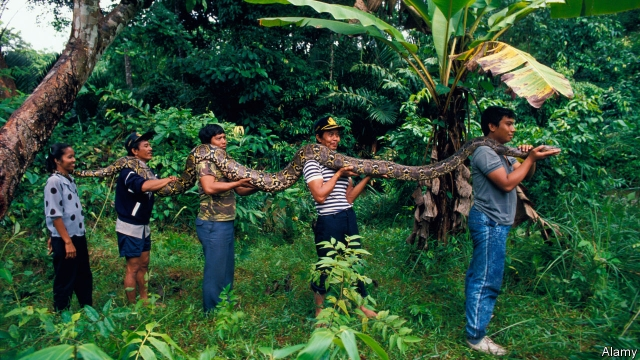

###### Snakes on a plantation

# Palm oil is bad for biodiversity, with a notable exception 

##### Rats love to munch on palm kernels, and snakes to snack on the rats 

 

> Mar 7th 2019 

FEW CREATURES can live comfortably on oil-palm plantations. The orderly rows of trees provide scant refuge for mammals trying to avoid predators and hunters. Monkeys struggle to swing on palm branches; birds have few places to nest. But for snakes, the plantations are an earthly paradise. 

Snakes flourish because they have an abundant source of food. They feast on the swarms of rats that are attracted to plantations by the energy-packed palm kernels. Studies have found more than 400 rodents a hectare on palm-oil farms. Stacks of dead palm fronds give ample cover for rats and reptiles alike. According to a recent report by the International Union for Conservation of Nature, at least eight species of snake thrive on oil-palm plantations. They are often more prevalent on plantations than in neighbouring jungles. 

On a plantation belonging to Cargill in the Indonesian province of South Sumatra, the medical centre is stocked with anti-venoms. A poster on the wall depicts several species of snake to help patients identify their attacker. Signs warning about pythons are dotted among the rows of oil palm. Workers are encouraged to wear thick gloves to reduce the risk of bites. Across Indonesia, media outlets routinely report stories of oil-palm harvesters getting gobbled up by enormous pythons. 

But the snakes can also be a boon for oil-palm workers, who tend to be poorly paid. Snake skins can fetch $30 to $60 apiece, roughly a week’s wage. Many are shipped to Europe to become fashionable belts or handbags. Another money-spinner is to milk poisonous snakes and sell the venom. 

For oil-palm companies, too, there are upsides. The snakes, after all, prevent even bigger infestations of rats, which would reduce yields. Indeed, some oil-palm firms wish for more snakes on their plantations. Agrocaribe, a Guatemalan one, set up its own snake hatchery. 

-- 

 单词注释:

1.biodiversity[]:n. 生物多样性 

2.notable['nәutәbl]:n. 著名人士, 值得注意之事物 a. 值得注意的, 显著的 

3.munch[mʌntʃ]:v. 用力咀嚼, 大声咀嚼 

4.kernel['kә:nl]:n. 核心, 中心, 精髓, 内核 [计] 内核 

5.comfortably['kʌmfәtәbli]:adv. 安乐地, 舒服地, 宽裕地 

6.scant[skænt]:a. 不充分的, 不足的 vt. 减少, 吝啬, 限制, 藐视, 忽略 

7.mammal[mæmәl]:n. 哺乳动物 [化] 哺乳动物 

8.predator['predәtә]:n. 食肉动物, 掠夺者 [医] 捕食者 

9.earthly['ә:θli]:a. 地球的, 俗世的, 可能的 

10.rodent['rәudәnt]:a. 咬的, 啮齿类的 n. 啮齿动物 

11.hectare['hektɑ:]:n. 公顷 [经] 公顷 

12.frond['frɒnd]:n. 叶, 植物体 [医] 叶(指蕨类、棕榈类、苏铁类) 

13.reptile['reptail]:n. 爬行动物, 爬虫, 卑鄙的人 a. 爬行的, 爬虫类的, 卑鄙的 

14.specie['spi:ʃi]:n. 硬币 [经] 硬币 

15.prevalent['prevәlәnt]:a. 普遍的, 流行的 

16.Cargill[]:n. 美国嘉吉公司 

17.Indonesian[.indәu'ni:ʒәn]:a. 印尼的 n. 印尼人, 印尼语群 

18.sumatra[su'mɑ:trә]:n. 苏门答腊岛（印尼西部的大岛） 

19.depict[di'pikt]:vt. 描述, 描写 

20.attacker[ә'tækә]:n. 攻击者 

21.python['paiθɒn]:n. 大蟒, 巨蟒 [计] Python 程序设计语言；人生苦短，我用 Python 

22.Indonesia[.indәu'ni:ʒә]:n. 印尼 

23.routinely[]:adv. 日常, 乏味, 常规, 例行 

24.harvester['hɑ:vistә]:n. 收获者, 收割机 

25.gobble['gɒbl]:n. 火鸡叫声 vt. 狼吞虎咽 vi. 贪食, 咯咯叫 

26.boon[bu:n]:n. 恩惠 

27.poorly['puәli]:adv. 贫穷地, 不充分地, 贫乏地 a. 身体不舒服的 

28.apiece[ә'pi:s]:adv. 就每个而论, 各 

29.venom['venәm]:n. 毒液, 恶意 vt. 放毒, 使有毒 

30.upside['ʌpsaid]:n. 上侧, 上段, 上部 [机] 上侧, 上部 

31.infestation[.infe'steiʃәn]:n. 骚扰, 大批出没, 横行 [医] 侵染, 感染 

32.Guatemalan[,ɡwæti'mɑ:lən]:n. 危地马拉人 a. 危地马拉的（中美洲的一个国家） 

33.hatchery['hætʃәri]:n. 孵卵处 

