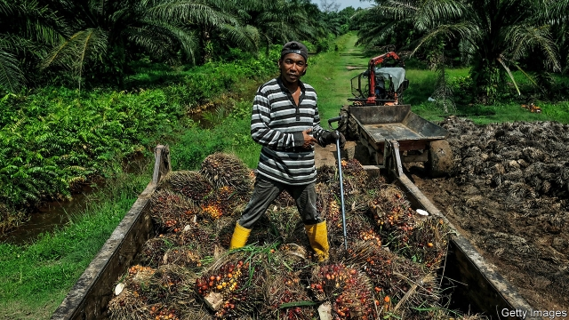
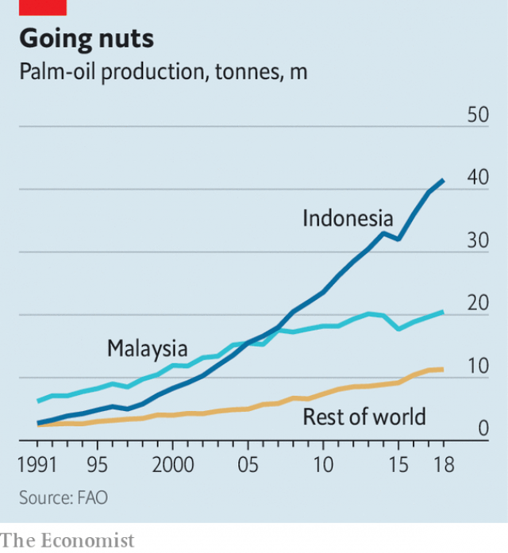

###### A pale shade of green

# The palm-oil industry’s effort to curb deforestation has lots of flaws 

##### But falling prices and wet weather has disguised them 

 

> Mar 7th 2019 

IN A WOODEN shed perched on top of a hill in Musi Banyuasin, a district on the Indonesian island of Sumatra, a group of palm-oil farmers wax lyrical about their crop. They started planting in the early 1990s after arriving from Java, the country’s most populous island, as part of a government resettlement scheme. Before palm oil, they worked in paddy fields and grew vegetables. But their new life is much more lucrative. Many have bought more farmland and can afford to send their children to university. “We can even buy cars,” exclaims one mustachioed farmer, gesturing at a 4x4 outside. The vehicle sits against a backdrop of oil palm seedlings and trees, which stretch for miles across the countryside. 

In some ways oil palm is indeed a wondrous crop. It is highly efficient. On a per-hectare basis it produces between six and ten times more oil than equivalents, like soyabeans. And that oil is highly versatile, turning up in about half of all supermarket products, from pizza dough to lipstick. 

That explains why Indonesia’s palm-oil industry has ballooned since these farmers arrived on Sumatra. Over that period the amount of land devoted to the crop has increased more than ten-fold, now covering 123,000 square kilometres, an area the size of Greece. Production surged 14-fold. Indonesia is now the biggest palm-oil producer in the world, accounting for half of global output. Malaysia is second, with a third of production (see chart). In Indonesia the industry accounts for about 2-3% of GDP. 

 

But to make way for plantations, huge swathes of tropical rainforest have been razed. In the 2000s Indonesia was cutting down more forest than anywhere else in the world. According to the International Union for Conservation of Nature, 47% of deforestation in Malaysia between 1972 and 2015 was the result of palm oil. In Indonesia the proportion was only 16%, but in some areas it was much higher. In Kalimantan, Indonesia’s slice of Borneo, for instance, palm oil was responsible for about 60% of all deforestation. 

Draining and burning peatlands, carbon-rich bogs formed when soggy soil prevents dead vegetable matter from fully decaying, provides a cheap way to clear land. But it releases vast amounts of greenhouse gases and coats much of South-East Asia in a toxic haze. The loss of biodiversity is also stinging. Oil-palm plantations provide homes for 65-90% fewer species of mammal than natural forests. Endangered species like tigers and orang-utans are among the victims. In the past four decades, species have slid towards extinction twice as fast in Indonesia as in any other country. 

There may, however, be cause for hope. In the past few years the palm-oil industry and the Indonesian government, egged on by NGO campaigns, have attempted to save more trees. Satellite images show that in 2017 the rate of deforestation in Indonesia fell to its lowest level in two decades. 

Judging whether this change is the result of the industry’s new approach is confounded by two factors. One is the weather. The most recent bout of scorching peat fires was in 2015, an El Niño year. Since then the weather has been wetter, which slows deforestation since fewer people try to clear by burning, and those fires which are lit are less likely to rage out of control. 

A second factor is the price of palm oil. This is closely correlated to the expansion of plantations, as demonstrated by a recent study of deforestation in Borneo led by David Gaveau at the Centre for International Forestry Research. Since its peak in 2016, the price of palm oil has dropped by a third, dampening the urge to chop down trees. 

Nevertheless, some in the palm-oil industry have made sincere attempts to become greener. The main platform for this is the Roundtable on Sustainable Palm Oil (RSPO), which started in 2004 and is made up of palm-oil growers, investors, traders, retailers and NGOs. It issues certificates to palm-oil mills whose green practices, such as preserving peatlands or forests, are confirmed by an independent auditor. In theory, RSPO palm oil should sell at a premium, since it allows those who buy it (and the final consumer) to sleep soundly. 

In practice, things are more tricky. One problem is the RSPO’s low coverage: only one-fifth of palm oil is certified. Many growers are put off by the cost of complying, for benefits that often do not materialise. Only 50% of certified palm oil is sold as such. The rest gets flogged as the normal stuff, bringing no extra income. This reflects weak demand from importers. About two-fifths of palm-oil exports are snapped up by China, India and Pakistan, markets where greenery is little valued. 

Other complaints about the RSPO are that its standards are too lenient and that it has little power to enforce them. That is true, but its rules are slowly being strengthened. Last year it prohibited the clearing of all types of forest, whereas previously only the densest jungle had to be preserved. In 2016 it suspended IOI, a Malaysian conglomerate, for failing to protect forests. 

A study led by Kimberly Carlson of the University of Hawaii found that the rate of deforestation on certified plantations was a third lower than on others. But the causality is unclear: the rules of the RSPO in effect ignore deforestation that occurred before 2005. Certified plantations were more likely to have planted oil palms before that cut-off and therefore tended to have less forest land to raze. 

Partly because of the weakness of the RSPO, many companies have loudly declared their own tree-loving initiatives. Researchers at the Zoological Society of London looked at the policies of the world’s 70 biggest palm-oil firms. They found that 46 had said they would no longer chop down trees and 36 said they would not farm peatlands. Some companies have been publishing details of land concessions and lists of suppliers, too. That gives pressure groups more scope to keep an eye on them. 

Last year Aidenvironment, an NGO, released a report alleging that Anthony Salim, the owner of Salim Group, Indonesia’s largest conglomerate, was, through layers of corporate ownership, the beneficiary of deforestation (it has not responded to the claim). A similar report by Greenpeace charged that, although Wilmar, the world’s biggest palm-oil company, has pledged not to deforest, a plantation owned by members of the boss’s family had cut down 215 square kilometres of jungle since 2013. 

Some experts also worry that companies’ new-found aversion to deforestation may be simply reducing the price of forest land, which is in turn bought by smallholders and cleared. A recent study by Kemen Austin of RTI International, another NGO, looked at the causes of deforestation in Indonesia. After 2012 clear-cutting by industrial-scale palm oil plantations dropped, but smallholders felled more trees. 

Smallholders account for about 40% of global production but little is known about them. They include poor villagers with a few trees in their gardens, well-heeled businessmen and migrants settled by government schemes, like those in Musi Banyuasin. If smallholders’ market share grew, that would be good for development but bad for the environment. They are hard to monitor and have little incentive to save trees, often selling to middlemen who do not offer markups for green palm oil. 

Stricter regulation may be the best way to rein them in. Indonesia’s president, Joko Widodo, has been trying. In 2015 and 2017 he extended a moratorium on converting forest and peatland to plantations. Last year he banned the issuance of permits for new plantations for three years. He has also launched an initiative to synchronise land-concession maps, which often differ at the local, provincial and national level and among various interested ministries. If implemented, this would make it easier to hold deforesters to account. 

Past moratoriums, however, have not had much success. That is partly because the laws apply only to new requests for land permits, not to concessions already granted or those still going through the application process. Indonesia’s local politicians are powerful and have a long tradition of allowing national parks to be razed in exchange for campaign funding. 

The real test of these policies—and those of the industry—will come later this year. The weather is expected to be drier and so more favourable for clearing peatland. And the price of palm oil is forecast to rebound. Politicians and environmental campaigners will be watching the satellite imagery with trepidation. 

-- 

 单词注释:

1.curb[kә:b]:n. 抑制, 勒马绳, 边石 vt. 抑制, 束缚, 勒住 

2.deforestation[di:.fɒ:ri'steiʃәn]:n. 采伐森林, 森林开伐 [法] 砍伐森森 

3.flaw[flɒ:]:n. 缺点, 裂纹, 瑕疵, 一阵狂风 [化] 划痕; 裂缝; 裂纹 

4.perch[pә:tʃ]:n. 栖木, 高位, 杆, 河鲈 v. (使)栖息, 就位, 位于, (使)暂歇 

5.musi[]:[网络] 穆实；穆西；音乐 

6.Banyuasin[]:班纽亚辛 

7.Indonesian[.indәu'ni:ʒәn]:a. 印尼的 n. 印尼人, 印尼语群 

8.sumatra[su'mɑ:trә]:n. 苏门答腊岛（印尼西部的大岛） 

9.lyrical['lirikәl]:a. 抒情诗调的, 有抒情味的, 感情丰富的 

10.Java['dʒɑ:vә]:n. 爪哇, 爪哇咖啡 [计] Java 程序设计语言 

11.populous['pɒpjulәs]:a. 人口多的, 人口稠密的 

12.resettlement[]:[法] 重新定居, 重予安置 

13.paddy['pædi]:n. 稻, 谷, 爱尔兰人, 警察 [法] 警察 

14.lucrative['lu:krәtiv]:a. 有利益的, 获利的, 合算的 

15.farmland['fɑ:mlænd]:n. 农田 

16.mustachioed[]: 有大鬈曲八字胡的 

17.backdrop['bækdrɒp]:n. 背景幕, 背景 

18.seedling['si:dliŋ]:n. 秧苗, 树苗 [医] 籽苗, 幼苗, 实生苗 

19.wondrous['wʌndrәs]:a. 令人惊奇的 

20.soyabean[]:[医] 大豆 

21.versatile['vә:sәtail]:a. 多才多艺的, 万用的, 万向的 

22.pizza['pi:tsә]:n. 比萨饼 

23.dough[dәu]:n. 生面团 [化] 捏塑体; 生面团 

24.lipstick['lipstik]:n. 口红, 唇膏 [机] 口红 

25.surge[sә:dʒ]:n. 巨涌, 汹涌, 澎湃 vi. 汹涌, 澎湃, 颠簸, 猛冲, 突然放松 vt. 使汹涌奔腾, 急放 [计] 电压尖峰 

26.Indonesia[.indәu'ni:ʒә]:n. 印尼 

27.producer[prә'dju:sә]:n. 生产者, 制作者, 制作人 [化] 发生器; (炉煤气)发生炉; 制气炉; 生产者 

28.Malaysia[mә'leiziә]:n. 马来西亚 [经] 马来西亚 

29.swathe[sweiθ]:vt. 绑, 裹, 包围 n. 带子, 绷带 

30.rainforest['rein'fɔrist]:[生态]雨林 

31.raze[reiz]:vt. 毁灭, 刮去, 把...夷为平地, 消除, 抹去, 破坏 

32.Kalimantan[,kɑ:li'mɑ:ntɑ:n]:n. 加里曼丹(旧为婆罗洲) 

33.Borneo['bɒ:niәu]:n. 婆罗洲 

34.peatland['pi:tlænd]:n. [地]泥炭地 

35.bog[bɒg]:n. 沼泽 vt. 使陷于泥沼 vi. 陷于泥沼 

36.soggy['sɒgi]:a. 浸水的, 沉闷的 [化] 欠硫; 硫化不足 

37.fully['fuli]:adv. 十分地, 完全地, 充分地 

38.toxic['tɒksik]:a. 有毒的, 中毒的 [医] 中毒的, 毒物的 

39.haze[heiz]:n. 薄雾, 阴霾, 疑惑 vt. 使变朦胧, 使变糊涂 vi. 变朦胧, 变糊涂 

40.biodiversity[]:n. 生物多样性 

41.stinging['stiŋiŋ]:a. 刺人的, 刺一般的, 激烈的 

42.specie['spi:ʃi]:n. 硬币 [经] 硬币 

43.mammal[mæmәl]:n. 哺乳动物 [化] 哺乳动物 

44.endanger[in'deindʒә]:vt. 危及 [法] 使危险, 危及 

45.extinction[ik'stiŋkʃәn]:n. 消失, 消灭, 废止 [化] 消光; 熄灭 

46.ngo[]:abbr. 民间组织；非政府组织（Non-Governmental Organization） 

47.confound[kәn'faund]:vt. 使混淆, 使狼狈, 挫败 

48.bout[baut]:n. 一回, 回合, 较量 [医] 发作 

49.scorch[skɒ:tʃ]:n. 烧焦, 枯萎 v. 烧焦, 拷焦, (使)枯萎, 讽刺 

50.peat[pi:t]:n. 泥煤, 泥炭色 [化] 泥炭 

51.el[el]:abbr. 预期损失（Expected Loss） 

52.les[lei]:abbr. 发射脱离系统（Launch Escape System） 

53.correlate['kɒrәleit]:n. 有相互关系的东西, 相关物 vt. 使有相互关系 vi. 相关 

54.david['deivid]:n. 大卫；戴维（男子名） 

55.gaveau[]:[网络] 音乐厅卡沃；加沃；嘉瓦 

56.forestry['fɒristri]:n. 林学, 森林地 [法] 林地, 林学, 林业 

57.dampen['dæmpәn]:vt. 弄湿, 使沮丧 vi. 变湿, 丧气 

58.roundtable[]:a. 圆桌的, 圆台 

59.sustainable[sә'steinәbl]:a. 足可支撑的, 养得起的, 可以忍受的 

60.grower['grәuә]:n. 栽培者, 生长物 

61.investor[in'vestә]:n. 投资者 [经] 投资者 

62.trader['treidә]:n. 商人, 商船 [经] 交易者, 商船 

63.retailer['ri:teilә]:n. 零售商人, 传播的人 [经] 零售商 

64.ngos[]:abbr. non-government organization 非政府组织，非政府机构 

65.auditor['ɒ:ditә]:n. 审计员, 听者, 旁听生 [经] 审计(查帐)员, 审计师, 会计检查员 

66.premium['pri:miәm]:n. 额外补贴, 奖金, 奖赏, 保险费 [医] 保险费 

67.soundly['saundli]:adv. 完全地, 健全地, 坚牢地 

68.tricky['triki]:a. 狡猾的, 机敏的 

69.certify['sә:tifai]:v. 证明, 保证 

70.comply[kәm'plai]:vi. 顺从, 依从 [法] 遵守, 承诺, 照做 

71.materialise[mә'tiәriәlaiz]:vi.vt. (使)物质化, (使)具体化, (使)追求物质利益, (使)显形, 成为事实, 实现 vi. 突然出现 

72.flog[flɒg]:vt. 鞭打, 鞭策, 严厉的批评, 迫使 

73.importer[im'pɒ:tә]:n. 输入者, 进口商 [法] 进口商, 输入者 

74.Pakistan[.pɑ:ki'stɑ:n]:n. 巴基斯坦 

75.greenery['gri:nәri]:n. 绿叶, 绿树, 装饰用的绿树枝或叶 

76.lenient['li:njәnt]:a. 宽大的, 温和的, 慈悲为怀的 [法] 宽大的, 仁慈的 

77.dens[denz]:[医] 牙, 齿 

78.IOI[]:[网络] 国际信息学奥林匹克；国际资讯奥林匹亚(International Olympiad inInformatics)；国际信息学奥林匹克竞赛(International Olympiad Infornatics) 

79.Malaysian[mә'leiziәn]:a. 马来西亚的 n. 马来西亚人 

80.conglomerate[kәn'glɒmәrit]:a. 聚成球形的, 砾岩性的 n. 集成物, 混合体, 砾岩 v. (使)凝聚成团 

81.kimberly[]:n. 金柏莉（女子名） 

82.Carlson[]:n. 卡尔森（公司名）；卡尔松（姓氏） 

83.Hawaii[hә'waii:]:n. 夏威夷州, 夏威夷岛 

84.causality[kɒ:'zæliti]:n. 因果关系 [化] 因果性 

85.zoological[.zәuә'lɒdʒikl]:a. 动物学的 

86.concession[kәn'seʃәn]:n. 特许, 让步, 认可 [经] 核准, 许可, 特殊(权) 

87.supplier[sә'plaiә]:n. 供应者, 供给国, 供应商 [化] 承制厂; 供应厂商 

88.allege[ә'ledʒ]:vt. 宣称, 主张, 提出, 断言 [法] 断言, 指称, 指证 

89.anthony['æntәni]:n. 安东尼（人名） 

90.Salim[]:n. 萨利姆（非盟达尔富尔特使）；沙林（男子名）；三林集团（印尼企业名） 

91.corporate['kɒ:pәrit]:a. 社团的, 合伙的, 公司的 [经] 团体的, 法人的, 社团的 

92.beneficiary[.beni'fiʃәri]:n. 受惠者, 受益人 a. 受封的 

93.greenpeace['gri:npi:s]:n. 绿色和平组织（保护动物不遭捕猎等） 

94.wilmar[]:[网络] 丰益国际；新加坡丰益国际；丰益国际集团 

95.pledge[pledʒ]:n. 诺言, 保证, 誓言, 抵押, 信物, 保人, 祝愿 vt. 许诺, 保证, 使发誓, 抵押, 典当, 举杯祝...健康 

96.deforest[.di:'fɒrist]:vt. 滥伐森林, 砍掉...上的树林 

97.aversion[ә'vә:ʃәn]:n. 厌恶, 讨厌的事, 讨厌的人 [医] 厌恶, 移转, 移位 

98.smallholder['smɒ:l.hәuldә]:n. 小农, 小佃农 

99.austin['ɔ:stin]:n. 奥斯丁（人名）；英国制汽车牌名 

100.rti[]:abbr. respiratory tract infection 呼吸道感染; rotor temperature indicator 转子温度指示器; rotor temperature indicastor 转子温度计; rise time indicator 上升时间指示器 

101.fell[fel]:vt. 击倒 n. 一季所伐的木材, 折缝 a. 凶猛的, 可怕的 fall的过去式 

102.migrant['maigrәnt]:n. 候鸟, 移居者 [法] 移居者 

103.incentive[in'sentiv]:n. 动机 a. 激励的 

104.middleman['midlmæn]:n. 中间人 [法] 调解人, 中间人, 中人 

105.markup['mɑ:kʌp]:n. 涨价, 利润, 标高价 

106.Joko[]:[网络] 佐戈；上甲；彩绘阿祥 

107.widodo[]:[网络] 阿斯 

108.moratorium[.mɒrә'tɒ:riәm]:n. 延期偿付, 暂停 [法] 延期偿付, 延缓履行, 延期偿还期 

109.issuance['iʃjuәns]:n. 发行, 发布 [经] 发行, 发给 

110.synchronise['siŋkrәnaiz, 'sin-]:vi. (使)同时发生, (使)整步, (使)同步, (使)同速进行 vt. 使在时间上一致, 校准, 把钟表拨至相同的时间, 把...并列对照 

111.provincial[prә'vinʃәl]:n. 外地人, 粗野的人 a. 省的, 外地的, 偏狭的 

112.rebound[ri'baund]:vi. 弹回, 返回, 产生事与愿违的结果 vt. 使弹回, 使返回 n. 反弹, 返回, 篮板球, 振作 rebind的过去式和过去分词 

113.environmental[in.vaiәrәn'mentәl]:a. 周围的, 环境的 [经] 环境的, 环保的 

114.campaigner[kæm'peinә]:n. 从军者, 老兵, 竞选者 

115.imagery['imidʒәri]:n. 肖像, 比喻, 雕刻 [化] 成像 

116.trepidation[.trepi'deiʃәn]:n. 恐惧, 惊惶, 忧虑 [医] 震颤, 抖颤; 悸惧 

