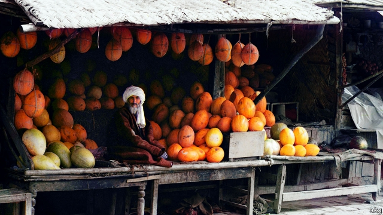

###### No inspectors call

# Uzbekistan embarks on unexpected economic reforms 

##### Government officials are forbidden from harassing small businesses 

 

> Mar 7th 2019 

WHEN MINISTERS from faraway countries tour Western financial centres to tout their plans for economic reform, their presentations are often drearily predictable. There is typically lots of talk about “fiscal consolidation”, improvements to infrastructure and the soundness of the banking system. Not Djamshed Kuchkarov, finance minister of Uzbekistan: he is proudest of what his government is not doing. The most important economic reform since Shavkat Mirziyoyev succeeded Islam Karimov as president in 2016, he says, is a three-year moratorium on inspections of businesses by meddling government officials. Government could do the businessmen of Uzbekistan no greater favour, he implies, than getting out of their way and letting them get on with things, without fear of extortion. 

In a region full of state-dominated, bureaucratic, corruption-riddled economies, it is a revolutionary thought. Mr Karimov was already running Uzbekistan when it became independent from the Soviet Union in 1991. He preserved all sorts of Soviet economic policies, including an inflated official exchange rate, currency controls and an enormous role for the state in industry and farming. To that he added such standard post-Soviet abuses as the abrupt expropriation of any private business that looked worth seizing. 

Few had expected Mr Mirziyoyev to change much of this. He had, after all, served as Mr Karimov’s prime minister for 13 years. But since coming to power he has methodically set about renovating the economy, as well as initiating more limited political reforms. Uzbekistan, with 32m people, is the most populous country in Central Asia. Until recently, it was also one of the region’s most stagnant and repressive—in a competitive field. Overnight, it has become a showcase for reform. 

Mr Mirziyoyev has sharply devalued the currency, the som, bringing the official and black-market rates into alignment. Exporters are no longer required to sell a quarter of their foreign-currency revenue to the government. This is important not just to cross-border businesses, Mr Kuchkarov argues, but also to ordinary Uzbeks, since the past shortage of hard currency had led to a shortage of cash, as businesses hoarded notes with which to buy dollars on the black market. That had left pensioners and salaried workers struggling to cash their monthly bank transfers. 

Mr Kuchkarov also trumpets the government’s decision to allow petty traders to cross the country’s previously closed borders, which he says is spurring cottage industries in areas like the Fergana valley, where Uzbekistan, Kyrgyzstan and Tajikistan intertwine. The area’s arbitrary Soviet-era borders had separated many families, who are delighted by the new opening. Yuliy Yusupov, an economist based in Tashkent, Uzbekistan’s capital, likens the effect to the fall of the Berlin Wall. The authorities have approved the first flights in 25 years between Tashkent and Dushanbe in Tajikistan. “Connectivity” is a buzzword for the government, which recently hosted a conference on improving regional infrastructure and economic co-operation. The opening is already yielding benefits: trade with the rest of Central Asia has risen by half since 2017. 

Uzbekistan has leapt up the World Bank’s ease of doing business rankings, from 166th in 2012 to 76th this year. The government has greatly simplified the tax code, to turn it into a mechanism for actually collecting tax, rather than bribes. It is also restructuring state-owned enterprises, with a view to their eventual privatisation. The management of airports and the state-owned airline is being separated, for example, as are the generation, transmission and distribution of electricity. In February Uzbekistan sold its first dollar-denominated bond, partly to set a benchmark for borrowing by local companies. It yields 5.4% over ten years, and was heavily oversubscribed. 

In Tashkent there is a palpable sense of optimism. The investment climate has improved “big time”, says Igor Kolesnikov of British American Tobacco’s Uzbek unit: “In the past it was very difficult to understand the rules of the game, but these days the situation is much healthier.” The reforms are “super for business”, enthuses an entrepreneur who imports timber from Russia. 

But as the bond prospectus noted, the immediate impact of all the upheaval is to hamper the economy. Inflation has jumped to 14%, thanks to the devaluation of the som. GDP growth has slowed from 7.9% in 2015 (suspiciously, it always grew by about 8% under Mr Karimov) to 5.1% last year. Unemployment has also risen. 

Investors remain wary. They especially distrust the courts, which readily endorsed past expropriations. The government has stopped the most blatant forms of cronyism, such as handing out the right to import certain goods duty-free to those with friends in high places. But potential conflicts of interest endure: Tashkent’s mayor, for instance, owns a company that has invested in construction projects in the city. 

The government has largely stopped forcing everyone able-bodied into the fields to help harvest cotton. But farmers are treated “like serfs”, says Mr Yusupov. Rules obliging them to grow cotton and sell it to the state at fixed prices endure. 

The true accountability that business requires to flourish is still absent. Mr Mirziyoyev has created limited space for public debate, releasing some political prisoners and tolerating a degree of criticism. Forced evictions and demolitions of homes to make way for big construction projects currently under way in Tashkent, for instance, have led to widespread condemnation—something Mr Karimov would have stamped out. But Uzbekistan still lacks opposition parties and free media. 

Just how far Mr Mirziyoyev’s reforms will go is a burning question. There is no indication that genuine democracy is on offer. Even economic reforms are bound to prompt resistance from entrenched elites. But the fact that any reforms are being undertaken at all is a big step forward. 

-- 

 单词注释:

1.inspector[in'spektә]:n. 检查员, 巡视员 [化] 检查员 

2.Uzbekistan[,uzbeki'stɑ:n]:n. 乌兹别克斯坦 

3.embark[im'bɑ:k]:vi. 乘船, 着手, 从事, 上飞机 vt. 使上船, 使上飞机, 使从事 

4.unexpect[]:[网络] 意想不到；使意外 

5.harass['hærәs]:vt. 使困扰, 使烦恼, 折磨 

6.faraway['fɑ:rәwei]:a. 遥远的, 恍惚的, 出神的 

7.tout[taut]:vi. 招徕顾客, 兜售物品 vt. 招徕, 刺探...情报 n. 兜售者, 侦查者 

8.drearily['driәrili]:adv. 沉寂地, 令人沮丧地, 令人厌倦地 

9.predictable[pri'diktәbl]:a. 可预言的 

10.typically['tipikәli]:adv. 代表性地；作为特色地 

11.fiscal['fiskәl]:a. 财政的, 国库的 [经] 财政上的, 会计的, 国库的 

12.consolidation[kәn.sɒli'deiʃәn]:n. 巩固, 团结, 合并, 加强 [医] 实变 

13.infrastructure['infrәstrʌktʃә]:n. 基础结构, 基础设施 [经] 基础设施 

14.soundness['saundnis]:n. 完全坚固, 稳固, 公正 [机] 无疵 

15.Islam['izlɑ:m]:n. 伊斯兰教 

16.karimov[]:[网络] 乌兹别克斯坦总统卡里莫夫；乌兹别克斯坦总统卡西莫夫；卡里莫夫总统 

17.moratorium[.mɒrә'tɒ:riәm]:n. 延期偿付, 暂停 [法] 延期偿付, 延缓履行, 延期偿还期 

18.meddle['medl]:vi. 干涉, 干预, 擅自摸弄 [法] 干预, 插手, 弄乱 

19.extortion[ik'stɒ:ʃәn]:n. 勒索, 敲诈, 强取 [经] 勒索, 强夺 

20.inflate[in'fleit]:vt. 使膨胀, 使得意, 使通货膨胀, 使充气 vi. 充气, 膨胀 

21.expropriation[eks.prәupri'eiʃәn]:n. 征用, 收用, 征收 [经] 征用, 没收, 征购 

22.methodically[mi'θɒdikәli]:adv. 有系统地, 有方法地 

23.renovate['renәuveit]:vt. 更新, 革新, 刷新, 修复, 使恢复活力 

24.initiate[i'niʃieit]:n. 入会, 开始 a. 新加入的 vt. 开始, 传授基本知识给 

25.populous['pɒpjulәs]:a. 人口多的, 人口稠密的 

26.stagnant['stægnәnt]:a. 不流动的, 停滞的, 不景气的, 萧条的, 污浊的, 迟钝的 [经] 萧条的 

27.showcase['ʃәukeis]:n. 陈列橱 [经] 商品陈列所, 货物陈列架 

28.devalue[di:'vælju:]:vt.vi. 降低...的价值, 贬值, 降低价值, 使(货币)贬值 [经] 贬值 

29.SOM[]:[计] 报文开始符 

30.alignment[ә'lainmәnt]:n. 队列, 结盟, 校正 [计] 校准; 对齐; 对准 

31.exporter[ik'spɒ:tә]:n. 出口商, 输出者, 出口公司 [经] 出口商, 输出者 

32.Uzbek['uzbek]:n. 乌兹别克语；乌兹别克人；乌兹别克族 a. 乌兹别克族的；乌兹别克人的；乌兹别克语的 

33.hoard[hɒ:d]:n. 贮藏物, 密藏的金钱 v. 囤积, 贮藏 

34.pensioner['penʃәnә(r)]:n. 领取抚恤金者, (英国剑桥大学的)自费生, 为金钱所收买的人, 帮佣 [法] 领取退休金者, 领取抚恤金者 

35.salaried['sælәrid]:a. 拿薪水的, 拿薪金的, 有薪金的, 有薪水的 [经] 有薪金的, 拿薪金的 

36.petty['peti]:a. 琐碎的, 小规模的, 小气的, 委琐的 [经] 小额的, 微小的, 小规模的 

37.trader['treidә]:n. 商人, 商船 [经] 交易者, 商船 

38.fergana[]: [地名] [亚洲中部] 费尔干纳（大宛）; [地名] [俄罗斯] 费尔干纳; [地名] [乌兹别克斯坦] 费尔干纳 

39.Kyrgyzstan[kiə'ɡizstən]:n. 吉尔吉斯斯坦（国名） 

40.Tajikistan[tɑ:dʒiki'stɑ:n]:n. 塔吉克斯坦 

41.intertwine[.intә'twain]:v. (使)纠缠, (使)缠绕 

42.yusupov[]:[网络] 尤斯波夫；尤苏普夫宫；尤苏普夫公爵 

43.economist[i:'kɒnәmist]:n. 经济学者, 经济家 [经] 经济学家 

44.Tashkent[tæʃ'kent]:塔什干[乌兹别克共和国首都] 

45.liken['laikәn]:vt. 比喻, 比拟 

46.Berlin[bә:'lin]:n. 柏林, (软质)柏林毛线 

47.Dushanbe[dju:'ʃɑ:nbi]:杜尚别[塔吉克斯坦首都] 

48.connectivity[kәnek'tiviti]:[计] 连通性, 连通度 

49.buzzword['bʌzwә:d]:n. 流行词 

50.regional['ri:dʒәnәl]:a. 地方的, 地域性的 [医] 区的, 部位的 

51.ranking['ræŋkiŋ]:n. 等级, 地位 a. 上级的, 头等的, 超群的 

52.mechanism['mekәnizm]:n. 机械, 机构, 结构, 机理, 技巧 [化] 机理; 历程; 机构 

53.bribe[braib]:n. 贿赂 vt. 贿赂, 收买 vi. 行贿 

54.restructuring[]:[计] 重构的 

55.eventual[i'ventʃuәl]:a. 最后的, 终于的 

56.privatisation[ˌpraɪvətaɪ'zeɪʃən]:n. 私有化, 非国营化（将国营企业转为民营） 

57.benchmark[]:[计] 基准程序; 基准 

58.oversubscribe[.әuvәsәb'skraib]:vt. 超额认购(公债等), 过量预订 [经] 超额认购(公债等), 订购(某物)过多 

59.palpable['pælpәbl]:a. 可感知的, 明显的, 触摸得到的 [医] 可触知的 

60.optimism['ɒptimizm]:n. 乐观主义, 乐观, 乐天 [医] 乐观主义, 乐观 

61.Igor[]:n. (Igor)人名；(乌克、罗、塞、斯洛伐、法、葡、俄、西、英)伊戈尔 abbr. 注入气和采出石油比（Injection Gas-Oil Ratio） 

62.kolesnikov[]:[网络] 列尼斯科夫；科列斯尼科夫 

63.Uzbek['uzbek]:n. 乌兹别克语；乌兹别克人；乌兹别克族 a. 乌兹别克族的；乌兹别克人的；乌兹别克语的 

64.enthuse[in'θju:z]:vt. 使充满热情, 使感兴趣, 使热心 vi. 热心 

65.entrepreneur[.ɒntrәprә'nә:]:n. 企业家, 主办人 [经] 承包商, 企业家 

66.prospectus[prәs'pektәs]:n. 创办计划书, (内容)说明书, 内容简介 [经] (募债)说明书 

67.upheaval[ʌp'hi:vl]:n. 举起, 隆起, 大变动, 剧变 

68.hamper['hæpә]:n. 食篮, 阻碍物, 食盒 vt. 阻碍, 使困累, 妨碍, 牵制 

69.inflation[in'fleiʃәn]:n. 胀大, 夸张, 通货膨胀 [化] 充气吹胀; 膨胀 

70.devaluation[,di:vælju'eiʃәn]:n. 降低价值, 贬值 [经] 贬值 

71.suspiciously[]:adv. 猜疑地；怀疑地 

72.alway['ɔ:lwei]:adv. 永远；总是（等于always） 

73.investor[in'vestә]:n. 投资者 [经] 投资者 

74.wary['wєәri]:a. 谨慎的, 小心的, 机警的, 周到的, 唯恐的 

75.distrust[dis'trʌst]:n. 不信任 vt. 不信任 

76.endorse[in'dɒ:s]:vt. 支持, 赞同, 背书于, 签署 [经] 赞成, 背书 

77.blatant['bleitәnt]:a. 喧嚣的, 吵闹的, 俗丽的, 炫耀的 

78.cronyism['krәjniizəm]:n. 任人唯亲 

79.serf[sә:f]:n. 农奴, 奴隶, 服苦役的人 

80.accountability[ә.kauntә'biliti]:n. 负有责任, 可说明性 [化] 衡算计量 

81.eviction[i'vikʃәn]:n. 逐出, 赶出 [法] 收回财产, 收回租地, 没收 

82.demolition[.demә'liʃәn]:n. 破坏, 毁坏, 撤销 [经] 拆毁(除,破坏) 

83.currently['kʌrәntli]:adv. 现在, 当前, 一般, 普通 [计] 当前 

84.opposition[.ɒpә'ziʃәn]:n. 反对, 敌对, 相反, 在野党 [医] 对生, 对向, 反抗, 反对症 

85.entrench[in'trentʃ]:vt. 围以壕沟, 防护, 保卫, 使处于牢固地位 vi. 掘壕, 侵犯 

86.elite[ei'li:t]:n. 精华, 精锐, 中坚分子 

