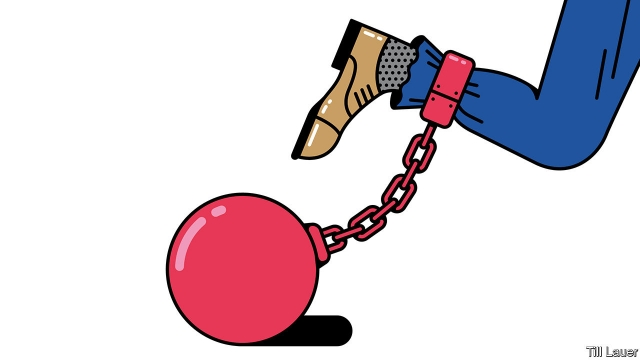

###### Banyan

# Whatever Carlos Ghosn’s misdeeds, Japan’s openness is also on trial 

##### Hostage justice is not the only problem 

 

> Mar 7th 2019 

AFTER 108 DAYS in detention, Carlos Ghosn, the former chairman of Nissan, was this week granted bail by a Tokyo court while he awaits trial on charges of financial misconduct. In Japan Mr Ghosn was once a business megastar for having rescued the giant carmaker from bankruptcy in the late 1990s. He was the hero in a manga series. When polled, many Japanese even thought the French-Lebanese-Brazilian should be running the country.  

Mr Ghosn’s world changed on November 19th when prosecutors, television cameras in tow, met his private jet on arrival in Tokyo. Prosecutors accuse him of understating his income and allege he improperly offloaded personal foreign-exchange losses via a Nissan subsidiary. He disappeared into an unheated cell, to be interrogated without lawyers and receive only fleeting visits from family. To secure convictions, Japan’s system of justice depends heavily on confessions procured during long, isolating detentions. But Mr Ghosn has refused to confess. He says he has done nothing that Nissan did not approve. 

Critics claim that, as a foreigner, Mr Ghosn has been singled out for treatment akin to a Stalinist show trial—right down to character assassination by a rabid press corps. That is not true. Mr Ghosn’s long pre-trial detention is far from unique. After his refusal to confess, Nobumasa Yokoo was detained for 966 days on charges of helping Olympus, a manufacturer of optical equipment, cook its books. The international fuss around Mr Ghosn may even have made the courts more lenient. It is extremely rare to get bail without confessing. Even then, Mr Ghosn had to post ¥1bn ($9m) and submit to surveillance cameras at his home. 

Despite Japan’s “hostage-based” justice, in which innocents have been convicted on the basis of confessions obtained by relentless interrogation, other aspects of its justice system are admirable. Overall, it throws far fewer people in prison than most developed countries: 41 out of every 100,000 people, compared with 139 in Britain and 655 in America. First-time offenders often get another chance. Recidivism is low.  

Yet Mr Ghosn’s nationality is far from irrelevant. Stephen Givens, an American lawyer practising in Japan, says the timing of the arrest is “not coincidental”. Mr Ghosn was also boss of Renault, which bailed out Nissan 20 years ago in return for a 43.4% stake. Nissan’s Japanese executives have resented its subsequent transformation into Renault’s cash cow. Nissan had maintained its formal independence in an alliance that also includes Mitsubishi, a smaller Japanese carmaker. Yet the bridling executives surmised Mr Ghosn was working towards a merger of Renault and Nissan. To many in the Japanese establishment, a foreign car company (in which the French state has a stake) owning one of Japan’s most prominent manufacturers is beyond the pale. This week the Financial Times disclosed that Nissan executives persuaded the government of Shinzo Abe to lobby its French counterpart against a merger. 

All this has a bearing because, extraordinarily, it is Nissan executives who are supplying prosecutors with much of the evidence on which they are basing their case. Nissan is also spinning the press against its former boss. Yet it beggars belief that other executives were not aware of Mr Ghosn’s remuneration schemes. And if they were not, what does it say about them, and the company’s oversight? 

Such questions are scarcely aired in the mainstream Japanese media. And for now, the odds favour the prosecutors, with an average 99.9% conviction rate. Whatever his alleged crimes, tales of Mr Ghosn’s sense of entitlement are losing him supporters. A Marie Antoinette-themed wedding reception in Versailles, underwritten in part with Renault money, betrays a want of self-reflection. President Emmanuel Macron of France, confronted with gilets jaunes at home, has not been eager to spring to Mr Ghosn’s defence.  

Yet Mr Ghosn and his combative new team of lawyers promise to fight. That puts not only the prosecutors on trial—an acquittal would be disastrous for their reputation. Mr Abe and corporate Japan also risk embarrassment. The prime minister often talks about making Japan more open to foreigners and foreign investment. Yet of various high-profile gaijin brought in to run Japanese companies over the past 30 years, only Mr Ghosn had made an indisputable success of things—until now. Japanese business is clearly not as open to the world as Mr Abe says it is. 

-- 

 单词注释:

1.banyan['bænjәn]:n. 印度榕树 [医] 榕树, 孟加拉榕 

2.carlo[]:n. 卡洛（男子名） 

3.misdeed['mis'di:d]:n. 罪行, 犯罪 [法] 不端行为, 犯罪, 恶性 

4.openness['әupәnnis]:n. 公开；宽阔；率真 

5.hostage['hɒstidʒ]:n. 人质, 抵押品 [经] 人质, 抵押品 

6.detention[di'tenʃәn]:n. 阻止, 监禁, 拘留 [医] 隔离, 拘留, 滞留, 停滞 

7.ghosn[]:[网络] 戈森 

8.nissan[]:n. 尼桑（日产汽车名） 

9.bail[beil]:n. 保释, 拎环, 杓, 栅栏 vt. 保释, 舀水 

10.misconduct[.mis'kɒndʌkt]:vt. 办错, 使行为不端 n. 办错, 渎职, 通奸 

11.megastar[ˈmegəstɑ:(r)]:n. 巨星, 演艺巨星 

12.carmaker['kɑ:,meikә(r)]:n. 汽车制造商 

13.bankruptcy['bæŋkrәptsi]:n. 破产者 [经] 破产, 倒闭 

14.manga['mæŋɡә]:n. 日本漫画 

15.sery[]:n. (Sery)人名；(俄)谢雷；(科特)塞里 

16.prosecutor['prɒsikju:tә]:n. 实行者, 告发者, 公诉人 [法] 原告, 起诉人, 检举人 

17.tow[tәu]:n. 拖, 拖绳, 拖轮 vt. 拖, 拉, 牵引 

18.understate[.ʌndә'steit]:v. 不完全地陈述, 保守地说, 有意轻描淡写 

19.allege[ә'ledʒ]:vt. 宣称, 主张, 提出, 断言 [法] 断言, 指称, 指证 

20.improperly[]:[计] 不适当地 

21.offload['ɔflәjd, ɔf'lәjd; (?@) 'ɔ:flәjd]:v. 卸下, 卸货 

22.subsidiary[sәb'sidiәri]:n. 子公司, 附件, 辅助者 a. 辅助的, 次要的, 津贴的 

23.unheated[ʌn'hi:tid]:a. 未加热的,不热的 

24.interrogate[in'terәgeit]:vt. 质问, 讯问, 审问 vi. 质问, 讯问 

25.conviction[kәn'vikʃәn]:n. 定罪, 信服, 坚信 [法] 定罪, 证明有罪, 判罪 

26.confession[kәn'feʃәn]:n. 承认, 坦白, 招供 [法] 自白, 招供, 自认有罪 

27.procure[prәu'kjuә]:vt. 获得, 取得, 导致 vi. 拉皮条 

28.akin[ә'kin]:a. 同类的, 同族的, 同源的 

29.Stalinist['stalinist]:n. 斯大林主义者 a. 斯大林主义的；斯大林的 

30.assassination[ә.sæsi'neiʃәn]:n. 暗杀 [法] 暗杀, 行刺 

31.rabid['ræbid]:a. 猛烈的, 热烈的, 急进的, 狂怒的, 偏激的, 疯狂的 [医] 狂犬病的, 咬病的 

32.corp[]:[经] 公司 

33.yokoo[]:[网络] 横尾；群马田舍 

34.detain[di'tein]:vt. 扣留, 扣押, 耽搁 [法] 拘留, 扣押, 留住 

35.Olympus[әu'limpәs]:n. 奥林匹斯山, 天堂 

36.fuss[fʌs]:n. 大惊小怪, 小题大作, 忙乱 vi. 无事自扰, 焦急, 焦燥, 忙乱 vt. 使激动, 使烦燥 

37.lenient['li:njәnt]:a. 宽大的, 温和的, 慈悲为怀的 [法] 宽大的, 仁慈的 

38.surveillance[sә:'veilәns]:n. 监视, 监督 [电] 侦测 

39.convict[kәn'vikt]:n. 囚犯, 罪犯 vt. 宣告有罪, 使知罪 

40.relentless[ri'lentlis]:a. 无情的, 冷酷的, 残酷的 

41.interrogation[in.terәu'geiʃәn]:n. 审问, 疑问句, 问号 [电] 询问 

42.offender[ә'fendә]:n. 罪犯, 无礼的人, 得罪人的人 

43.recidivism[ri'sidivizm]:n. 累犯 [医] 复发趋向, 再发趋向, 再犯趋向 

44.irrelevant[i'relәvәnt]:a. 不恰当的, 无关系的, 不相干的 [法] 无关的, 不相干的, 离题的 

45.stephen['sti:vn]:n. 斯蒂芬（男子名） 

46.given['givәn]:a. 赠予的, 沉溺的, 约定的 give的过去分词 

47.timing['taimiŋ]:n. 时间选择, 时间测定, 定时, 调速 [计] 定时器时钟 

48.coincidental[kәuinsi'dentәl]:a. 一致的, 符合的, 巧合的 

49.renault[rә'nәu]:n. 法国雷诺公司；雷诺（姓氏） 

50.resent[ri'zent]:vt. 愤恨, 憎恶, 怨恨 

51.alliance[ә'laiәns]:n. 联盟, 联合 [法] 同盟, 联盟, 联姻 

52.Mitsubishi[mi'tsubiʃi]:[经] 三菱 

53.bridle['braidl]:n. 马勒, 约束 [医] 系带, 约束 

54.surmise['sә:maiz]:n. 推测, 猜测 v. 推测, 臆测 

55.merger['mә:dʒә]:n. 合并, 归并 [经] 购并 

56.shinzo[]:[网络] 晋三；爆裂战士战蓝宝；神像 

57.abe[eib]:n. 亚伯（男子名, 等于Abraham） 

58.lobby['lɒbi]:n. 大厅, 休息室, 游说议员者 vi. 游说议员, 游说 vt. 游说 

59.counterpart['kauntәpɑ:t]:n. 副本, 复本, 配对物, 相应物 [经] 副本, 正副二份中之一 

60.extraordinarily[ik'strɔ:dθnәrili]:adv. 非凡, 破例, 特别, 非常, 离奇, 使人惊奇, 惊人, 特命, 特派 

61.remuneration[ri.mju:nә'reiʃәn]:n. 报酬 [经] 报酬, 酬劳 

62.mainstream['meinstri:m]:n. 主流 

63.odds[ɒdz]:n. 可能性, 几率, 机会, 胜算, 不平等 

64.entitlement[]:n. 权利 [法] 权利 

65.supporter[sә'pɒ:tә]:n. 支持者, 后盾, 迫随者, 护身织物 [法] 支持者, 赡养者, 抚养者 

66.marie['mɑ:ri(:), mә'ri:]:n. 玛丽（女子名） 

67.Versailles[veә'sai, vә:'seilz]:凡尔赛[法国北部城市] 

68.underwrite['ʌndәrait]:vt. 签名于下, 给...保险 vi. 经营保险业 

69.emmanuel[i'mænjuәl]:n. 以马内利（耶稣基督的别称）；伊曼纽尔（男子名, 等于Immanuel） 

70.macron['mækrәn]:n. 长音符号 

71.confront[kәn'frʌnt]:vt. 使面对, 对抗, 遭遇, 使对质, 比较 [法] 对证, 使对质, 比较 

72.gilet[dʒi'lei]:n. 背心, 马甲 

73.jaune[]:[网络] 汝拉 

74.combative[kәm'bætiv]:a. 好斗的, 好事的 

75.acquittal[ә'kwitәl]:n. 履行, 无罪开释 [经] (债务的)清偿 

76.disastrous[di'zɑ:strәs]:a. 损失惨重的, 悲伤的 

77.corporate['kɒ:pәrit]:a. 社团的, 合伙的, 公司的 [经] 团体的, 法人的, 社团的 

78.embarrassment[im'bærәsmәnt]:n. 困难, 阻碍, 困窘 [医] 窘迫 

79.gaijin['^aidʒin]:n. <日>外国人 

80.indisputable[.indis'pju:tәbl]:a. 无争论之余地的 

