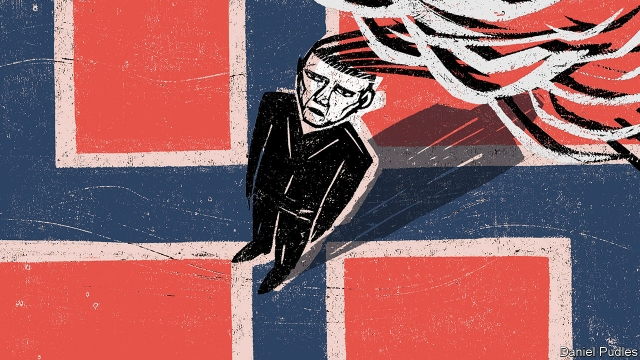

###### This thing of darkness

# In “The Tempest”, guilt and memory swirl in the mists of time 

##### An eerie Swedish novel by Steve Sem-Sandberg 

 

> Mar 7th 2019 

The Tempest. By Steve Sem-Sandberg. Translated by Anna Paterson.Faber; 256 pages; £12.99 

ANDREAS RETURNS to his childhood home on one of Norway’s many little islands. It is a Scandinavian April: “strands of mist cling to the ground, enveloping the two sentry boxes at the bridge head and what remains of the iron post for the old barrier across the road.” The opening page of Steve Sem-Sandberg’s new novel (elegantly translated from the Swedish by Anna Paterson) hints at what is to come—personal and political history shrouded by the fog of time and an unwillingness to confront the sins of the past. Those ghostly sentry boxes, the old barrier, are a warning against intrusion. 

Mr Sem-Sandberg is a novelist determined to confront the worst of humanity. His previous book, “The Chosen Ones”, dealt with the Nazi programme of forced euthanasia for ill and disabled children; “The Emperor of Lies” was set in the ghetto of the Polish city of Lodz during the Holocaust. Now he turns to Norway, and the lingering stench left by the German occupation during the second world war. The name of Vidkun Quisling, who led the collaborationist government, has since become a byword for treachery. 

Andreas’s homecoming is prompted by the death of his guardian, Johannes. At first, this seems a conventional story, as Andreas recounts his arrival from the mainland to see how things stand at the Yellow Villa, where he and his sister, Minna, grew up. But soon the reader learns of the mysterious and frightening circumstances in which they came to be in Johannes’s care. They were left with him, seemingly for a short while, by their American parents, the Lehmans, but then the couple disappeared, as if into thin air. They were never heard from again. 

Johannes, like everyone else on the island, lived in the shadow of its owner, Jan-Heinz Kaufmann. A botanist who pressed a copy of his leaflet, “On the Nutritional Requirements of Nature and of Mankind”, onto all his employees, Kaufmann had been a minister in Quisling’s government. As Andreas digs into the past, the questions only become more puzzling. What actually happened to his and Minna’s parents? What was Kaufmann really up to in his private kingdom? And how complicit were the islanders in the events of the war? Guilt hangs over the story and its setting, which seems to hover outside time: the island “seemed as if it had always existed, full of wailing, enigmatic life forms, long before anyone set foot on it”. 

This is a gripping, disturbing book. Mr Sem-Sandberg’s realistic narrative morphs into something stranger. Events occur out of chronological order, the narrator and other islanders slide casually into violence, information is repeated as if Andreas has forgotten what he has said, his memory overcome by the island mist. Throughout the reader wonders at the parallels with Shakespeare’s play of the same name; the correlations of plot and character are cleverly slippery. At the end of the play, Prospero breaks his staff, abjuring his work. Such a renunciation is not so easy on Mr Sem-Sandberg’s eerie isle. 

-- 

 单词注释:

1.tempest['tempist]:n. 暴风雨, 骚动 vt. 使受大风暴影响, 使骚动, 使激动 

2.guilt[gilt]:n. 罪行, 内疚 [法] 罪, 犯罪, 罪行 

3.swirl[swә:l]:n. 漩涡, 涡动 vt. 使成漩涡 vi. 打漩, 盘绕, 眩晕 

4.eerie['iәri]:a. 怪诞的, 可怕的, 奇异的, 令人迷惑不解的 

5.Swedish['swi:diʃ]:n. 瑞典人, 瑞典语 a. 瑞典的, 瑞典人的, 瑞典语的 

6.steve[]:n. 史蒂夫（男子名） 

7.anna['ænә]:n. 安娜（女子名） 

8.andrea['ændriә,ɑ:n'dreiә]:n. 安德里亚（男子名） 

9.Scandinavian[,skændi'neivjәn]:n. 斯堪的纳维亚人, 斯堪的纳维亚语, 北欧日耳曼语系 a. 斯堪的纳维亚人的, 斯堪的纳维亚语的, 北欧日耳曼语系的 

10.strand[strænd]:n. (绳索的)股, 绳, 串, 海滨, 河岸 vi. 搁浅 vt. 使搁浅, 使落后, 使陷于困境, 弄断, 搓 

11.cling[kliŋ]:vi. 粘紧, 附着, 紧贴, 坚持 

12.envelop[in'velәp]:vt. 包封, 遮盖, 包围 n. 信封 

13.sentry['sentri]:n. 哨兵, 看守 vt. 设岗哨 vi. 站岗, 放哨 

14.elegantly[]:adv. 优美地 

15.Paterson['pætәsәn]:帕特森[美国新泽西州东北部城市] 

16.shroud[ʃraud]:n. 尸衣, 寿衣, 覆盖物, (船的)横桅索 vt. 包以尸衣, 遮蔽, 隐藏, 覆盖 

17.unwillingness[]:n. 不情愿；不愿意 

18.confront[kәn'frʌnt]:vt. 使面对, 对抗, 遭遇, 使对质, 比较 [法] 对证, 使对质, 比较 

19.ghostly['gәustli]:a. 幽灵的, 影子似的, 精神的 

20.intrusion[in'tru:ʒәn]:n. 闯入, 侵扰 [医] [向内]突入 

21.humanity[hju:'mæniti]:n. 人性, 人类, 博爱 

22.Nazi['nɑ:tsi]:n. 纳粹党人 a. 纳粹党的 

23.euthanasia[.ju:θә'neizjә]:n. 安乐死 [医] 安死术 

24.ghetto['getәu]:n. 犹太人区 

25.Lodz[lu:ʒ]:罗兹(波兰城市) 

26.holocaust['hɔlәkɔ:st]:n. 大屠杀, 大火灾, 毁灭, 大规模烧杀 

27.Norway['nɒ:wei]:n. 挪威 

28.linger['liŋgә]:vi. 逗留, 消磨, 徘徊 vt. 消磨 

29.stench[stentʃ]:n. 恶臭, 臭气 v. (使)发恶臭 

30.quisle['kwizl]:vi. 卖国, 叛国 [法] 卖国, 做卖国贼, 当傀儡政府的头子 

31.collaborationist[kә.læbә'reiʃәnist]:n. 通敌者 

32.byword['baiwә:d]:n. 谚语, 俗话, 笑柄 

33.treachery['tretʃәri]:n. 背叛, 变节 [法] 背叛, 变节, 背信弃义 

34.homecoming['hәumkʌmiŋ]:n. 归国, 省亲回家, 同学会 

35.guardian['gɑ:diәn]:n. 看守者, 监护人, 保护人 a. 保护的 

36.Johanne[]:n. (Johanne)人名；(德、丹)约翰妮 

37.recount[ri'kaunt]:vt. 详述, 叙述, 重新计算 n. 重新计算 

38.villa['vilә]:n. 别墅 

39.minna['minə]:n. 明娜（女子名） 

40.seemingly['si:miŋli]:adv. 看来似乎, 表面上看来 

41.lehmans[]:n. (Lehmans)人名；(法)勒曼 

42.kaufmann[]: [人名] 考夫曼 

43.botanist['bɒtәnist]:n. 植物学家 

44.leaflet['li:flit]:n. 小叶, 传单 [医] 小叶 

45.nutritional[nju: 'triʃәnәl]:a. 营养的, 滋养的 [医] 营养的 

46.complicit[kәm'plisit]:a. 有同谋关系的,串通一气的[由 complicity 逆构] 

47.islander['ailәndә]:n. 岛民 

48.guilt[gilt]:n. 罪行, 内疚 [法] 罪, 犯罪, 罪行 

49.hover['hʌvә]:vi. 盘旋, 翱翔, 徘徊 vt. 孵 n. 翱翔 

50.alway['ɔ:lwei]:adv. 永远；总是（等于always） 

51.wail[weil]:n. 恸哭, 哀号, 嚎啕, 呼啸(声) vi. 恸哭, 呼啸, 悲叹, 哀号, 嚎啕 

52.enigmatic[.enig'mætik]:a. 费解的, 谜一般的, 高深莫测的 

53.realistic[riә'listik]:a. 现实的, 逼真的, 现实主义的, 实在论的 

54.narrative['nærәtiv]:n. 叙述, 故事 a. 叙述的, 叙事的, 故事体的 

55.morph[mɔf]:[计] 形态, 词态 

56.chronological[, krɔnә'lɔdʒikәl]:a. 年代学的, 按时间顺序的, 按照年月顺序的 [计] 编年的, 按年月日顺序的 

57.narrator[]:n. 讲述者, 叙述者 [法] 陈述者, 叙述者 

58.casually['kæʒjuәli]:adv. 偶然地, 临时地, 随便地 

59.correlation[.kɒrә'leiʃәn]:n. 相互关系, 相关, 关联 [医] 相关, 联系 

60.cleverly[]:adv. 聪明地, 全然, 完全, 巧妙地 

61.Prospero['prɔspәrәj]:[计] Prospero程序 

62.abjure[әb'dʒuә]:vt. 发誓断绝, 公开放弃 [法] 誓绝, 弃绝, 公开放弃 

63.renunciation[ri.nʌnsi'eiʃәn]:n. 放弃, 废弃, 弃权, 脱离关系 [法] 放弃, 抛弃, 脱离关系 

64.isle[ail]:n. 小岛, 群岛 vt. 使成为岛状 vi. 住在岛屿上 

