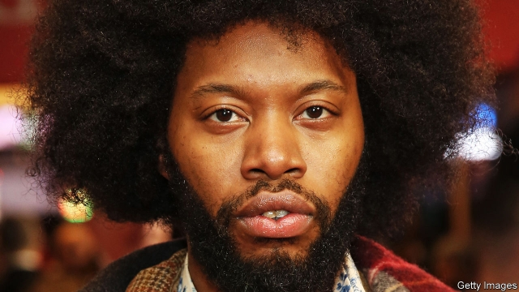

###### A bigger splash

# Jeremy O. Harris is a rising star of American theatre 

##### His plays ask their audiences to confront their own complicity in prejudice 

 

> Mar 7th 2019 

“DADDY” OPENS with a young, perfectly sculpted black man named Franklin (played by Ronald Peet) emerging from a swimming pool. His white host, a rich, silver-haired art collector named Andre, looks on lustily and lunges for the younger man’s legs (“mmmm…smooth. Like the sweetest chocolate”). Later, after the characters become lovers, Andre (a cool, reptilian Alan Cumming) repeatedly smacks Franklin’s bare buttocks, playfully but not without menace. These are unnerving scenes. In an American theatre, watching a powerful white man hungrily appraise and then slap a naked black body is inescapably fraught. 

A co-production of the New Group and the Vineyard Theatre, “Daddy” had its premiere on March 5th. It was written by Jeremy O. Harris, a 29-year-old playwright who has emerged onto America’s theatre scene with the speed and vigour of a geyser. He is swiftly earning a reputation for exploring discomforting ideas about race and sex with humour, intellectual rigour, nods to pop culture and an engaging sense of spectacle. His“Slave Play”, which dramatised a darkly amusing form of antebellum sex therapy for interracial couples, opened off-Broadway to rapturous reviews in December. “Daddy” features a full pool (a remarkable bit of staging that cost almost $100,000), a gospel choir and Mr Cumming crooning George Michael’s creepily seductive hit, “Father Figure”. 

Given that he has yet to graduate from Yale School of Drama, the playwright has made quite a splash. Producers rarely back student writers, but, says Jim Nicola of New York Theatre Workshop, which put on “Slave Play”, they made an exception for Mr Harris. The play “felt so urgent, so much a part of where the conversation is right now,” he says. “Jeremy’s got this intellectual metabolism working at warp speed,” says Amy Herzog, a playwright and lecturer at Yale. “There’s no safety net, for him or [the audience].” 

The timing is auspicious for his brand of provocation. Mr Harris, who is black and gay, asks his audiences—who tend to be older, white and left-leaning—to confront their own complicity in prejudice. In “Daddy”, Franklin, himself an artist, tries to explain to Andre why they are destined to have different reactions to a sculpture by an African-American that deals with slavery and blackness. “It’s not a nightmare or a dream you’re sharing, it’s a nightmare or a dream you’re witnessing,” he tells his white lover. Andre denies that it is necessary to share an artist’s experiences to appreciate the work. “Beauty is beauty is beauty, Franklin. No matter whose eyes are seeing it.” He relishes the edginess of having a young black boyfriend, but has little interest in his point of view. 

Growing up in Martinsville, Virginia, Mr Harris was introduced to the potential of theatre by Shakespeare. “He was a populist,” Mr Harris explains. “He knew at the end of the day our brains get off on all the things that we’re ashamed of.” But it was a teacher’s recommendation of Suzan-Lori Parks’s “In the Blood”, about a mother struggling to bring up five children, which helped him imagine an “expressive, huge, epic and unapologetic” theatrical world beyond the safe, mostly white stories that were typically told on stage. “It made it seem possible to make a play that could speak to me.” 

Mr Harris’s plays are about power and relationships; they hover at the intersection of violence and desire. His characters, many of them queer, often speak past each other. This sense of disconnection is political, he says. It is meant to show “how the simple act of not listening to people without power actually feeds power”. In his script notes for “Daddy”, he writes: “Everybody talks but no one listens. Have fun with that.” 

-- 

 单词注释:

1.jeremy['dʒerimi]:n. 杰里米（男子名） 

2.O[әu]:interj. 啊, 唉, 哎呀, 哦 n. 零 [计] 操作, 运算, 输出 

3.harris['hæris]:n. 哈里斯（英国苏格兰一地区）；哈里斯（姓氏） 

4.confront[kәn'frʌnt]:vt. 使面对, 对抗, 遭遇, 使对质, 比较 [法] 对证, 使对质, 比较 

5.complicity[kәm'plisiti]:n. 同谋, 串通, 复杂 [法] 共谋, 共犯关系 

6.daddy['dædi]:n. 爸爸 

7.sculpt[skʌlpt]:v. 雕刻, 造型 

8.Franklin['fræŋklin]:[计] 富兰克林 

9.ronald['rɔnәld]:n. 罗纳德（男子名） 

10.peet[pi:t]: [人名] [英格兰人姓氏] 皮特 Peter的昵称 

11.collector[kә'lektә]:n. 收集家, 收取款项的人 [化] 集电极; 捕收剂 

12.andre['ændri, 'ɑ:ndrei]:n. 安德烈（男子名, 等于Andrew） 

13.lustily['lʌstili]:adv. 精力充沛地, 强壮地 

14.lunge[lʌndʒ]:n. 刺, 刺进, 跃进, 套马索 v. 突进, 刺 

15.reptilian[rep'tiliәn]:a. 爬虫类的, 像爬虫的, 卑鄙的 n. 爬行动物 

16.alan['ælәn]:n. 艾伦（男子名） 

17.cum[kʌm]:prep. 和, 附有, 与 a. 附有红利的 adv. 附有红利地 

18.smack[smæk]:n. 风味, 滋味, 少量, 拍击声, 咂嘴声, 小渔船, 海洛因 vi. 有味道, 咂嘴, 发出拍击声 vt. 拍, 打, 掴, 咂, 出声地吻 adv. 啪地一声, 猛然 

19.buttock['bʌtәk]:n. 半边臀部, 屁股, 船尾突出部 vt. 过背摔 

20.playfully[]:adv. 开玩笑地；好游玩地 

21.menace['menis]:n. 威胁, 胁迫 v. 威吓, 胁迫 

22.unnerve[.ʌn'nә:v]:vt. 使失去勇气, 使胆怯, 使不能自制 [医] 除神经 

23.hungrily['hʌŋɡrəlɪ]:adv. 饥饿地; 渴望地, 贪婪地 

24.appraise[ә'preiz]:vt. 评价, 估价 [经] 评价, 鉴定 

25.slap[slæp]:n. 掴, 掌击, 侮辱, 拍击声 v. 拍击, 惩罚 adv. 正面地, 直接地, 突然地 

26.inescapably[ˌɪnɪ'skeɪpəblɪ]:adv. 逃不掉地 

27.fraught[frɒ:t]:a. 含有...的, 伴着...的, 充满...的 

28.vineyard['vinjәd]:n. 葡萄园 

29.daddy['dædi]:n. 爸爸 

30.premiere[pri'miә]:v. 初次公演, 首次露面 n. 初次的演出 a. 首次的, 首位的 

31.playwright['pleirait]:n. 剧作家 

32.vigour['vigә]:n. 精力, 活力, 力量, 效力, 气势 

33.geyser['gaizә]:n. 喷泉, 间歇泉 

34.swiftly['swiftli]:adv. 很快地, 即刻 

35.discomfort[dis'kʌmfәt]:n. 困苦, 不适 [医] 不舒适, 不舒, 烦闷, 不快活 

36.rigour['rigә]:n. 严格, 严厉, 苛刻, 严酷, 严密, 精确 

37.dramatise['dræmәtaiz]:vt.vi. 改编为剧本, 戏剧化, 戏剧般地假装, 装假, 具有戏剧性, 使惹人注目 

38.darkly['dɑ:kli]:adv. 暗, 黑, 呈黑 

39.amusing[ә'mju:ziŋ]:a. 有趣的, 引人发笑的 

40.antebellum[.ænti'belәm]:a. 战前的, 南北战争前的 

41.therapy['θerәpi]:n. 治疗 [医] 疗法, 治疗 

42.interracial[.intә'reiʃjәl]:a. 人种间的, 人种混合的 

43.rapturous['ræptʃәrәs]:a. 兴高采烈的, 狂喜的, 欢天喜地的 

44.gospel['gɒspәl]:n. 福音, 信仰, 真理 

45.croon[kru:n]:v. 低声歌唱, 低唱, 低吟 n. 低唱, 低吟, 轻哼 

46.george[dʒɔ:dʒ]:n. 乔治（男子名）；自动操纵装置；英国最高勋爵勋章上的圣乔治诛龙图 

47.creepily[k'ri:pɪlɪ]:adv. 令人毛骨悚然地 

48.seductive[si'dʌktiv]:a. 诱惑的, 引人注意的, 有魅力的 

49.Yale[jeil]:n. 耶鲁 

50.producer[prә'dju:sә]:n. 生产者, 制作者, 制作人 [化] 发生器; (炉煤气)发生炉; 制气炉; 生产者 

51.jim[dʒim]:n. 吉姆（人名） 

52.nicola[]:n. 尼古拉（男子名） 

53.york[jɔ:k]:n. 约克郡；约克王朝 

54.metabolism[mi'tæbәlizm]:n. 新陈代谢, 变态 [化] 新陈代谢; 代谢 

55.warp[wɒ:p]:n. 变形, 弯曲, 歪曲, 乖僻, 偏差, 偏见 vt. 使变形, 弄歪, 使翘曲, 使不正常, 歪曲, 使有偏见 vi. 变弯, 变歪 

56.amy['eimi]:n. 艾米（女子名） 

57.Herzog[]:赫尔佐克（人名） 

58.lecturer['lektʃәrә]:n. 演讲者, 讲师 [法] 讲演人, 讲课人, 讲师 

59.timing['taimiŋ]:n. 时间选择, 时间测定, 定时, 调速 [计] 定时器时钟 

60.auspicious[ɒ:'spiʃәs]:a. 吉兆的, 幸运的 

61.provocation[.prɒvә'keiʃәn]:n. 激怒, 刺激, 挑拨 [医] 激发[作用] 

62.destine['destin]:vt. 注定, 预定 

63.blackness['blæknis]:n. 黑, 黑色, 邪恶 [化] 黑度 

64.nightmare['naitmєә]:n. 梦魇, 恶梦, 可怕的事物(或情景、人物) [医] 梦魇, 恶梦 

65.relish['reliʃ]:n. 滋味, 风味, 美味, 爱好, 食欲, 调味品 vt. 调味, 喜欢, 玩味 vi. 有味道 

66.edginess['edʒinis]:n. 刀口锐利, 急躁 

67.boyfriend['bɔifrend]:n. 男朋友 

68.martinsville[]: [地名] [美国] 马丁斯维尔 

69.Virginia[vә'dʒinjә]:n. 弗吉尼亚 

70.Shakespeare['ʃeik.spiә]:n. 莎士比亚 

71.Populist['pɔpjulist]:n. 民粹派的成员 

72.expressive[ik'spresiv]:a. 表达的, 富于表情的 

73.epic['epik]:n. 史诗, 叙事诗 a. 史诗的, 叙事诗的 

74.unapologetic[ˌʌnəˌpɒləˈdʒetɪk]:a. 不道歉的, 不认错的； 不辩解的 

75.theatrical[θi'ætrikl]:a. 剧场的, 夸张的, 戏剧性的 n. 戏剧演出 

76.typically['tipikәli]:adv. 代表性地；作为特色地 

77.hover['hʌvә]:vi. 盘旋, 翱翔, 徘徊 vt. 孵 n. 翱翔 

78.intersection[.intә'sekʃәn]:n. 交集, 十字路口, 交叉点 [计] 逻辑乘; 与 

79.disconnection[,diskә'nekʃәn]:n. 分离, 断开, 分开 [计] 断开, 拆接, 不连接 

80.script[skript]:n. 手迹, 手稿, 正本, 手写体 vt. 改编为演出本 [计] 手写体, 小型程序 

