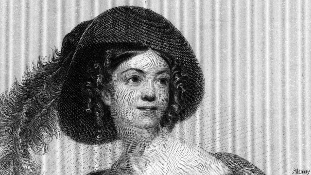

###### Spiders of society

# Letitia Elizabeth Landon was the Byron of her age 

##### Her life was tragic. But was she a great poet? 

 

> Mar 7th 2019 

L.E.L.: The Lost Life and Scandalous Death of Letitia Elizabeth Landon, the Celebrated “Female Byron”. By Lucasta Miller. Knopf; 416 pages; $30. Jonathan Cape; £25 

LETITIA ELIZABETH LANDON was the Sappho of her age, a Scheherazade and a Becky Sharp. She wore many masks. Guileless ingénue. Poet of unspoken passions. Mistress to her editor. Wronged woman. A fly caught in gossip’s web. A prolific (but impoverished) author of verse, fiction and literary hackwork. She wrote under her initials—“L.E.L.”—with their echoes of “elle” and “hell”. The poet Robert Southey had called Byron and Shelley “the Satanic school”; the infernal L.E.L. was its first female member. She called her poems “songs” as if they were composed not on the page, but on the lyre. “I have sung passionate songs of beating hearts,” she wrote, “the fallen leaf, the faded flower, the broken heart, and the early grave.” 

Hearts beat to her metre. The writer Edward Bulwer-Lytton rushed each week at Cambridge for the new Literary Gazette and “the three magical letters ‘L.E.L.’.” Elizabeth Barrett (not yet Browning) admired Landon’s “raw bare powers” and thought her the pre-eminent poetess. Barrett’s “Aurora Leigh” drew on Landon’s smash hit, “The Improvisatrice”. The Brontës hung on her every restless word. 

Who now reads L.E.L? asks Lucasta Miller, as she seeks to restore Landon to the temple of the muses. In life, Landon was wounded by gossip—“the spiders of society/ They weave their petty webs of lies and sneers”—and by the “cold mockery” of the critics. She has suffered worse in death. In “Middlemarch” George Eliot makes the silly, spendthrift Rosamond Vincy a fan. In Virginia Woolf’s “Orlando”, the hero-turned-heroine is aghast to find herself in the early 19th century with L.E.L.’s stanzas pouring from her pen, “the most insipid verse she had ever read in her life.” The charge sheet is grave: she was a peddler of “rubbishy sentimentality”, a poet of “pasteboard” passions, her “phantasies” no more sophisticated than a schoolgirl’s. 

Born in 1802, she was indeed a schoolgirl when she began writing. She lived with her grandmother in the new London suburb of Brompton (later she reinvented her rackety upbringing). Across the way was William Jerdan, editor of the Literary Gazette, his wife and their young family. In 1820 Landon, aged 18, sent her governess to Jerdan with a note. A young lady unknown to him “ventures to intrude the enclosed lines”. He published them, made her famous and made her his mistress. Thomas Carlyle called Jerdan the “satyr-cannibal Literary Gazeteer”. He became Landon’s Svengali. He puffed and promoted his Infant Prodigy. They had three illegitimate children and she gave each one up in turn. 

In Landon’s poems love is ever unrequited and power seldom in the woman’s hands: “The love which is as life to me/Is but a simple toy to you.” It could not last. The lustful, live-and-let-live Regency would become the laced and hypocritical age of Victoria. “Fame” and “shame” is a commonly recurring rhyme in Landon’s songs. The only hope for her almost-ruined reputation was to marry. George Maclean, British governor of Cape Coast Castle (in modern Ghana), obliged. In 1838 she sailed with her new husband to west Africa; eight weeks later she was found dead with a bottle of Prussic acid in her hand. She was 36. Self-destruction? Murder? Was there a female rival, asked the Weekly True Sun, in whose veins ran the “hot blood of Africa”? 

Ms Miller is excellent on social and literary London: the Romantic rage for sex-and-suicide; the nabobs of Empire; the bluestocking ladies and Garrick Club gentlemen; the Grub Street scribblers and Punch magazine’s social-climbing Mr and Mrs Spangle Lacquer. Her reading of Landon’s poems is less convincing. When she writes that Landon’s “Flowers of Loveliness” is “not blandly shallow but deeply shallow”, or that what might first be read as “mawkishness” is really a “channel” for “suppressed personal rage”, or that her “naive sentimentalism” reveals “bitter and cynical depths when voiced”, the modern reader returns to the poems, reads them aloud and concludes: shallow, mawkish, sentimental. Nevertheless, this book is a fascinating portrait of a woman and her times and a heartbreaking song of the fickleness of love and fame. 

-- 

 单词注释:

1.letitia[li'tiʃiə]:n. 利蒂希娅（女子名） 

2.elizabeth[i'lizәbәθ]:n. 伊丽莎白（女子名） 

3.Landon['lændәn]:n. [姓氏] 兰德勒 

4.byron['baiәrәn]:n. 拜伦（男子名） 

5.tragic['trædʒik]:a. 悲惨的, 悲剧的 

6.scandalous['skændәlәs]:a. 不体面的, 可耻的, 诽谤性的, 爱传播丑闻的 

7.lucasta[]: [人名] 卢卡丝塔 

8.jonathan['dʒɔnәθәn]:n. 乔纳森（男子名） 

9.cape[keip]:n. 岬, 海角, 披肩, 斗蓬 

10.letitia[li'tiʃiə]:n. 利蒂希娅（女子名） 

11.elizabeth[i'lizәbәθ]:n. 伊丽莎白（女子名） 

12.Landon['lændәn]:n. [姓氏] 兰德勒 

13.sappho['sæfәu]:n. 莎孚（古代希腊的女诗人） 

14.Scheherazade[ʃi,hiərə'zɑ:də; ʃə,hεə-]:n. 谢赫拉莎德（《天方夜谭》中的苏丹新娘） 

15.becky['beki]:n. [口]上挂钩 

16.guileless['gailis]:a. 不狡猾的, 诚实的 

17.unspoken['ʌn'spәukәn]:unspeak的过去分词 

18.wronge[]:[网络] 。。。 

19.prolific[prәu'lifik]:a. 有生殖力的, 多产的, 丰富的 [医] 多育的, 多产的, 繁殖的 

20.impoverish[im'pɒvәriʃ]:vt. 使贫穷, 耗尽...的力气 

21.verse[vә:s]:n. 诗, 韵文, 诗句 vt. 用诗表达 vi. 作诗 

22.hackwork['hækw\\:k]:n. 粗劣文学作品 

23.elle[]:n. 世界时装之苑（时尚类期刊）；依尼（服装品牌名） 

24.Robert['rɔbәt]:[法] 警察 

25.southey['sauði, 'sʌði]:n. 骚塞（姓氏） 

26.shelley['ʃeli]:n. 谢莉（女子名） 

27.Satanic[sә'tænik]:a. 魔鬼似的, 穷凶极恶的, 邪恶的, 非常残酷的, 罪恶的, 极恶劣的 

28.infernal[in'fә:nl]:a. 阴间的, 恶魔的 

29.lel[]:abbr. low-energy laser 低能量激光 

30.lyre['laiә]:n. 里拉(古希腊乐器), 琵琶类乐器 [医] 琴, 琴形物 

31.passionate['pæʃәnit]:a. 热情的, 热烈的, 易怒的, 热恋的 

32.edward['edwәd]:n. 爱德华（男子名） 

33.Cambridge['keimbridʒ]:n. 剑桥 

34.gazette[gә'zet]:n. 报, 公报, 报纸 vt. 在公报上宣布, 刊载于公报 

35.magical['mædʒikәl]:a. 魔术的, 有魔力的, 不可思议的 

36.barrett['bærәt, 'bærit]:n. 巴雷特（男子名） 

37.poetess['pәuitis]:n. 女诗人 

38.aurora[ɒ:'rɒ:rә]:n. 曙光, 极光, 奥罗拉(曙光女神) [电] 极光 

39.leigh[l i:]:n. 利（男子名, 等于Lee） 

40.improvisatrice[im,prɔvizɑ'tri:tʃe]:n. 女即兴诗人, 女即兴作曲家[演奏者] 

41.miller['milә]:n. 厂主, 蛾 [机] 铣床 

42.muse[mju:z]:n. 沉思, 冥想 v. 沉思, 冥想, 若有所思地凝望或说 

43.petty['peti]:a. 琐碎的, 小规模的, 小气的, 委琐的 [经] 小额的, 微小的, 小规模的 

44.mockery['mɒkәri]:n. 嘲弄, 笑柄, 歪曲 

45.Middlemarch[]:米德尔马契（小说名） 

46.george[dʒɔ:dʒ]:n. 乔治（男子名）；自动操纵装置；英国最高勋爵勋章上的圣乔治诛龙图 

47.eliot['eljәt]:n. 艾略特（姓氏） 

48.spendthrift['spendθrift]:n. 浪费的人 a. 浪费的, 挥霍无度的 

49.Rosamond[]:n. 罗莎蒙德（女子名） 

50.vincy[]:n. 文西（女子名） 

51.Virginia[vә'dʒinjә]:n. 弗吉尼亚 

52.orlando[ɔ:'lændәu]:n. 奥兰多（美国城市名, 男子名） 

53.aghast[ә'gɑ:st]:a. 惊骇的, 吓呆的 

54.stanza['stænzә]:n. 演出期, (体育比赛的)局 

55.insipid[in'sipid]:a. 乏味的, 清淡的, 难吃的 [医] 无味的 

56.peddler['pedlә]:n. (毒品)小贩, 传播者, 沿街叫卖的小贩 

57.rubbishy['rʌbiʃi]:a. 碎屑的, 破烂的 

58.sentimentality[.sentimen'tæliti]:n. 多愁善感 [医] 情感生活 

59.pasteboard['peistbɒ:d]:n. 厚纸, 纸板, 纸牌 a. 纸板做的, 不结实的 

60.phantasy['fæntәsi]:n. 幻想, 怪念头, 想象 vt.vi. 幻想, 怪念头, 想象 

61.sophisticate[sә'fistikeit]:n. 久经世故的人, 精于...之道的人 vt. 篡改, 曲解, 使变得世故, 掺合, 弄复杂 vi. 诡辩 

62.schoolgirl['sku:lgә:l]:n. 女学生 

63.Brompton['brɔmtәn]:cocktail, Brompton mixture 布朗普顿混合麻醉剂(用于减轻癌症引起的疼痛等) 

64.reinvent[.ri:in'vent]:vt. 重新使用；彻底改造；重复发明（在不知他人已发明的情况下） 

65.rackety['rækiti]:a. 喧扰的, 喧闹的, 寻欢作乐的 

66.upbringing['ʌp.briŋiŋ]:n. 教养 

67.william['wiljәm]:n. 威廉（男子名）；[常作W-][美俚]钞票, 纸币 

68.governess['gʌvәnis]:n. 女家庭教师 

69.intrude[in'tru:d]:vi. 闯入, 侵入 vt. 强加于 

70.thoma[]:n. (Thoma)人名；(阿尔巴、阿拉伯)索玛；(英、德、罗、匈、捷、塞、瑞典)托马 

71.Carlyle[kɑ:'lail]:n. 卡莱尔 

72.gazeteer[]:n. 地名词典 [网络] 澳大利亚地理地名 

73.svengali[svenˈgɑ:li]: [人名] 斯文加利 

74.prodigy['prɒdidʒi]:n. 惊人的事物, 奇迹, 不凡的人, 奇才, 神童, 预兆 

75.illegitimate[.ili'dʒitimәt]:a. 不法的, 私生的, 不合规则的, 不合理的, 不符合习惯的 n. 无合法身份的人 vt. 宣告...为非法, 证明...为私生 

76.unrequited[.ʌnri'kwaitid]:a. 无报答的, 没有受到报复的 [法] 无报酬的, 得不到报答的, 无报复的 

77.lustful['lʌstful]:a. 贪欲的, 好色的 

78.regency['ri:dʒәnsi]:n. 摄政统治, 摄政权, 摄政统治区 [法] 摄政, 摄政权, 统治 

79.hypocritical[.hipә'kritikl]:a. 伪善的, 伪善者的 

80.victoria[vik'tɔ:riә]:n. 维多利亚（女子名） 

81.recur[ri'kә:]:vi. 复发, 回到, 重现, 再来, 诉诸, 采用, 循环 

82.Maclean[]:n. (MacLean)人名；(英)麦克莱恩 

83.Ghana['gɑ:nә]:n. 加纳 

84.prussic['prʌsik]:a. 普蓝的, 普鲁士蓝的 

85.vein[vein]:n. 血管, 静脉, 纹理, 气质, 情绪 vt. 使有脉络, 像脉络般分布于 

86.nabob['neibɔb]:n. 印度莫卧儿帝国的地方长官, 在印度发财的欧洲人, 富豪 

87.bluestocking['blu:stɒkiŋ]:n. 女学者, 装做有学问的女人 

88.Garrick['^ærik]:灰吕 

89.grub[grʌb]:n. 幼虫, 乏味之人 v. 寻找, 翻掘 

90.scribbler['skriblә]:n. 潦草书写的人, 三流作家, 小文人 

91.Mr['mistә(r)]:先生 [计] 存储器回收程序, 多重请求 

92.spangle['spæŋgl]:n. 亮晶晶的小物件 v. (使)闪烁 

93.lacquer['lækә]:n. 瓷漆, 漆, 漆器 vt. 涂漆 

94.les[lei]:abbr. 发射脱离系统（Launch Escape System） 

95.loveliness['lʌvlinis]:n. 可爱, 美丽, 魅力 

96.blandly['blændli]:adv. 温和地, 柔和地 

97.mawkishness['mɔ:kiʃnis]:n. 伤感；心情不佳 

98.suppress[sә'pres]:vt. 镇压, 使止住, 禁止, 抑制, 查禁 [法] 镇压, 平定, 禁止出版 

99.naive[nɑ:'i:v]:a. 天真的, 纯真的, 幼稚的 

100.sentimentalism[,senti'mentəlizəm]:n. 感伤主义 

101.cynical['sinikәl]:a. 愤世嫉俗的, 讽刺的, 冷嘲的 

102.mawkish['mɒ:kiʃ]:a. 淡而无味的, 令人作呕的, 感伤的 

103.sentimental[.senti'mentl]:a. 感伤的, 感情用事的 

104.fascinate['fæsineit]:vt. 令人入神, 使着迷 vi. 入迷 

105.heartbreaking['hɑ:tbreikiŋ]:a. 令人悲伤的, 极其累人的, 令人动情的 

106.fickleness['fɪklnəs]:n. 易变; 无常; 浮躁; 变化无常 

