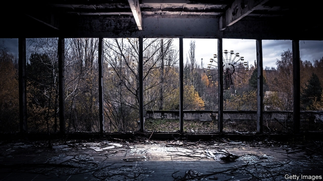
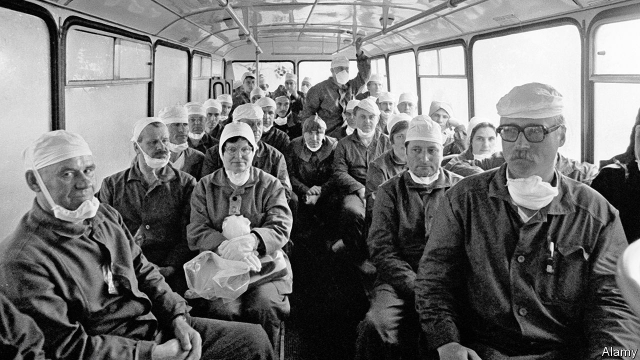

###### A view from the bridge

# The tragedy of Chernobyl 

##### Three new books reconsider the impact of the worst-ever nuclear catastrophe 

 

> Mar 7th 2019 

Manual for Survival. By Kate Brown. W.W. Norton; 432 pages; $27.95. Allen Lane; £20 

Midnight in Chernobyl By Adam Higginbotham. Simon & Schuster; 560 pages; $29.95. Bantam Press; £20 

Chernobyl: History of a Tragedy. By Serhii Plokhy. Basic Books; 432 pages; $32. Allen Lane; £20 

AT THE ENTRANCE to the “Zone of Alienation” around the Chernobyl Nuclear Power Plant in Ukraine stand two kiosks, painted a radioactive shade of yellow. Along with snacks for the tourists who descend on the site of the world’s worst nuclear disaster, they sell Chernobyl-themed merchandise: T-shirts bearing the radiation symbol, gas masks and glowing fridge magnets. Next to a vat of mulled wine is a stack of mugs decorated with pictures of the frozen Ferris wheel in Pripyat (a town built to house the plant’s employees), and of the infamous reactor No. 4, which melted down on the morning of April 26th 1986. 

The weather was unseasonably warm on that fateful Saturday, and Pripyat was in a festive mood. Locals planned to attend weddings or to stroll into the idyllic forests they had come to love. An engineer who arrived in 1971 described the surroundings reverently: “Silence and a sense of primeval creation.” Then the safety test scheduled for that morning went tragically wrong. Anatoliy Diatlov, the plant’s deputy chief engineer, called the ensuing meltdown “a picture worthy of the pen of the great Dante”. While monitors in Sweden picked up radiation just hours after the explosion, it took the Soviet government three days to release a terse statement: “There has been an accident at the Chernobyl atomic-electricity station.” 

At a spot near the plant, a tour guide commends the “good panoramic view” of the reactors. Selfies ensue. One young woman snaps away as her friend dons a gas mask and strikes a pose against the backdrop of the plant’s cooling system. A man photographs his girlfriend in front of the reactors, smiling and flashing a peace sign. 

Chernobyl’s atoms were supposed to be peaceful. In the Soviet Union nuclear energy represented technological progress and the human conquest of nature. Soviet leaders saw it as a means to power their empire; the RBMK, or “high power channel reactor”, was central to their plans. Touted as more powerful and cheaper than other models, the RBMK was also considered so safe that the Soviets skimped on protective containment structures. Anatoliy Alexandrov, head of the Soviet Academy of Sciences, reportedly insisted that the RBMK was reliable enough to be put on Red Square. 

Yet as officials at the Ministry of Medium Machine Building, the secretive outfit in charge of the Soviet nuclear industry, knew all too well, the RBMK had fatal flaws. The boron control rods used to slow reactions were tipped with graphite, meaning that during an emergency shutdown, the rods would briefly stoke the nuclear reaction before damping it down. As Adam Higginbotham writes in “Midnight in Chernobyl”, one of three recent books about the event and its aftermath, it was as if “the pedals of a car had been wired in reverse, so that hitting the brakes made it accelerate instead of slowing down”. 

The inefficiencies, shortages and dysfunction of the Soviet system accentuated the risks. “God forbid that we suffer any serious mishap—I’m afraid that not only Ukraine but the Union as a whole would not be able to deal with such a disaster,” the plant’s director, Viktor Briukhanov, had prophesied a few months earlier. 

 

The tourists, mostly Europeans, along with a smattering of Chinese and some well-off Ukrainians (personal tours cost around $400, more than the average monthly salary), board buses and vans labelled “alpha”, “beta” and “gamma”. Some were inspired to visit by video games set in the Zone. Others have come for the Instagrammable ruin porn. One group follows a young guide wearing radiation-symbol earrings, signs detached from their meaning. In this way, writes Serhii Plokhy in “Chernobyl”, a masterful retelling of the episode, disaster is turned into myth. 

Mr Plokhy, a Harvard historian, grew up 500km south-east of the facility and developed an inflamed thyroid, a sign of radiation exposure. His aim is to reinstate Chernobyl as, above all, a human tragedy. Drawing on archives opened in the wake of Ukraine’s revolution of 2013-14, plus first-hand recollections, he scrupulously reconstructs the calamity, from the plant’s rushed construction to the erection of a new “sarcophagus” over the failed reactor three decades later. He shows how Chernobyl embodied the Soviet system’s failings, and in turn played a role in the system’s collapse, ultimately acting as a catalyst for Mikhail Gorbachev’s policy of glasnost, or openness, and for nationalist movements in republics such as Ukraine, Belarus and Lithuania. Mr Higginbotham’s description of the initial hours inside the burning reactor is vivid, but it is Mr Plokhy’s book that will endure as a definitive history. 

Nowhere is the need for such a history more palpable than inside the Zone. “Chernobyl has become a brand,” laments one veteran guide. He pulls out his phone to show a zany dance clip made by Polish visitors that begins with a car careening across a nearby bridge—known locally as the “bridge of death”, because those who stood on it to watch flames from the reactor lick the sky received lethal doses of radiation. Chernobyl ought to be a memorial site, a reminder of the perils of hubris, its atmosphere closer to a concentration camp than to the twisted theme park it has become. 

The blasé attitude has been encouraged by the systematic minimisation of the disaster’s impact. Official estimates of the death toll range from 31 to 54, along with several thousand later cancer cases. In 1988 the Soviet health minister claimed that all was well: “we can today be certain that there are no effects of the Chernobyl accident on human health.” Studies by international organisations such as the WHO and the IAEA offered similar assurances. 

In “Manual for Survival”, a magisterial blend of historical research, investigative journalism and poetic reportage, Kate Brown sets out to uncover Chernobyl’s true medical and environmental effects. Where officials attributed rising levels of illness in contaminated areas to better screening and psychological stress, she finds long-suppressed evidence that suggests a different story. Her book is an awe-inspiring journey through archives and the villages, forests and swamps of the Polesia region of Ukraine and Belarus. While direct causation is nearly impossible to prove, she marshals correlations that link chronic exposure to low doses of radiation with thyroid, heart and eye disease, cancers, endocrine and digestive-tract disorders, anaemia, birth defects and infant deaths. 

Those walking the grounds of Chernobyl now receive a personal dosimeter which beeps constantly, speeding up as levels of gamma radiation rise. Inside the Zone, tourists scramble about in search of “hotspots”, their dosimeters a chorus of disregarded warnings. Today, most visitors absorb less radiation in a day than during a typical transatlantic flight. In 1986 harmful fallout spread for hundreds of kilometres; political rows erupted over the dose and distance thresholds for evacuation. In time, radiation moved through the environment—and human bodies—in complex, poorly understood ways. 

The swampy flood plains of Polesia, Ms Brown finds, are especially conducive to the transmission of radiation into the food chain. Manipulation of the weather further skewed the distribution: Soviet pilots seeded clouds in Belarus to induce radioactive rains before the toxins could reach large cities such as Moscow. In Ukraine they shot cement into the sky to prevent downpours from flooding the Pripyat river and spreading radiation into the Dnieper, the country’s main waterway. 

Most haunting are her accounts of how radioactive isotopes progressed through the food supply. Loth to sacrifice production targets, Soviet planners ordered slaughterhouses to mix radioactive and clean meat to make sausages. The Soviets were not alone in circulating poisoned wares: Greek wheat contaminated by the fallout was eventually blended into consignments of aid shipped to Africa and East Germany. Even now, Ms Brown joins pickers in the forests of northern Ukraine who combine “hot” and clean berries so the crop meets radiation requirements for exports. 

She argues that the cover-up extended beyond the Soviet Union. After all, the global nuclear industry relies on the notion that low doses of radiation are harmless. If Chernobyl could be shown to have no effect on human health, Ms Brown argues, “then the fallout from nuclear testing, the seeping radioactive waste from bomb factories, the civilian reactors that daily emitted radioactivity, the widespread use of radiation in medical treatments, and the exposed bodies of workers, patients and innocent bystanders in secret medical tests could be forgotten.” In this analysis, Chernobyl was a crisis not only of the Soviet Union but of modern civilisation. She sees it as the emblematic catastrophe of the Anthropocene, the geological epoch during which human activity has become the dominant influence on the environment. 

In the Zone the fallout from human activity is embedded in the ground. The topsoil is thick with leaves that have turned a morbid, corpse-like grey (as Ms Brown recounts, radiation impedes the natural process of decomposition). The trees, some bent by the effects of radiation, emit creaks that fill the Zone’s eerie silence like an infant’s wails. Verdant green pines line the roads, concealing the forests’ wounds. 

-- 

 单词注释:

1.Chernobyl[tʃiә'nɔ:bil]:[经] 车诺比 

2.reconsider[.ri:kәn'sidә]:v. 再考虑, 重新考虑 

3.kate[keit]:n. 凯特（女子名, 等于Catherine） 

4.norton['nɔ:tәn]:n. 诺顿（男子名）；诺顿公司（美国一软件公司） 

5.allen['ælin, 'ælәn]:n. 艾伦（男子名） 

6.Adam['ædәm]:n. 亚当 [计] 自动直接存取管理 

7.Schuster[]:n. (Schuster)人名；(英、德、匈、捷、瑞典)舒斯特 舒斯特 

8.bantam['bæntәm]:n. 矮脚鸡 

9.alienation[.eiljә'neiʃәn]:n. 疏远, 离间, 转让 [医] 精神错乱 

10.ukraine[ju(:)'krein]:n. 乌克兰（原苏联一加盟共和国, 现已独立） 

11.kiosk[ki'ɒsk]:n. 亭, 凉亭, 报摊 

12.VAT[væt]:n. 大桶 vt. 装入大桶, 在大桶里处理 

13.mull[mʌl]:n. 软薄布, 混乱 vt. 研磨, 细想 vi. 深思熟虑 

14.Ferris['feris]:n. 费理斯（男子名） 

15.pripyat[]: [电影]普利皮亚特 

16.reactor[ri'æktә]:n. 反应者, 反应器, 反应堆, 电抗器 [化] 反应釜; 反应锅 

17.unseasonably[ˌʌn'siːzənəbli]:adv. 反季节地；不合季节地 

18.fateful['feitful]:a. 宿命的, 重大的, 决定性的 

19.festive['festiv]:a. 庆祝的, 喜庆的, 欢乐的 

20.stroll[strәul]:n. 闲逛, 漫步 v. 闲逛, 漫步 

21.idyllic[ai'dilik]:a. 田园诗的, 牧歌的, 悠闲的 

22.primeval[prai'mi:vl]:a. 初期的, 原始的, 远古的 

23.creation[kri:'eiʃәn]:n. 创造, 创作物, 发明 [化] 产生 

24.tragically['trædʒɪklɪ]:adv. 悲剧地, 悲惨地 

25.anatoliy[]:n. (Anatoliy)人名；(乌克)阿纳托利 

26.ensuing[]:a. 接著发生的 

27.meltdown['meltdaun]:[经] 销毁(货币等), 变卖(财产) 

28.dante['dænti]:n. 但丁（意大利诗人） 

29.Sweden['swi:dn]:n. 瑞典 

30.terse[tә:s]:a. 简洁的, 扼要的 

31.commend[kә'mend]:vt. 嘉奖, 委托给, 推荐 

32.panoramic[.pænә'ræmik]:a. 全景的 

33.selfies[]:[网络] 自拍照 

34.ensue[en'su:]:vi. 跟着发生, 继起 vt. 追求 

35.don[dɒn]:n. 西班牙贵族(或绅士), 先生, 阁下 vt. 穿上 

36.backdrop['bækdrɒp]:n. 背景幕, 背景 

37.girlfriend[]:n. 女朋友 

38.technological[.teknә'lɒdʒikl]:a. 技术的 [经] 工艺的, 技术的 

39.rbmk[]:[网络] 反应堆；石墨轻水型核反应炉；石墨水冷堆 

40.tout[taut]:vi. 招徕顾客, 兜售物品 vt. 招徕, 刺探...情报 n. 兜售者, 侦查者 

41.skimp[skimp]:vt. 少给, 克扣 vi. 吝啬 a. 少的, 不足的 

42.containment[kәn'teinmәnt]:n. 抑制, 牵制, 遏制 [法] 抑制, 牵制, 遏制 

43.alexandrov[]:n. (Alexandrov)人名；(罗、保)亚历山德罗夫 

44.reportedly[ri'pɒ:tidli]:adv. 根据传说, 根据传闻, 据报道 

45.secretive[si'kri:tiv]:a. 秘密的, 偷偷摸摸的, 分泌的, 促进分泌的 

46.outfit['autfit]:n. 用具, 配备, 机构 vt. 配备, 供应 vi. 得到装备 

47.flaw[flɒ:]:n. 缺点, 裂纹, 瑕疵, 一阵狂风 [化] 划痕; 裂缝; 裂纹 

48.boron['bɒ:rɒn]:n. 硼 [化] 硼B 

49.graphite['græfait]:n. 石墨 [化] 石墨 

50.shutdown['ʃʌtdaun]:n. 关门, 停工, 停机 [经] 停工 

51.briefly['brifli]:adv. 简短地, 扼要地, 简明地, 简单地 

52.stoke[stәuk]:v. 司炉, (使)大吃 

53.higginbotham[]: [人名] [英格兰人姓氏] 希金博特姆 Higginbottom的变体 

54.aftermath['ɑ:ftәmæθ]:n. 结果, 后果 [法] 后果, 结果 

55.pedal['pedl]:n. 踏板, 脚蹬子 a. 脚的, 脚踏的 vt. 用脚踏动 vi. 踩踏板, 骑车 

56.inefficiency[.ini'fiʃәnsi]:n. 无效率, 无能 [化] 效率低; 效率差 

57.dysfunction[dis'fʌŋkʃәn]:n. 机能不良, 机能障碍 [医] 机能障碍, 机能不良 

58.accentuate[æk'sentjueit]:vt. 以重音念, 强调, 重读 

59.Viktor[]:维克托（人名） 

60.prophesy['prɒfәsai]:v. 预言, 预报 

61.smatter['smætә]:v. 略知, 略懂 n. 一知半解, 肤浅知识, 少数 

62.ukrainian[ju(:)'kreinjәn]:a. 乌克兰的；乌克兰人的 

63.alpha['ælfә]:n. 希腊字母表的第一个字母, 最初, 开端 [医] α(希腊文的第一个字母), 甲种 

64.beta['beitә]:n. 希腊字母表的第二个字母 [医] β(希腊文的第二个字母), 乙种 

65.gamma['^æmә]:n. 希腊语的第三个字母(Γ,γ) [医] γ(希腊文第三个字母), 丙种, 微克(千分之一毫克) 

66.porn[pɔ:n]:n. 色情描写, 黄色书刊, 色情画, 色情照片, 色情文学 

67.earring['iәriŋ]:n. 耳环, 耳饰 

68.detach[di'tætʃ]:vt. 使分离, 分遣 [机] 摘下, 分离, 卸下 

69.masterful['mɑ:stәful]:a. 傲慢的, 主人派头的, 熟练的 

70.myth[miθ]:n. 神话, 虚构的事, 虚构的人 

71.Harvard['hɑ:vәd]:n. 哈佛大学 

72.historian[hi'stɒ:riәn]:n. 历史学家, 记事者 

73.inflame[in'fleim]:vt. 激怒, 点火, 激起 vi. 着火, 激动, 发炎 

74.thyroid['θairɒid]:a. 甲状腺的, 甲状的, 甲状软骨的 n. 甲状腺, 甲状软骨, 甲状腺剂 

75.reinstate[.ri:in'steit]:vt. 使复原, 使恢复, 使复立 

76.archive['ɑ:kaiv]:vt. 把...存档 n. 档案馆, 档案文件 [计] 挡案库, 存档 

77.recollection[.rekә'lekʃәn]:n. 记忆, 回想, 回忆 

78.scrupulously[]:adv. 严谨, 一丝不苟, 用心, 准确, 多顾虑, 小心翼翼, 审慎, 诚实, 真心实意 

79.reconstruct[.ri:kәns'trʌkt]:vt. 重建, 改造 [化] 按原样修复 

80.calamity[kә'læmiti]:n. 灾难, 不幸事件 

81.erection[i'rekʃәn]:n. 直立, 竖起, 建筑物 [化] 装配 

82.sarcophagus[sɑ:'kɒfәgәs]:n. 石棺 

83.embody[im'bɒdi]:vt. 具体表达, 使具体化 [经] 合并, 具体化, 具体表现 

84.failing['feiliŋ]:n. 失败, 缺点 prep. 如果没有... a. 失败的 

85.catalyst['kætәlist]:n. 触媒, 接触剂, 催化剂, 刺激因素, 促进因素 [计] 催化剂 

86.Mikhail[]:米哈伊尔（人名） 

87.glasnost['glæsˌnəʊst]:n. 公开性; 公开化 

88.openness['әupәnnis]:n. 公开；宽阔；率真 

89.nationalist['næʃәnәlist]:n. 国家主义者, 民族主义者 

90.Belarus['belərəs]:n. 白俄罗斯, 白俄罗斯共和国 

91.lithuania[,liθju(:)'einjә, -niә]:n. 立陶宛 

92.definitive[di'finitiv]:n. 限定词 a. 限定的, 决定性的 

93.palpable['pælpәbl]:a. 可感知的, 明显的, 触摸得到的 [医] 可触知的 

94.lament[lә'ment]:n. 悲叹, 悔恨, 恸哭, 挽歌, 悼词 vt. 哀悼 vi. 悔恨, 悲叹 

95.zany['zeini]:n. 小丑, 笨人, 马屁精 a. 滑稽的, 滑稽愚蠢的 

96.clip[klip]:n. 修剪, 夹子, 回形针, 剪下来的东西 vt. 修剪, 痛打, 夹牢, 剪报 vi. 剪报 

97.careen[kә'ri:n]:vt. 倾斜, 倾, (为了修理或清洁)使倾侧 n. 船的倾侧 

98.locally['lәukәli]:adv. 地方性地, 局部性地, 在当地 

99.lethal['li:θәl]:a. 致命的 n. 致死因子 

100.reminder[ri'maindә]:n. 提醒的人, 暗示 [经] 催单 

101.peril['peril]:n. 危险, 冒...之险, 险境, 险因 vt. 置...于险境, 冒险, 危及 

102.hubris['hju:bris]:n. 傲慢, 狂妄野心 

103.minimisation[ˌmɪnɪmaɪ'zeɪʃən]:n. 极小化（求最小值, 最简化） 

104.toll[tәul]:n. 通行费, 代价, 钟声 vt. 征收, 敲钟, 鸣钟, 勾引, 引诱 vi. 征税, 鸣钟 

105.organisation[,ɔ: ^әnaizeiʃən; - ni'z-]:n. 组织, 团体, 体制, 编制 

106.IAEA[]:abbr. 国际原子能组织（International Atomic Energy Agency） 

107.assurance[ә'ʃuәrәns]:n. 保证, 把握, 信心, 保险 [经] 保证, 担保, 保险 

108.magisterial[.mædʒi'stiәriәl]:a. 长官的, 威严的, 有权威的 [法] 长官的, 有权威的, 专横的 

109.investigative[in'vestigeitiv]:a. 审查的, 调查的, 好研究的 [法] 调查的, 审查的, 受调查研究的 

110.journalism['dʒә:nәlizm]:n. 新闻业, 报章杂志 [法] 报刊, 新闻业, 新闻出版 

111.poetic[pәu'etik]:a. 诗的, 诗意的, 诗人的 

112.reportage[.repɒ:'tɑ:ʒ]:n. 新闻报道, 报告文学 

113.environmental[in.vaiәrәn'mentәl]:a. 周围的, 环境的 [经] 环境的, 环保的 

114.contaminate[kәn'tæmineit]:vt. 弄污, 弄脏, 污染, 毒害 [化] 污染 

115.Polesia[]:[网络] 波利西亚；基辅地区 

116.causation[kɒ:'zeiʃәn]:n. 因果关系, 原因 [法] 因果律, 原因作用, 因果关系 

117.marshal['mɑ:ʃәl]:n. 元帅, 陆空军高级将官, 典礼官, 执法官 vt. 整理, 引领, 统率 vi. 排列, 各就各位 

118.correlation[.kɒrә'leiʃәn]:n. 相互关系, 相关, 关联 [医] 相关, 联系 

119.chronic['krɒnik]:a. 慢性的, 习惯性的 n. 慢性病患者 

120.endocrine[.endәu'krain]:a. 内分泌的 n. 内分泌物, 内分泌腺 

121.anaemia[ә'ni:mjә]:n. 贫血, 贫血症, 无活力 [医] 贫血 

122.dosimeter[dәu'simitә]:n. 放射量测定计 [化] 放射剂量计; 放射剂量仪 

123.beep[bi:p]:n. 短而尖的声音, 嘟 v. 嘟嘟响 

124.constantly['kɒnstәntli]:adv. 不变地, 不断地, 时常地 

125.scramble['skræmbl]:n. 攀缘, 爬行, 抢夺, 混乱, 紧急起飞 vi. 攀缘, 杂乱蔓延, 争夺, 拼凑, 匆忙 vt. 攀登, 扰乱, 使混杂 

126.hotspot[]:n. 热区；热点 

127.disregard[.disri'gɑ:d]:n. 忽视, 漠视 vt. 忽视, 不顾 

128.les[lei]:abbr. 发射脱离系统（Launch Escape System） 

129.transatlantic[.trænsәt'læntik]:a. 横渡大西洋的, 大西洋彼岸的, 美国的 

130.fallout['fɒ:laut]:n. 原子尘的降下, 辐射性微尘, 原子尘, 附带结果 [医] [放射尘]回降 

131.threshold['θreʃәuld]:n. 门槛, 入口, 开端, 阈 [计] 阈; 阈值 

132.evacuation[i.vækju'eiʃәn]:n. 撤退, 疏散 [化] 抽空; 排空 

133.poorly['puәli]:adv. 贫穷地, 不充分地, 贫乏地 a. 身体不舒服的 

134.swampy['swɒmpi]:a. 沼泽的, 沼泽多的, 湿地的, 松软的 

135.conducive[kәn'dju:siv]:a. 有益于...的, 有助于...的, 助长的 

136.manipulation[mә.nipju'leiʃәn]:n. 操作, 处理 [化] (用手)操作; 使用 

137.skew[skju:]:a. 斜的, 歪的 n. 歪斜, 偏态家庭关系 vi. 歪斜, 侧转 vt. 使歪斜, 曲解 [计] 扭斜; 歪斜; 偏斜 

138.induce[in'dju:s]:vt. 引诱, 招致, 归纳出, 感应 [医] 诱导, 感应 

139.toxin['tɒksin]:n. 毒素 [化] 毒素 

140.downpour['daunpɔ:]:n. 倾盆大雨；注下 

141.Dnieper[d'ni:pә]:第聂伯河[苏联西部](或译德涅伯河, 注入黑海) 

142.waterway['wɒtәwei]:n. 航道, 水路 [法] 水道, 水路航道 

143.haunt[hɒ:nt]:n. 常到的地方, 生息地 vt. 常到, 出没于, 萦绕于 vi. 出没, 作祟 

144.isotope['aisәutәup]:n. 同位素 [化] 同位素 

145.loth[lәuθ]:a. 不愿意的, 厌恶的 

146.planner['plænә]:n. 计划者, 设计者, 安排者 [机] 刨床机 

147.slaughterhouse['slɒ:tәhaus]:n. 屠杀场 

148.consignment[kәn'sainmәnt]:n. 委托 [经] 委托, 寄销, 寄销品 

149.picker['pikә]:n. 啄者, 啄物, 采摘者, 采摘机, 挖掘者, 古董收集者 [法] 扒手 

150.seep[si:p]:vi. 渗出, 渗流, 漏 n. 小泉, 水陆两用吉普车 

151.bystander['baistændә(r)]:n. 旁观者, 目击者 [法] 候补陪审员, 旁观者 

152.civilisation[,sivilai'zeiʃən;-li'z-]:n. 文明, 文明世界, 文化, 开化, 教化 

153.emblematic[,embli'mætik]:a. 象征的, 典型的 

154.anthropocene[]:n. 人类世 

155.geological[.dʒiәu'lɒdʒikәl]:a. 地质学的, 地质的 

156.epoch['i:pɒk]:n. 新纪元, 时代, 时期 

157.dominant['dɒminәnt]:a. 占优势的, 支配的 [医] 优性的, 显性的 

158.embed[im'bed]:vt. 使插入, 使嵌入, 使深留脑中 [计] 嵌入 

159.topsoil['tɒpsɒil]:n. 上层土, 表层土 

160.morbid['mɒ:bid]:a. 致病的, 病态的, 疾病的, 可怕的 [医] 病的 

161.recount[ri'kaunt]:vt. 详述, 叙述, 重新计算 n. 重新计算 

162.impede[im'pi:d]:vt. 妨碍, 阻碍, 阻止 

163.decomposition[.di:kɒmpә'ziʃәn]:n. 分解, 腐败, 变质 [化] 分解; 裂解 

164.creak[kri:k]:n. 辗轧声, 嘎吱嘎吱声 vi. 作辗轧声, 发出辗轧声 

165.eerie['iәri]:a. 怪诞的, 可怕的, 奇异的, 令人迷惑不解的 

166.wail[weil]:n. 恸哭, 哀号, 嚎啕, 呼啸(声) vi. 恸哭, 呼啸, 悲叹, 哀号, 嚎啕 

167.verdant['vә:dnt]:a. 翠绿的, 青翠的, 无经验的, 不老练的 

