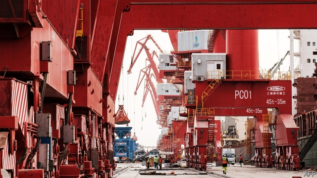
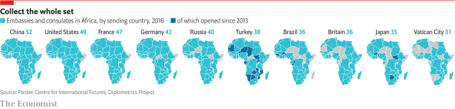
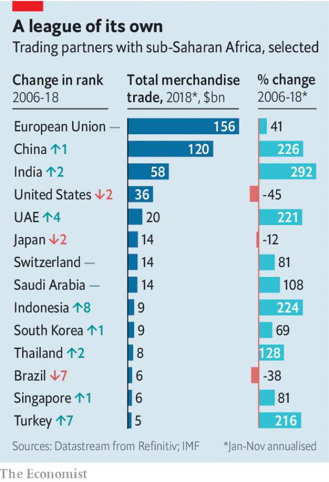
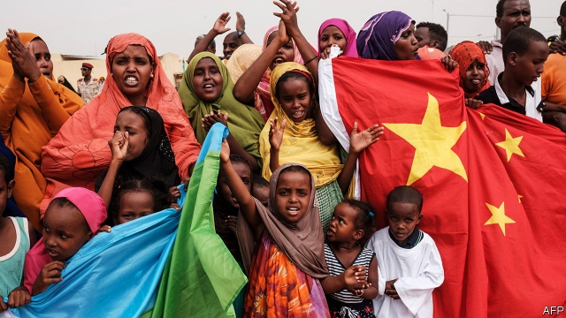

###### A sub-Saharan seduction

# Africa is attracting ever more interest from powers elsewhere 

##### They are following where China led 

 

> Mar 7th 2019 

GRAHAM GREENE, chronicler of hazy entrepots, would have loved Djibouti. A third of global shipping steams by this little bit of north-east Africa. All the world, it seems, is crammed together in its capital. French, Italian and Japanese military bases jostle each other near the shore. Camp Lemonnier, formerly run by the French Foreign Legion and now America’s only permanent military base in Africa, sits by the airport; China’s first such base is a little to the north-west of it. Indian and British embassies will soon open. Within weeks the Turkiye Diyanet Foundation will open the largest mosque in east Africa in the city; the muezzin will struggle to be heard amid the roar of fighter jets overhead. 

From the top of the minaret you can see China—not because it rises all the way to orbit, but because there is a lot of China to see right in front of you. Djibouti is small, but it boasts a multipurpose port, a railway to Ethiopia and the beginnings of a free-trade zone which, once finished, will be the largest in Africa. They were all built by Chinese state-owned firms and are at least partly run by them. On a visit to the port (pictured) your correspondent waves at the sailors on a Chinese naval vessel one berth along from a freighter filled with Ukrainian grain; their returning looks prompt the question of what is Mandarin for disdain. 

According to McKinsey, a management consultancy, there are now 10,000 Chinese businesses on the African continent. China’s dramatic investments have encouraged other countries, most notably India, to follow suit. At the same time, China is changing the terms of its engagement, increasingly cashing in economic connections for political and military ties—again with others, such as Turkey and Russia, looking to do the same. Alex Vines of Chatham House, a think-tank in London, talks of a “new scramble for Africa”. 

Comparisons to the European race for colonies in the late 19th century gall Africans keen to point out vast differences. It is true that the resources colonialists coveted still provide a lure. But the new scramblers want more than just a share of what Africa has; they want a stake in what it is now trying to build—in the economies and growing global stature of the world’s second-most-populous continent, poised between two of its three great oceans. 

This suggests that the continent will increasingly be a place where international rivalries play out. In a speech in December John Bolton, President Donald Trump’s national security adviser, spoke of it as the site for a new era of “great power competition”. But such competition does not have to be a zero-sum game. Infrastructure investments tend to benefit all comers, not just the investors. Most of all, they can benefit Africans. Though the new scramblers are often powerful, much of what they want cannot just be taken. It must be given. African nations are the primary players in the game. How they play it will be a decisive factor in how well the continent fulfils the promise outsiders see in it. 

According to the Diplometrics project at the University of Denver more than 320 embassies or consulates were opened in Africa between 2010 and 2016. Turkey alone opened 26 (see maps). The boom continues: last year India announced it would open 18 more. Foreign leaders are supporting the diplomatic push. This year Vladimir Putin, the Russian president, is set to host the first Russia-Africa summit, a tribute act to the triennial Forum on Africa-China Co-operation (FOCAC), in Beijing. Hosted by President Xi Jinping, last year’s FOCAC attracted more African leaders than the annual meeting of the UN General Assembly. Japan and Britain are also hosting gatherings in the coming months. 

 

When not hosting African politicians, foreign leaders are visiting them. China’s top officials made 79 visits to Africa in the decade up to 2018. Since 2008 Turkey’s leader, Recep Tayyip Erdogan, has paid more than 30 visits to African countries, most of them sub-Saharan. Emmanuel Macron has visited the continent nine times since becoming president of France in 2017; Narendra Modi has visited eight African countries during his five years in power in India. But not all are so keen. Kanye West and Kim Kardashian have visited more African leaders than has Mr Trump, who has yet to set foot on the continent. 

Such visits and summits are in part efforts to make use of Africa’s diplomatic clout. Its 54 nations make up more than a quarter of the UN General Assembly and by custom it always has three of the 15 non-permanent seats on the Security Council. China has persuaded nearly every African state to ditch diplomatic recognition of Taiwan; only eSwatini (formerly Swaziland) remains to be swayed. Russia has petitioned African politicians over its claims to Crimea; 28 African countries abstained on a General Assembly motion condemning the annexation. Israel has sought recognition of Jerusalem as its capital, and now has Togo on its side. 

Military ties are strengthening alongside the diplomatic ones. The Horn of Africa has become part of the broader competition between Saudi Arabia and the United Arab Emirates (UAE) on one side and Iran, Qatar and Turkey on the other. In 2017 Turkey built its largest overseas military base, and its first in Africa, in Somalia. Saudi Arabia and the UAE have launched attacks into Yemen from their positions in the Horn. Saudi Arabia has also recruited soldiers from Sudan, some of them children. It is also thought to be keen to open a base in Djibouti; the UAE is set to open a new one in neighbouring Somaliland. 

China’s military influence stretches well beyond the base in Djibouti. Last year the People’s Liberation Army (PLA) conducted exercises in Cameroon, Gabon, Ghana and Nigeria. Chinese popular culture celebrates Africa as a place for derring-do. In 2017 “Wolf Warrior 2”, a film in which Chinese special forces save beleaguered doctors in Africa, set new records at the box office. “Peacekeeping Infantry Battalion”, a television show, celebrates China’s role as a provider of blue helmets. The country fields more UN peacekeepers than any of the Security Council’s other four permanent members, most of them in the Democratic Republic of Congo, Mali, South Sudan and Sudan. 

This interest in peace goes hand in hand with a brisk business in arms; China sells more weapons in sub-Saharan Africa than any other nation. It accounted for 27% of the region’s arms imports in 2013-17, compared with 16% in 2008-12, according to the Stockholm International Peace Research Institute. China claims military ties, some of them simply co-operative rather than commercial, with 45 African governments. Its aims are several, says Lina Benabdallah of Wake Forest University. It wants to be seen as a power with intercontinental reach. It wants to protect trade; in Beijing, east Africa is counted part of “the Maritime Silk Road”. And there are more than 1m Chinese living in Africa who may need protection, too. During the Libyan revolution of 2011 a Chinese naval vessel helped in the evacuation of thousands of Chinese contractors from the country. 

Chinese expansion has worried other Asian powers. Japan is enlarging its base in Djibouti. India is developing a network of radar and listening posts around the Indian Ocean, though plans for a base in the Seychelles were blocked by the archipelago last year. In March the Indian army will host its first military exercises with a number of African countries, including Tanzania, Kenya and South Africa. 

Keeping up with the Joneses is not the only reason for military involvement. European countries are stepping up their presence in the Sahel, the arid region on the southern edge of the Sahara desert, aiming both to quell Islamic terrorism and stem the flow of migrants to Europe. The EU is also supporting soldiers from the “G5 Sahel” group of Burkina Faso, Chad, Mali, Mauritania and Niger. 

Russia’s moves are more muscular, and more mercenary. Often the key figures are cronies of Mr Putin, like Yevgeny Prigozhin, a former chef, rather than official state employees. Mr Vines likens them to Cecil Rhodes and other 19th-century imperialists who would lead private invasions with the implicit protection of the government back home. Last year, after the Central African Republic (CAR) asked for help fighting rebels, Russia barged aside France, the CAR’s former colonial ruler, quickly sending arms and advisers. Experts in extractive industry soon followed. The defence ministry is now home to a group of Russian “advisers”. Last year’s Miss Central African Republic beauty pageant attracted the generous sponsorship of Lobaye Invest, a Russian diamond company. 

Though its role in the CAR is the most high-profile, Russia has been intensifying its links across Africa. At least 250,000 Africans were trained in or by the Soviet Union before its demise in 1991, which provides scope for the renewal of old relationships. Russian political advisers have been busy in countries such as Zimbabwe, Guinea and Madagascar. 

As others have bolstered links with Africa, America has “stepped away”, notes Judd Devermont of the Centre for Strategic and International Studies, a think-tank. It has cut funding for development and diplomatic programmes. It has announced a 10% reduction in troops in Africa and has left key positions unfilled; it took Mr Trump’s administration 18 months to fill the top Africa job in the State Department. 

 

America’s relative economic importance is also waning. In 2006 America, China and France were the three countries doing the most trade with sub-Saharan Africa, defined as the sum of imports and exports (see chart). From 2006 to 2018 Chinese trade increased by 226% and India’s by 292%. Other countries also posted impressive increases, although from low starting points: 216% for Turkey, 335% for Russia, 224% for Indonesia. The EU, still all-told the region’s largest trading partner, managed only a modest 41%. American trade with sub-Saharan Africa shrank. 

The top sources of foreign direct investment (FDI) are firms from America, Britain and France. But last year a UN report on global FDI found that the “geographical sources of FDI to Africa are becoming more diversified.” China’s stock of FDI grew from $16bn in 2011 to $40bn in 2016, slightly less than France’s ($49bn). Investments from companies based in Singapore have grown markedly, too. 

Access to Africa’s natural resources remains critical. But economic relations are about much more than commodities. One-third of sub-Saharan countries can expect GDP growth of more than 5% this year, according to the IMF. The number of mobile-phone and data subscriptions will grow by almost 5% per year over the next five years, more than twice the global average, as nearly 300m Africans move online by 2025, according to GSMA, a trade association. 

Food imports and exports are also growing. Gulf countries, which import 80-90% of their food, have recently struck agricultural deals with Mali, Mauritania, Morocco, Mozambique, Sudan and Tanzania. Other countries see Africa as a customer for excess capacity. China, which has run up huge stockpiles, sold more than 781,000 tonnes of rice to African countries in 2017, more than ten times the amount in 2016, with Ivory Coast overtaking South Korea as the biggest importer. 

And African countries are increasingly home to foreign manufacturing firms. Chinese state-backed companies have helped set up “special economic zones” in Ethiopia, Nigeria and Rwanda as well as Djibouti. Olam International, a Singaporean company, operates a free-trade zone in Gabon; India is trying to open one in Mauritius. Turkey has a facility next to the Chinese one in Djibouti, part of a set of ambitious plans for the continent which include building railways in Tanzania, airport terminals in Ghana and much of the “futuristic” Diamniadio Lake City in Senegal. Turkish Airlines, which is 49% state-owned, flies to more than 50 African cities. 

Others are thus positioned to take up some slack as China recalibrates its approach to the continent to make it less expensive. Rather than announcing a doubling or tripling of its financial pledges to African countries, as it had at previous FOCACs, last year China offered a package less generous than the previous one. Part of this shift is because some Chinese deals in Africa have gone sour, angering Chinese investors. Sinosure, the state-owned insurer, had to write off $1bn in losses on the railway from Djibouti to Ethiopia after fewer passengers turned up than expected. In September Mr Xi warned against state-backed investments which amount to “vanity projects”. 

China is also sensitive to accusations of “debt-trap diplomacy”: using loans countries cannot pay back to extract other concessions from them. In Africa this charge is easily exaggerated. China is the primary creditor to just three African countries: Congo-Brazzaville, Djibouti and Zambia, according to the China Africa Research Initiative at Johns Hopkins University. On average, 32% of African external public debt is owed to private lenders and 35% to multilateral institutions such as the World Bank. China is the biggest bilateral lender, but its loans are just 20% of the total. 

But criticism of some loans seems amply justified. In Kenya local journalists have been probing the terms of the $3.2bn railway between Nairobi and Mombasa, with worries that Mombasa’s port may be pledged as collateral. “Ultimately the debt problem is an African problem,” says Anzetse Were, a Kenyan economist. “But China is finally getting some pushback.” 

This may encourage the West to increase its economic efforts. In September the EU announced it would give €40bn in grants from 2021 to 2027, building on Germany’s “Marshall Plan for Africa” launched in 2017. In October last year America doubled the lending capacity of its Overseas Private Investment Corporation to $60bn; it is also now allowed, for the first time in 50 years, to invest in equity as well as debt. “We would not have gotten that much money from them without China,” says Ms Were. 

 

“African leaders realise they have more choices than ever,” says Carlos Lopes, a negotiator for the African Union. They are no longer bound to their coloniser or in one cold-war camp. They can weigh priorities and offers and, at least to some extent, play off suitors. Yet there are reasons to be wary. 

The first is that African countries usually remain the weaker partner in military and economic agreements. In a rush to sign headline-grabbing deals African leaders often agree to onerous terms. Better-trained negotiating teams would help, says Ms Were; so would better language skills among African diplomats. On the structural front, there could be strength in unity. The African Continental Free Trade Area agreement, which needs ratification by just three more countries to enter into force, could be a big plus, giving the continent a single voice in some negotiations. 

The second reason to be cautious about Africa’s bounty of choices is that it may mean more options for corruption. What is a good deal for leaders is often a poor one for the led. Western diplomats praise Djibouti in private for the skill with which it has played countries off against one another to secure rent on military bases and infrastructure deals. How much this guile improved the lot of the citizenry, rather than the country’s elites, is unclear. 

Democracy and transparency are the antidotes to corruption. Recently in Kenya and Ghana, for example, local media, civil society and opposition parties have been able to scrutinise dodgy deals signed by their governments. Sadly, however, Russia and China do not care about African democracy. They may claim that their policy is not to interfere. But their propping up of autocrats—China’s support for Denis Sassou Nguesso of Congo-Brazzaville, Russia’s for Faustin-Archange Touadéra of the CAR—amounts to intervention of a particularly reactionary kind. 

The West, too, has a long history of supporting its preferred “strongmen” on the continent. Since the cold war, though, it has by and large promoted liberal reforms, if haphazardly and with exceptions. America’s apathy on matters African is one reason such initiatives have slowed of late, but re-engagement would not necessarily set things right. The new Africa “strategy” outlined by Mr Bolton in December made no mention of democracy. 

That is short-sighted. For African countries need more than extra choices over whom they strike deals with. They need the power to choose their politicians, too. 

-- 

 单词注释:

1.seduction[si'dʌkʃәn]:n. 教唆, 怂恿, 诱惑, 诱惑物, 诱饵 [法] 诱奸, 勾引, 引诱 

2.graham['ɡreiәm]:a. 全麦的；粗面粉的；全麦粉制成的 

3.greene[]:n. 格林（姓氏） 

4.chronicler['krɔniklә(r)]:n. 年代史编者, 记录者 

5.hazy['heizi]:a. 朦胧的, 模糊的, 烟雾弥漫的 

6.entrepot['ɒntrәpәu]:n. 仓库, 贸易中心 [经] 仓库, 保税仓库, 转运口岸 

7.Djibouti[dʒi'bu:ti]:吉布提[非洲] 

8.cram[kræm]:vt. 塞满, 填满, 猛吃 vi. 贪吃 n. 极度拥挤, 死记硬背 

9.jostle['dʒɒsl]:n. 推挤, 冲撞 vi. 推挤, 冲撞 vt. 推, 挤, 煽动 

10.lemonnier[]:[网络] 莫尼埃；蒙尼尔；莱蒙尼尔 

11.formerly['fɒ:mәli]:adv. 从前, 以前 

12.legion['li:dʒәn]:n. 军团, 军队, 众多的人 

13.turkiye[]:[网络] 土耳其；土耳其报；土耳其公司 

14.diyanet[]:[网络] 宗教事务局 

15.mosque[mɒsk]:n. 清真寺 

16.muezzin[mju:'ezin]:n. 宣礼员 

17.amid[ә'mid]:prep. 在其间, 在其中 [经] 在...中 

18.minaret[.minә'ret]:n. 光塔 

19.multipurpose['mʌlti'pә:pәs]:[计] 多用途的, 通用的, 多功能的 

20.Ethiopia[.i:θi'әupiә]:n. 埃塞俄比亚 

21.berth[bә:θ]:n. 船岸之间的水区, 锚地, 卧铺 vi. 停泊 vt. 使停泊 

22.freighter['freitә]:n. 租船人, 承运人, 托运人, 货船, 运输机 [经] 装货人, 货主, 承运人 

23.ukrainian[ju(:)'kreinjәn]:a. 乌克兰的；乌克兰人的 

24.mandarin['mændәrin]:n. 中国官话, 国语, 满清官吏, 柑橘 a. (中国式)紧身马褂的 

25.disdain[dis'dein]:n. 蔑视 vt. 蔑视, 鄙弃 

26.McKinsey[]:n. 麦肯锡（公司） 

27.consultancy[]:n. 商量, 协商, 磋商, 会诊, 与...商量, 咨询, 请教, 找(医生)看病, 查阅, 考虑 [经] 咨询业务, 咨询服务 

28.notably['nәjtbәli]:adv. 显著地, 著名地, 尤其, 特别 

29.engagement[in'geidʒdmәnt]:n. 诺言, 约会, 婚约, 交战 [医] 衔接 

30.Alex[]:[计] 开放网络文件系统 

31.chatham['tʃætәm]:n. 查塔姆（姓氏） 

32.scramble['skræmbl]:n. 攀缘, 爬行, 抢夺, 混乱, 紧急起飞 vi. 攀缘, 杂乱蔓延, 争夺, 拼凑, 匆忙 vt. 攀登, 扰乱, 使混杂 

33.gall[gɒ:l]:n. 胆汁, 五倍子, 苦味, 肿痛, 恼怒, 磨损处 vt. 烦恼, 屈辱, 磨伤 vi. 被磨伤 

34.colonialist[kә'lәjnjәlist]:n. 殖民主义者 [法] 殖民主义者 

35.covet['kʌvit]:v. 妄想, 垂涎 

36.lure[luә]:n. 饵, 诱惑 vt. 引诱, 诱惑 

37.scrambler['skræmblә]:n. 扰频器, 爬行者 [计] 密码器 

38.stature['stætʃә]:n. 身材, 身高, 高度 [医] 身材, 身高 

39.poise[pɒiz]:n. 平衡, 均衡, 姿势, 镇静, 安静, 砝码 vt. 使平衡, 使悬着, 保持...姿势 vi. 平衡, 悬着, 准备好 

40.rivalry['raivlri]:n. 竞争, 对抗 [医] 拮抗 

41.john[dʒɔn]:n. 盥洗室, 厕所, 嫖客 

42.bolton['bәultәn]:a. 可用螺栓固定的 

43.donald['dɔnәld]:n. 唐纳德（男子名） 

44.adviser[әd'vaizә]:n. 顾问, 劝告者, 指导教师 [法] 顾问, 劝告者 

45.infrastructure['infrәstrʌktʃә]:n. 基础结构, 基础设施 [经] 基础设施 

46.comer['kʌmә]:n. 来的人, 新来者, 有成功希望的人 

47.investor[in'vestә]:n. 投资者 [经] 投资者 

48.cannot['kænɒt]:aux. 无法, 不能 

49.decisive[di'saisiv]:a. 决定性的, 坚定的, 果断的 

50.outsider[' aut'saidә]:n. 外人, 局外人, 非会员, 外行, 门外汉, 比赛中获胜可能性不大的选手 [经] 外船公司 

51.Denver['denvә]:n. 丹佛(美国城市) 

52.consulate['kɒnsjulit]:n. 领事, 领事任期, 领事馆 [经] 领事馆 

53.diplomatic[.diplә'mætik]:a. 外交的, 老练的 [法] 外交的, 外交上的, 文献上的 

54.Vladimir[vlɑ'dimɪr]:n. 弗拉基米尔（古罗斯弗拉基米尔-苏兹达里公国的古都） 

55.putin['putin]:n. 普京（人名） 

56.tribute['tribju:t]:n. 贡物, 礼物, 颂辞 

57.triennial[trai'eniәl]:a. 每三年一次的 n. 三年生植物, 三年发生一次的事 

58.forum['fɒ:rәm]:n. 论坛, 公开讨论的广场, 法庭, 讨论会 [法] 讨论会, 专题讨论, 公共论坛 

59.UN[ʌn]:pron. 家伙, 东西 [经] 联合国 

60.gathering['gæðәriŋ]:n. 聚集, 集中, 采集 [化] 富集 

61.recep[]:n. (Recep)人名；(土)雷杰普 

62.tayyip[]:[网络] 塔伊普 

63.erdogan[]:[网络] 埃尔多安；土耳其总理埃尔多安；艾尔多安 

64.emmanuel[i'mænjuәl]:n. 以马内利（耶稣基督的别称）；伊曼纽尔（男子名, 等于Immanuel） 

65.macron['mækrәn]:n. 长音符号 

66.narendra[]:[网络] 纳伦德拉；纳兰德；纳然陀 

67.MODI['mәudai]:[计] 模块化光学数字接口 

68.kanye[]:n. 卡内（美国说唱歌手） 

69.kim[]:n. 金姆（人名） 

70.kardashian[]:n. 卡戴珊（人名） 

71.trump[trʌmp]:n. 王牌, 法宝, 喇叭 vt. 打出王牌赢, 胜过 vi. 出王牌, 吹喇叭 

72.clout[klaut]:n. 敲击, 破布 vt. 打补钉 

73.alway['ɔ:lwei]:adv. 永远；总是（等于always） 

74.taiwan['tai'wɑ:n]:n. 台湾 

75.Swaziland['swɑ:zilænd]:n. 斯威士兰 

76.petition[pi'tiʃәn]:n. 请愿, 诉状, 陈情书, 申请, 祈求, 祷文 v. 正式请求, 恳求, 请愿 

77.Crimea[krai'miә]:n. 克里米亚, 克里米亚半岛 

78.abstain[әb'stein]:vi. 自制, 戒绝, 弃权, 回避 

79.annexation[ænek'seiʃәn]:n. 合并, 附加, 附加物 [法] 兼并, 侵吞, 附加物 

80.Israel['izreil]:n. 以色列, 以色列后裔, 犹太人 

81.Jerusalem[dʒә'ru:sәlәm]:n. 耶路撒冷 

82.togo['tәu^әu]:n. 多哥（西非国家） 

83.saudi['sajdi]:a. 沙乌地阿拉伯（人或语）的 

84.Arabia[ә'reibiә]:n. 阿拉伯半岛 

85.emirate[e'miәrit]:n. 埃米尔的地位, 酋长国 

86.UAE[]:阿拉伯联合酋长国 

87.Iran[i'rɑ:n]:n. 伊朗 

88.Qatar['kɑ:tәr]:n. 卡塔尔 

89.oversea['әuvә'si:]:adv. 海外, 向国外, 向海外, 国外 a. 外国的, 在国外的, 在海外的, 舶来的 

90.Somalia[sәu'mɑ:liә]:n. 索马里 

91.yeman[]:[网络] 也门；叶门；园艺业的普及则始于也门 

92.Sudan[su:'dæn]:n. 苏丹 [化] 苯偶氮间苯二酚; 苏丹 

93.Somaliland[sә'mɑ:lilænd]:索马里兰[东非一地区] 

94.PLA[]:中国人民解放军 [计] 可编程序逻辑阵列 

95.Cameroon['kæmәru:n]:n. 喀麦隆 

96.gabon[^a'b]:n. 加蓬（非洲中西部国家） 

97.Ghana['gɑ:nә]:n. 加纳 

98.Nigeria[nai'dʒiriә]:n. 尼日利亚 

99.warrior['wɒ:riә]:n. 战士, 勇士, 武士, 鼓吹战争的人, 战斗, 尚武 

100.beleaguer[bi'li:gә]:vt. 围, 围攻 

101.infantry['infәntri]:n. 步兵, 步兵团 

102.battalion[bә'tæljәn]:n. 营, 军队, 集团 

103.provider[prә'vaidә]:n. 供应者, 供养人, 伙食承办人 [计] 提供器 

104.peacekeeper['pi:s,ki:pә(r)]:n. (交战国间的)停火执行者(或小组) 

105.Congo['kɔŋ^әu]:n. 刚果, 刚果河, 工夫茶 [建] 刚果, 直接刚果红 

106.Mali['mɑ:li]:n. 马里 

107.Stockholm['stɒkhәulm]:n. 斯德哥尔摩 

108.lina[]:n. 莉娜（女子名） 

109.intercontinental[,intә,kɔnti'nentl]:a. 大陆间的, 洲际的 

110.maritime['mæritaim]:a. 海的, 海上的, 海事的, 沿海的, 海员的 [经] 海事的, 海上的, 海员的 

111.Libyan['libiәn]:a. 利比亚的 n. 利比亚人, 古代利比亚语 

112.evacuation[i.vækju'eiʃәn]:n. 撤退, 疏散 [化] 抽空; 排空 

113.contractor['kɒntræktә]:n. 立契约的人, 承包商 [化] 承包者; 承包工厂 

114.Seychelles[sei'ʃelz]:n. 塞舌尔 

115.archipelago[.ɑ:ki'pelәgәu]:n. 群岛, 多岛屿的海 

116.Tanzania[.tænzә'ni:ә]:n. 坦桑尼亚 

117.Kenya['kenjә]:n. 肯尼亚 

118.involvement[in'vɔlvmәnt]:n. 卷入, 牵连, 包含, 困窘 [经] 财政困难, 经济上的困窘 

119.Sahel['sɑ:hel]:荒漠草原(西非) 

120.arid['ærid]:a. 干燥的, 不毛的 

121.Sahara[sә'hɑ:rә]:n. 撒哈拉沙漠 

122.quell[kwel]:vt. 压制, 平息, 减轻 

123.Islamic[iz'læmik]:a. 伊斯兰教的, 穆斯林的 

124.terrorism['terәrizm]:n. 恐怖主义, 恐怖统治, 恐怖状态 [法] 胁迫, 暴政, 恐怖政治 

125.migrant['maigrәnt]:n. 候鸟, 移居者 [法] 移居者 

126.EU[]:[化] 富集铀; 浓缩铀 [医] 铕(63号元素) 

127.burkina[]:[网络] 布基纳法索；布加纳法索；布基纳法索地图 

128.Faso[]:n. (Faso)人名；(意)法索 

129.Chad[tʃæd]:n. 乍得 [计] 孔屑 

130.Mauritania[.mɒri'teiniә]:n. 毛里塔尼亚 

131.Niger['naidʒә]:n. 尼日尔 [化] 皂脚 

132.muscular['mʌskjulә]:a. 强壮的, 肌肉发达的, 有力的 [医] 肌的; 肌肉发达的 

133.mercenary['mә:sinәri]:n. 唯利是图者, 雇佣兵 a. 为钱而工作的, 被雇的, 图利的 

134.crony['krәuni]:n. 密友, 亲密伙伴, 好朋友 

135.yevgeny[]:[网络] 叶夫根尼 

136.liken['laikәn]:vt. 比喻, 比拟 

137.cecil['sesl, 'sisl]:n. 塞西尔（男子名） 

138.rhodes[]:n. 罗兹岛（希腊东南端佐泽卡尼索斯群岛中最大的岛屿）；罗兹市（罗兹岛上的港口城市） 

139.imperialist[im'piәriәlist]:n. 帝国主义者, 皇帝统治的拥护者, 皇帝派的人 a. 帝国主义的 

140.implicit[im'plisit]:a. 暗示的, 含蓄的, 固有的, 绝对的 [经] 不讲明的, 含蓄的 

141.barge[bɑ:dʒ]:n. 驳船 vt. 用船运输 vi. 蹒跚, 闯入 

142.colonial[kә'lәunjәl]:a. 殖民的, 殖民地的 [法] 殖民地居民 

143.quickly['kwikli]:adv. 很快地 

144.extractive[ik'stræktiv]:a. 引得出的, 萃取的, 抽取的 n. 抽出物, 精, 熬汁 

145.pageant['pædʒәnt]:n. 盛会, 游行, 虚饰, 露天表演 

146.sponsorship['spɔnsәʃip]:n. 发起, 倡议, 主办, 保证人的地位, 教父的地位, 教母的地位 

147.Lobaye[]:[地名] 洛巴伊 ( 中非 ) 

148.intensify[in'tensifai]:vt. 加强 vi. 强化 

149.demise[di'maiz]:n. 崩, 薨, 死亡 vt. 让渡, 遗赠, 转让 

150.renewal[ri'nju:әl]:n. 更新, 革新, 复兴, 恢复, 修补, 补充, 继续, 重订, 重申, 续借 [经] 更新, 换新, 重申 

151.Zimbabwe[zim'bɑ:bwei]:n. 津巴布韦 

152.guinea['gini]:n. 几内亚 

153.Madagascar[mædә'^æskә]:n. 马达加斯加岛 

154.bolster['bәulstә]:n. 支持, 长枕 vt. 支持, 支撑 

155.judd[dʒʌd]:n. 贾德（姓氏） 

156.unfilled['ʌn'fild]:a. 未填充的, 空的 

157.wane[wein]:n. 减少, 衰微, 败落, 亏缺, 月亏 vi. 变小, 亏缺, 衰落, 消逝, 退潮 

158.Indonesia[.indәu'ni:ʒә]:n. 印尼 

159.fdi[]:abbr. 飞行方向指示器（Flight Direction Indicator ）；世界牙科联合会（Federation Dentaire Internationale） 

160.geographical[dʒiә'græfikl]:a. 地理学的, 地理的 

161.diversify[dai'vә:sifai]:vt. 使多样化, 使变化 

162.les[lei]:abbr. 发射脱离系统（Launch Escape System） 

163.Singapore[.siŋgә'pɒ:]:n. 新加坡 

164.markedly['mɑ:kidli]:adv. 显著地, 醒目地, 明显地 

165.commodity[kә'mɒditi]:n. 农产品, 商品, 有用的物品 [经] 商品, 货物, 日用品 

166.IMF[]:国际货币基金组织 [经] 国际货币基金 

167.datum['deitәm]:n. 论据, 材料, 资料, 已知数 [医] 材料, 资料, 论据 

168.subscription[sәb'skripʃәn]:n. 捐献, 订金, 订阅, 签署, 同意 [化] 订购 

169.online[]:[计] 联机 

170.GSMA[]:[网络] 全球移动通信协会(GSM Association)；全球行动通讯系统协会；全球移动通信系统协会 

171.Morocco[mә'rɒkәu]:n. 摩洛哥, 摩洛哥皮革 [机] 摩洛哥革 

172.Mozambique[.mәuzәm'bi:k]:n. 莫桑比克 

173.stockpile['stɒkpail]:n. 储蓄, 积蓄, 库存 vt. 储蓄, 贮存 

174.tonne[tʌn]:n. 吨, 公吨 [经] 吨 

175.ivory['aivәri]:n. 象牙, 乳白色 a. 象牙制的, 乳白色的 

176.Korea[kә'riә]:n. 朝鲜, 韩国 

177.importer[im'pɒ:tә]:n. 输入者, 进口商 [法] 进口商, 输入者 

178.manufacturing[.mænju'fæktʃәriŋ]:n. 制造业 a. 制造业的 

179.rwanda[rj'ændә]:n. 卢旺达（东非国家）；卢旺达语 

180.olam[]: 联机分析挖掘 

181.singaporean[,siŋ^ә'pɔ:riәn]:n. 新加坡人 

182.Mauritius[mɒ:'riʃiәs]:n. 毛里求斯 

183.ambitious[æm'biʃәs]:a. 有野心的, 抱负不凡的, 雄心勃勃的 

184.futuristic[.fju:tʃә'ristik]:a. 未来派的 

185.Senegal[,seni'^ɔ:l]:n. 塞内加尔 

186.Turkish['tә:kiʃ]:n. 土耳其语 a. 土耳其的, 土耳其人的, 土耳其语的 

187.slack[slæk]:n. 松弛, 松懈, 淡季, 闲散, 家常裤 a. 松弛的, 不流畅的, 疏忽的, 无力的, 呆滞的, 软弱的, 漏水的 adv. 马虎地, 缓慢地 vt. 放松, 使缓慢 vi. 松懈, 减弱, 松弛 

188.recalibrates[]:[网络] 重新校正 

189.triple['tripl]:n. 三倍数, 三个一组 a. 三倍的 vt. 使增至三倍 vi. 增至三倍 

190.pledge[pledʒ]:n. 诺言, 保证, 誓言, 抵押, 信物, 保人, 祝愿 vt. 许诺, 保证, 使发誓, 抵押, 典当, 举杯祝...健康 

191.insurer[in'ʃuәrә]:n. 保险公司 [法] 保险人, 承保人, 保险公司 

192.accusation[ækju:'zeiʃәn]:n. 控告, 指控, 指责 [法] 控告, 起诉, 告发 

193.extract[ik'strækt]:n. 榨出物, 精汁, 摘录, 选段 vt. (费力地)取出, 采掘, 榨取, 摘录, 吸取 [计] 提取 

194.concession[kәn'seʃәn]:n. 特许, 让步, 认可 [经] 核准, 许可, 特殊(权) 

195.creditor['kreditә]:n. 债权人 [法] 债权人, 债主, 贷方 

196.Zambia['zæmbiә]:n. 赞比亚 [经] 赞比亚 

197.john[dʒɔn]:n. 盥洗室, 厕所, 嫖客 

198.hopkins['hɔpkinz]:n. 霍普金（姓氏） 

199.lender['lendә]:n. 出借人, 贷方 [经] 出借者, 贷方, 贷款人 

200.multilateral[.mʌlti'lætәrәl]:a. 多边的, 多国的 [经] 多边的, 涉及多方的 

201.bilateral[bai'lætәrәl]:a. 有两边的, 双边的, 双方的 [医] 两侧的 

202.amply['æmpli]:adv. 充足地, 充裕地 

203.probe[prәub]:n. 探索, 调查, 探针, 探测器 v. 用探针探测, 调查, 探索 

204.Nairobi[nai'rәubi]:n. 内罗比 

205.Mombasa[mɔm'bæsә]:蒙巴萨岛[肯尼亚] 

206.collateral[kә'lætәrәl]:a. 并行的, 附随的, 旁系的 n. 旁系亲属, 担保品 

207.kenyan['kenjәn]:n. 肯尼亚人 

208.economist[i:'kɒnәmist]:n. 经济学者, 经济家 [经] 经济学家 

209.pushback['pʊʃbæk]:n. 飞机推迟起飞 

210.Marshall['mɑ:ʃәl]:n. 马歇尔（姓氏, 男子名, 等于Mar'shal） 

211.equity['ekwiti]:n. 公平, 公正 [经] 权益, 产权 

212.carlo[]:n. 卡洛（男子名） 

213.lope[lәup]:v. (使)大步慢跑 n. 大步慢跑 

214.negotiator[ni'gәuʃieitә]:n. 磋商者, 交涉者, 议定者 [经] 谈判者, 交易者, 协商者 

215.coloniser[]:[网络] 殖民者；开拓者；定居者 

216.suitor['sju:tә]:n. 起诉者, 请愿者, 求婚者 [法] 起诉人, 原告, 求婚者 

217.wary['wєәri]:a. 谨慎的, 小心的, 机警的, 周到的, 唯恐的 

218.onerous['ɒnәrәs]:a. 繁重的, 负有法律责任的 [法] 负有义务的, 艰巨的, 繁重的 

219.diplomat['diplәmæt]:n. 外交官, 有外交手腕的人 [法] 外交家, 外交官, 有权谋的人 

220.continental[.kɒnti'nentl]:a. 大陆的, 洲的 n. 欧洲大陆人 

221.ratification[.rætifi'keiʃәn]:n. 批准, 承认, 认可 [经] 追认, 批准 

222.negotiation[ni.gәuʃi'eiʃәn]:n. 谈判, 磋商, 交涉 [经] 谈判, 协商 

223.bounty['baunti]:n. 慷慨, 宽大, 礼物 [经] 奖励金, 补贴 

224.corruption[kә'rʌpʃәn]:n. 腐败, 堕落, 贪污 [计] 论误 

225.infrastructure['infrәstrʌktʃә]:n. 基础结构, 基础设施 [经] 基础设施 

226.guile[gail]:n. 狡猾, 狡计 

227.citizenry['sitizәnri]:n. 市民 [法] 市民 

228.elite[ei'li:t]:n. 精华, 精锐, 中坚分子 

229.unclear[.ʌn'kliә]:a. 不易了解的, 不清楚的, 含混的 

230.transparency[træns'pærәnsi]:n. 透明, 透明度, 透过性, 透明物, 清晰 [计] 透明性; 透明 

231.antidote['æntidәut]:n. 解毒剂, 解毒药 [化] 解毒药 

232.opposition[.ɒpә'ziʃәn]:n. 反对, 敌对, 相反, 在野党 [医] 对生, 对向, 反抗, 反对症 

233.scrutinise[]:vt.vi. 细看, 仔细检查, 审查, 细阅 [经] 详细检查, 细细地看 

234.dodgy['dɒdʒi]:a. 狡猾的, 逃避的, 难弄的 

235.prop[prɒp]:n. 支柱, 支持者, 倚靠人, 道具, 螺旋桨 vt. 支撑, 维持 

236.deni[]:n. (Deni)人名；(俄)杰尼；(意、阿拉伯)德尼 十数的 

237.sassou[]:[网络] 飒爽；萨苏；马自达飒爽 

238.nguesso[]:[网络] 恩格索 

239.intervention[.intә'venʃәn]:n. 插入, 介入, 调停 [经] 干预 

240.reactionary[ri'ækʃәnәri]:n. 反动分子 a. 反动的, 反动主义的, 反对改革的 

241.strongman[ˈstrɒŋmæn]:n. 大力士 

242.haphazardly[.hæp'hæzәdli]:adv. 偶然地, 随意地；杂乱地 

243.apathy['æpәθi]:n. 无感情, 无兴趣, 冷漠 [医] 无情[感], 淡漠 

