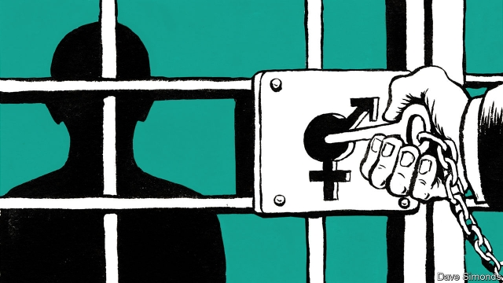

###### A tough cell

# A transgender wing seeks to resolve a clash of prisoners’ rights 

##### Three inmates are moving to Britain’s first transgender wing—but not all trans prisoners are keen to follow them 

 

> Mar 7th 2019 

LONG BEFORE she was sent to prison, “A.L.” knew she was transgender. As a child, she “wasn’t like other boys” and liked to dress up in girls’ clothes. Yet when she first confided in warders, they suggested she move to a wing with sex offenders. In a study of transgender inmates published in 2017 by G4S, a firm which runs prisons, she said she was refused a place in a women’s jail. “I was told that the women prisons would be too interested in ‘what I’ve got downstairs’,” she said. 

The prison service reckons there are at least 139 transgender inmates in England and Wales, which is probably an underestimate. Since there are no unisex prisons, the authorities face a dilemma in deciding where to place them. They must balance the welfare of transgender offenders with those of other prisoners, particularly women, whose safety could be threatened by prisoners who were born male. Karen White, a convicted paedophile who now identifies as a woman, sexually assaulted two prisoners in a women’s jail in 2017. “We have a clash of rights,” says Richard Garside of the Centre for Crime and Justice Studies, a think-tank. 

This week the Ministry of Justice announced a possible solution: a wing for transgender prisoners, which opened in HMP Downview, a women’s jail in south London. It will hold three transgender women. Officials say it is a unique response to the individuals’ circumstances, not a pilot that could soon apply to all, but the ministry is reviewing its policy on how to handle transgender inmates in general. 

Some reckon the wing represents significant progress. The prison service has twice issued more permissive guidance for transgender inmates since 2011, but a parliamentary report in 2016 found that this advice was sometimes “simply being ignored” by warders. Policy is inconsistent. A prisoner’s request to buy women’s underwear was turned down in one jail but approved in another. In one prison, inmates were given a sign reading: “Do not enter, shower in use by transgender prisoner.” 

At first blush, separate wings would seem to meet the needs of both transgender and other prisoners better than the current system, under which the majority of transgender inmates have the chance to persuade a board that they should be housed in a jail with prisoners born into the opposite sex, even if they have not undergone surgery or obtained an official “gender recognition certificate”. The board runs a risk whatever it decides. Placing self-declared women in female prisons could expose other inmates to abuse by predators like Ms White. But forcing them into a men’s prison, even if they have lived as a woman for years, could put them in harm’s way. The parliamentary report highlighted the cases of two transgender women who committed suicide while in men’s prisons in 2015. 

Even so, not all transgender inmates like the idea of separate wings. The mantra of some activists that “trans women are women” implies they should be treated no differently from inmates who were born female. And if the new wing is designed for dangerous inmates, others may avoid it. Debbie Hayton, a transgender campaigner, reckons that, were she ever jailed, she might plump for a men’s prison rather than a faraway transgender wing holding sex offenders. “If these people are considered too dangerous to be put with women, perhaps they’re too dangerous for me, too.” 

-- 

 单词注释:

1.transgender[trænzˈdʒendə(r)]:n. 变性人 

2.clash[klæʃ]:n. 冲突, 撞击声, 抵触 vi. 冲突, 抵触 vt. 使发出撞击声 [计] 对撞 

3.inmate['inmeit]:n. 同住者, 被收容者 [法] 内部的, 接近中心的, 内在的 

4.Tran[]:n. (Tran)人名；(柬)德兰 

5.AL[]:[计] 算法语言, 字母, 汇编语言 [医] 铝(13号元素) 

6.confide[kәn'faid]:vt. 吐露, 委托 vi. 信赖 

7.warder['wɒ:dә]:n. 看守, 守卫, 看门人 [法] 监狱看守人, 门警, 管理人 

8.offender[ә'fendә]:n. 罪犯, 无礼的人, 得罪人的人 

9.reckon['rekәn]:vt. 计算, 总计, 估计, 认为, 猜想 vi. 数, 计算, 估计, 依赖, 料想 

10.wale[weil]:n. 隆起的伤痕, 鞭痕, 凸条纹, 精华, 选择 vt. 在...上留下鞭痕, 织成棱纹, 挑选, 撑住 vi. 挑选 

11.underestimate[.ʌndәr'estimeit]:n. 低估 vt. 低估, 看轻 

12.unisex['ju:niseks]:a. 男女皆宜的 

13.karen['kɑ:rәn]:n. 凯伦（人名）；克伦邦（缅甸邦名） 

14.convict[kәn'vikt]:n. 囚犯, 罪犯 vt. 宣告有罪, 使知罪 

15.paedophile[ˈpi:dəʊfaɪl]:n. 恋童癖者 

16.sexually[]:adv. 性别地；两性之间地 

17.assault[ә'sɒ:t]:n. 攻击, 袭击 vt. 袭击, 攻击 vi. 发动攻击 

18.richard['ritʃәd]:n. 理查德（男子名） 

19.garside[]: [人名] [英格兰人姓氏] 加赛德住所名称，来源于北方中世纪英语，含义是“圈用地+山坡”(enclosure+hill slopes 

20.HMP[]:主机监督协议 

21.permissive[pә'misiv]:a. 许可的, 获准的, 宽容的, 放任的, 放纵的, 允许选择的, 自由的 [法] 表示许可的, 随意的, 纵容的 

22.parliamentary[.pɑ:lә'mentәri]:a. 国会的, 议会的, 议会制度的 

23.inconsistent[.inkәn'sistәnt]:a. 不一致的, 易变的, 前后矛盾的 [法] 矛盾的, 不一致的, 不协调的 

24.blush[blʌʃ]:vi. 脸红, 羞愧 vt. 弄成红色 n. 脸红 

25.gender['dʒendә]:n. 性 vt. 产生 

26.predator['predәtә]:n. 食肉动物, 掠夺者 [医] 捕食者 

27.suicide['sjuisaid]:n. 自杀, 自杀者 v. 自杀 a. 自杀的 

28.mantra['mʌntrә, 'mæn-]:颂歌, 咒语(尤指四吠陀经典内作为咒文或祷告唱念的) 

29.activist['æktivist]:n. 激进主义分子 

30.differently['difrentli]:adv. 差异, 不同, 各别, 各种 

31.debbie['debi]:n. 黛比（女子名, 等于Debby） 

32.hayton[]: [人名] [英格兰人姓氏] 海顿住所名称，来源于古英语，含义是“干草+圈用地，居留地”(hay+enclosure,settlement); [地名] [英国] 海顿 

33.campaigner[kæm'peinә]:n. 从军者, 老兵, 竞选者 

34.plump[plʌmp]:a. 圆胖的, 丰满的, 直接下落的, 直率的 vt. 突然放下, 支持, 使丰满, 使鼓起 vi. 扑通落下, 投票赞成, 变丰满, 鼓起 adv. 沉重地, 突然地, 直截了当地 

35.faraway['fɑ:rәwei]:a. 遥远的, 恍惚的, 出神的 

