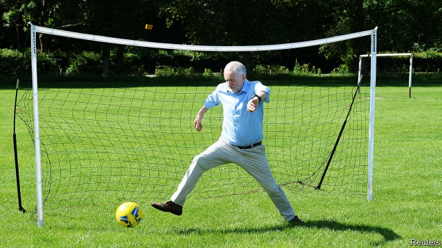

###### Two left feet

# Astonishingly, Labour seems in even worse shape than the Tories 

##### Jeremy Corbyn keeps missing chances to take the lead over the government 

 

> Mar 7th 2019 

AS SO OFTEN, Theresa May is in trouble. The prime minister is barely in control of her cabinet, let alone her MPs or her party. Unless her attorney-general, Geoffrey Cox, comes back from Brussels with a magical release from the Irish backstop, she is set to lose a second vote on her Brexit deal next week and be forced to seek an extension of the March 29th deadline. The going should be good for the Labour Party. Yet in many ways Jeremy Corbyn, its leader, has even more problems than Mrs May. 

The biggest is internal division in his party. It is worth recalling that four-fifths of his own MPs expressed no confidence in Mr Corbyn’s leadership as long ago as June 2016. More recently eight of them have defected to form what they call the Independent Group (TIG). Another MP has walked out since. Although the new group has also lured three Tory MPs, and more defections are promised, its support seems to come mainly from erstwhile Labour voters. With polls showing TIG, which is moving towards becoming a fully fledged party, scoring in the mid-teens, the Tory lead over Labour has widened into double figures. 

And that is just one of Labour’s splits. Tom Watson, the deputy leader, is setting up the Future Britain Group, a social-democratic club of 50-odd Labour MPs that amounts to a party within the party. Mr Watson, who like Mr Corbyn was directly elected by members, has no intention of leaving Labour. He may indeed be positioning himself for a future leadership race. Whatever happens, his group is likely to prove a thorn in Mr Corbyn’s side—just as the right-wing European Research Group within the Tory party is for Mrs May. 

It is not just dislike of Mr Corbyn and his far-left worldview that lies behind these divisions. His personal rating is as abysmally low with voters as with his own MPs. He is the least popular Labour leader since Michael Foot in 1982. Despite Mrs May’s shortcomings, a large majority considers her the more competent leader and plausible prime minister of the two. 

Mr Corbyn is also suffering from continuing rows over anti-Semitism. When Luciana Berger joined the breakaway TIG, she declared that Labour was institutionally anti-Semitic. On March 7th the official equality watchdog said that Labour may have unlawfully discriminated against Jews, and that it was considering using its statutory enforcement powers against the party. The ugly saga has badly tarnished the image of Mr Corbyn as a peace-loving anti-racism campaigner. 

It has also highlighted the big difference between today and past decades when moderates battled to stop Labour drifting leftward. When the likes of Hugh Gaitskell and Neil Kinnock fought off far-left influence in the 1960s and 80s, they did so as party leader, supported by their shadow cabinet. Now it is the leadership itself that is in the hands of the far left. Those anxious to wrench the party back to the centre face having to do so from outside the tent, not inside it. And as Mr Watson and others are finding, that is a far harder task. 

As if to stir things up, into all this has fallen Labour’s dilemma over Brexit. Mr Corbyn is a long-standing Eurosceptic who was against Britain joining what he considers a capitalist club. His immediate circle is mostly pro-Brexit, not least because of fears that the EU’s state-aid rules might stand in the way of efforts to build socialism in Britain. Yet the party’s MPs and members are strongly pro-EU and see Brexit as central to a Tory policy that aims also at cutting social welfare, deregulating and reducing workers’ rights. 

Mr Corbyn’s response has been one of studied ambiguity. While accepting the result of the 2016 referendum, he has opposed what he calls a Tory Brexit. He has sought to retain support from metropolitan Remainers as well as small-town Leavers. Yet as the Brexit deadline has drawn near, this attempt to please both sides has run out of road. Facing the prospect of more resignations by Remainer MPs, Mr Corbyn has given conditional backing to what he calls a “public vote” on the government’s Brexit deal. 

For the time being, there is little chance of a parliamentary majority for another referendum. That is partly because some Labour MPs from Leave-voting constituencies are against the idea. They argue that the party would lose support if it were seen, like the Liberal Democrats, as overtly anti-Brexit. The promise of a second referendum might play well in London or in places with lots of students, they acknowledge, but it would go down badly in northern and midland seats that Labour must win if it is to secure a majority. 

Most analysts disagree. Polls suggest that a majority of Labour voters, even in areas that supported Leave, backed Remain. And Labour Leave supporters seem to be softening their views, or even switching sides, more than Tory Leavers are. Peter Kellner, a former chairman of YouGov, points to polls showing that 70% of Labour voters now think the Brexit decision was a mistake. He concludes that the risk of losing votes to other parties or to abstention is greater if Labour is seen facilitating a Tory Brexit than if it calls for a second referendum. Rob Ford of the University of Manchester says this is true even in northern constituencies that backed Leave in 2016. 

Labour’s woes and its poor showing in polls are encouraging some Tory MPs to talk of another early election. They think back to the 1980s, when a divided, far-left Labour Party handed the Conservatives three successive election victories. Yet this time the Tories have been in power for nine hard years, voters are sick of austerity, Brexit is a mess and Mrs May is a proven flop on the campaign trail. After calling the 2017 election she frittered away a 20-point lead and cost the Tories their majority. As she struggles on against a damaged Mr Corbyn, it increasingly looks as if the most likely winner of the next election will be whichever party changes its leader first. 

-- 

 单词注释:

1.astonishingly[ə'stɔniʃiŋli]:adv. 令人惊讶地 

2.Tory['tɒ:ri]:n. 托利党党员, 保守党员, 亲英分子 a. 保守分子的 

3.jeremy['dʒerimi]:n. 杰里米（男子名） 

4.Corbyn[]:科尔宾（人名） 

5.theresa[ti'ri:zә]:n. 特丽萨（女子名） 

6.MP[]:国会议员, 下院议员 [计] 宏处理程序, 维护程序, 线性规划, 微程序, 多处理器 

7.geoffrey[]:n. 杰弗里（男子名） 

8.cox[kɒks]:n. 舵手 v. 做舵手 

9.Brussel[]:n. 布鲁塞尔（比利时首都） 

10.magical['mædʒikәl]:a. 魔术的, 有魔力的, 不可思议的 

11.backstop['bækstɒp]:n. 挡球网, 接球手 [电] 背向停止 

12.Brexit[]:[网络] 英国退出欧盟 

13.Mr['mistә(r)]:先生 [计] 存储器回收程序, 多重请求 

14.tig[tiɡ]:vi. 轻碰；戏弄 

15.MP[]:国会议员, 下院议员 [计] 宏处理程序, 维护程序, 线性规划, 微程序, 多处理器 

16.lure[luә]:n. 饵, 诱惑 vt. 引诱, 诱惑 

17.Tory['tɒ:ri]:n. 托利党党员, 保守党员, 亲英分子 a. 保守分子的 

18.defection[di'fekʃәn]:n. 背叛, 缺乏, 毛病 [法] 缺点, 过失, 背叛 

19.erstwhile['ә:stwail]:adv. 以前, 往昔地 a. 以前的, 往昔的 

20.voter['vәutә]:n. 选民, 投票人 [法] 选民, 选举人, 投票人 

21.fully['fuli]:adv. 十分地, 完全地, 充分地 

22.fledge[fledʒ]:vt. 喂养, 用羽毛盖上, 装上羽毛 vi. 长羽毛 

23.tom[tɒm]:n. 雄性动物, 雄猫 

24.Watson['wɔtsn]:[计] 沃森 

25.worldview['wɜ:ldvju:]:n. 看; 视力; 观点; 目的 

26.abysmally[ə'bɪzməlɪ]:adv. 极糟地; 可怕地; 完全地; 极端地 

27.michael['maikl]:n. 迈克尔（男子名） 

28.plausible['plɒ:zibl]:a. 貌似真实的, 貌似合理的, 说得煞有其事的 [法] 花言巧语的, 似乎有理的 

29.luciana[]:n. (Luciana)人名；(罗、意)卢恰娜(女名), 卢恰纳 

30.Berger['bә:dʒә]:伯杰(姓氏) 

31.breakaway[]:n. 脱离, (美)(非正式)一碰就散开/脱落的, 分裂 

32.institutionally[]:adv. institutional的变形 

33.watchdog['wɒtʃdɒg]:n. 看门狗, 监察人 [化] 监控设备; 监视器 

34.unlawfully[]:adv. 不正当地；不合法地 

35.discriminate[dis'krimineit]:v. 区别, 差别待遇 

36.Jew[dʒu:]:n. 犹太人, 守财奴, 犹太教信徒 vt. 欺骗, 杀价 

37.statutory['stætjutәri]:a. 法令的, 法定的, 可依法惩处的 [经] 法定的 

38.enforcement[in'fɒ:smәnt]:n. 执行, 强制 [法] 实施, 加强, 厉行 

39.saga['sɑ:gә]:n. 传说, 英雄传奇, 冒险故事 

40.tarnish['tɑ:niʃ]:n. 失泽, 失泽膜, 污点 vt. 使失去光泽, 玷污 vi. 失去光泽, 被玷污 

41.campaigner[kæm'peinә]:n. 从军者, 老兵, 竞选者 

42.leftward['leftwәd]:a. 左方的, 左侧的 adv. 在左方, 在左手 

43.hugh[hju:]:n. 休（男子名） 

44.Gaitskell['^eitskәl]:盖茨克尔(姓氏) 

45.neil[]:n. 尼尔（男子名） 

46.Kinnock[]:n. (Kinnock)人名；(英)金诺克 

47.wrench['rentʃ]:n. 扳钳, 扳手, 扭伤, 歪曲, 痛苦 vt. 猛扭, 扭伤, 曲解, 折磨 vi. 猛扭, 猛绞 

48.eurosceptic[ˌjʊərəʊ'skeptɪk]:n. 欧洲统一怀疑论者；反对英国亲近欧盟的人 

49.capitalist['kæpitәlist]:n. 资本家, 资本主义者 a. 资本主义的 

50.deregulate[di:re^jjleit]:[法] 解除管制 

51.ambiguity[.æmbi'gju:iti]:n. 不明确, 含糊 [计] 二义性; 多义性 

52.referendum[.refә'rendәm]:n. （就重大政治或社会问题进行的）全民公决，全民投票 

53.metropolitan[.metrә'pɒlitn]:n. 大都市居民, 都主教, 宗主国的公民 a. 大都市的, 都主教区的, 宗主国的 

54.remainers[]:[网络] 剩余物 

55.leaver['li:vә]:n. 离开者（常指学校毕业生） 

56.remainer[]:[网络] 剩下的 

57.conditional[kәn'diʃәnl]:a. 有条件的, 有前提的 [电] 有条件的 

58.parliamentary[.pɑ:lә'mentәri]:a. 国会的, 议会的, 议会制度的 

59.constituency[kәn'stitjuәnsi]:n. 选民, 顾客, 读者 [法] 选区, 全体选民, 选区内的选民 

60.democrat['demәkræt]:n. 民主人士, 民主主义者, 民主党党员 [经] 民主党 

61.overtly['әuvә:tly. әu'vә:tly]:adv. 明显地；公开地, 公然地 

62.midland['midlәnd]:n. 中部地方, 内地 

63.analyst['ænәlist]:n. 分析者, 精神分析学家 [化] 分析员; 化验员 

64.supporter[sә'pɒ:tә]:n. 支持者, 后盾, 迫随者, 护身织物 [法] 支持者, 赡养者, 抚养者 

65.soften['sɒftn]:v. (使)变柔软, (使)变柔和 

66.peter['pi:tә]:vi. 逐渐消失, 逐渐减少 

67.Kellner[]:n. (Kellner)人名；(瑞典)谢尔纳；(德、法、匈、捷)克尔纳；(英、罗)凯尔纳 

68.YouGov[]:[网络] 民治调查公司；尤格夫；民治公司 

69.abstention[әb'stenʃәn]:n. 戒绝, 回避, 弃权 

70.facilitate[fә'siliteit]:vt. 使容易, 促进, 帮助 [法] 使容易, 使便利, 推进 

71.ford[fɒ:d]:n. 浅滩, 福特汽车 v. 涉过, 涉水 

72.Manchester['mæntʃestә]:n. 曼彻斯特 

73.woe[wәu]:n. 悲哀, 悲痛, 苦痛 

74.austerity[ɒ'sterәti]:n. 朴素, 苦行, 严格, 严峻 

75.flop[flɒp]:n. 砰然落下, 拍击声, 失败 vi. 笨重地摔, 猛落 vt. 笨拙地抛下 adv. 噗通 

76.fritter['fritә]:vt. 浪费, 细切, 剁碎 n. 细片, 屑 

