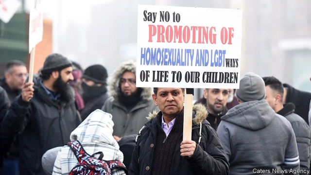

###### Sex and religion

# British Muslim parents oppose LGBT lessons in primary school 

##### The parents seem to have won the latest battle in a new culture war 

 

> Mar 7th 2019 

WHEREAS AMERICA has culture wars between secular liberals and conservative Christians, cultural battles in Europe increasingly pit secular liberals against conservative Muslims. A noisy skirmish over sex education in a Muslim district of the English Midlands could be a sign of things to come. 

Since early February parents have been demonstrating outside Parkfield Community School in Birmingham because their children, aged between four and 11, have been receiving lessons about same-sex relationships. The “No Outsiders” classes, pioneered by Parkfield’s assistant head, Andrew Moffatt, are offered for use in schools, libraries and parent-teacher groups across England, and cover topics grouped under buzzwords like equality and diversity. 

Things came to a head on March 1st when hundreds of children were kept away from Parkfield in protest. Mr Moffatt, who has received a medal from the queen for his work, came in for a barrage of threatening messages, some implying that the teacher, who is gay, has been using pupils as guinea pigs in an unwanted social experiment. 

Parkfield was backed by Ofsted, the schools inspectorate, whose boss said it was vital for children to be aware of “families that have two mummies or two daddies”. But on March 4th the school seemed to be backing down. Parents received a letter saying No Outsiders lessons would not be taught for the rest of the term, and promising consultations over future lessons. The school’s bosses maintained they had never intended to hold the controversial classes between now and the Easter holidays. The head of the trust which runs the school, Hazel Pulley, insisted that the lessons would resume in the summer term. 

The row has split the Labour Party that dominates the city’s politics. Shabana Mahmood, the MP for Birmingham Ladywood, urged the authorities to understand the parents’ position. It was “all about the age-appropriateness of conversations with young children in the context of religious backgrounds”, she said. Fellow Labour activists denounced her defence of “bigotry”. 

But Nick Gibb, the schools minister, seemed to hint that she had a point. He confirmed that schools must promote equality. But they “will be required to take the religious beliefs of their pupils into account when they decide to deliver certain content”, he added. That will be tricky in Birmingham, where more than a third of children are Muslim and conservative strands, like the Deobandis and Salafis, enjoy much influence. 

-- 

 单词注释:

1.Muslim['mjzlim; (?@) 'mʌzlem]:n. 伊斯兰教, 伊斯兰教教徒 

2.lgbt[.el dʒiː biː 'tiː]:[网络] 同志；跨性别者；双性恋和跨性别 

3.secular['sekjulә]:n. 修道院外的教士 a. 世俗的, 现世的, 长期的 

4.cultural['kʌltʃәrәl]:a. 文化的, 教养的, 修养的 [医] 培养的 

5.Muslim['mjzlim; (?@) 'mʌzlem]:n. 伊斯兰教, 伊斯兰教教徒 

6.skirmish['skә:miʃ]:n. 前哨战, 小争论, 小冲突 vi. 发生小争论, 侦察 

7.midland['midlәnd]:n. 中部地方, 内地 

8.parkfield[]: [地名] [美国] 帕克菲尔德 

9.Birmingham['bә:miŋәm]:n. 伯明翰 

10.outsider[' aut'saidә]:n. 外人, 局外人, 非会员, 外行, 门外汉, 比赛中获胜可能性不大的选手 [经] 外船公司 

11.andrew['ændru:]:n. 安德鲁（男子名） 

12.Moffatt[]:n. (Moffatt)人名；(英)莫法特 

13.buzzword['bʌzwә:d]:n. 流行词 

14.diversity[dai'vә:siti]:n. 差异, 多样性 [化] 多样性 

15.barrage['bærɑ:dʒ]:n. 弹幕, 掩护炮火 vt. 以密集炮火进攻 

16.guinea['gini]:n. 几内亚 

17.unwanted[.ʌn'wɒntid]:a. 没人要的, 不需要的, 多余的 

18.ofsted[]: 教育标准局（英国负责评鉴学校标准的政府部门） 

19.inspectorate[in'spektәrit]:[法] 检查员, 检查员的管辖区域, 视察团 

20.mummy['mʌmi]:n. 木乃伊, 瘦而干瘪之人, 妈咪 [医] 干尸, 木乃伊; 普鲁士红 

21.daddy['dædi]:n. 爸爸 

22.consultation[.kɒnsәl'teiʃәn]:n. 请教, 咨询, 磋商会 [医] 会诊 

23.hazel['heizl]:n. 榛子, 榛树, 淡褐色 a. 榛树的, 淡褐色的 

24.pulley['puli]:n. 滑车, 滑轮 [医] 滑车 

25.politic['pɒlitik]:a. 精明的, 明智的, 策略的 

26.shabana[]:[网络] 沙帕娜；丝明纳丝巾；丝明纳 

27.Mahmood[]:n. (Mahmood)人名；(阿拉伯、伊朗)马哈茂德 

28.MP[]:国会议员, 下院议员 [计] 宏处理程序, 维护程序, 线性规划, 微程序, 多处理器 

29.Ladywood[]:[地名] 莱迪伍德 ( 英 ) 

30.context['kɒntekst]:n. 上下文, 背景, 来龙去脉 n. 上下文 [计] 上下文 

31.activist['æktivist]:n. 激进主义分子 

32.denounce[di'nauns]:vt. 告发, 抨击, 谴责 [法] 谴责, 斥责, 告发 

33.bigotry['bigәtri]:n. 盲从, 偏见, 偏执的行为(或态度) 

34.nick[nik]:n. 刻痕, 缺口, 划痕 vt. 刻痕于, 弄缺, 擦伤 vi. 狙击 

35.GIBB[]:n. (Gibb)人名；(英)吉布 

36.tricky['triki]:a. 狡猾的, 机敏的 

37.strand[strænd]:n. (绳索的)股, 绳, 串, 海滨, 河岸 vi. 搁浅 vt. 使搁浅, 使落后, 使陷于困境, 弄断, 搓 

38.salafis[]:[网络] 沙拉菲；萨拉菲派；沙拉菲派 

