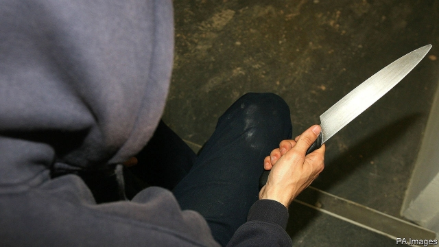
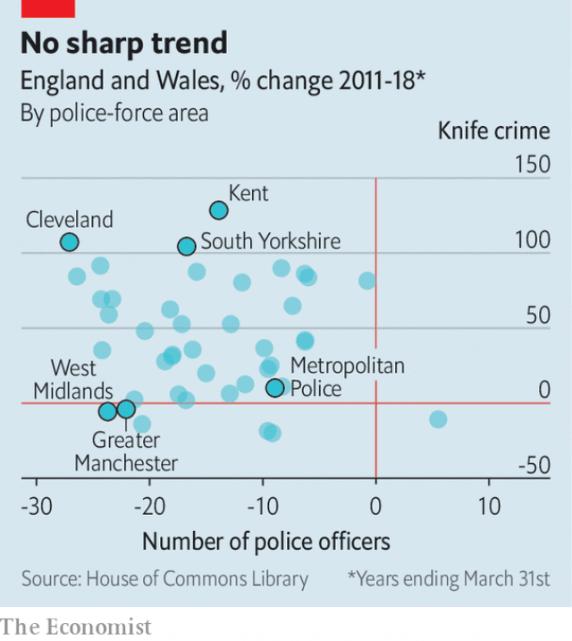

###### Murder mystery

# Fatal stabbings are at record levels in Britain. Why? 

##### Cuts to police numbers are only one part of a complex picture 

 

> Mar 7th 2019 

 

YOUSEF MAKKI and Jodie Chesney, two 17-year-olds, were stabbed to death within 24 hours of each other on March 1st and 2nd. Mr Makki was killed near Manchester and Ms Chesney in east London. The victims—one a successful pupil at a private school and the other an Explorer Scout—have received more coverage than most of this year’s other teenage casualties. But they reflect a broader trend: knife crime is on the rise. 

In the year to March 2018, 285 people were stabbed to death in England and Wales, the highest number since records began in 1946. The number of people aged 18 and under being treated for stab wounds has risen by two-thirds in the past five years, bringing the total close to a peak reached about a decade ago. 

What is behind the outbreak? Many police officers blame deep cuts to their funding made by the Conservative-led government from 2010. The number of officers has since fallen by 15%. Theresa May, who as home secretary in 2010-16 oversaw these cuts, insists that there is “no direct correlation between certain crimes and police numbers”. 

This is not a popular view. Sajid Javid, the current home secretary, says that “we have to listen to [police] when they talk about resources”. Cressida Dick, the country’s top cop, argues that there “must be something” to the fact that violent crime has risen just as budgets for the police and other public services have shrunk. One of her predecessors, Lord Stevens, is blunter: “I don’t think [Mrs May] listens, quite frankly, to what she’s being told.” 

 

The prime minister may have overstated the police’s invulnerability to cuts. But her opponents probably overstate the impact. There is so far no sign that those police forces suffering greater reductions in manpower have seen greater rises in knife crime (see chart). And although attention has focused on big urban areas, the country’s largest cities have in fact seen smaller rises in knife crime than most other places. 

There is no simple explanation for why stabbings are rising at a time when overall crime is flat. Funding cuts—not just to the police but to the services that keep young people on the straight and narrow—probably have more to do with it than Mrs May admits. A steep drop in the number of stop-and-searches, another change which began during Mrs May’s time in the Home Office, may have made it easier to carry a knife. And changes in the drug market, in which big city gangs have branched out to challenge dealers in provincial towns, have sparked turf wars on previously quiet patches. 

The overall homicide rate, at 1.24 per 100,000 people, remains well below its recent peak of more than 1.5 in the early 2000s, and is trifling by international standards. But the public are becoming worried. Mrs May should be, too. 

-- 

 单词注释:

1.stabbing['stæbiŋ]:a. (疼痛)剧烈而突然的 

2.yousef[]:[网络] 优素福；尤喜夫；约瑟夫 

3.makki[]:[网络] 麦加 

4.jodie['dʒәjdi]:n. [美军俚]平民男子；征兵不录（或缓役）的男子（等于jodie） 

5.chesney[]: [人名] 切斯尼 

6.makki[]:[网络] 麦加 

7.Manchester['mæntʃestә]:n. 曼彻斯特 

8.coverage['kʌvәridʒ]:n. 覆盖的范围, 保险总额, 新闻报导 [化] 可达范围; 覆盖度 

9.teenage['ti:nidʒ]:a. 十三岁到十九岁的 

10.casualty['kæʒjuәlti]:n. 意外事故, 伤亡, 受害者 [化] 事故 

11.wale[weil]:n. 隆起的伤痕, 鞭痕, 凸条纹, 精华, 选择 vt. 在...上留下鞭痕, 织成棱纹, 挑选, 撑住 vi. 挑选 

12.theresa[ti'ri:zә]:n. 特丽萨（女子名） 

13.oversee[.әuvә'si:]:vt. 向下看, 了望, 监督, 偷看到 [法] 监察, 监督, 俯瞰 

14.correlation[.kɒrә'leiʃәn]:n. 相互关系, 相关, 关联 [医] 相关, 联系 

15.sajid[]:n. (Sajid)人名；(印尼)赛义德 

16.javid[]:[网络] 加威；贾维德 

17.Cressida['kresidә]:n. 克雷西达 

18.dick[dik]:n. 家伙, 词典, 誓言(书) [医] 二氯乙胂(毒气) 

19.cop[kɒp]:n. 警官 vt. 抓住 

20.predecessor[.predi'sesә]:n. 前任, 先辈, 前身 [医] 初牙, 前辈, 祖先 

21.stevens['sti:vnz]:n. 史蒂文斯（姓氏） 

22.frankly['fræŋkli]:adv. 坦白地 

23.overstate[.әuvә'steit]:vt. 夸大的叙述, 夸张, 过分强调 [经] 多计, 高估 

24.invulnerability[in.vʌlnәrә'biliti]:n. 不会受伤害, 刀枪不入, 无懈可击的 

25.manpower['mænpauә]:n. 人力 [经] 人力 

26.Mr['mistә(r)]:先生 [计] 存储器回收程序, 多重请求 

27.dealer['di:lә]:n. 经销商, 商人 [经] 交易员, 贩卖商 

28.provincial[prә'vinʃәl]:n. 外地人, 粗野的人 a. 省的, 外地的, 偏狭的 

29.turf[tә:f]:n. 草皮, 泥炭, 跑马场 vt. 覆草皮于 

30.homicide['hɒmisaid]:n. 杀人, 杀人者 [医] 杀人, 杀人者 

