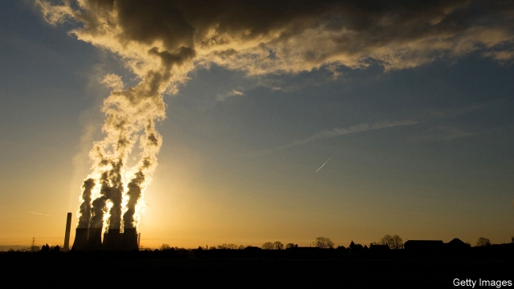
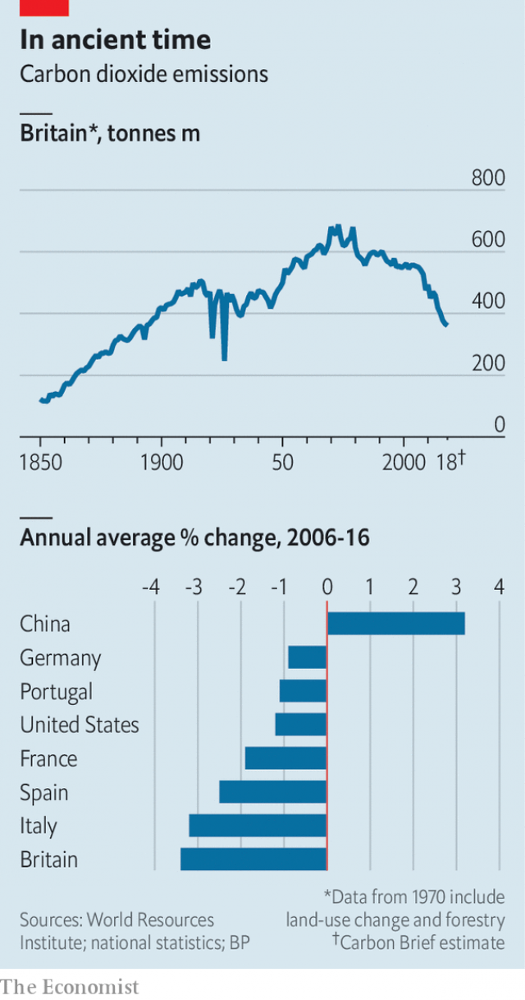

###### A greener and more pleasant land

# How Britain cut carbon emissions more than nearly any other country 

##### The rapid demise of coal has burnished the country’s climate credentials 

 

> Mar 7th 2019 

MARGARET THATCHER was a chemist by training, which may be one reason why she was also one of the first world leaders to warn about the dangers of an overheating planet. In a speech to the UN in 1989 she highlighted the risks posed by the “vast increase” in the amount of CO2 entering the atmosphere. 

It made little difference. When Thatcher gave her speech, the concentration of carbon dioxide in the Earth’s atmosphere stood at about 350 parts per million (ppm). Today the number is 412ppm, and rising fast: 2018 was the fourth-warmest year on record. Indeed, each of the past five years is one of the five hottest. 

But there are slivers of good news. According to figures from BP, an oil firm, between 2006 and 2016 Britain made some of the biggest emissions cuts of any rich economy, averaging 3.4% a year (see chart). And in February the government published its latest set of energy-use statistics. Analysis of those figures by Carbon Brief, a specialist news website, suggests that Britain’s emissions of carbon dioxide, the main greenhouse gas, fell by 1.5% last year, to 361m tonnes. That marks the sixth annual fall in a row. The country’s emissions of CO{-2} are now around 39% lower than they were in 1990, the benchmark year against which most climate-change targets are set. 

 

If anything, that undersells the scale of the fall. Historical emissions figures must be estimated from secondary sources. But it seems likely that the last time carbon dioxide emissions were as low as today was in the closing years of the 19th century, when Queen Victoria was on the throne and cars and electric lighting were cutting-edge curiosities. 

Most of the reduction comes from removing coal, the dirtiest of the fossil fuels, from the electricity grid. A combination of the collapse of heavy industry in the 1980s (which reduced demand for electricity) and the “dash for gas” in the 1990s, which saw a rush to build gas-fired stations, means that Britain has not built a coal power station since 1987. Coal’s share of electricity generation has fallen especially fast in the past few years, as a combination of the EU’s emissions-trading scheme and a British carbon floor-price of £18 ($24) per tonne has made it uneconomic. In 2014 coal accounted for 30% of all electricity generated in Britain. By 2017 that had fallen to just 6.7%. Last year the country went 1,856 hours without coal providing any electricity at all. The government wants the fuel to be phased out entirely by 2025. 

The gap has been filled by gas, and by renewable energy. Wind and solar power have boomed on the back of subsidies that guarantee their power can be sold at favourable prices. Offshore wind, in particular, is growing fast. Britain already has the world’s biggest offshore wind farm, and several more are being built. 

Despite all that, Britain remains one of the 20 biggest producers of carbon dioxide (though far behind America and China). And the rate at which emissions are falling seems to be slowing down. Getting rid of coal is the easy part. Replacing gas will be harder. The more renewable electricity comes onto the grid, the more problems are caused by its intermittent nature. The government wants to see a big expansion of nuclear power. But rows over subsidies have seen two firms, Hitachi and Toshiba, pull out, leaving those plans in disarray. 

And electricity is only one part of the equation. Transport and heating, the other big users of energy, remain dominated by fossil fuels. Sales of electric and hybrid cars are growing, albeit from a low base. In 2018 they made up 2.7% of new cars, but cuts to government subsidies seem likely to dampen demand. Heating, which is provided mostly by natural gas or kerosene, is trickiest of all. Electric heating is far more expensive than the fossil-fuel sort. A switch to it would imply big rises in power bills, which are already a cause of political rows. Britain’s houses are mostly old, poorly built and draughty. Laws that would have ensured that newly built houses were low-carbon were recently scrapped. 

Dieter Helm, an energy economist at the University of Oxford, points out that the way climate-change statistics are compiled flatters service economies like Britain’s, which have outsourced production of the goods they consume to countries like China. He thinks countries should count carbon consumption, instead of production. Still, the home of the Industrial Revolution has made more progress than many when it comes to the green sequel. 

-- 

 单词注释:

1.emission[i'miʃәn]:n. 发射, 射出, 发行 [医] 发射, 遗精 

2.demise[di'maiz]:n. 崩, 薨, 死亡 vt. 让渡, 遗赠, 转让 

3.burnish['bә:niʃ]:vt. 擦亮, 打磨, 磨光 vi. 磨光发亮 n. 光辉, 光泽 

4.credential[kri'denʃәl]:n. 国书, 凭据, 证明书 [经] 凭证, 证书 

5.margaret['mɑ:^әrit]:n. 玛格利特（女子名） 

6.thatcher[]:n. 盖屋顶者 

7.overheating[]:[经] 过分的经济活动 

8.UN[ʌn]:pron. 家伙, 东西 [经] 联合国 

9.thatcher[]:n. 盖屋顶者 

10.ppm[]:[化] 百万分率 

11.sliver['slivә]:n. 裂片, 薄片, 梳毛 vt. 切成长片 vi. 剖开, 分裂 

12.bp[]:[化] 碱基对 

13.statistic[stә'tistik]:n. 统计量 a. 统计的, 统计学的 

14.tonne[tʌn]:n. 吨, 公吨 [经] 吨 

15.benchmark[]:[计] 基准程序; 基准 

16.undersell[.ʌndә'sel]:vt. 以低于市价售出, 抛售 [经] 廉价出售 

17.victoria[vik'tɔ:riә]:n. 维多利亚（女子名） 

18.fossil['fɒsәl]:n. 化石, 古物 a. 化石的, 陈腐的, 守旧的 

19.grid[grid]:n. 格子, 栅格 [计] 网格 

20.uneconomic[]:a. 不经济的, 浪费的 [经] 不经济的, 不实用的 

21.entirely[in'taiәli]:adv. 完全, 全然, 一概 

22.renewable[ri'nju(:)әbl]:a. 可更新的, 可恢复的, 可继续的, 可换新的, 可重复的, 可重说的 [计] 可更新, 可再生的 

23.producer[prә'dju:sә]:n. 生产者, 制作者, 制作人 [化] 发生器; (炉煤气)发生炉; 制气炉; 生产者 

24.intermittent[.intә'mitәnt]:a. 间歇的, 断断续续的 [化] 间歇的; 间断的 

25.Hitachi[hi'tɑ:tʃi]:[计] 日立网络体系结构 

26.toshiba[]:n. 东芝（公司名, 财富500强公司之一, 总部所在地日本, 主要经营电子电气） 

27.disarray[.disә'rei]:vt. 弄乱, 使混乱, 使脱去衣服 n. 无秩序, 杂乱, 不整齐的衣着 

28.hybrid['haibrid]:n. 混血儿, 杂种, 混合物 a. 混合的, 杂种的, 混合语的 [计] NetWare的主机实用程序, 双重用户建立程序 

29.albeit[ɔ:l'bi:it]:conj. 尽管, 虽然 

30.dampen['dæmpәn]:vt. 弄湿, 使沮丧 vi. 变湿, 丧气 

31.kerosene['kerәsi:n]:n. 煤油, 火油, 灯油 [化] 煤油 

32.tricky['triki]:a. 狡猾的, 机敏的 

33.poorly['puәli]:adv. 贫穷地, 不充分地, 贫乏地 a. 身体不舒服的 

34.draughty['drɑ:fti]:a. 通风的 

35.scrap[skræp]:n. 碎片, 残余物, 些微, 片断, 铁屑, 吵架 vt. 扔弃, 敲碎, 拆毁 vi. 互相殴打 a. 零碎拼凑成的, 废弃的 

36.dieter['daiәtә]:n. 节食者 

37.helm[helm]:n. 舵, 驾驶盘, 枢机, 头盔 vt. 给...掌舵, 指挥, 给...戴头盔 

38.economist[i:'kɒnәmist]:n. 经济学者, 经济家 [经] 经济学家 

39.Oxford['ɒksfәd]:n. 牛津, 牛津大学 

40.flatter['flætә]:vt. 奉承, 阿谀, 使高兴 [机] 平面锤 

41.outsourced[autˈsɔ:st]:v. 外购（指从外国供应商等处获得货物或服务）； 外包（工程）( outsource的过去式和过去分词 ) 

42.sequel['si:kwәl]:n. 继续, 续集, 后果 [计] 结构的英语查询语言 

