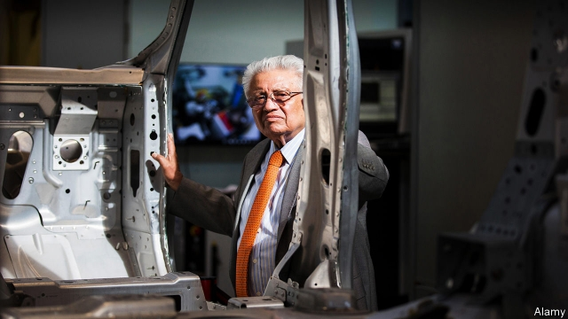

###### Kumar Bhattacharyya, 1940-2019

# Kumar “Battery Charger”, the man who energised Britain 

##### Lord Bhattacharyya, an engineering dynamo, died on March 1st 

 

> Mar 7th 2019 

LORD TEBBIT, one of Margaret Thatcher’s lieutenants, once proposed a “cricket test” to see how well assimilation was going. Did immigrants cheer for England or their country of origin? Kumar Bhattacharyya would have failed Lord Tebbit’s test—he liked to say that “I support England in the Test matches, except when they are playing India.” But he was one of the great Englishmen of his generation. 

Born in Bangalore to a wealthy Brahmin family that had made its money in tea and steel, the young Mr Bhattacharyya moved to Britain in 1961 to work for Lucas Industries and study engineering at Birmingham University. He quickly fell in love with the country, despite finding the food inedible and the weather intolerable. But he worried that the object of his affection was bent on self-destruction. Academics looked down on industry. Manufacturing companies were in a dismal state. The ruling class was reconciled to decline. 

He devoted his life to tackling these problems—and was lucky to encounter an ambitious vice-chancellor at Warwick University, Jack Butterworth, who shared his analysis. Butterworth gave him “a table, a chair and a secretary” in the engineering department. “Battery Charger”, as he was known, did the rest, challenging the holier-than-thou approach of academia head on and forging close links with business. 

The result was a powerhouse of research and training called the Warwick Manufacturing Group. It now has a staff of 650 carrying out cutting-edge research in everything from lean production to battery technology and allowing students to combine an academic education with working for local firms. The jewel in its crown, a 355,000-square-foot National Automotive Innovation Centre, is under construction. 

Lord Bhattacharyya, as he became in 2004, also did more than anyone to persuade the Tata Group to buy Corus, an ailing steel giant, in 2007 and Jaguar Land Rover the year after. The second was a particular coup. Worried that Ford was planning to sell JLR to a private-equity company that would gut it, Lord Bhattacharyya invited his good friend Ratan Tata to see what was on offer. The Indian titan decided to invest more than £10bn ($13bn) in JLR, tripling its workforce. 

Lord Bhattacharyya was the subject of one of the most poorly titled books in recent years, “Kumar Bhattacharyya: The Unsung Guru”. He was in fact the subject of many a song. The British government rewarded him with a knighthood and a peerage—he relished being called Professor Lord Bhattacharyya—and his fellow management theorists revered him. The Warwick Manufacturing Group means that he now has a permanent place in the landscape of his beloved Midlands. 

-- 

 单词注释:

1.Kumar[]:n. 库马尔（姓氏） 

2.Bhattacharyya[]:[计] 巴特查里亚 

3.charger['tʃɑ:dʒә]:n. 充电器, 冲锋者, 战马 [化] 充电器; 装料机; 加料机 

4.energise['enәdʒaiz]:vt. 供给…能量；使精力充沛（等于energize） 

5.dynamo['dainәmәu]:n. 发电机 [医] 电机, 发电机 

6.tebbit[]: [人名] [英格兰人姓氏] 特比特 Theobald的变体 

7.margaret['mɑ:^әrit]:n. 玛格利特（女子名） 

8.assimilation[ә.simi'leiʃәn]:n. 同化, 同化作用, 吸收 [化] 同化; 同化作用 

9.Bangalore[,bæŋ^ә'lɔ:]:n. 炸药桶 

10.Brahmin['brɑ:min]:n. 婆罗门, 僧侣 

11.lucas['lu:kәs]:n. 卢卡斯（男子名, 等于Luke） 

12.Birmingham['bә:miŋәm]:n. 伯明翰 

13.quickly['kwikli]:adv. 很快地 

14.inedible[in'edibl]:a. 不适于食用的 

15.intolerable[in'tɒlәrәbl]:a. 无法忍受的, 难耐的 

16.manufacturing[.mænju'fæktʃәriŋ]:n. 制造业 a. 制造业的 

17.dismal['dizmәl]:a. 阴沉的, 凄凉的, 令人忧郁的 n. 低落的情绪, 沼泽 

18.reconcile['rekәnsail]:vt. 使和解, 调停, 使和谐, 使一致, 使听从 [经] 对帐, 使一致 

19.tackle['tækl]:n. 工具, 复滑车, 滑车, 装备, 扭倒 vt. 固定, 处理, 抓住 vi. 扭倒 

20.ambitious[æm'biʃәs]:a. 有野心的, 抱负不凡的, 雄心勃勃的 

21.warwick['wɔrik]:n. 沃里克（英国英格兰中部沃里克郡城市）；沃里克（美国罗德岛州东部城市, 为纺织业中心）；沃里克（姓氏） 

22.jack[dʒæk]:n. 插座, 千斤顶, 男人 vt. 抬起, 提醒, 扛举, 增加, 提高, 放弃 a. 雄的 [计] 插座 

23.Butterworth[]:[计] 巴特沃斯 

24.academia[.ækә'di:miә]:n. 学术界, 学术生涯 

25.forge[fɒ:dʒ]:n. 熔炉, 铁工厂 vt. 打制, 锻造, 伪造 vi. 锻造, 伪造 

26.powerhouse['pauәhaus]:n. 发电所, 动力室, 精力旺盛的人, 办事效率高的机构 

27.automotive[.ɒ:tәu'mәutiv]:a. 汽车的 

28.innovation[.inәu'veiʃәn]:n. 改革, 创新 [法] 创新, 改革, 刷新 

29.tata[.tæ'tɑ:. .tɑ:-]:int. [英国口语]再见 

30.corus[]: 科勒斯钢铁公司 

31.ailing['eiliŋ]:a. 生病的 [医] 患病的, 病痛的 

32.jaguar['dʒægjuә]:n. 美洲虎 

33.rover['rәuvә]:n. 漂泊者, 流浪者, 海盗 [法] 流浪者, 海盗, 海盗船 

34.coup['ku:]:n. 砰然的一击, 妙计, 出乎意料的行动, 政变 [医] 发作, 中, 击 

35.ford[fɒ:d]:n. 浅滩, 福特汽车 v. 涉过, 涉水 

36.JLR[]:[网络] 捷豹路虎(Jaguar Land Rover)；类脂研究杂志(Journal of Lipid Research)；捷豹路虎汽车公司 

37.gut[gʌt]:n. 剧情, 内容, 内脏, 肚子, 海峡, 勇气 vt. 取出内脏, 毁坏...的内部 

38.RATAN[ræ'tæn]:用于导航的雷达和电视设备 

39.Titan['taitn]:n. 提坦, 太阳神, 巨人 

40.triple['tripl]:n. 三倍数, 三个一组 a. 三倍的 vt. 使增至三倍 vi. 增至三倍 

41.poorly['puәli]:adv. 贫穷地, 不充分地, 贫乏地 a. 身体不舒服的 

42.unsung[.ʌn'sʌŋ]:a. 未被唱颂的, 未赞颂的 

43.guru['guru:]:n. 古鲁(印度教导师) [医] 柯拉子 

44.knighthood['naithud]:n. 骑士身分, 骑士气质, 骑士 

45.relish['reliʃ]:n. 滋味, 风味, 美味, 爱好, 食欲, 调味品 vt. 调味, 喜欢, 玩味 vi. 有味道 

46.theorist['θi:әrist]:n. 理论家, 理论工作者 

47.rever[]:n. 作梦（歌名） 

48.landscape['lændskeip]:n. 风景, 山水, 风景画 vi. 从事景观美化 vt. 美化...景观 [计] 横向 

49.midland['midlәnd]:n. 中部地方, 内地 

