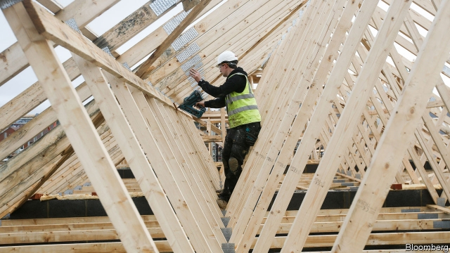
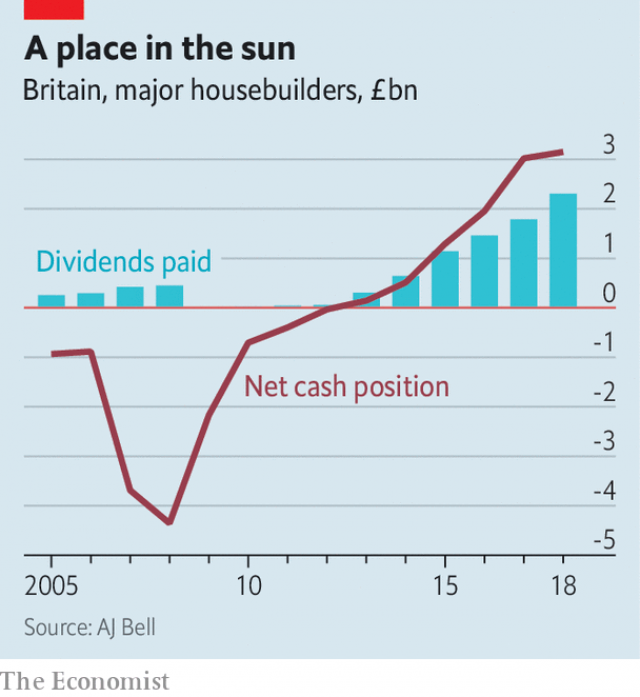

###### Cash in the attic

# Why British housebuilders are making such juicy profits 

##### Operating margins are roughly twice what they are in America 

 

> Mar 7th 2019 

MOVE OVER, investment banking. Now housebuilding is the industry Britons love to hate. Even as many people struggle with high housing costs, housebuilders are cashing in. Last month Persimmon, Britain’s largest, posted profits of £1.1bn ($1.4bn) for 2018, its highest ever. Across the industry operating margins are twice what they are in America. Dividends have jumped and the firms’ cash piles point to big payouts in the future (see chart). Stories of senior managers being paid investment-banker salaries often hit the headlines. 

Why are the builders enjoying a purple patch? One explanation is that they are better managed than they once were. Before the financial crisis in 2008-09 many were laden with debt. After the crisis they raised capital and cut costs. Recently Barratt Developments revealed a cunning plan which involved lowering the pitch of its roofs, which should reduce the number of tiles required. Housebuilders are also shifting more units. Last year Britain put up 200,000 dwellings, the most in a decade. 

 

Policymakers have given housebuilders a helping hand, however. “Help to Buy”, a mortgage-subsidy scheme launched in 2013, raises the purchasing power of potential new-home buyers. It was supposed to increase home-ownership rates among the young. Economists dispute whether it actually has. But according to a forthcoming paper from Felipe Carozzi, Christian Hilber and Xiaolun Yu of the London School of Economics, the clearest impact of Help to Buy has been to raise house prices, potentially by as much as 5%. 

The builders’ juicy profits may also be a consequence of the changing structure of the housing market. In the early 1980s small builders (ie, those erecting up to 100 units a year) built almost half Britain’s homes. Since then the market has become more concentrated. The minnows’ share has fallen to a tenth, while the whales have boosted theirs. The growing complexity of the planning system is in part to blame. From the 1990s more obligations were placed on developers. Builders must often rely on time-consuming appeals in order to get approval for a project. Small firms rarely have the expertise and resources to navigate the system. 

The big builders’ market power expresses itself in different ways. Stories abound of new houses which quickly develop mould and damp. There is also evidence that big builders acquire large plots of land in a local area, then put up houses deliberately slowly in order to maintain the local market price. A recent official review by Sir Oliver Letwin, a Conservative MP, found that “the larger the site, the more likely it is to have a low build-out rate.” 

Housebuilders’ power may find its purest expression in the market for developable land. That market is opaque. Yet it appears that homebuilders can bargain down the price at which they buy plots. Robin Hardy of Shore Capital, an investment firm, says that whereas in the mid-2000s five or six builders would compete for a plot of land, one or two is now more common, which gives potential sellers fewer options. A calculation by Neal Hudson of Resi Analysts, a consultancy, suggests that residential-land prices are currently some 30% below what one would expect given their historical relationship with house prices. With land prices held down, many builders have seen rising margins on each house that they sell. 

The industry needs new firms to enter the market and compete away excess profits. To enable that, the government could lower barriers to entry. Doling out smaller plots of developable land—something that Transport for London, the capital’s transit authority and a big landowner, is exploring—would help smaller builders. Publishing more data on the land market could make it more efficient. Brexit may also dent housebuilders’ profits, if prices fall or if dwindling European immigration makes it harder to find labourers. Until then, the fat profits enjoyed by the building firms look as safe as houses. 

-- 

 单词注释:

1.attic['ætik]:n. 阁楼, 顶楼 [医] 鼓室上隐窝 

2.housebuilder[]: [医]造房工 

3.Briton['britәn]:n. 大不列颠人, 英国人 

4.persimmon[pә'simәn]:n. 柿子(树) [医] 柿 

5.dividend['dividend]:n. 被除数, 股利 [计] 被除数 

6.payout['pei'aut]:n. 支出, 付出款项 [经] 付出款项, 花费, 支出 

7.builder['bildә]:n. 建立者 [机] 组份 

8.Barratt[]:n. (Barratt)人名；(英)巴勒特；(西)巴拉特 

9.tile[tail]:n. 砖瓦, 瓷砖, 瓦片 vt. 铺以瓦, 铺以瓷砖 [计] 平铺 

10.policymaker['pɔlisi.meikә]:n. 政策制定者；决策人 

11.buyer['baiә]:n. 买主, 买方 [经] 买主, 买方, 买手 

12.economist[i:'kɒnәmist]:n. 经济学者, 经济家 [经] 经济学家 

13.forthcoming['fɒ:θ'kʌmɑŋ]:a. 即将来临的 n. 来临 

14.Felipe[]:n. (Felipe)人名；(西、葡、罗)费莉佩(女名), 费利佩 

15.carozzi[]: [人名] 卡罗齐 

16.Hilber[]:[网络] 希尔伯 

17.yu[ju]:n. 禹（传说的中国古代圣君） 

18.potentially[pә'tenʃәli]:adv. 可能地, 潜在地 

19.IE['i:ei]:[计] 中断启动 

20.complexity[kәm'pleksiti]:n. 复杂, 复杂性, 复杂的事物 

21.developer[di'velәpә]:n. 开发者 [计] 显影器 

22.expertise[.ekspә:'ti:z]:n. 专家意见, 专门技术 [法] 专门知识, 专家意见 

23.navigate['nævigeit]:vi. 航行 vt. 航行于, 驾驶, 操纵, 使通过 

24.abound[ә'baund]:vi. 大量存在, 富于, 充满 

25.quickly['kwikli]:adv. 很快地 

26.oliver['ɒlivә]:n. 脚踏铁锤 

27.letwin[]:[网络] 莱特文；希望有天能指哪打哪 

28.MP[]:国会议员, 下院议员 [计] 宏处理程序, 维护程序, 线性规划, 微程序, 多处理器 

29.developable[di'velәpәbl]:a. 可发展的, 可显(影)的, 可开发的 

30.opaque[әu'peik]:n. 不透明物 a. 不透明的, 不传热的, 不传导的, 阴暗的 [计] 白底 

31.homebuilder['həʊm,bɪldə]:n. 住宅设计家；住宅建筑公司；住宅建筑商 

32.robin['rɒbin]:n. 旅鸫 [医] 刺槐毒素 

33.hardy['hɑ:di]:a. 难的, 艰苦的, 坚硬的, 勇敢的 adv. 努力地, 辛苦地, 坚硬地 

34.neal[]:n. 尼尔（人名） 

35.Hudson['hʌdsn]:n. 哈得孙河 

36.resi[]:[网络] 万鼎工程；菜；树脂 

37.analyst['ænәlist]:n. 分析者, 精神分析学家 [化] 分析员; 化验员 

38.consultancy[]:n. 商量, 协商, 磋商, 会诊, 与...商量, 咨询, 请教, 找(医生)看病, 查阅, 考虑 [经] 咨询业务, 咨询服务 

39.currently['kʌrәntli]:adv. 现在, 当前, 一般, 普通 [计] 当前 

40.dole[dәul]:n. 救济品, 失业救济金 vt. 发放救济 

41.transit['trænsit]:n. 经过, 通行, 运输, 运输线, 转变 vt. 运送, 使通过, 经过 vi. 通过 

42.landowner['lændәunә]:n. 地主 [法] 土地所有人, 地主 

43.datum['deitәm]:n. 论据, 材料, 资料, 已知数 [医] 材料, 资料, 论据 

44.Brexit[]:[网络] 英国退出欧盟 

45.dent[dent]:n. 凹痕 vt. 使凹下, 削弱 vi. 塌陷 

46.dwindle['dwindl]:vi. 减少, 缩小, 衰落 vt. 使缩小 

