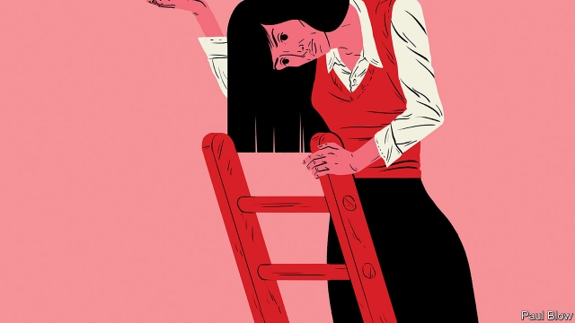

###### Bartleby

# A small step for women 

##### Progress in the boardroom is only a start 

 

> Mar 7th 2019 

THE GLASS ceiling in the corporate world is not broken, but it is starting to crack. Women are getting on to corporate boards at greater speed, and in greater numbers. 

Research by LinkedIn, a professional networking site, shows that across five countries (America, Germany, India, Italy and Norway) women it lists as directors reached the position faster than their male counterparts did. In America, for example, women got there 9.8 years after leaving university and men after 10.9 years. 

This suggests that younger women are making good progress in the boardroom. Overall, however, females are still lagging behind the males. The proportion of people in leadership roles (director-level and above) that is female in the five countries varies from 17% in India to 35% in America. 

Britain has seen a clear advance; a campaign there called the 30% club has managed to increase the share of female directors of FTSE 100 companies from 12.5% in 2010 to 30.6%. But as the world marks International Women’s Day on March 8th, it is clear that the glass ceiling has not shattered. 

Some firms may be paying only lip service to the idea of female leadership. A paper in the Academy of Management Journal* highlights the phenomenon of “twokenism”, a statistical bunching of American companies with exactly two female directors. The authors suggest this is directly related to the average number of female directors on S&P 1500 boards in the period studied (2004-13), which was 1.92. By opting for two women, businesses could claim they had “above average” female representation. 

In any case, a rise in the number of female directors is a narrow measure of female economic success. Having women at the top of organisations may inspire others to emulate them, and board members may be able push through more female-friendly policies lower down in their organisations. But the vast majority of women would never expect to become directors. What they value is an opportunity to get a well-paid job and to be free from discrimination while doing it. 

In this respect the news is less encouraging. Across the OECD the gender pay gap of full-time employees averages 13.5% and varies widely, from 3.4% in Luxembourg to 36.7% in South Korea. It can be hard to adjust for all the many factors, such as skill levels, that might explain this gap. Nevertheless, the OECD found last year that full-time employed women with a college degree earned, on average, 26% less than their male equivalents. 

A World Bank survey of 187 economies, published last month, found that women had, on average, three-quarters of the legal and employment rights of men. The survey asked questions such as whether women were free to travel and open a business, if they had property rights and if they were protected from sexual harassment. In the Middle East and north Africa, women were found on this basis to have less than half the rights of men (Saudi Arabia was ranked lowest of all the countries surveyed). Only in six countries (Belgium, Denmark, France, Latvia, Luxembourg and Sweden) did the law and society grant women equal rights. 

Problems are deep-rooted. Research by Lisa Cameron of the University of Melbourne with the IZA, a German think-tank, found that in many developing economies more than half of all non-agricultural female workers relied on informal employment, a higher share than men. Not only do these women get paid less as a result, they also lack access to state social programmes, such as unemployment benefit and pensions, which are often designed with formal employment status in mind. 

The result is that poorly paid women have few resources to fall back on. In addition, social programmes are much less generous in developing economies than they are in the rich world, absorbing 17.7% of GDP in Europe and 10.7% in America, but only 9.7% in Latin America and just 1.4% in South-East Asia. Without the cushion of a benefit system, working women in the developing world probably must endure more bullying and harassment at work, for fear of losing their jobs. 

So there is certainly cause to celebrate women making small steps forward in the boardroom. But bigger leaps are still needed elsewhere. 

* “Diversity Thresholds: How Social Norms, Visibility and Scrutiny Relate to Group Composition” by Edward H. Chang, Katherine L. Milkman, Dolly Chugh and Modupe Akinola 

-- 

 单词注释:

1.bartleby[]:[网络] 巴特比；巴特白；老板是空气 

2.boardroom['bɒ:drum]:n. 会议室, 证券交换场所 

3.corporate['kɒ:pәrit]:a. 社团的, 合伙的, 公司的 [经] 团体的, 法人的, 社团的 

4.linkedin['lɪŋktɪn]:n. 商务化人际关系网 

5.Norway['nɒ:wei]:n. 挪威 

6.counterpart['kauntәpɑ:t]:n. 副本, 复本, 配对物, 相应物 [经] 副本, 正副二份中之一 

7.ftse[]:abbr. failed to sustain engraftment 支撑移植物植入失败 

8.shatter['ʃætә]:n. 碎片, 粉碎, 落叶, 喷洒 vt. 打碎, 使散开, 粉碎, 破坏 vi. 粉碎, 损坏, 脱落 

9.opt[ɒpt]:vi. 选择 

10.representation[.reprizen'teiʃәn]:n. 表示法, 表现, 陈述, 代表 [计] 表示法指定 

11.organisation[,ɔ: ^әnaizeiʃən; - ni'z-]:n. 组织, 团体, 体制, 编制 

12.emulate['emjuleit]:vt. 效法, 尽力赶上, 同...竞争 [计] 仿真 

13.les[lei]:abbr. 发射脱离系统（Launch Escape System） 

14.Oecd[]:[经] 已开发国家组织 

15.gender['dʒendә]:n. 性 vt. 产生 

16.luxembourg['luksәm,bә:^]:n. 卢森堡公国；卢森堡（卢森堡公国首都） 

17.Korea[kә'riә]:n. 朝鲜, 韩国 

18.harassment['hærәsmәnt]:n. 困扰, 烦扰, 烦恼 [法] 折磨, 骚扰, 侵扰 

19.saudi['sajdi]:a. 沙乌地阿拉伯（人或语）的 

20.Arabia[ә'reibiә]:n. 阿拉伯半岛 

21.Denmark['denmɑ:k]:n. 丹麦 

22.Latvia['lætviә]:n. 拉脱维亚 

23.Sweden['swi:dn]:n. 瑞典 

24.lisa['li:zә, 'laizә]:n. 丽莎（女子名） 

25.cameron['kæmәrәn]:n. 卡梅伦/隆（男子名） 

26.Melbourne['melbәn]:n. 墨尔本 

27.iza[]: [地名] [哥伦比亚] 伊萨 

28.informal[in'fɒ:mәl]:a. 非正式的, 不拘礼的, 通俗的 [经] 非正式的, 日常使用的 

29.statu[]:[网络] 状态查看；雕像；特级雪花白 

30.poorly['puәli]:adv. 贫穷地, 不充分地, 贫乏地 a. 身体不舒服的 

31.bully['buli]:n. 欺凌弱小者, 土霸 vt. 威胁, 恐吓, 欺负 vi. 欺负 a. 特好的, 第一流的 adv. 十分 

32.diversity[dai'vә:siti]:n. 差异, 多样性 [化] 多样性 

33.norm[nɒ:m]:n. 基准, 模范, 标准, 准则, 平均数 [化] 定额 

34.visibility[.vizi'biliti]:n. 可见性, 能见度, 能见距离 [计] 可见性 

35.scrutiny['skru:tini]:n. 细看, 仔细检查, 监视, 选票检查 [经] 复查, 评核, 仔细检查 

36.edward['edwәd]:n. 爱德华（男子名） 

37.H[eitʃ]:[计] 硬件, 高度, 水平, 主机 [医] 氢(1号元素), 亨[利](电感单位) 

38.chang[tʃɑ:ŋ. tʃæŋ]:n. 青稞酒（等于chong） 

39.katherine[]:n. 凯瑟琳（女子名） 

40.L[el]:n. 见习驾驶员 [计] 电感, 标记, 语言, 负载, 局部, 线路 

41.milkman['milkmәn]:n. 牛奶商, 送奶工, 挤奶的男人 

42.dolly['dɒli]:n. 洋娃娃, (洗衣用)捣棒 vi. 移动车 vt. 用移动车移动 

43.chugh[]:[网络] 丘格 

44.modupe[]:n. (Modupe)人名；(尼日利)莫杜佩 

45.akinola[]:阿基诺拉 

