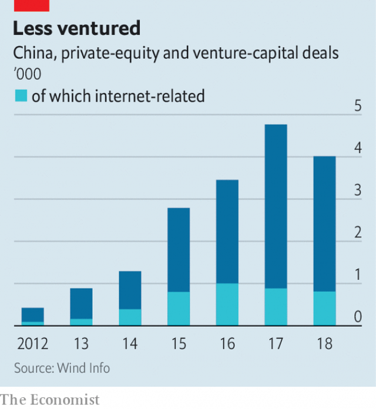

###### Unicorns in winter

# China’s formerly white-hot tech sector is in the doldrums 

##### Technology startups are finding it harder to attract venture capital and are shedding staff 

 

> Mar 7th 2019 

“ONLY WHEN the year grows cold do we see the qualities of the pine and the cypress,” wrote Robin Li, the boss of Baidu, in a new year’s letter to staff at China’s main online-search firm. It was yet another recognition of a chill sweeping through the country’s technology industry. The lavish financing that promising startups have come to expect has dried up. Job cuts have multiplied. Even China’s tech giants have not been spared and are slashing bonuses and travel expenses. 

This wintry spell is a remarkable reversal for a batch of firms, such as Meituan-Dianping, an online-services super-app, that are among China’s most vivacious. Early last year they appeared to be in rude health and were drawing in vast dollops of investment. More money was raised for venture-capital funds in China in the first half of 2018 than in America, the first time that had ever happened: $56bn compared with $42bn, according to Preqin, a data provider. By the autumn no fewer than 86 new “unicorns”—private, billion-dollar startups—had emerged. 

Then the “capital winter” set in. One trigger was a selloff in tech stocks globally that included China’s biggest stars, Alibaba and Tencent. Worries have multiplied about the pace of revenue growth in a slowing economy, as well as the time it is taking for highly valued private startups to approach profitability. Even giants are seeing sales growth slow. In the third quarter of 2018 JD.com, an e-commerce group, reported its slowest quarterly revenue increase since 2014 and its first decline in new users. 

 

During the last three months of 2018, deals to commit venture capital to young firms slumped in number by two-fifths, and private-equity financing dropped by more than a quarter, to under $10bn, compared with the previous three months, according to CB Insights, a research firm (see chart). Unable to raise money, a slew of small funds have even disappeared. 

Part of the downturn has more to do with supply of financing for VC funds than disillusion with unicorns. The government has cracked down on informal sources of financing from which much VC funding has flowed, for example. But larger investors have also grown cautious about tech companies. The woes of Ofo, a bike-sharing unicorn, exemplified the sort of hubris that many reckon had spread too far in tech. Ofo raised seven rounds of financing within 18 months, earning a $2bn valuation. It is now almost bankrupt. 

Startups looking for early-stage investment have felt the capital winter most keenly. Yuqing Guo, a partner at PwC, a consultancy, says investors are advising them to expect as little as half the valuation they might have won a year ago. Where once investors brandished term sheets before a startup had launched, now they wait. Deals are taking longer: a round of funding once raised within a month is taking six, says Nisa Leung of Qiming Venture Partners, a big investor in Chinese tech. 

As private cash has grown harder to come by, more established companies have been looking to public markets. But this has turned into another reckoning for the tech industry, as some anticipated blockbusters fall flat. Shares in Meituan-Dianping and Ping An Good Doctor, China’s largest online health-care app, have dropped by a tenth from their offering price. 

Among Chinese bosses, meanwhile, business confidence in the three months to December was at its lowest in six quarters, according to a survey by the central bank. The country lost around 160 billionaires to last year’s stockmarket slump, reports Hurun, a consultancy which tracks the country’s super rich. The fortune of Tencent’s Ma Huateng fell by as much as 43% in 2018, to $27bn in October, as his social-media and gaming titan was hobbled by a regulatory hold-up. For the three months to June 2018 the company posted its first quarterly profit decline since 2005. 

Other peppy online businesses have been hurt by tighter censorship, as the Communist Party intrudes ever more noticeably into China’s technology sector—whether by requiring the shutting down of a popular jokes app, or by announcing that Jack Ma of Alibaba, its best entrepreneur, is a party member. Meanwhile, internet firms are having to look for new ways to attract users and sources of revenue. Karen Chan of Jefferies, a bank, expects growth in China’s online ad budget to slow from the 30% of the past two years to 17% this year. 

Baidu, Alibaba and Tencent, as well as Meituan-Dianping and Xiaomi, have announced restructuring plans involving a workforce trim or a reduction in new hires. Didi Chuxing, a ride-hailing giant, halved year-end bonuses for staff. Rumours of large lay-offs have circulated on social media: Zhihu, a Quora-like question-and-answer website, was reported to have fired 300 workers in December (it denied this). Job openings for the internet industry fell by 40% in the first quarter of 2018 on the previous year, according to data from Zhaopin, a jobs website. 

How long will such problems persist? For the capital winter, investors say a thaw could be near. China’s stockmarket has bounced in 2019 (see Buttonwood). A new innovation board in Shanghai, modelled on Nasdaq, should encourage local tech offerings, with rules that allow even some money-losing startups to go public. The first flotations may begin in the summer. 

Still, China’s unicorns will need to grow differently in future. Many are expanding not in their usual bases of Beijing, Shanghai and Shenzhen, but in second-tier cities, including Wuhan, Chengdu and Xi’an, driven by a need to reduce operating costs. These inland cities are luring talented young Chinese and the startups they want to work for. They offer housing subsidies and relaxed rules on household registrations, a system that ties Chinese to where their family came from. 

Xiaohongshu (meaning “Little Red Book”), a popular social network for fashion and beauty products, made the move to Wuhan in 2017 from its base in Shanghai. Its largest office is now there. Lower costs have allowed it to grow quickly, and it entices the best to relocate by paying them rich-city salaries. It was valued at over $3bn in a funding round in June led by Alibaba. Tao Yun, who runs Xiaohongshu in Wuhan, says that the capital winter marks a threshold: startups will need not just “a good story and barbaric growth”, says Ms Tao, but solid numbers to back them up. 

In a widely circulated post in December, Wang Xing, the founder of Meituan-Dianping, made a grim prediction that “2019 might be the worst year of the past decade, but it will be the best of that to come”. If firms and investors learn the hard lessons of the capital winter—when it comes to adapting, Chinese startups, after all, have strong form—such dark thoughts may be set aside come spring. 

-- 

 单词注释:

1.unicorn['ju:nikɔ:n]:n. 似马的独角兽 [医] 单角的 

2.formerly['fɒ:mәli]:adv. 从前, 以前 

3.tech[tek]:n. 技术学院或学校 

4.sector['sektә]:n. 扇形, 部门, 部分, 函数尺, 象限仪, 段, 区段 vt. 把...分成扇形 [计] 扇面; 扇区; 段; 区段 

5.doldrum['dɒldrəm]: [医]赤道无风带 

6.startup[]:[计] 启动 

7.cypress['saiprәs]:n. 柏, 落羽杉, 柏树 [机] 桧木 

8.robin['rɒbin]:n. 旅鸫 [医] 刺槐毒素 

9.baidu[]:n. 百度（全球最大的中文搜索引擎） 

10.lavish['læviʃ]:a. 大方的, 丰富的, 浪费的 vt. 浪费, 滥用, 慷慨给予 

11.slash[slæʃ]:v. 猛砍, 乱砍 n. 猛砍, 乱砍, 删减 [计] 斜线 

12.wintry['wintri]:a. 如冬的, 寒冷的, 冬的, 冷淡的 

13.reversal[ri'vә:sl]:n. 翻转, 颠倒, 反转 [医] 逆转, 颠倒 

14.batch[bætʃ]:n. 一次所烘的面包, 一次所制之量, 一组, 批, 成批, 分批 v. 成批, 分批处理 [计] 一批 

15.vivacious[vi'veiʃәs]:a. 活泼的, 快活的, 多年生的 

16.dollop['dɒlәp]:n. 块, 团 

17.Preqin[]:[网络] 据先秦金融研究公司；据普瑞奇；普瑞奇 

18.datum['deitәm]:n. 论据, 材料, 资料, 已知数 [医] 材料, 资料, 论据 

19.provider[prә'vaidә]:n. 供应者, 供养人, 伙食承办人 [计] 提供器 

20.trigger['trigә]:n. 触发器, 扳机 vt. 触发, 发射, 引起 vi. 松开扳柄 [计] 切换开关 

21.selloff['sel,ɔf]:n. 卖清存货；清除存货（廉价出售） 

22.globally[]:[计] 全局地 

23.alibaba[]:n. 阿里巴巴（公司名） 

24.Tencent[]:[网络] 腾讯；腾讯公司；腾讯控股 

25.profitability[.prɒfitә'biliti]:n. 收益性, 利益率 [经] 可获利润率 

26.slump[slʌmp]:n. 暴跌, 垂头弯腰的姿态 vi. 猛然掉落, 陷入, 衰落(经济等) 

27.CB[]:n. 平民波段 [医] 钶(41号元素铌的旧名) 

28.slay[slei]:v. 杀害, 残杀 

29.downturn['dauntә:n]:n. (尤指经济方面的)衰退, 下降趋势 [电] 低迷时期 

30.VC[]:[计] 虚拟计算机 

31.disillusion[.disi'lu:ʒәn]:n. 觉醒, 幻灭 vt. 使醒悟, 使幻想破灭 

32.informal[in'fɒ:mәl]:a. 非正式的, 不拘礼的, 通俗的 [经] 非正式的, 日常使用的 

33.investor[in'vestә]:n. 投资者 [经] 投资者 

34.woe[wәu]:n. 悲哀, 悲痛, 苦痛 

35.Ofo[]:[网络] 奥福美国医学研究卫星(Orbiting Frog Otolith)；欧富；净油系统 

36.exemplify[ig'zemplifai]:vt. 例证, 例示 [法] 制作经公章证明的誊本, 例证 

37.hubris['hju:bris]:n. 傲慢, 狂妄野心 

38.reckon['rekәn]:vt. 计算, 总计, 估计, 认为, 猜想 vi. 数, 计算, 估计, 依赖, 料想 

39.valuation[.vælju'eiʃәn]:n. 评价, 估价, 价值判断 [经] 估价, 计价, 评价 

40.bankrupt['bæŋkrʌpt]:n. 破产者 a. 破产的 vt. 使破产 

41.keenly['ki:nli]:adv. 锐利地, 敏捷地, 激烈地 

42.guo[]:abbr. 仅供政府使用（Government Use Only） 

43.PWC[]:abbr. 印刷线路卡（Printed Wiring Card） 

44.consultancy[]:n. 商量, 协商, 磋商, 会诊, 与...商量, 咨询, 请教, 找(医生)看病, 查阅, 考虑 [经] 咨询业务, 咨询服务 

45.brandish['brændiŋ]:vt. 挥, 挥舞 n. 挥舞 

46.nisa[]:n. (Nisa)人名；(意、西、塞、葡)尼萨 

47.leung[]:梁/亮；莱翁 

48.blockbuster['blɒkbʌstә]:n. 巨型炸弹 

49.ping[piŋ]:n. 砰(子弹击中时的声音), 报时的最后一声, 声脉冲 vi. 砰(铛)地发声 [计] internet网络包测程序, 连通性检测命令 

50.online[]:[计] 联机 

51.APP[]:[计] 应用, 应用程序; 相联并行处理器 

52.billionaire[.biljә'nєә]:n. 亿万富翁 

53.stockmarket[s'tɒkmɑ:kɪt]: 证券市场; 证券交易所; 证券行情 

54.Hurun[]:[网络] 胡润百富 

55.MA[mɑ:]:n. 妈 [计] 存储器地址, 多路存取 

56.Huateng[]:[网络] 马 

57.Titan['taitn]:n. 提坦, 太阳神, 巨人 

58.hobble['hɒbl]:vi. 蹒跚 vt. 使跛行, 阻碍 n. 跛行 

59.regulatory['regjulәtәri]:a. 受控制的, 统制的, 调整的 [经] 规则的 

60.peppy['pepi]:a. 精神充沛的, 活泼的, 起动快的 

61.censorship['sensәʃip]:n. 检查制度 [医] 督察, 监察 

62.intrude[in'tru:d]:vi. 闯入, 侵入 vt. 强加于 

63.noticeably[]:adv. 显而易见, 值得注意, 重要, 显著 

64.jack[dʒæk]:n. 插座, 千斤顶, 男人 vt. 抬起, 提醒, 扛举, 增加, 提高, 放弃 a. 雄的 [计] 插座 

65.entrepreneur[.ɒntrәprә'nә:]:n. 企业家, 主办人 [经] 承包商, 企业家 

66.karen['kɑ:rәn]:n. 凯伦（人名）；克伦邦（缅甸邦名） 

67.chan[]:n. 通道（槽, 沟） 

68.Jeffery[]:n. 杰弗里（人名） 

69.Xiaomi[]:[网络] 小米手机；路嘉怡；品牌 

70.restructuring[]:[计] 重构的 

71.Didi[]:n. 迪迪（足球运动员名） 

72.halve[hɑ:v]:vt. 二等分, 对半分享, 把...减半 

73.thaw[θɒ:]:n. 融解, 融化, 解冻时期 vt. 使融解, 使缓和 vi. 融化, 解冻 

74.buttonwood['bʌtnwʊd]: 美洲悬铃木 

75.innovation[.inәu'veiʃәn]:n. 改革, 创新 [法] 创新, 改革, 刷新 

76.nasdaq['næz,dæk]:abbr. 全国证券交易商自动报价系统协会（National Association of Securities Dealers Automated Quotation） 

77.offering['ɒfәriŋ]:n. 提供, 奉献物, 牲礼, 上市的股票(或证券等) [经] 出售物 

78.flotation[flәu'teiʃәn]:[化] 浮; 浮游选矿 [医] 浮集(法), 浮选(法) 

79.differently['difrentli]:adv. 差异, 不同, 各别, 各种 

80.shenzhen['ʃʌn'dʒʌŋ]:n. 深圳 

81.wuhan['wu:'hɑ:n]:n. 武汉（中国湖北省省会） 

82.chengdu['tʃʌŋ'du:]:n. 成都市（中国四川省省会） 

83.lure[luә]:n. 饵, 诱惑 vt. 引诱, 诱惑 

84.talented['tælәntid]:a. 天资高的, 有才能的 

85.registration[.redʒi'streiʃәn]:n. 登记, 挂号, 注册 [计] 登记; 定位; 对齐; 记录 

86.quickly['kwikli]:adv. 很快地 

87.entice[in'tais]:vt. 诱骗, 引诱, 怂恿 

88.relocate[ri:'lәukeit]:vt. 重新安置, 再配置, 放在新地方 [计] 再定位; 浮动 

89.Tao[tau]:n. (道家学说中的)道 

90.yun[]:abbr. 南斯拉夫货币名称的缩写 

91.barbaric[bɑ:'bærik]:a. 野蛮的, 粗野的 

92.wang[]:n. 王（姓氏）；王安电脑公司 

93.xing[]:n. 侨兴环球（公司名字, 已在美国纳斯达克上市） 

94.founder['faundә]:n. 创立者, 建立者 vt. 使沉没, 使摔倒, 弄跛, 浸水, 破坏 vi. 沉没, 摔到, 变跛, 倒塌, 失败 

95.grim[grim]:a. 冷酷的, 坚强的, 残忍的, 可怕的, 讨厌的 

96.prediction[pri'dikʃәn]:n. 预言, 预报 [化] 预测 

