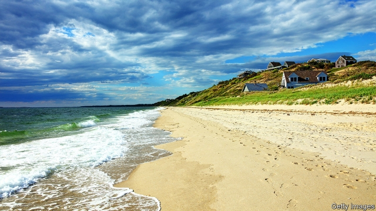

###### Gusts of change

# Energy firms bet on offshore wind farms in America 

##### Opposition is dwindling 

 

> Mar 7th 2019 

THE FUTURE of clean energy depends on meetings like the one held at a small hotel in a small city in Massachusetts last month. Residents of New Bedford came together to voice their opinions about an offshore wind proposal from a company called Vineyard Wind. To date, such projects have not fared well in America; opponents have blocked big offshore wind farms. But opposition has dwindled. Though lobstermen fretted about local crustacea, supporters of the project in New Bedford touted the new jobs that would be on offer. Bureaucrats overseeing the plan offered heart-shaped chocolates at the sign-in table. If Vineyard Wind secures the necessary approvals, the project would be, astonishingly, America’s first large offshore wind farm. Construction could begin by the end of the year. 

After nearly two decades of fighting, the wind industry is poised to sweep into American waters. In February a number of European energy giants, including Royal Dutch Shell, EDF, Equinor and Orsted, bid to build New York’s first offshore wind project, with a decision due this spring. Other plans are moving forward, from Virginia to New Hampshire. In total, states have sanctioned nearly 17,000 megawatts of offshore wind power. This increase is almost as large as Europe’s entire offshore wind market. Yet America remains perilous for wind developers, not just because of lingering opposition, but owing to a lack of a local supply chain to help with turbine construction. Ports seem inadequate to handle all the work. For global energy firms these are big risks, but they could be more than offset by the potential rewards. 

More than 4,000 wind turbines already twirl off the coasts of Europe. In America, just five short turbines poke out of the waves near Rhode Island, despite the north-east’s shallow waters, high wind speeds and millions of energy-hungry consumers. America’s most famous offshore wind project remains one never built. Cape Wind, proposed in 2001, spent 16 years battling fishermen and rich landowners, including the Kennedy family, whose concern over climate change did not dull their desire for an unspoilt view. Faced with such headaches, wind developers invested in Europe or sought firm ground in America’s Midwest, home to big gusts and residents accustomed to using land for both pleasure and purpose. 

Among the things that have changed is technology. Operators are now able to build bigger turbines that can be sited farther from shore. And because turbines have become so large and powerful, firms need to install fewer of them to generate the same amount of electricity, which lowers development costs. Vineyard Wind plans to supply electricity to Massachusetts at 6.5 cents per kilowatt hour, which—though helped by a generous federal tax credit—is about the same price as electricity from German offshore wind farms. 

State policies are boosting the industry, too. North-eastern governors are keen to burnish their green credentials to voters concerned about climate change, but the region has little room for big solar or wind farms on land. Massachusetts passed a law in 2016 requiring state utilities to procure about 1,600 megawatts in offshore wind power over the next decade, provided they receive reasonable bids. Other governors in the north-east have followed suit, becoming more bullish after Vineyard Wind’s announcement of low electricity prices. So far, President Donald Trump’s administration has been supportive. 

The result is a frenzy. When, in 2015, the government auctioned a site off the Massachusetts coast, the winning bid was $281,285—“a very clear indicator of a market that was basically dead”, says Thomas Brostrom, who leads the North American business for Orsted, a Danish energy firm. In the latest auction in Massachusetts, in December, each lease sold for over 400 times that sum. European developers are battling it out, some adopting all-American names. In Massachusetts, for instance, Orsted’s subsidiary is Bay State Wind; Vineyard Wind is a partnership of Copenhagen Infrastructure Partners and a subsidiary of Spain’s Iberdrola, and Mayflower Wind is a joint venture between Shell and EDP Renewables, whose headquarters are in Madrid. EnBW, a German utility, is bidding along the east coast but is also eyeing waters off California (where the steep continental shelf will need floating turbines that have yet to be deployed at scale). 

Despite enthusiastic governors, companies must still secure leases and contracts to sell electricity to utilities. Orsted, for one project, anticipates needing more than 20 permits and approvals from federal, state and local agencies. It has spent $510m to acquire Deepwater Wind, one of the few American offshore developers, in part to help it deal with complex regulations. 

Even if firms manage all that, other factors threaten to push up costs. The region has no big turbine manufacturers, so firms must pay to transport parts from Europe. A 99-year-old law means that they cannot use European ships that are specially designed to install turbines. No such American ship yet exists. There are insufficient ports to handle the heavy components needed for turbines. And an investment tax credit for wind is due to expire in 2020. States are rushing to hold auctions this year, but inevitably many projects will come too late to use the credit. That may lift the price of electricity from wind projects. 

Wood Mackenzie, a consultancy, expects growth in offshore wind to subside after the tax credit expires, then pick up again in the mid-2020s as technology advances and factories open in America. States are vying to support the industry’s future growth. “My goal is to make Massachusetts the Denmark of North American wind,” says Stephen Pike, who leads the state’s efforts to promote a green economy. 

In the meantime, Vineyard Wind is advancing its project, step by step. In January the company signed an agreement with the Natural Resources Defense Council, promising, among other things, to time construction to avoid disturbing the endangered North Atlantic right whale. It recently hammered out a deal with fishermen in Rhode Island, who remain concerned about the turbines’ effect. Lars Pedersen, chief executive of Vineyard Wind, remains optimistic. “It’s a challenging regulatory system, it’s litigious and so on, but if you can deliver jobs and clean energy at an affordable price,” he says, “I believe this is a huge opportunity.” 

-- 

 单词注释:

1.gust[gʌst]:n. 突然一阵, 趣味, 爱好 

2.opposition[.ɒpә'ziʃәn]:n. 反对, 敌对, 相反, 在野党 [医] 对生, 对向, 反抗, 反对症 

3.dwindle['dwindl]:vi. 减少, 缩小, 衰落 vt. 使缩小 

4.Massachusetts[.mæsә'tʃu:sits]:n. 麻萨诸塞州 

5.bedford['bedfәd]:n. 贝德福德（英格兰一郡及该郡之首府）；贝德福德（美国俄亥俄州城市）；贝德福德（男子名） 

6.vineyard['vinjәd]:n. 葡萄园 

7.opposition[.ɒpә'ziʃәn]:n. 反对, 敌对, 相反, 在野党 [医] 对生, 对向, 反抗, 反对症 

8.lobsterman['lɔbstәmәn]:n. 捕龙虾的渔夫 

9.fret[fret]:n. 烦躁, 磨损, 焦急, 网状饰物 vi. 烦恼, 不满, 磨损 vt. 使烦恼, 腐蚀, 使磨损, 使起波纹 

10.Crustacea[krʌs'teiʃjә]:n. 甲壳纲 [医] 甲壳纲 

11.supporter[sә'pɒ:tә]:n. 支持者, 后盾, 迫随者, 护身织物 [法] 支持者, 赡养者, 抚养者 

12.tout[taut]:vi. 招徕顾客, 兜售物品 vt. 招徕, 刺探...情报 n. 兜售者, 侦查者 

13.bureaucrat['bjuәrәukræt]:n. 官僚作风的人, 官僚, 官僚主义者 [法] 官僚, 官僚作风的人 

14.oversee[.әuvә'si:]:vt. 向下看, 了望, 监督, 偷看到 [法] 监察, 监督, 俯瞰 

15.astonishingly[ə'stɔniʃiŋli]:adv. 令人惊讶地 

16.poise[pɒiz]:n. 平衡, 均衡, 姿势, 镇静, 安静, 砝码 vt. 使平衡, 使悬着, 保持...姿势 vi. 平衡, 悬着, 准备好 

17.Dutch[dʌtʃ]:n. 荷兰人, 荷兰语 a. 荷兰的 

18.edf[]:abbr. Economic Development Foundation <菲>经济开发基金会 

19.Orsted[]:厄斯特德 

20.Virginia[vә'dʒinjә]:n. 弗吉尼亚 

21.hampshire['hæmpʃiә]:n. 汉普郡（英国南部之一郡） 

22.sanction['sæŋkʃәn]:n. 核准, 制裁, 处罚, 约束力 vt. 制定制裁规则, 认可, 核准, 同意 

23.megawatt['megәwɒt]:n. 兆瓦特 [电] 百万瓦 

24.perilous['perilәs]:a. 危险的, 濒临毁灭的 

25.developer[di'velәpә]:n. 开发者 [计] 显影器 

26.linger['liŋgә]:vi. 逗留, 消磨, 徘徊 vt. 消磨 

27.inadequate[in'ædikwәt]:a. 不充分的, 不适当的 [法] 不充分的, 不适当的 

28.offset['ɒ:fset]:n. 抵消, 把...并列, 旁系, 支管, 用胶印法印 vt. 弥补, 抵消, 胶印 vi. 装支管 n. 偏移量 [计] 偏移量 

29.twirl[twә:l]:vt. (使)快速转动, 捻弄 n. 转动, 万能钥匙, 旋转的东西 

30.rhode[]:n. 罗德岛 

31.cape[keip]:n. 岬, 海角, 披肩, 斗蓬 

32.landowner['lændәunә]:n. 地主 [法] 土地所有人, 地主 

33.kennedy['kenidi]:n. 肯尼迪（姓氏, 美国第35任总统） 

34.unspoilt[]:a. 未受损害的, 未受破坏的, 未宠坏的 

35.Midwest[]:n. (美国的)中西部 [经] 中西部 

36.kilowatt['kilәwɒt]:n. 千瓦 [医] 千瓦[特] 

37.burnish['bә:niʃ]:vt. 擦亮, 打磨, 磨光 vi. 磨光发亮 n. 光辉, 光泽 

38.credential[kri'denʃәl]:n. 国书, 凭据, 证明书 [经] 凭证, 证书 

39.voter['vәutә]:n. 选民, 投票人 [法] 选民, 选举人, 投票人 

40.procure[prәu'kjuә]:vt. 获得, 取得, 导致 vi. 拉皮条 

41.bullish['buliʃ]:a. 似公牛的, 看涨的, 上扬的 [经] 行情看涨的 

42.donald['dɔnәld]:n. 唐纳德（男子名） 

43.supportive[sә'pɔ:tiv]:a. 支撑, 支承, 资助, 赞助, 支援, 经受, 忍受, 扶养, 证实, 鼓励, 维持, 伴奏 

44.frenzy['frenzi]:n. 疯狂, 狂暴, 狂怒 [医] 暴怒, 狂乱 

45.auction['ɒ:kʃәn]:n. 拍卖 vt. 拍卖 

46.indicator['indikeitә]:n. 指示器, 指示剂, 指标 [计] 指示器 

47.thoma[]:n. (Thoma)人名；(阿尔巴、阿拉伯)索玛；(英、德、罗、匈、捷、塞、瑞典)托马 

48.brostrom[]:[网络] 斯特劳姆；布鲁斯特鲁姆；斯容 

49.Danish['deiniʃ]:n. 丹麦文 a. 丹麦的, 丹麦人的, 丹麦文的 

50.lease[li:s]:n. 租约, 租期, 租 vt. 出租, 租出, 租得 

51.subsidiary[sәb'sidiәri]:n. 子公司, 附件, 辅助者 a. 辅助的, 次要的, 津贴的 

52.partnership['pɑ:tnәʃip]:n. 合伙, 合股, 合作关系 [经] 合伙(合作)关系, 全体合伙人 

53.Copenhagen[.kәupәn'heigәn]:n. 哥本哈根 

54.infrastructure['infrәstrʌktʃә]:n. 基础结构, 基础设施 [经] 基础设施 

55.iberdrola[]:[网络] 伊维尔德罗拉；西班牙伊维尔德罗拉；伊维尔德罗拉公司 

56.mayflower['mei.flauә]:n. 五月开花的草木 

57.EDP[]:电子数据处理 [计] 电子数据处理 

58.renewable[ri'nju(:)әbl]:a. 可更新的, 可恢复的, 可继续的, 可换新的, 可重复的, 可重说的 [计] 可更新, 可再生的 

59.headquarter[,hed'kwɔ:tә]:vt. 将...的总部设在 

60.Madrid[mә'drid]:n. 马德里 

61.California[.kæli'fɒ:njә]:n. 加利福尼亚 

62.continental[.kɒnti'nentl]:a. 大陆的, 洲的 n. 欧洲大陆人 

63.deploy[di'plɒi]:v. 展开, 配置 

64.deepwater['di:p,wɔ:tә(r)]:a. 深海的,海洋上的,靠近海洋的 

65.cannot['kænɒt]:aux. 无法, 不能 

66.expire[ik'spaiә]:vi. 期满, 呼气, 断气 vt. 呼出 

67.inevitably[in'evitәbli]:adv. 不可避免地 

68.mackenzie[]:n. 麦肯齐河（又译“马更些河”, 加拿大西北部河流）；麦肯齐区（又译“马更些区”, 加拿大西北部的小区）；麦肯齐氏 

69.consultancy[]:n. 商量, 协商, 磋商, 会诊, 与...商量, 咨询, 请教, 找(医生)看病, 查阅, 考虑 [经] 咨询业务, 咨询服务 

70.subside[sәb'said]:vi. 沉淀, 沉降, 平息 

71.vie[vai]:vi. 争, 竞争, 争胜 vt. 提出...来竞争, 以...作较量 

72.Denmark['denmɑ:k]:n. 丹麦 

73.stephen['sti:vn]:n. 斯蒂芬（男子名） 

74.pike[paik]:n. 长矛, 尖头, (体操)屈体, 流浪者, 狗鱼, 通行费 vi. 用矛刺杀, 刺, 离开, 谨慎办事, 采用屈体姿势 

75.defense[di'fens]:n. 防卫, 防卫物 [医] 防御 

76.endanger[in'deindʒә]:vt. 危及 [法] 使危险, 危及 

77.lar[lɑ:]:n. 家庭守护神 

78.pedersen[]:n. (Pedersen)人名；(英、德、西)佩德森；(挪、芬)彼得森；(丹)彼泽森 

79.regulatory['regjulәtәri]:a. 受控制的, 统制的, 调整的 [经] 规则的 

80.litigious[li'tidʒәs]:a. 好诉讼的, 好争论的 [法] 关于诉讼的, 可引起诉讼的, 好诉讼的 

81.affordable[]:[计] 普及型 

