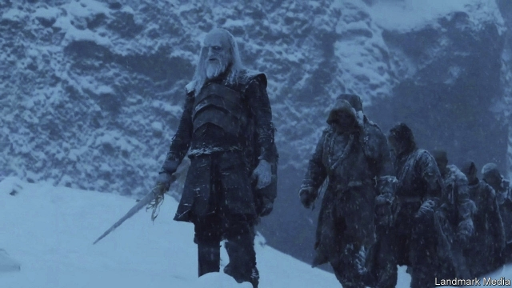

###### Luvvies leaving

# HBO’s boss resigns, raising questions about WarnerMedia’s strategy 

##### Richard Plepler’s departure may bode ill for the television network under AT&T 

 

> Mar 7th 2019 

ON THE EVENING of February 28th Casey Bloys, president of programming for HBO, a television network, called David Simon, creator of “The Wire”, one of its most highly regarded series, on a set in Manhattan. Richard Plepler, boss and public face of HBO, had just announced he was leaving, and Mr Bloys was trying to reassure the talent. The message, Mr Simon says, was to keep going, that “nothing has changed here”. 

In truth, much has changed. HBO, long a powerful fief of creativity under Time Warner, a media group, is now run by AT&T, a vast telecommunications company. In June 2018 it closed its purchase of Time Warner after an antitrust judge approved the merger—a decision upheld on appeal on February 26th. 

The phone firm could simply have declared that HBO would become its global streaming brand—a more prestigious version of Netflix—under Mr Plepler. During his reign as co-president from 2007 and as chief executive from 2013, HBO developed critically-acclaimed hits such as “Veep” and “Game of Thrones” while generating massive profits for Time Warner ($2.2bn in 2017). 

Instead AT&T whittled away at the autonomy of Mr Plepler and of HBO. In October John Stankey, an AT&T executive put in charge of WarnerMedia (the new name for Time Warner), announced a new streaming service that would combine content from HBO, Warner Bros studio and the firm’s Turner division of cable networks. Mr Stankey said HBO would be the centrepiece of that offer. But he also said WarnerMedia must offer a lot more entertainment of all kinds to engage streaming subscribers daily. 

It was clear HBO was to have a subordinate position in his plans. On March 4th Mr Stankey put Robert Greenblatt, a former chairman of NBC Entertainment, in charge of HBO, Turner’s entertainment networks and the streaming business. David Levy, the respected boss of Turner, resigned a day after Mr Plepler. 

WarnerMedia will test its new service by the end of this year in an increasingly saturated market. Netflix has 139m subscribers. Apple and Disney are launching streaming products this year. HBO, with 38m subscribers in America and more than 100m worldwide, will be vital. 

The question is whether AT&T’s ambitions will enhance or diminish HBO’s standing. A new streaming service with a wide range of content raises the risk of confusing consumers. And Mr Stankey has made clear he wants HBO itself to produce far more programming, which will test the network’s capacities as a tastemaker. “Everyone’s hoping that they will find a way to get what they need in terms of more production without diluting HBO’s brand,” Mr Simon says. “It’s going to require a lot of finesse.” 

-- 

 单词注释:

1.luvvy[ˈlʌvi]:n. <英><俚><贬>（感情奔放或做作的）演员； （用作称呼）亲爱的, 宝贝儿 

2.richard['ritʃәd]:n. 理查德（男子名） 

3.bode[bәud]:v. 预示 bide的过去式 

4.casey['keisi]:n. 凯西（男子名） 

5.bloy[]:[网络] 伯歌瑞克；布洛伊 

6.hbo[]:abbr. 家庭影院（Home Box Office）；美国家庭电影院 

7.david['deivid]:n. 大卫；戴维（男子名） 

8.simon['saimәn]:n. 西蒙（男子名） 

9.Creator[kri:'eitә(r)]:n. 上帝, 创造者, 创作者 

10.sery[]:n. (Sery)人名；(俄)谢雷；(科特)塞里 

11.Manhattan[mæn'hætәn]:n. 曼哈顿 

12.reassure[.ri:ә'ʃuә]:vt. 使...安心, 向...再保证 [法] 重新保证, 再保险, 使清除疑虑 

13.fief[fi:f]:n. 封地, 采邑 

14.creativity[.kri:ei'tiviti]:n. 创造力, 创造性 

15.warner['wɔ:nә]:n. 警告者, 告诫者, 预告者 [化] 报警器 

16.telecommunication['telikәmju:ni'keiʃәn]:n. 电讯, 远距离通讯, 无线电通讯 [计] 远程通信, 电信 

17.antitrust[.ænti'trʌst]:a. 反托拉斯的 [法] 反托拉斯的 

18.uphold[ʌp'hәuld]:vt. 支撑, 赞成, 鼓励, 举起, 坚持 [法] 确认, 赞成, 支持 

19.prestigious[pre'stidʒiәs]:a. 享有声望的 

20.veep[vi:p]:(=Veepee, vice-president)(美国的)副总统 

21.whittle['hwitl]:vt. 逐渐削薄, 削整, 削弱, 削减 vi. 削木头 n. 大刀, 屠刀 

22.autonomy[ɒ:'tɒnәmi]:n. 自治, 自治权 [医] 自主性 

23.john[dʒɔn]:n. 盥洗室, 厕所, 嫖客 

24.bro[]:abbr. 兄弟（brother） 

25.turner['tә:nә]:n. 车工, 体育协会会员 

26.centrepiece['sentәpi:s]:n. 中心装饰品 

27.subscriber[sʌbs'kraibә]:n. 签署者, 捐献者, 订户 [经] 定户 

28.subordinate[sә'bɒ:dnit]:n. 属下, 附属物 a. 下级的, 次要的, 附属的 vt. 使居下位, 使服从 

29.Robert['rɔbәt]:[法] 警察 

30.greenblatt[]: [人名] 格林布拉特 

31.NBC[]:全国广播公司(美国) 

32.levy['levi]:n. 税款, 所征的人数, 征收 vi. 征税, 课税 vt. 征收, 强求, 召集 

33.saturate['sætʃәreit]:vt. 使渗透, 浸透, 使充满, 使饱和 a. 浸透的, 饱和度高的, 深颜色的 n. 饱和化合物, 饱和脂肪酸 

34.netflix[]:n. 全球十大视频网站中唯一收费站点 

35.Disney['dizni]:n. 迪斯尼 

36.diminish[di'miniʃ]:v. (使)减少, (使)变小 

37.tastemaker['teist.meikә]:n. 时髦风尚的首创者, 开创时髦风尚的事物 

38.dilute[dai'lju:t]:vt. 冲淡, 稀释 a. 淡的, 稀释的 

39.finesse[fi'nes]:n. 策略, 手段, (桥牌中的)飞牌 v. 用计谋处理, 出小牌 

