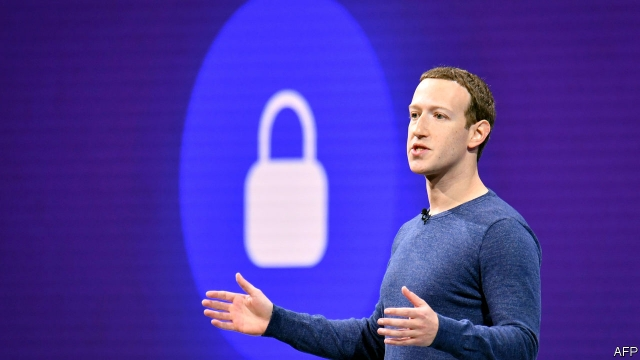

###### Facebook’s third act

# Mark Zuckerberg announces his firm’s next business model 

##### If it works, the social-networking giant will become more private and more powerful 

 

> Mar 7th 2019 

THE FIRST big overhaul for Facebook came in 2012-14. Internet users were carrying out ever more tasks on smartphones rather than desktop or laptop computers. Mark Zuckerberg opted to follow them, concentrating on Facebook’s mobile app ahead of its website, and buying up two fast-growing communication apps, WhatsApp and Instagram. It worked. Facebook increased its market valuation from around $60bn at the end of 2012 to—for a brief period in 2018—more than $600bn. 

On March 6th Mr Zuckerberg announced Facebook’s next pivot. As well as its existing moneymaking enterprise, selling targeted ads on its public social networks, it is building a “privacy-focused platform” around WhatsApp, Instagram and Messenger. The apps will be integrated, he said, and messages sent through them encrypted end-to-end, so that even Facebook cannot read them. While it was not made explicit, it is clear what the business model will be. Mr Zuckerberg wants all manner of businesses to use its messaging networks to provide services and accept payments. Facebook will take a cut. 

A big shift was overdue at Facebook given the privacy and political scandals that have battered the firm. Even Mr Zuckerberg, who often appears incapable of seeing the gravity of Facebook’s situation, seemed to grasp the irony of it putting privacy first. “Frankly we don’t currently have a strong reputation for building privacy protective services,” he noted. 

Still, he intends to do it. Mr Zuckerberg claims that users will benefit from his plan to integrate its messaging apps into a single, encrypted network. The content of messages will be safe from prying eyes of authoritarian snoops and criminals, as well as from Facebook itself. It will make messaging more convenient, and make profitable new services possible. But caution is warranted for three reasons. 

The first is that Facebook has long been accused of misleading the public on privacy and security, so the potential benefits Mr Zuckerberg touts deserve to be treated sceptically. He is also probably underselling the benefits that running integrated messaging networks brings to his firm, even if they are encrypted so that Facebook cannot see the content. The metadata alone, ie, who is talking to whom, when and for how long, will still allow Facebook to target advertisements precisely, meaning its ad model will still function. 

End-to-end encryption will also make Facebook’s business cheaper to run. Because it will be mathematically impossible to moderate encrypted communications, the firm will have an excuse to take less responsibility for content running through its apps, limiting its moderation costs. 

If it can make the changes, Facebook’s dominance over messaging would probably increase. The newfound user-benefits of a more integrated Facebook might make it harder for regulators to argue that Mr Zuckerberg’s firm should be broken up. 

Facebook’s plans in India provide some insight into the new model. It has built a payment system into WhatsApp, the country’s most-used messaging app. The system is waiting for regulatory approval. The market is huge. In the rest of the world, too, users are likely to be drawn in by the convenience of Facebook’s new networks. Mr Zuckerberg’s latest strategy is ingenious but may contain twists. 

-- 

 单词注释:

1.zuckerberg[]:扎克伯格 

2.overhaul[.әuvә'hɒ:l]:vt. 分解检查, 翻修, 精细检查, 彻底革新 n. 分解检查, 精细检查, 大检修 

3.facebook[]:n. 脸谱网 

4.smartphones[]: 智能手机（smartphone的复数） 

5.desktop['desktɔp]:n. 桌面 [计] 桌面 

6.laptop[]:[计] 膝上型的 

7.opt[ɒpt]:vi. 选择 

8.APP[]:[计] 应用, 应用程序; 相联并行处理器 

9.WhatsApp[]:[网络] 智能手机；联络电话；每月活跃用 

10.Instagram[]:一款图片分享应用 

11.valuation[.vælju'eiʃәn]:n. 评价, 估价, 价值判断 [经] 估价, 计价, 评价 

12.pivot['pivәt]:n. 枢轴, 支点, 旋转运动, 中枢, 关键人物 a. 枢轴的, (如)在枢轴上转动的 vi. 在枢轴上转动, 随着转移 vt. 装枢轴于, 以...为中心旋转 [计] 程序员交互验证和编制工具, 数据透视表 

13.moneymaking['mʌni.meikiŋ]:a. 热心赚钱的；会赚钱的；赚钱的 

14.encrypt[in'kript]:[计] 加密 

15.cannot['kænɒt]:aux. 无法, 不能 

16.privacy['praivәsi]:n. 隐私, 隐居, 秘密 [计] 个人保密权 

17.batter['bætә]:v. 连续猛打（尤其指妇女），猛击 n. 面糊（食物），击球员，打击手 

18.incapable[in'keipәbl]:a. 无能力的, 不能的 [机] 不能行的, 耐不住的 

19.irony['aiәrәni]:n. 反语, 讽刺, 具有讽刺意味的事 

20.frankly['fræŋkli]:adv. 坦白地 

21.currently['kʌrәntli]:adv. 现在, 当前, 一般, 普通 [计] 当前 

22.pry[prai]:n. 杠杆, 窥探, 好奇者 vi. 打听, 窥探 vt. 撬动, 撬开, 费力得到 

23.authoritarian[ɒ:.θɒri'tєәriәn]:a. 独裁的, 独裁主义的 

24.snoop[snu:p]:vi. 调查, 窥探 n. 窥视行为, 爱管闲事的人, 私家侦探 

25.warrant['wɒ:rәnt]:n. 授权, 正当理由, 根据, 证明, 批准, 凭证, 令状, 委任状 vt. 授权给, 保证, 担保, 批准, 使有正当理由 

26.misleading[mis'li:diŋ]:a. 引入歧途的, 使人误解的, 骗人的 [法] 误写姓名的, 误称的, 令人误解的 

27.tout[taut]:vi. 招徕顾客, 兜售物品 vt. 招徕, 刺探...情报 n. 兜售者, 侦查者 

28.sceptically['skeptɪklɪ]:adv. 怀疑地 

29.metadata[]:[计] 元数据 

30.IE['i:ei]:[计] 中断启动 

31.precisely[pri'saisli]:adv. 精确地, 明确地, 刻板地, 拘泥地, 正好, 恰恰, 对, 正是如此, 确实如此, 不错 

32.encryption[-'kripʃən]:[计] 加密 

33.mathematically[ˌmæθə'mætɪklɪ]:adv. 算术地 

34.les[lei]:abbr. 发射脱离系统（Launch Escape System） 

35.moderation[.mɒdә'reiʃәn]:n. 缓和, 适度, 温和 [化] 慢化 

36.dominance['dɔminәns]:n. 优势, 显性, 统治, 控制, 支配 [计] 控制, 扰势 

37.newfound['nju:fajnd]:a. 新发现的 

38.regulator['regjuleitә]:n. 调整者, 校准者, 校准器, 调整器, 标准钟 [化] 调节剂; 调节器 

39.regulatory['regjulәtәri]:a. 受控制的, 统制的, 调整的 [经] 规则的 

40.ingenious[in'dʒi:njәs]:a. 灵敏的, 精巧的, 聪明的 

