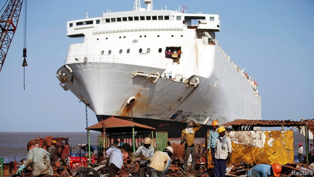

###### High by the beach

# The world’s biggest ship-breaking town is under pressure to clean up 

##### Maersk, a Danish shipping giant, is trying to lift safety and environmental standards at Indian yards 

 

> Mar 7th 2019 

HOW DO YOU make a 10,000-tonne container ship disappear? At Alang, a small town in Gujarat, on the western coast of India, it happens regularly. At roadside stalls on its outskirts, shopkeepers sell furniture together with lifeboats; washing machines alongside emergency flares. Nearer the town, stalls give way to warehouses and enormous open-air yards; cranes stretch to the horizon. Ships that look like Lego sets being dismantled sit on a stretch of beach. 

Alang is the world’s biggest ship-breaking town. Almost a third of all retired vessels—at least 200 each year—are sent to be broken up here, at over 100 different yards stretching along 10km of sand. The industry employs some 20,000 people, almost all men who migrate from the poorer states of India’s northern Hindi-speaking belt. Taxes paid by breakers generate huge sums for the state government. Yet it is a dangerous industry for its workers and a filthy one in environmental terms. 

Of 744 ships that were pulled apart worldwide last year, 518 were dismantled on beaches. Only 226 were processed “off the beach” at industrial sites designed for the purpose, according to the Shipbreaking Platform, an NGO which campaigns against beach-breaking. The majority of big shipping firms use beaches, except a tiny few such as Hapag Lloyd of Germany and Boskalis of the Netherlands. 

A typical operation involves a ship being beached at low tide. Once her fittings and other resaleable parts are removed, hundreds of workers with gas blowtorches clamber over the vessel’s hull, cutting it into huge steel blocks. These are then dropped onto the beach, where they are cut up again before being sold, then rerolled for use in construction. 

Apart from the danger of dropping tens of tonnes of steel from a great height, the method is immensely polluting. A review in 2015 by Litehauz, a Danish marine environmental consultancy, found that in the process of scrapping a 10,000-tonne ship at least 120 tonnes of steel becomes molten and is lost in the sea. Levels of mercury and lead, as well as oil, in Alang’s water are at least 100 times higher than at other beaches. Workers must handle asbestos and dangerous chemicals. Accidents are common. Last year 14 workers died at Alang. 

 

Alang is just one of many ship-breaking centres in South Asia. Among the others are beaches in Bangladesh (where workers reportedly include children) and Pakistan. Last year the subcontinent recycled around 90% of the world’s ships by tonnage (see chart). Ship-breaking is concentrated in the region for three reasons. Prices for scrap steel are higher than elsewhere (90% of a ship is typically steel), thanks to demand for rerolled steel for construction. Labour costs are lower than at yards in Europe, America or Turkey (workers at Alang make up to 800 rupees, or $11, per day, and usually less) and safety and environmental regulations are much weaker. Most sellers scrap their ships in South Asia because they get better prices for them. 

At some yards in Alang, however, things have begun to improve. European regulations on ship-breaking have tightened. Shipowners, in particular Maersk, a Danish company which is the world’s biggest shipper, are preparing to comply with them. 

At the Baijnath Melaram shipyard a huge crane barge sits in the water next to a stretch of “impermeable” concrete. “We used to have to winch the blocks up the beach,” says Siddharth Jain, the firm’s business manager. Now, the crane lifts blocks of steel down from the ships directly to the concrete, so that they need never touch the sand. In contrast to the yards nearby, where men in simple work clothes and no safety goggles operate blowtorches, the workers scuttling around Baijnath Melaram wear boiler suits, face masks and helmets. 

The changes are largely down to Maersk. It previously refused to use South Asian ship-breakers but now reckons it can improve things. To persuade recyclers such as Baijnath Melaram to upgrade, Maersk has accepted discounts of up to 40% on its ships. Maersk says ten Alang yards are now at a standard it is happy with. Around 70 more are upgrading in order to meet standards set by the Hong Kong International Convention for the Safe and Environmentally Sound Recycling of Ships, an unratified treaty on ship recycling. 

Maersk’s campaign is in response to new regulations in force since December 31st 2018 that require all European-flagged vessels to be recycled at shipyards approved by Brussels. Just over a third of the world’s ships fall in this category. Maersk, whose fleet is roughly 40% European-flagged, hopes that the best yards at Alang will be able to comply with the new rules. Two Indian yards have already been audited for the European certification; 11 more have applied. “If we sustain that momentum, in five, six or seven years all of Alang could be really responsible,” says John Kornerup Bang, Maersk’s sustainability chief. 

But on January 30th the EU announced that the Indian yards audited will not make the list, which is awkward for Maersk. Officials say that while there was genuine improvement, more change is needed. Some are sceptical whether Alang’s facilities will ever make it. Ingvild Jenssen of the Shipbreaking Platform says that even Alang’s best yards are not clean enough. She argues that Maersk’s efforts merely “greenwash” a model that needs to change completely. 

With European certification, Alang’s yards could pull away from the rest of South Asia and become a place even the most responsibly-minded ship owners send vessels. But without it, the risk is that they end up beached: not clean enough for Europe; but too expensive to compete with breakers in Bangladesh or Pakistan which have not changed at all. If that happens, the industry in Alang—and the jobs and revenue it generates—could disappear almost as quickly as the ships it dismantles. 

-- 

 单词注释:

1.maersk[]:n. 马士基 

2.Danish['deiniʃ]:n. 丹麦文 a. 丹麦的, 丹麦人的, 丹麦文的 

3.environmental[in.vaiәrәn'mentәl]:a. 周围的, 环境的 [经] 环境的, 环保的 

4.alang[]:[网络] 黄俊郎；部落；在家的感觉真好 

5.Gujarat[,ɡu:dʒe'rɑ:t]:n. 古吉拉特邦（印度西部的邦） 

6.roadside['rәudsaid]:n. 路旁, 路边 a. 路边的 

7.stall[stɒ:l]:n. 厩, 停车处, 牧师职位, 货摊, 托辞, 拖延 vt. 关入厩, 停顿, 推托, 支吾, 使陷于泥中 vi. 被关在厩内, 陷于泥中, 停止, 支吾 

8.lifeboat['laifbәjt]:n. 救生艇 

9.lego[]:n. 乐高积木（商标名） 

10.dismantle[dis'mæntl]:vt. 拆除...的设备, 分解, 去除覆盖物 

11.migrate['maigreit]:vi. 移动, 移往, 随季节而移居 [计] 迁移程序 

12.breaker['breikә]:n. 断路器 [化] 破碎机 

13.filthy['filθi]:a. 污秽的, 丑恶的 

14.shipbreaking[ʃɪpb'reɪkɪŋ]: 拆船; 拆船业务 

15.ngo[]:abbr. 民间组织；非政府组织（Non-Governmental Organization） 

16.hapag[]:abbr. Hamburg-American Line 汉堡-美国轮船公司 

17.lloyd[lɔid]:n. 劳埃德（男子名） 

18.Boskalis[]:[网络] 荷兰波斯卡利斯公司；荷兰波斯卡里斯公司；荷兰波斯卡利斯疏浚公司 

19.Netherlands['neðәlәndz]:n. 荷兰 

20.fitting['fitiŋ]:a. 适宜的 n. 试穿, 试衣, 装配, 装置 

21.resaleable[ri:'seilәbl]:a. 可转卖的, 可再卖的 

22.blowtorch['blәutɒ:tʃ]:n. 喷灯 [机] 喷灯 

23.clamber['klæmbә]:n. 攀登, 爬上 v. 爬上, 攀登 

24.hull[hʌl]:n. 壳, 皮, 船体 vt. 去壳 

25.rerolled[]:[网络] 改轧 

26.tens[]:十位 

27.tonne[tʌn]:n. 吨, 公吨 [经] 吨 

28.immensely[i'mensli]:adv. 无限地, 广大地, 庞大地 

29.consultancy[]:n. 商量, 协商, 磋商, 会诊, 与...商量, 咨询, 请教, 找(医生)看病, 查阅, 考虑 [经] 咨询业务, 咨询服务 

30.scrap[skræp]:n. 碎片, 残余物, 些微, 片断, 铁屑, 吵架 vt. 扔弃, 敲碎, 拆毁 vi. 互相殴打 a. 零碎拼凑成的, 废弃的 

31.asbestos[æs'bestɒs]:n. 石棉 [化] 石棉 

32.Bangladesh[,bɑ:ŋ^lә'deʃ]:n. 孟加拉国 [经] 孟加拉共和国 

33.reportedly[ri'pɒ:tidli]:adv. 根据传说, 根据传闻, 据报道 

34.Pakistan[.pɑ:ki'stɑ:n]:n. 巴基斯坦 

35.subcontinent[sʌb'kɒntinәnt]:n. 次大陆 

36.tonnage['tʌnidʒ]:n. 吨位 [化] 吨位 

37.typically['tipikәli]:adv. 代表性地；作为特色地 

38.rupee[ru:'pi:]:n. 卢比(印、巴等国货币单位) 

39.les[lei]:abbr. 发射脱离系统（Launch Escape System） 

40.tighten['taitn]:vt. 勒紧, 使变紧 vi. 变紧, 绷紧 

41.shipowner['ʃipәunә]:n. 船主 

42.shipper['ʃipә]:n. 托运人, 发货人 [经] 货主, 运货者, 装货人 

43.comply[kәm'plai]:vi. 顺从, 依从 [法] 遵守, 承诺, 照做 

44.Baijnath[]:拜吉纳斯 

45.shipyard['ʃipjɑ:d]:n. 造船厂 [经] 船坞, 造船厂, 修船厂 

46.barge[bɑ:dʒ]:n. 驳船 vt. 用船运输 vi. 蹒跚, 闯入 

47.impermeable[im'pә:miәbl]:a. 不能渗透的, 不能通过的 [医] 不[渗]透性 

48.winch[wintʃ]:n. 曲柄, 绞车 vt. 用绞盘拉 

49.siddharth[]:n. (Siddharth)人名；(印)西达尔特 

50.Jain[dʒain]:n. 耆那教徒 a. 耆那教的, 耆那教徒的 

51.goggle['gɒgl]:n. 眼睛瞪视, 护目镜 a. 突出的, 瞪眼的 vi. 瞪眼看, 眼珠转动 vt. 使瞪眼, 使眼珠转动 

52.scuttle['skʌtl]:n. 箩, 筐, 急速逃走, 天窗, 小舱口 vi. 急速逃走, 急忙撤退 vt. 凿沉, 毁坏 

53.boiler['bɒilә]:n. 煮器, 汽锅, 锅炉 [化] 锅炉 

54.reckon['rekәn]:vt. 计算, 总计, 估计, 认为, 猜想 vi. 数, 计算, 估计, 依赖, 料想 

55.recycler[]:[计] 再循环器, 反复循环器 

56.upgrade['ʌpgreid]:n. 上坡, 升级, 上升 adv. 往上 vt. 使升级, 提升, 改良品种 vi. 升级 [计] 升级 

57.hong[hɔŋ]:n. （中国、日本的）行, 商行 

58.kong[kɔŋ]:n. 含锡砾石下的无矿基岩；钢 

59.environmentally[]:adv. 有关环境方面 

60.recycling[]:[电] 再循环 

61.unratified[ʌn'rætifaid]:a. 未批准(或认可)的 

62.recycling[]:[电] 再循环 

63.Brussel[]:n. 布鲁塞尔（比利时首都） 

64.audit['ɒ:dit]:n. 审计, 查帐 vt. 查(帐), 旁听 vi. 查账 [计] 查帐; 审查; 检查 

65.certification[.sә:tifi'keiʃәn]:n. 证明 [经] 证明 

66.momentum[mәu'mentәm]:n. 动力, 动量 [化] 动量 

67.john[dʒɔn]:n. 盥洗室, 厕所, 嫖客 

68.sustainability[sə,stenə'bɪlɪti]:n. 持续性, 能维持性, 永续性 

69.EU[]:[化] 富集铀; 浓缩铀 [医] 铕(63号元素) 

70.jenssen[]:[网络] 金诗尼 

71.greenwash[]: 漂绿 

72.quickly['kwikli]:adv. 很快地 

