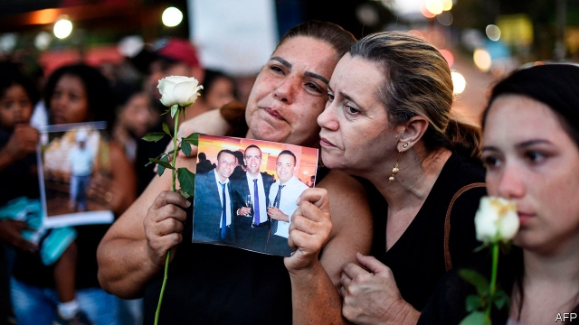

###### Beyond the Vale

# Vale and the aftermath of a devastating dam failure 

##### Prosecutors say the firm colluded with auditors to present its Brumadinho dam as safe 

 

> Mar 7th 2019 

FABIO SCHVARTSMAN, a hitherto well-respected businessman, may now be the most detested man in Brazil. As chief executive of Vale, a giant miner and the world’s largest producer of iron ore, it was Mr Schvartsman who had to face the public after the collapse of a company tailings dam in the town of Brumadinho on January 25th. Since then Vale has seen the erasure of 14% of its market value, grave legal allegations, the downgrading of its debt and a devastating body count: 186 people are now confirmed as dead, with 122 still missing. 

So it was not a shock when, on March 2nd, Vale said that Mr Schvartsman and three other executives would step down. “Today the dams are impeccable,” Mr Schvartsman had said last year. Tailings dams contain tonnes of waste material from mining operations. The design used at Brumadinho was known to be the least expensive and most risky. 

After a deluge of waste burst from the Brumadinho dam, ripping through a perilously located staff canteen and submerging a valley in mud, the company tried to respond quickly. Its board suspended share buybacks, dividends and bonuses for executives. It has made payments of 100,000 reais ($26,000) to 266 families. The resignations of Mr Schvartsman and three other executives follow a letter from prosecutors and police urging their dismissal (and that of others). The removals are temporary, but are unlikely to be reversed. Eduardo de Salles Bartolomeo, a Vale veteran, has been named interim chief executive. 

He faces mounting problems. A crucial question is if Mr Schvartsman or other executives knew about problems with the dam. The firm maintains that “the executives had no previous knowledge of a scenario of imminent risk of a dam breach”. Prosecutors allege that Vale colluded with auditors to present the dam as safe, dismissing inspectors who disagreed. Vale’s own procedures suggest that any serious safety concerns would have been reported to senior leaders, prosecutors also argue. 

Under Brazilian anticorruption law the company could face $7.2bn in fines, estimates Morgan Stanley, a bank. That does not account for other penalties or costs. Vale must deal with challenges outside court, too. These include accelerating plans to dismantle dams similar to the one at Brumadinho, suspending production at another big mine in Brazil (in response to a court order) and evacuating residents from three areas near other tailings dams. 

Despite all these difficulties the firm may prove resilient. That is partly because of Mr Schvartsman’s changes since he took over, in May 2017. He reduced Vale’s debt and cut capital spending, notes Carlos De Alba of Morgan Stanley. With healthy free cashflow and low debt, Vale’s balance sheet can probably withstand even hefty government fines, argues Tyler Broda of RBC Capital Markets, another bank. The fundamentals in metals markets are also helping. In the 2020s, demand is expected to rise for iron ore in emerging markets and for nickel (another of Vale’s key commodities) in electric cars. That increases the odds of Vale surviving the disaster, even as victims remain missing, buried in mud. 

-- 

 单词注释:

1.vale[veil]:n. 谷, 溪谷, 告别 interj. 再见 

2.aftermath['ɑ:ftәmæθ]:n. 结果, 后果 [法] 后果, 结果 

3.devastate['devәsteit]:vt. 毁坏 [法] 使荒废, 毁灭, 掠夺 

4.prosecutor['prɒsikju:tә]:n. 实行者, 告发者, 公诉人 [法] 原告, 起诉人, 检举人 

5.collude[kә'lu:d]:vi. 共谋, 串通, 勾结 

6.auditor['ɒ:ditә]:n. 审计员, 听者, 旁听生 [经] 审计(查帐)员, 审计师, 会计检查员 

7.Brumadinho[]:[地名] 布鲁马迪纽 ( 巴西 ) 

8.fabio[]:n. 法比奥（意大利常用名） 

9.hitherto[.hiðә'tu:]:adv. 迄今, 至今 

10.detest[di'test]:vt. 厌恶, 憎恨 

11.Brazil[brә'zil]:n. 巴西 

12.producer[prә'dju:sә]:n. 生产者, 制作者, 制作人 [化] 发生器; (炉煤气)发生炉; 制气炉; 生产者 

13.tailing['teiliŋ]:n. 下脚, 嵌入墙中砖石突出部, 尾料 [化] 谱尾 

14.erasure[i'reiʃә]:n. 擦除, 抹掉 [电] 擦掉 

15.allegation[.æli'geiʃәn]:n. 断言, 主张, 申辩 [法] 声明, 事实陈述, 断言 

16.downgrade['dajn^reid]:vt. 降低, 贬低 n. 下坡 a. 下坡 adv. 下坡 

17.impeccable[im'pekәbl]:a. 无懈可击的, 勿容置疑的, 无瑕疵的, 不会做坏事的 

18.tonne[tʌn]:n. 吨, 公吨 [经] 吨 

19.risky['riski]:a. 危险的 

20.deluge['delju:dʒ]:n. 大洪水, 泛滥 vt. 使泛滥 

21.rip[rip]:n. 裂痕, 破绽, 拉裂, 浪子, 巨浪 vi. 被拉开, 裂开, 猛冲 vt. 撕, 扯, 劈 

22.perilously[ˈperɪləslɪ]:adv. 充满危险地, 危机四伏地 

23.quickly['kwikli]:adv. 很快地 

24.buyback['baibæk]:n. 回购, 回买协议 

25.dividend['dividend]:n. 被除数, 股利 [计] 被除数 

26.reais[]:[网络] 雷亚尔；黑奥；雷阿尔 

27.dismissal[dis'misәl]:n. 免职, 解雇 [经] 解雇 

28.Eduardo[]:n. 爱德华多（姓氏） 

29.de[di:]:[化] 非对映体过量 [医] 铥(69号元素铥的别名,1916年Eder离得的假想元素) 

30.salle[sɑ:l, sæl]:n. 大厅, 室 

31.bartolomeo[]:n. (Bartolomeo)人名；(西、意)巴尔托洛梅奥 

32.interim['intәrim]:a. 暂时的, 临时的, 间歇的 n. 过渡时期 

33.scenario[si'nɑ:riәu]:n. 剧本提纲, 情节, 剧本, 方案, 事态 [计] 方案 

34.imminent['iminәnt]:a. 即将来临的, 逼近的 

35.breach[bri:tʃ]:n. 裂口, 违背, 破坏, 违反, 突破, 破裂 vt. 攻破, 突破 vi. 跳出水面 

36.allege[ә'ledʒ]:vt. 宣称, 主张, 提出, 断言 [法] 断言, 指称, 指证 

37.inspector[in'spektә]:n. 检查员, 巡视员 [化] 检查员 

38.Brazilian[brә'ziljәn]:n. 巴西人 a. 巴西的, 巴西人的 

39.anticorruption[]:反腐败, 反贪污 

40.Morgan['mɒ:gәn]:n. 摩根马 

41.stanley['stænli]:n. 斯坦利（男子名） 

42.penalty['penәlti]:n. 处罚, 刑罚, 罚款, 罚球, 报应, 不利结果, 妨碍 [经] 罚金(款), 违约金 

43.dismantle[dis'mæntl]:vt. 拆除...的设备, 分解, 去除覆盖物 

44.resilient[ri'ziliәnt]:a. 弹回的, 有弹力的 [医] 回弹的, 回能的 

45.carlo[]:n. 卡洛（男子名） 

46.de[di:]:[化] 非对映体过量 [医] 铥(69号元素铥的别名,1916年Eder离得的假想元素) 

47.alba['ælbә]:[医] 脑白质 

48.cashflow['kæʃfləʊ]:vi. 现金流转 

49.hefty['hefti]:a. 重的, 肌肉发达的 

50.tyler['tailә]:n. 泰勒（男子名）；秘密会所看守人（共济会的） 

51.broda[]:[网络] 达；宽广的；布罗达 

52.RBC[]:红血球, 红细胞 [医] 红细胞计数 

53.nickel['nikl]:n. 镍, 镍币, 五分镍币 vt. 镀镍于 

54.commodity[kә'mɒditi]:n. 农产品, 商品, 有用的物品 [经] 商品, 货物, 日用品 

55.odds[ɒdz]:n. 可能性, 几率, 机会, 胜算, 不平等 

