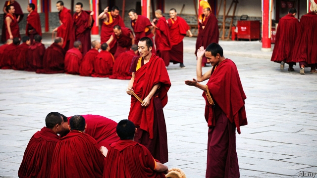

###### The sensitive month

# As anniversaries loom, China is snooping on Tibetans 

##### Foreign tourists are being shut out of Tibet, too 

 

> Mar 7th 2019 

FOUR BURLY policemen man a makeshift checkpoint outside Hongya, a hillside village in the western province of Qinghai on the edge of the Tibetan plateau. One of them says would-be visitors to Hongya must have their identity documents photographed and names noted down. Hongya is the birthplace of the 14th, and current, Dalai Lama, Tibet’s exiled spiritual leader who is reviled by China’s government. His former home is maintained as a shrine by relatives; Tibetan pilgrims occasionally venture there. But for now, at least, Hongya is closed to unauthorised outsiders. 

Security is often tight around Hongya. But the authorities across the plateau, including Tibet and vast Tibetan-inhabited areas of other provinces, are on heightened alert during what officials sometimes call the “sensitive month” of March. It is a time of year studded with anniversaries that officials fear could trigger protests by Tibetans. One is March 14th, the date in 2008 when anti-Chinese riots erupted in Lhasa, the capital of Tibet, prompting plateau-wide unrest and a fierce clampdown. 

But it is events 60 years ago that are most bitterly remembered by many Tibetans: the crushing of an uprising in Lhasa against Chinese rule that broke out on March 10th 1959 and intensified after the Dalai Lama fled to India a week later. Little suggests that another large-scale outbreak is in the offing. But as officials often say, no risk is too small to dismiss. Over the past decade more than 150 Tibetans, many of them monks, are believed to have set themselves on fire to protest against the government’s denunciations of the Dalai Lama and what some Tibetans see as China’s suppression of their culture. Demonstrations by pro-Tibetan groups have been planned in cities from New York to Delhi to mark the rebellion in 1959. 

Kumbum monastery near Xining, the capital of Qinghai province, is one of the main centres of Tibetan Buddhism (some of its monks are pictured). It also has a reputation for being one of the most loyal to the Chinese government. But it does not feel relaxed. When greeted, resident Tibetan monks look nervously around for guards and at the ubiquitous rooftop security-cameras before offering a few polite words in response. There has long been a police station at Kumbum. Since the unrest in 2008 the authorities have opened them in many more monasteries. 

At least foreigners are still allowed in Qinghai. Every year since 2008 Tibet itself has been closed to foreign tourists for several weeks around March. This year, because of the 60th anniversary, the ban is expected to be longer than usual. (Foreign journalists and Western diplomats are rarely allowed in.) In January Tibet’s police chief, Zhang Hongbo, said there were “many risks and hidden dangers” in this year of big anniversaries (including the 70th on October 1st of Communist China’s founding). He said that as a result, the task of maintaining stability in Tibet would be “even more serious and complicated”. On March 2nd he urged colleagues to “resolutely fight for victory” in the “tough battle” to ensure security this month. Officials are worried about dissent even within their own ranks. In a recent propaganda video, Tibet’s government accused “two-faced” Communist Party members of secretly working with separatists. 

But the party has an anniversary in March it would like to celebrate. It falls on March 28th—the day in 1959 when China dissolved Tibet’s Dalai Lama-led government and, it says, ended an oppressive system of monastic control over ordinary citizens (much exaggerated, say Tibetans abroad). This year it will be a decade since the date was declared to be “Serfs’ Emancipation Day”. It is marked with official performances of song and dance. In recent days state media have been gushing with praise for the “democratic reform” and modernity that the day ushered in, and the gratefulness of Tibetans. The stepped-up security presence across the Tibetan plateau, however, paints a very different picture. Chinese officials know that Tibetans are in no mood for outpourings of joy. 

-- 

 单词注释:

1.loom[lu:m]:n. 织布机, 若隐若现的景象 vi. 朦胧地出现, 隐约可见, 可怕地出现 

2.snoop[snu:p]:vi. 调查, 窥探 n. 窥视行为, 爱管闲事的人, 私家侦探 

3.Tibetan[ti'betn]:a. 西藏的 n. 藏语, 西藏人 

4.burly['bә:li]:a. 结实的, 粗壮的, 率直的 

5.makeshift['meikʃift]:n. 权宜之计, 临时代用品 a. 权宜的, 临时代用的 

6.checkpoint['tʃekpɒint]:n. 检查站 [计] 检查点 

7.Qinghai['tʃiŋ'hai]:青海(位于中国西部, 长江、黄河上游) 

8.Tibetan[ti'betn]:a. 西藏的 n. 藏语, 西藏人 

9.plateau[plæ'tәu]:n. 高地, 高原, (上升后的)稳定水平 [医] 高原, 平顶, 坪 

10.lama['lɑ:mә]:n. 喇嘛 

11.exile['eksail]:n. 放逐, 流放, 被放逐者 vt. 放逐, 流放, 使背井离乡 

12.revile[ri'vail]:v. 辱骂, 斥责 

13.shrine[ʃrain]:n. 圣地, 神龛, 庙 vt. 将...置于神龛内 

14.pilgrim['pilgrim]:n. 旅行者, 朝圣者, 香客 vi. 朝圣 

15.unauthorised[ʌn'ɔ:θəraizd]:a. 无权的（等于unauthorized） 

16.outsider[' aut'saidә]:n. 外人, 局外人, 非会员, 外行, 门外汉, 比赛中获胜可能性不大的选手 [经] 外船公司 

17.heighten['haitn]:vt. 增高, 提高, 加强 vi. 升高, 变大 

18.stud[stʌd]:n. 装饰钮扣, 大头钉, 领扣, 种马 vt. 镶嵌, 点缀, 散布 

19.trigger['trigә]:n. 触发器, 扳机 vt. 触发, 发射, 引起 vi. 松开扳柄 [计] 切换开关 

20.riot['raiәt]:n. 暴动, 喧闹, 放纵 vi. 发动, 暴动, 纵情, 放荡 vt. 浪费, 挥霍 

21.lhasa['lɑ:sә]:n. 拉萨（中国西藏藏族自治区首府） 

22.clampdown['klæmdaun]:n. 压制, 取缔 

23.uprise[ʌp'raiz]:n. 升起, 起立, 上山坡, 出现 vi. 上升, 起义, 出现 

24.intensify[in'tensifai]:vt. 加强 vi. 强化 

25.outbreak['autbreik]:n. 爆发, 暴动 [医] 暴发 

26.offing['ɒ:fiŋ]:n. 海面, 离岸距离 

27.monk[mʌŋk]:n. 修道士, 僧侣, 和尚 

28.denunciation[di.nʌnsi'eiʃәn]:n. 谴责, 告发 [经] 废止合同(契约), 宣告合同(契约等)无效 

29.suppression[sә'preʃәn]:n. 抑压, 镇压, 抑制 [计] 抑制 

30.demonstration[.demәn'streiʃәn]:n. 示范, 实证 [医] 示教, 实物教授 

31.york[jɔ:k]:n. 约克郡；约克王朝 

32.delhi['deli]:n. 德里（印度城市名） 

33.Kumbum[]:[网络] 塔尔寺；塔尔b；古本寺 

34.monastery['mɒnәstәri]:n. 修道院, 僧侣 

35.Xining['ʃi:'niŋ]:西宁[青海省](旧译Sining或Hsining) 

36.nervously[]:adv. 焦急地；神经质地；提心吊胆地 

37.ubiquitous[ju:'bikwitәs]:a. 无所不在的, 到处存在的, 普遍存在的 

38.rooftop['ru:ftɒp]:n. 屋顶 

39.diplomat['diplәmæt]:n. 外交官, 有外交手腕的人 [法] 外交家, 外交官, 有权谋的人 

40.zhang[]:n. 张, 章（中国姓氏） 

41.resolutely[]:adv. 坚决地；毅然地 

42.dissent[di'sent]:n. 异议 vi. 持异议, 不同意 

43.propaganda[.prɒpә'gændә]:n. 宣传, 宣传活动 [医] 宣传 

44.secretly['si:kritli]:adv. 秘密地, 背地里 

45.separatist['sepәreitist]:n. 分离主义者, 独立派 

46.oppressive[ә'presiv]:a. 压制性的, 压迫的, 沉重的 

47.monastic[mә'næstik]:a. 修道院的, 僧尼的, 寺院的, 庙宇的, 禁欲生活的 n. 修道士 

48.emancipation[i.mænsi'peiʃәn]:n. 释放, 解放 [医] 解放(胎儿在母体内成立局部自主状态) 

49.gush[gʌʃ]:n. 涌出, 滔滔不绝地讲话 v. 涌出, 迸出, 滔滔不绝的讲话 

50.modernity[mɒ'dә:nәti]:n. 现代性, 现代状态, 现代东西 

51.usher['ʌʃә]:n. 引座员, 招待员 vt. 引导, 招待 vi. 作招待员 

52.gratefulness[]:n. 感激, 感恩 

53.outpouring[.aut'pɒ:riŋ]:n. 注出, 流出, 流露 

