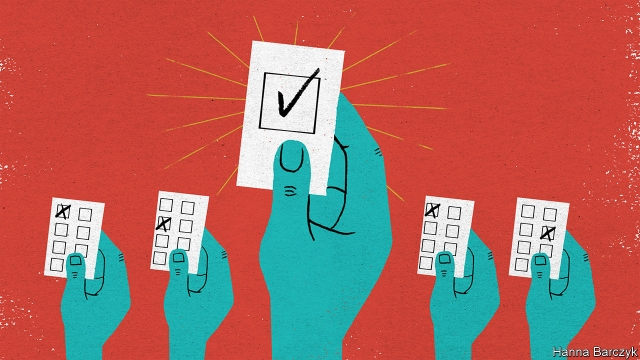

###### Chaguan

# China recruits Westerners to sell its “democracy” 

##### This reveals more than the party intends 

 

> Mar 7th 2019 

THE ANNUAL sitting of the National People’s Congress, China’s well-fed eunuch of a parliament, poses several tests for foreign reporters. Though its committees may suggest tweaks to new laws, and some play a diplomatic role engaging with foreign legislators, meetings of its 3,000 or so delegates are mostly very dull. Indeed, the congress has never voted down a proposal from Communist Party chiefs. There is the puzzle of whether to join a yearly propaganda show in which foreign journalists are given plum seats at leaders’ press conferences and urged to pre-submit questions that few will be invited to ask—allowing state media to show domestic audiences the world’s press, hands aloft and clamouring to join this simulacrum of representative democracy. 

There is the security that grips Beijing during the “two sessions”, the simultaneous gatherings of the legislature and the Chinese People’s Political Consultative Conference, an advisory body stuffed with business bosses, academics, sports stars, religious leaders and other grandees. Notably, cyber-police disrupt the online services, known as VPNs, that offer a route past the Great Firewall of censorship. For foreign reporters, the sessions’ great drama often involves guessing whether they will be able to use the internet to file their stories about the government’s accountability. 

Finally, there is the odd experience of meeting supposed colleagues who are in fact complete strangers, meaning foreigners employed by Chinese state media, or by obscure Western news outlets that channel Chinese propaganda. Some ask planted questions at press conferences. Others pop up in the state media lauding China’s political system. Xinhua, China’s official news agency, this year put out a video entitled “Chinese democracy in the eyes of an American”. A fresh-faced young man from Chicago, Colin Linneweber, strolls around Tiananmen Square while opining that “it’s widely acknowledged that a key to China’s success is its system of democracy”, and praising the country’s “stability”. He then presents mini-profiles of delegates with such day jobs as farmer, migrant worker and postman, whose proposals for making China better became law. It is tempting to be quite cross with such Westerners. Ordinary Chinese who start praising democracy on the square, a ghost-haunted, massively policed spot, would be instantly arrested. Stability comes at a price, what is more. China’s one-party rule involves more than the absence of messy things like real elections or a free press. It requires active, unsleeping maintenance by state-security agents tasked with tracking, threatening or jailing any who challenge the Communist monopoly on power. 

As far back as China’s civil war, party leaders called themselves democrats, unlike their dictatorial rivals, the Nationalist Party or Kuomintang. In 1945 Mao Zedong impressed Chinese intellectuals when he assured a businessman and educational reformer, Huang Yanpei, that democracy would help a Communist government avoid cycles of triumph and decline that doomed imperial dynasties. “Only when a government is subject to the people’s supervision will it not dare to slacken,” Mao declared. Huang came to realise how much he had misjudged Mao. In 1957 he saw the party turn on his son, Huang Wanli, an engineer who (correctly) sounded the alarm about flaws in a planned dam on the Yellow River. When his warnings were not heeded, the younger Huang noted that the American people could remove officials from office. He was purged as a “rightist” and sentenced to hard labour. 

After Mao’s death, when economic opening was not matched by political liberalisation, party leaders sounded a bit defensive about that choice, assuring foreigners that only a firm grip on their vast country could avoid chaos. In the 1990s rule passed to Jiang Zemin, an admirer of Western culture who loved to quote Abraham Lincoln’s call for government of, by and for the people. Asked by an American interviewer whether China was a dictatorship, Mr Jiang replied that he was the elected head of a collective party leadership, although the method of his election had to take account of China’s levels of economic and educational development. 

Jump to the present day, and foreigners hear no such half-apologies from the China led by President Xi Jinping. Mr Xi calls China a socialist, consultative democracy, featuring the “orderly participation” of the people and always under the party’s control. Today, state media hail China’s political system as far more responsive and effective than the West’s “conflict-driven”, money-tainted politics. The recent government shutdown in America, Brexit-related confusion and gilets jaunes riots in France are all held up in China as examples of Western decadence and failure. Talking politics to ordinary Chinese is a chastening experience. A bicycle repairman in Beijing, after ascertaining that Chaguan is British, scoffs: “That prime minister? May? Total chaos, isn’t it?” 

Opinion polling is hard in China, where candour can be dangerous. Still, the Asian Barometer Survey, run by National Taiwan University, has on four occasions quizzed the Chinese public about democracy. Writing in the Taiwan Journal of Democracy, Yue Yin, a political scientist, notes that a narrow majority of the survey’s respondents in China support press censorship in the name of stability, while two-thirds say they are at ease with one-party rule. Yet accountability matters. Nearly 80% reject a government in which “experts decide everything” and 60% say the public should be free to criticise the authorities. 

That suggests another way to understand propaganda films in which foreigners call the legislature a beacon of democracy. Such videos are a backhanded tribute to the West. An American’s views on accountable government carry weight, because ordinary Chinese know that American voters can kick the bums out. For now, China’s rulers still mind when their authoritarian system is judged against Western norms. When they no longer think they need the Colin Linnewebers of this world, start worrying. 

  

-- 

 单词注释:

1.eunuch['ju:nәk]:n. 太监, 阉人, 无能者 [医] 去睾者, 无睾者, 阉人 

2.tweak[twi:k]:n. 拧, 扭, 焦急 vt. 扭, 开足马力 

3.diplomatic[.diplә'mætik]:a. 外交的, 老练的 [法] 外交的, 外交上的, 文献上的 

4.legislator['ledʒisleitә]:n. 立法者, 立法官, 立法委员 [法] 立法者, 立法机关成员, 立法委员 

5.propaganda[.prɒpә'gændә]:n. 宣传, 宣传活动 [医] 宣传 

6.plum[plʌm]:n. 李子 

7.aloft[ә'lɒft]:adv. 在高处, 在上 

8.clamour['klæmә]:n. 喧闹 v. 大声地要求 

9.simulacrum[.simju'leikrәm]:n. 像, 影, 幻影 

10.simultaneous[.simәl'teinjәs]:a. 同时的, 同时发生的 [计] 同时的 

11.gathering['gæðәriŋ]:n. 聚集, 集中, 采集 [化] 富集 

12.legislature['ledʒisleitʃә]:n. 立法机关, 议会, 立法院 [法] 立法机构, 立法机关 

13.consultative[kәn'sʌltәtiv]:a. 商议的, 协议的, 咨询的 [法] 咨询的, 商议的, 协议的 

14.advisory[әd'vaizәri]:a. 顾问的, 咨询的, 劝告的 [法] 劝告的, 忠告的, 咨询的 

15.grandee[græn'di:]:n. 大公, 显贵之人 

16.notably['nәjtbәli]:adv. 显著地, 著名地, 尤其, 特别 

17.disrupt[dis'rʌpt]:a. 分裂的, 中断的 vt. 使分裂, 使瓦解 

18.online[]:[计] 联机 

19.vpns[]:[网络] 虚拟专用网络；虚拟私人网络；虚拟私人网路 

20.firewall[]:[计] 放火墙, 隔离 

21.censorship['sensәʃip]:n. 检查制度 [医] 督察, 监察 

22.accountability[ә.kauntә'biliti]:n. 负有责任, 可说明性 [化] 衡算计量 

23.laud[lɒ:d]:n. 赞美, 称赞 vt. 赞美, 称赞 

24.Xinhua[]:[经] 新华社 

25.Chicago[ʃi'kɑ:gәu]:n. 芝加哥 

26.colin['kɔlin]:n. 科林（男子名） 

27.stroll[strәul]:n. 闲逛, 漫步 v. 闲逛, 漫步 

28.opine[әu'pain]:v. 想, 以为 

29.migrant['maigrәnt]:n. 候鸟, 移居者 [法] 移居者 

30.massively[]:adv. 大而重, 厚实, 粗大, 强有力, 结实, 魁伟, 大块, 大量, 大规模, 实心, 块状 [计] 大规模地 

31.unsleeping[ʌn'sli:piŋ]:a. 未入睡的, 警觉的, 时刻戒备的 

32.monopoly[mә'nɒpәli]:n. 垄断, 专卖权, 独占事业 [经] 垄断, 专利品, 垄断(权)独占 

33.democrat['demәkræt]:n. 民主人士, 民主主义者, 民主党党员 [经] 民主党 

34.dictatorial[diktә'tɒ:riәl]:a. 独裁者的, 独裁的, 独断的 

35.nationalist['næʃәnәlist]:n. 国家主义者, 民族主义者 

36.kuomintang['kwәumin'tæŋ]:n. (中国)国民党 

37.educational[.edju'keiʃәnl]:a. 教育的, 教育性的 

38.reformer[ri'fɒ:mә]:n. 改革家, 改革运动者 [化] 转化炉; 转化器; 重整器; 重整炉 

39.huang[]:n. 黄（姓氏） 

40.doom[du:m]:n. 厄运, 不幸, 法律, 宣告, 判决, 死亡 vt. 命中注定, 判决 

41.imperial[im'piәriәl]:a. 帝王的, 宗主国的, 至尊的, 壮丽的 n. 特等品 

42.supervision[.sju:pә'viʒәn]:n. 监督, 管理 [经] 监督, 管理 

43.slacken['slækәn]:vt. 使松弛, 放松, 放慢 vi. 变松弛, 减弱, 松劲 

44.misjudge[mis'dʒʌdʒ]:v. 判断错 

45.wanli[]:[网络] 万里科技；李志浪；横里 

46.correctly[kә'rektli]:adv. 对, 正确, 恰当, 符合一般性准则, 符合行为准则, 端正, 符合 

47.flaw[flɒ:]:n. 缺点, 裂纹, 瑕疵, 一阵狂风 [化] 划痕; 裂缝; 裂纹 

48.heed[hi:d]:n. 注意, 留心 v. 注意, 留心 

49.purge[pә:dʒ]:n. 净化, 清除, 泻药 v. (使)净化, 清除, (使)通便 [计] 服务器文件删除实用程序 

50.rightist['raitist]:n. 右派人士, 保守党员 a. 右翼的, 右派的 

51.liberalisation[,libərəlai'zeiʃən, -li'z-]:n. 自由化；开放 

52.defensive[di'fensiv]:a. 防卫的, 防备用的, 自卫的 n. 守势, 防卫姿势, 防卫物 

53.chao[]:n. 钞（货币） 

54.Jiang[]:江 蒋 姜（中国姓氏） 

55.zemin[]:[网络] 江 

56.admirer[әd'maiәrә]:n. 钦佩者, 仰慕者, 求爱者 

57.abraham['eibrәhæm, -hәm]:n. 亚伯拉罕（男子名） 

58.interviewer['intәvju:ә]:n. 会见者, 面谈者, 进行面试者 

59.dictatorship[dik'teitәʃip]:n. 独裁者之职位, 独裁, 独裁政权 [法] 专攻, 独裁权 

60.consultative[kәn'sʌltәtiv]:a. 商议的, 协议的, 咨询的 [法] 咨询的, 商议的, 协议的 

61.participation[.pɑ:tisi'peiʃәn]:n. 参与, 分享 [经] 参与, 参股 

62.alway['ɔ:lwei]:adv. 永远；总是（等于always） 

63.hail[heil]:n. 冰雹, 致敬, 欢呼, 招呼 vt. 向...欢呼, 致敬, 招呼, 使象下雹样落下 vi. 招呼, 下雹 interj. 万岁, 欢迎 

64.responsive[ri'spɒnsiv]:a. 回答的, 应答的, 易感应的 

65.politic['pɒlitik]:a. 精明的, 明智的, 策略的 

66.shutdown['ʃʌtdaun]:n. 关门, 停工, 停机 [经] 停工 

67.gilet[dʒi'lei]:n. 背心, 马甲 

68.jaune[]:[网络] 汝拉 

69.riot['raiәt]:n. 暴动, 喧闹, 放纵 vi. 发动, 暴动, 纵情, 放荡 vt. 浪费, 挥霍 

70.decadence['dekәdәns]:n. 颓废 

71.chasten['tʃeisәn]:vt. 惩罚；磨炼；抑制 

72.repairman[ri'pєәmæn]:n. 修理工 

73.ascertain[.æsә'tein]:vt. 确定, 查明 [法] 查明, 弄清, 确定 

74.candour['kændә]:n. 坦率, 正直, 公正, 爽直, 白色, 光明 

75.barometer[bә'rɒmitә]:n. 气压计 [化] 气压计 

76.taiwan['tai'wɑ:n]:n. 台湾 

77.yue[]:n. 越（中国南方古代越人各族的总称） 

78.yin[jin]:n. 中国思想里的“阴”（与“阳”相对）；中国的殷代；（苏格兰）一个（等于one） 

79.respondent[ri'spɒndәnt]:a. 回答的, 应答的, 反射的 n. 应答者, 被告 

80.criticise['kritisaiz]:v. 批评, 吹毛求疵, 非难 

81.beacon['bi:kn]:n. 烽火, 灯塔 v. 照亮 

82.backhand['bæk'hænd]:n. 手背拍, 反手抽击, 左斜手写体 v. 反手抽击 

83.tribute['tribju:t]:n. 贡物, 礼物, 颂辞 

84.accountable[ә'kauntәbl]:a. 负有责任的, 可说明的, 可解释的 [经] 负有责任的 

85.voter['vәutә]:n. 选民, 投票人 [法] 选民, 选举人, 投票人 

86.bum[bʌm]:n. 游荡者, 懒鬼, 闹饮 a. 没有价值的 vi. 过游民生活, 乞讨, 流浪 vt. 乞讨 

87.authoritarian[ɒ:.θɒri'tєәriәn]:a. 独裁的, 独裁主义的 

88.norm[nɒ:m]:n. 基准, 模范, 标准, 准则, 平均数 [化] 定额 

