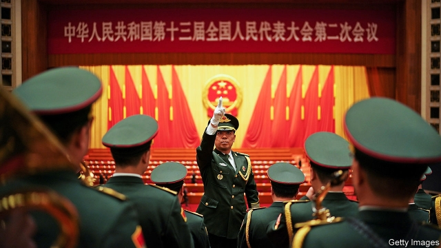

###### A new tune

# China’s prime minister frets about the country’s economy 

##### But he swears off large-scale stimulus to revive it 

 

> Mar 7th 2019 

CHINA’S RUBBER-STAMP parliament can seem unchanging from one year to the next. Shortly past 9am on March 5th—the same date and time as always—Li Keqiang, the prime minister, rose in Beijing’s Great Hall of the People to deliver his annual work report (after delegates had sung the national anthem, accompanied by a military band—pictured). His speech took, as ever, nearly two hours. He reviewed the government’s targets last year for growth, investment, employment and more, all of which it had reached. He also announced another series of targets that, as sure as stiff-backed soldiers hoist up the country’s flag in Tiananmen Square every morning, China will achieve again. Mr Li closed with a customary rousing pledge to bring about the “Chinese dream of national rejuvenation”. Delegates, having made a good show of listening raptly throughout, dutifully applauded (see Chaguan). 

Yet despite all the familiar pomp and well-worn phrases, there were enough new policies and numbers in Mr Li’s speech to highlight the economic uncertainty now facing many in China, including the government itself. The report, which marked the start of the legislature’s annual ten-day session, was laced with caution. Mr Li said China would aim for GDP growth of between 6% and 6.5% this year, down from 6.6% in 2018. Though still strong for an economy of China’s size, it would be the slowest rate in nearly 30 years. Many economists think the official figures exaggerate the pace (see article). 

Some details were even more revealing. Mr Li declared that economic policy would have an “employment first” focus: the government would strive to keep the unemployment rate below 5.5% and provide training for those out of work. The official jobless rate has remained steady at about 5%, but manufacturing and tech firms have recently started laying off employees. Lest the public think that officials are living high off the hog while others face straitened times, Mr Li ordered bureaucrats to cut spending on travel, cars and entertainment by 3%. 

He also acknowledged the suffering of private firms. Over the past year, there has been growing disquiet among entrepreneurs, fearful that the government is turning against them. Mr Li’s speech was, in part, aimed at countering that perception. Local governments, he said, were part of the problem. Too many owed money to contractors and were dragging out repayment. He promised to help private companies obtain loans—the difficulty of doing so has been a long-standing grievance. He accepted that trade tensions with America had hurt some companies—a frank admission for a Chinese leader. 

The big economic question is what the government’s concerns mean for its fiscal and monetary policies. Whenever growth has slowed in the past decade, China has reliably responded with hefty spending on infrastructure and a strong nudge to banks to lend more money. The signals are less clear this time around. 

Before this parliamentary session, some observers had thought that the central government was reverting to type. Since late last year its planning agency has been fast-tracking approvals for new infrastructure projects. Banks issued 3.2trn yuan ($477bn) of new loans in January, the most ever in a single month. Stockmarket investors have been turning bullish. The CSI 300, an index of shares in big Chinese firms, has soared by nearly 30% this year. 

But the leadership is in fact much warier of stimulus than it once was. It worries that debt levels are already too high. After the loan explosion in January, Mr Li warned that it could create “new potential risks” in the economy. (The central bank countered that the surge occurred for seasonal reasons.) For months Mr Li has sworn off what he calls “flood-style stimulus”, (ie, deluging the economy with cash as if irrigating a rice paddy). He repeated that phrase in his speech. He also mentioned “risks” 24 times, more than in any such report for at least a decade. Dangers, he said, could emanate from financial frailties, from wasteful local governments and from abroad (ie, the trade war with America). His message to Chinese officials was to prepare for the worst. His message to investors was that they should not bank on another big rise in government spending. 

But the Communist Party is still looking for ways to pep up the economy. Conveniently, there is one policy tool that does not involve building yet more bridges, and that has the added benefit of being popular: reducing tax. Mr Li unveiled cuts, mostly for firms, that should total nearly 2trn yuan this year, or more than 2% of forecast GDP. Economists at HSBC, a bank, called it China’s most sweeping corporate-tax cut in a decade. Including provincial bonds, the fiscal deficit is set to rise to about 5% of GDP this year, up from 4.1% in 2018. This is, however, a far cry from stimulus packages of yore. The government is still refraining from steps to boost the property market, which it has always done in the past when revving up growth. 

A big reason for China’s hesitation is the trade war with America. Many now assume that an agreement is only a matter of time. The two countries are reportedly working on the final touches. During this session, the legislature is set to approve a foreign-investment law that will respond to some of America’s main complaints—for example, by barring officials from requiring foreign investors to transfer technology to Chinese firms. Even if there is scepticism about how China will implement the law, it is an attempt to reduce trade tensions. 

America’s president, Donald Trump, and his Chinese counterpart, Xi Jinping, could meet this month to shake hands on a formal deal. But Chinese officials are well aware that Mr Trump is wont to change his mind. So they are trying to leave wriggle room as they devise economic policy. If the trade war is resolved, they can conserve their fiscal firepower. But if it worsens, they have scope to increase their spending. China’s plans depend partly on the caprices of America’s president. 

-- 

 单词注释:

1.fret[fret]:n. 烦躁, 磨损, 焦急, 网状饰物 vi. 烦恼, 不满, 磨损 vt. 使烦恼, 腐蚀, 使磨损, 使起波纹 

2.stimulus['stimjulәs]:n. 刺激, 激励, 刺激品 [医] 刺激特, 刺激 

3.revive[ri'vaiv]:vt. 使苏醒, 使复兴, 使振奋, 回想起, 重播 vi. 苏醒, 复活, 复兴, 恢复精神 

4.unchanging[ʌn'tʃeindʒiŋ]:a. 不变的 

5.Keqiang[]:[网络] 绿庆 

6.anthem['ænθәm]:n. 圣歌, 赞美诗 

7.sery[]:n. (Sery)人名；(俄)谢雷；(科特)塞里 

8.hoist[hɒist]:n. 升高, 起重机, 推动 v. 升起, 升高, 举起 

9.customary['kʌstәmәri]:a. 习惯的, 惯常的 [经] 通常的, 习惯的 

10.pledge[pledʒ]:n. 诺言, 保证, 誓言, 抵押, 信物, 保人, 祝愿 vt. 许诺, 保证, 使发誓, 抵押, 典当, 举杯祝...健康 

11.rejuvenation[]:[医] 回春, 返老还童 

12.raptly[]:全神贯注地 

13.dutifully[]:adv. 忠实地；忠贞地 

14.pomp[pɒmp]:n. 壮丽, 盛观, 夸耀 

15.uncertainty[.ʌn'sә:tnti]:n. 不确定, 不可靠, 不确定的事物 [化] 不确定度 

16.economist[i:'kɒnәmist]:n. 经济学者, 经济家 [经] 经济学家 

17.strive[straiv]:vi. 努力, 奋斗, 斗争 

18.jobless['dʒɔblis]:a. 失职的, 无职业的 [经] 失业的 

19.manufacturing[.mænju'fæktʃәriŋ]:n. 制造业 a. 制造业的 

20.tech[tek]:n. 技术学院或学校 

21.hog[hɒg]:n. 猪, 贪婪者, 象猪般的人 v. (使)拱起 

22.straiten['streitn]:vt. 使为难, 使穷困, 限制 

23.bureaucrat['bjuәrәukræt]:n. 官僚作风的人, 官僚, 官僚主义者 [法] 官僚, 官僚作风的人 

24.disquiet[dis'kwaiәt]:vt. 打搅, 使烦恼, 使忧虑, 使不安 n. 不安, 焦虑, 不平静 

25.entrepreneur[.ɒntrәprә'nә:]:n. 企业家, 主办人 [经] 承包商, 企业家 

26.perception[pә'sepʃәn]:n. 知觉, 感觉, 领悟力, 获取 [医] 知觉 

27.contractor['kɒntræktә]:n. 立契约的人, 承包商 [化] 承包者; 承包工厂 

28.repayment[ri'peimәnt]:n. 付还, 偿还, 报复, 付还的钱 [经] 偿还, 付还 

29.grievance['gri:vәns]:n. 委屈, 冤情, 苦况 [经] 不满(对雇用条件的) 

30.fiscal['fiskәl]:a. 财政的, 国库的 [经] 财政上的, 会计的, 国库的 

31.monetary['mʌnitәri]:a. 货币的, 金钱的 [经] 货币的, 金融的 

32.reliably[ri'laiәbli]:adv. 可靠地, 可信赖地 

33.hefty['hefti]:a. 重的, 肌肉发达的 

34.infrastructure['infrәstrʌktʃә]:n. 基础结构, 基础设施 [经] 基础设施 

35.nudge[nʌdʒ]:n. 用肘轻推, 推动, 讨厌家伙 

36.les[lei]:abbr. 发射脱离系统（Launch Escape System） 

37.parliamentary[.pɑ:lә'mentәri]:a. 国会的, 议会的, 议会制度的 

38.revert[ri'vә:t]:vi. 恢复, 复归, 回复, 还原 vt. 使回复原状, 使回转 n. 恢复原信仰的人 [计] 还原 

39.stockmarket[s'tɒkmɑ:kɪt]: 证券市场; 证券交易所; 证券行情 

40.investor[in'vestә]:n. 投资者 [经] 投资者 

41.bullish['buliʃ]:a. 似公牛的, 看涨的, 上扬的 [经] 行情看涨的 

42.csi[]:abbr. 犯罪现场调查（Crime Scene Investigation）；顾客满意指数（Customer Satisfaction Index） 

43.soar[sɒ:]:n. 高扬, 翱翔 vi. 往上飞舞, 高耸, 翱翔 

44.wary['wєәri]:a. 谨慎的, 小心的, 机警的, 周到的, 唯恐的 

45.surge[sә:dʒ]:n. 巨涌, 汹涌, 澎湃 vi. 汹涌, 澎湃, 颠簸, 猛冲, 突然放松 vt. 使汹涌奔腾, 急放 [计] 电压尖峰 

46.seasonal['si:znәl]:a. 季节的, 依照季节的, 周期性的 [经] 季节性的, 季节的 

47.IE['i:ei]:[计] 中断启动 

48.deluge['delju:dʒ]:n. 大洪水, 泛滥 vt. 使泛滥 

49.paddy['pædi]:n. 稻, 谷, 爱尔兰人, 警察 [法] 警察 

50.emanate['emәneit]:vi. 散发, 发出, 发源 

51.frailty['freilti]:n. 弱点, 脆弱, 意志薄弱 [法] 虚弱, 意志薄弱, 因意志薄弱而犯的错误 

52.wasteful['weistful]:a. 浪费的, 不经济的 

53.pep[pep]:n. 活力, 气力, 劲头, 锐气 vt. 鼓起精神, 激励, 使充满活力 

54.conveniently[]:a. 方便, 合宜 

55.unveil[.ʌn'veil]:vt. 揭开, 揭幕, 除去...的面纱 vi. 显露, 除去面纱 

56.hsbc[]:abbr. 汇丰银行（Hong Kong and Shang Hai Banking Corporation） 

57.provincial[prә'vinʃәl]:n. 外地人, 粗野的人 a. 省的, 外地的, 偏狭的 

58.deficit['defisit]:n. 赤字, 不足额 [医] 短缺 

59.yore[jɔ:, jɔә]:n. 从前, 往昔 

60.refrain[ri'frein]:n. 重复的话, 叠句, 副歌 vi. 节制, 避免, 克制 

61.alway['ɔ:lwei]:adv. 永远；总是（等于always） 

62.rev[rev]:n. 一次回转 v. 加快转速 [计] 反转, 周, 转数 

63.hesitation[.hezi'teiʃәn]:n. 犹豫, 踌躇, 含糊, 口吃, 暂停 [计] 暂停 

64.reportedly[ri'pɒ:tidli]:adv. 根据传说, 根据传闻, 据报道 

65.legislature['ledʒisleitʃә]:n. 立法机关, 议会, 立法院 [法] 立法机构, 立法机关 

66.scepticism['skeptisizm]:n. 怀疑论, 怀疑主义 [医] 多疑癖 

67.donald['dɔnәld]:n. 唐纳德（男子名） 

68.trump[trʌmp]:n. 王牌, 法宝, 喇叭 vt. 打出王牌赢, 胜过 vi. 出王牌, 吹喇叭 

69.counterpart['kauntәpɑ:t]:n. 副本, 复本, 配对物, 相应物 [经] 副本, 正副二份中之一 

70.wont[wɒnt]:n. 习惯 a. 惯常的, 易于...的 vi. 习惯 vt. 使习惯于 

71.wriggle['rigl]:n. 蠕动, 蜿蜒 vi. 蠕动, 蜿蜒前进, 摆脱 vt. 使扭动, 扭动着爬 

72.firepower['faiәpauә]:n. 火力 

73.worsen['wә:sn]:vt. 使更坏, 使恶化 vi. 变得更坏, 恶化 

74.caprice[kә'pri:s]:n. 反复无常, 多变, 任性 

