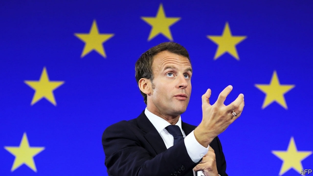

###### Friends, Europeans

# Emmanuel Macron appeals directly to Europe’s voters 

##### The French president issues a manifesto for a “Europe that protects” 

 

> Mar 7th 2019 

FOR NEARLY three months, the formerly globe-trotting French president has scarcely left the country. Instead he has cleared his diary to criss-cross France, staging nearly a dozen town-hall meetings in a “great national debate” intended to counter the gilets jaunes protests. That movement, which began last November, is ebbing, but it has yet to be pacified. Nevertheless, this week Emmanuel Macron at last re-emerged from his domestic troubles, publishing a bold manifesto for a European “renaissance” in 22 languages and 28 newspapers across the continent. 

The declaration was as arresting for its symbolism as its content. Mr Macron addressed it not to fellow leaders or like-minded political parties, but to “citizens of Europe”. This unusual appeal to people across the continent, including those in Britain, enabled him to tell British voters bluntly what he thought of Brexit. “Who told the British people the truth about their post-Brexit future?” asked Mr Macron, declaring that “the Brexit impasse is a lesson for us all”. Denis MacShane, a British former Europe minister, described it admiringly as “quite the most extraordinary interference seen in European politics” since Winston Churchill called on Europe to form a union after the second world war. 

Such an effort to speak directly to citizens abroad recalls Mr Macron’s technique of appealing to voters over the heads of political parties during his election campaign in 2017. The text served as the unofficial launch of his campaign for the European Parliament elections in May. In those elections, as part of his ambition to build a cross-border European sense of political identity, or demos, Mr Macron has tried to forge a pan-European liberal alliance. But that effort has come to little. 

Mr Macron’s pro-Europeanism is a long-standing passion. But doubling down on Europe is a counter-intuitive response to his difficulties at home, where the gilets jaunes denounce remote, technocratic elites. Grand schemes for Europe—and Mr Macron has no end of new agencies to propose—are hardly foremost among French protesters’ concerns. Sure enough, the National Rally (formerly the National Front), the populist party led by Marine Le Pen, promptly denounced Mr Macron’s “post-national vision”. His letter, the party sniffed, did not mention France once. 

Yet in many ways, Mr Macron’s manifesto is designed precisely to respond to the populists’ fears. He has long talked about a “Europe that protects”. In this new short text, the word “protect” appears no fewer than 13 times. He promises to strengthen external borders against the threat of illegal immigration. He wishes to rethink the Schengen border-free area, demanding that any countries that participate also share the burden of asylum-seekers. He proposes to reform competition and trade policy, introducing a buy-Europe policy to level the playing field (as he sees it) with America and China. He wants a new European Security Council that includes post-Brexit Britain, a minimum wage in each country, a European climate bank, a European “agency for the protection of democracies” (against the threat of cyber attacks and manipulation), and more. 

Mr Macron’s underlying message is about preserving “European civilisation”. This may sound like an effort to absorb populist themes he once abjured. Last year he warned of the “leprosy” of nationalism, and declared that if populists saw him as their main opponent “they are right”. (This laid the groundwork for a recent diplomatic spat with Italy.) But this time, says an aide, he is trying to bring together those worried about nationalism, whichever European country they happen to be in. 

Some of Mr Macron’s ideas are vague enough not to court controversy. The European minimum wage is to be “appropriate to each country”, leaving broad room for adjustment. There is no mention of his ambitions for euro-zone reform, which have stalled owing to the recalcitrance of Germany and other northern states, nor of a “European army”, which is frowned on in Poland and the Baltic states. The most divisive proposal is to make membership of Schengen conditional on sharing asylum-seekers, an idea plainly directed at Hungary’s Viktor Orban, who has made resistance to EU refugee policy his watchword. 

The French president may struggle to find support. “With which allies is he going to do all this?” asks Yves Bertoncini, president of the European Movement France, a think-tank. Mr Macron made no mention of how to implement his proposals or to arrive at a new European treaty, as he promises, by the end of the year. The reaction in Germany, France’s closest friend, was muted, although Olaf Scholz, the finance minister, called the text a “decisive signal”. 

Mr Macron may not have all the answers, and some of his ideas may be imprecise or flawed. Yet Europe is not exactly awash with strong voices in defence of the liberal order. Domestic distractions have recently kept the French president on the sidelines. This week’s declaration was a reminder that he has not abandoned his ambitions for Europe, nor run out of ideas about how to achieve them. 

-- 

 单词注释:

1.emmanuel[i'mænjuәl]:n. 以马内利（耶稣基督的别称）；伊曼纽尔（男子名, 等于Immanuel） 

2.macron['mækrәn]:n. 长音符号 

3.voter['vәutә]:n. 选民, 投票人 [法] 选民, 选举人, 投票人 

4.manifesto[.mæni'festәu]:n. 宣言, 声明 

5.formerly['fɒ:mәli]:adv. 从前, 以前 

6.gilet[dʒi'lei]:n. 背心, 马甲 

7.jaune[]:[网络] 汝拉 

8.eb[eb]:abbr. 电子束（Electron Beam） 

9.pacify['pæsifai]:vt. 使平静, 安慰, 绥靖, 使服从 

10.renaissance[ri'neisәns]:n. 复活, 复兴, 文艺复兴 a. 文艺复兴的 

11.declaration[.deklә'reiʃәn]:n. 宣告, 说明, 宣布 [计] 说明 

12.symbolism['simbәlizm]:n. 象征主义, 符号论 [医] 象征主义 

13.bluntly['blʌntli]:adv. 坦率地, 率直地 

14.Brexit[]:[网络] 英国退出欧盟 

15.impasse['impɑ:s]:n. 难局, 僵局, 死路, 死胡同 

16.deni[]:n. (Deni)人名；(俄)杰尼；(意、阿拉伯)德尼 十数的 

17.admiringly[әd'maiәriŋli]:adv. 钦佩地, 羡慕地 

18.politic['pɒlitik]:a. 精明的, 明智的, 策略的 

19.winston['winstәn]:n. 温斯顿（姓氏, 男子名） 

20.Churchill['tʃә:tʃil]:n. 邱吉尔 

21.unofficial[.ʌnә'fiʃәl]:a. 非正式的, 非官方的 [化] 非法定的; 未入药典的 

22.Demo['demәu]:n. 演示, 样本唱片 [计] 演示 

23.forge[fɒ:dʒ]:n. 熔炉, 铁工厂 vt. 打制, 锻造, 伪造 vi. 锻造, 伪造 

24.alliance[ә'laiәns]:n. 联盟, 联合 [法] 同盟, 联盟, 联姻 

25.denounce[di'nauns]:vt. 告发, 抨击, 谴责 [法] 谴责, 斥责, 告发 

26.technocratic[ˌteknə'krætɪk]:a. 由技术专家官员组成的；受技术官僚影响的 

27.elite[ei'li:t]:n. 精华, 精锐, 中坚分子 

28.rally['ræli]:n. 重振旗鼓, 集合, 群众集会, 跌停回升 v. 重整旗鼓, 集合, 恢复精神, 团结, 挖苦, 嘲笑 

29.Populist['pɔpjulist]:n. 民粹派的成员 

30.LE[]:[计] 小于或等于 

31.promptly['prɒmptli]:adv. 敏捷地, 迅速地 

32.precisely[pri'saisli]:adv. 精确地, 明确地, 刻板地, 拘泥地, 正好, 恰恰, 对, 正是如此, 确实如此, 不错 

33.rethink[ri:'θiŋk]:v. 再想, 重想 

34.schengen['ʃɛŋən]: [地名] [卢森堡] 申根 

35.cyber['saibә]:a. 网络的, 计算机的 

36.manipulation[mә.nipju'leiʃәn]:n. 操作, 处理 [化] (用手)操作; 使用 

37.underlie[.ʌndә'lai]:vt. 位于...之下, 成为...的基础 

38.civilisation[,sivilai'zeiʃən;-li'z-]:n. 文明, 文明世界, 文化, 开化, 教化 

39.abjure[әb'dʒuә]:vt. 发誓断绝, 公开放弃 [法] 誓绝, 弃绝, 公开放弃 

40.leprosy['leprәsi]:n. 麻疯病, 腐败 [医] 麻风 

41.nationalism['næʃәnәlizm]:n. 民族主义, 民族特性 

42.groundwork['graundwә:k]:n. 地基, 基础, 根据 

43.diplomatic[.diplә'mætik]:a. 外交的, 老练的 [法] 外交的, 外交上的, 文献上的 

44.aide[eid]:n. 助手, 副官 [计] 数据输入的可说明性 

45.controversy['kɒntrәvә:si]:n. 论争, 辩论, 论战, 争论 [法] 论战, 争论, 争吵 

46.stall[stɒ:l]:n. 厩, 停车处, 牧师职位, 货摊, 托辞, 拖延 vt. 关入厩, 停顿, 推托, 支吾, 使陷于泥中 vi. 被关在厩内, 陷于泥中, 停止, 支吾 

47.recalcitrance[ri'kælsitrәns]:n. 反抗, 不服从, 顽抗 

48.Poland['pәulәnd]:n. 波兰 

49.Baltic['bɒ:ltik]:a. 波罗的海的 

50.divisive[di'vaisiv]:a. 区分的, 制造分裂的, 造成不和的 

51.membership['membәʃip]:n. 会员的资格, 全体会员, 会员数目 [法] 会员资格, 成员资格, 会籍 

52.conditional[kәn'diʃәnl]:a. 有条件的, 有前提的 [电] 有条件的 

53.plainly['pleinli]:adv. 清楚地, 明白地, 简单地, 朴素地, 直率地, 坦白地 

54.Viktor[]:维克托（人名） 

55.orban[]: [人名] 奥尔班 

56.EU[]:[化] 富集铀; 浓缩铀 [医] 铕(63号元素) 

57.refugee[.refju'dʒi:]:n. 难民, 流亡者 [法] 避难者, 流亡者, 难民 

58.watchword['wɒtʃwә:d]:n. 暗号, 口令, 标语, 口号 

59.ally['ælai. ә'lai]:n. 同盟者, 同盟国, 助手 vt. 使联盟, 使联合, 使有关系 vi. 结盟 

60.yve[]: [男子名] 伊夫日耳曼的法语同源词, 含义是“紫杉, 弓”(yew,bow) 

61.olaf['әulәf, 'ɔl-]:n. 奥拉夫（男子名） 

62.scholz[]:n. (Scholz)人名；(瑞典)斯科尔茨；(英)肖尔茨 

63.decisive[di'saisiv]:a. 决定性的, 坚定的, 果断的 

64.imprecise[.impri'saiz]:a. 不严密的, 不精确的, 不明确的 

65.flaw[flɒ:]:n. 缺点, 裂纹, 瑕疵, 一阵狂风 [化] 划痕; 裂缝; 裂纹 

66.awash[ә'wɒʃ]:a. 与水面齐平的, 被浪冲打的 

67.distraction[dis'trækʃәn]:n. 娱乐, 分心的事物, 分心 [医] 注意力分散, 内脱位, 牙弓过宽 

68.sideline['saidlain]:n. 副业, 旁线, 界线, 兼职, 旁观者看法 vt. 使退出比赛场地 

69.reminder[ri'maindә]:n. 提醒的人, 暗示 [经] 催单 

